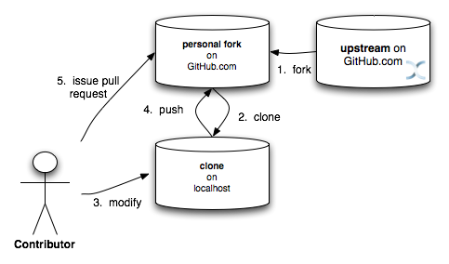
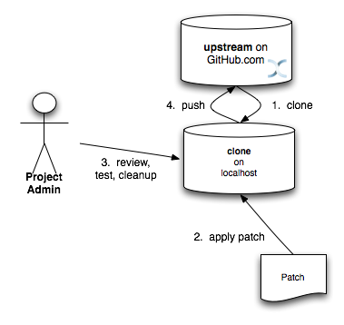

==  Source Control
In this chapter we discuss how to interact with Infinispan's source control repository.

NOTE: As a convention, _upstream_ is used as the name of the link:$$http://github.com/infinispan/infinispan$$[] repository.
This repository is the canonical repository for Infinispan.
We usually name _origin_ the fork on link:https://github.com[GitHub] of each contributor.
So the exact meaning of _origin_ is relative to the developer: you could think of _origin_ as your own fork. 

=== Prerequisites
This document assumes some working knowledge of git.
We recommend Scott Chacon's excellent link:$$http://progit.org/$$[Pro Git] as a valuable piece of background reading.
The book is released under the Creative Commons license and can be downloaded in electronic form for free.
At very least, we recommend that you read link:$$http://progit.org/book/ch2-0.html$$[Chapter 2],
link:$$http://progit.org/book/ch3-0.html$$[Chapter 3] and link:$$http://progit.org/book/ch5-0.html$$[Chapter 5] of _Pro Git_ before proceeding. 

=== Repositories
Infinispan uses link:$$http://github.com/infinispan/infinispan$$[] as its canonical repository, and this repository contains the stable code on master as well as the maintenance branches for previous minor versions (e.g., 5.0.x, 4.2.x, 4.1.x, etc)

Typically, only _Project Admins_ would be able to push to this repository while all else may clone or fork the repository. 

=== Roles
The project assumes one of 2 _roles_ an individual may assume when interacting with the Infinispan codebase. The 2 roles here are: 

.Roles
*  _Contributor_ 
*  _Project Admin_ (typically, no more than a small handful of people) 

NOTE: None of the roles assume that you are a Red Hat employee.
All it assumes is how much responsibility over the project has been granted to you.
Typically, someone may be in more than one role at any given time, and puts on a different "hats" based on the task at hand.

==== Contributor
A contributor will only ever submit patches via GitHub's _pull request_ mechanism.

Contributors should _always_ fork the upstream project on GitHub and work off a clone of this fork.

NOTE: All Infinispan core developers are considered contributors and work off personal forks of the upstream repository.
This allows for complex features to be developed in parallel without tripping up over one another.
This process is certainly not restricted to just Infinispan core developers; any contributor should also participate in this manner.

===== Creating a pull request on GitHub

In this workflow, the contributor forks the Infinispan upstream repository on GitHub, clones their fork, and makes changes to this private fork.
When changes have been tested and are ready to be contributed back to the project, a _pull request_ is issued via GitHub so that one of the _Project Administrators_ can pull in the change.

.Topic Branches
NOTE:
It is desirable to work off a _topic branch_, even when using your own, forked repository.
A topic branch is created for every feature or bug fix you do.
Typically you would create one topic branch per issue,
but if several patches are related it's acceptable to have several commits in the same branch;
however different changes should always be identified by different commits.  

Before you push your work onto your fork of the repository on GitHub (your _origin_), it is often a good idea to review your commits.
Consolidating them (squashing) or breaking them up as necessary and cleaning up commit messages should all be done while still working off your local clone.
Also, prior to issuing a pull request, you should make sure you rebase your branch against the upstream branch you expect it to be merged into. 
Also, only submit pull requests for your topic branch - not for your master!

TIP: The section on _Public Small Project_ in link:$$http://progit.org/book/ch5-2.html$$[Chapter 5, Section 2] of Pro Git has more information on this style of workflow. 

====== A worked example
. Make sure your master is synced up with upstream. See <<link_ifyouhaveforkedupstream,this section>> for how to do this 
. Create new branch for your topic and switch to it. For the example issue, ISPN-1234:

 git checkout -b t_ISPN-12345 master

. Do your work. Test. Repeat
. Commit your work on your topic branch
. Push your topic branch to GitHub. For example:

 git push origin t_ISPN-12345

. Issue a pull request using the link:$$http://help.github.com/send-pull-requests/$$[GitHub pull request system] 
. Once your pull request has been applied upstream, delete the topic branch both locally and on your fork. For example:

 git branch -d t_ISPN-12345 && git push origin :t_ISPN-12345

. Sync with upstream again so that your changes now appear in your master branch

If your topic branch has been open for a while and you are afraid changes upstream may clash with your changes, it makes sense to rebase your topic branch before you issue a pull request. To do this:

. Sync your master branch with upstream

 git checkout master
 git pull upstream master

. Switch to your topic branch. For example:

 git checkout t_ISPN-12345

. Rebase your topic branch against master:

 git rebase master

. During the rebase process you might need to fix conflicts
. When you're done test your code again.
. Push your rebased topic branch to your repo on GitHub (you will likely need to force this with the -f option). 

 git push -f origin ISPN-12345

. Continue your work on your topic branch.

TIP:  If you are sharing your forked Infinispan repo with others, then do not rebase! Use a merge instead.

===== Multi-step coordination between developers using forked repositories
Sometimes a feature/task is rather complex to implement and requires competence from multiple areas of the projects.
In such occasions it is not uncommon for developers to coordinate feature implementation using personal forks of Infinispan prior to finally issuing request to integrate into Infinispan main repository on GitHub.

For example, developer A using his personal Infinispan fork creates a topic branch T and completes as much work as he/she can before requesting for assistance from developer B.
Developer A pushes topic T to his personal Infinispan fork where developer B picks it up and brings it down to his local repo.
Developer B then in turn completes necessary work, commits his/her changes on branch T, and finally pushes back T to his own personal fork.
After issuing request for pull to developer A, developer B waits for notification that developer A integrated his changes.
This exchange can be repeated as much as it is necessary and can involve multiple developers.

====== A worked example
This example assumes that developer A and B have added each others Infinispan forked repositories with the `git add remote` command.
For example, developer B would add developer A's personal Infinispan fork repository with the command 

 git remote add devA https://github.com/developerA/infinispan.git

. Developer A starts implementing feature ISPN-244 and works on a local topic branch `t_ISPN244`.
Developer A pushes `t_ISPN244` to personal Infinispan fork. For example: 

 git push origin t_ISPN244

. Developer B fetches branch `t_ISPN244` to local repository. For example: 

 git fetch devA t_ispn244:my_t_ispn244

. Developer B works on local branch `my_t_ispn244` 
. Developer B commits changes, pushes `my_t_ispn244` to own fork. 

 git push origin my_t_ispn244

. Developer B sends pull request to developer A to integrate changes from `my_t_ispn244` to `t_ispn244` 

==== Project Admin
Project Admins have a very limited role.
Only Project Admins are allowed to push to upstream, and Project Admins _never_ write any code directly on the upstream repository.
All Project Admins do is pull in and merge changes from contributors (even if the "contributor" happens to be themselves) into upstream, perform code reviews and either commit or reject such changes. 

NOTE: All Contributors who are also Project Admins are encouraged to not merge their own changes, to ensure that all changes are reviewed by someone else.

This approach ensures Infinispan maintains quality on the main code source tree, and allows for important code reviews to take place again ensuring quality.
Further, it ensures clean and easily traceable code history and makes sure that more than one person knows about the changes being performed.

===== Handling pull requests

Project Admins are also responsible for responding to pull requests.
When pulling in changes from a forked repository, more than a single commit may be pulled in.
Again, this should be done on a newly created working branch, code reviewed, tested and cleaned up as necessary.

If commits need to be altered - e.g., rebasing to squash or split commits, or to alter commit messages - it is often better to contact the Contributor and ask the Contributor to do so and re-issue the pull request, since doing so on the upstream repo could cause update issues for other contributors later on.
If commits were altered or three-way merge was performed during a merge instead of fast-forward, it's also a good idea to check the log to make sure that the resulting repository history looks OK:

----

$ git log --pretty=oneline --graph --abbrev-commit  # History messed up due to a bad merge
*   3005020 Merge branch 'ISPN-786' of git://github.com/Sanne/infinispan
|\ 
| * e757265 ISPN-786 Make dependency to log4j optional  <-- Same with cb4e5d6 - unnecessary
* | cb4e5d6 ISPN-786 Make dependency to log4j optional  <-- Cherry-picked commit by other admin
|/
* ...

$ git reset cb4e5d6  # revert the bad merge

----

It is therefore _strongly recommended_ that you use the link:$$https://github.com/maniksurtani/githelpers/blob/master/project_admins/handle_pull_request$$[`handle_pull_request`] script that ensures a clean merge.
If you _still_ wish to do this manually, please consider reading through the script first to get an idea of what needs to happen. 

TIP: More information on pulling changes from remote, forked repos can be found in link:$$http://progit.org/book/ch5-3.html$$[Chapter 5, Section 3] of Pro Git, under _Checking Out Remote Branches_ . 

====== Possible trouble handling pull requests
. If you have warnings about "Merge made by recursive" you have to fix it rebasing.
. If you have warnings about "non-fast-forward" you have to rebase.
. If you see "non-fast-forward updates were rejected" you *must never* use `--force` on upstream!
It means that another patch was merged before you and you have to update your master again, and rebase again.
. `--force` is allowed only in special maintenance circumstances.
If you find you're needing it to handle a pull request, then you're doing it wrong, and the mistake might be a dangerous one!
It's like the good rule of never commit when you're drunk (drunk coding, however, is allowed).

.Never use `--force` on `git push`
WARNING: Using `--force` while pushing on a shared repository such as _upstream_ you could effectively erase other committed patches.
No one should ever use this option unless unanimously approved on the public mailing list: the most dangerous aspect of it is that nobody gets any notification if this happens, and we might think issues are solved but you silently removed the fix and it's history from the repository. 

===== Cutting releases
Releases can only be cut by Project Admins, and must be done off a recently updated (`git fetch` and `git pull origin`) clone of the upstream repo.
Infinispan's `bin/release.py` script takes care of the rest.

==== Release branches
Infinispan has several main release branches. These are master (ongoing work on the current unstable release), 
and maintenance branches for previous minor releases (e.g., `5.0.x`, `4.2.x`, `4.1.x`).
Work should never be committed directly to any of these release branches directly; topic branches should always be used for work, and these topic branches should be merged in using the process outlined above.

==== Topic branches
Some of the biggest features of git are speed and efficiency of branching, and accuracy of merging.
As a result, best practices involve making frequent use of branches.
Creating several topic branches a day, even, should not be considered excessive, and working on several topic branches simultaneously again should be commonplace.

link:$$http://progit.org/book/ch3-4.html$$[Chapter 3, Section 4] of Pro Git has a detailed discussion of topic branches.
For Infinispan, it makes sense to create a topic branch and name it after the JIRA it corresponds to. (if it doesn't correspond to a JIRA, a simple but descriptive name should be used). 

===== Topic Branches Affecting More Than One Release Branch
Most topic branches will only affect a single release branch, e.g. features targeted at the current unstable release will only affect the master release branch.
So a topic branch should be created based off master. 
However, occasionally, fixes may apply to both release branches 4.2.x as well as master. In this case, the following workflow should apply:

. Create topic branch off 4.2.x. For example:

 git checkout -b <topic>_4.2.x 4.2.x

. Create topic branch off master. For example:

 git checkout -b <topic>_master master

. Do your work on `<topic>_master`, test and commit your fixes 
. Switch to `<topic>_4.2.x`. For example: 

 git checkout <topic>_4.2.x

.  Cherry-pick your commit from `<topic>_master` onto `<topic>_4.2.x`. For example: 

 git cherry-pick <commit_id>

. Test `<topic>_4.2.x` for correctness, modify as necessary 
. Issue two separate pull requests for both branches

==== Comments
It is _extremely important_ that comments for each commit are clear and follow certain conventions.
This allows for proper parsing of logs by git tools.
Read link:$$http://tbaggery.com/2008/04/19/a-note-about-git-commit-messages.html$$[this article] on how to format comments for git and adhere to them.
Further to the recommendations in the article, the short summary of the commit message should be in the following format: 

  ISPN-XXX Subject line of the JIRA in question

This can optionally be followed by a detailed explanation of the commit.
Why it was done, how much of it was completed, etc.
You may wish to express this as a list, for example:

 * Add a unit test
 * Add more unit tests
 * Fix regressions
 * Solve major NP-Complete problems

Make sure however to split separate concerns - especially if they are unrelated - in separate commits.

==== Commits
Sometimes work on your topic branch may include several commits.
For example, committing a test. Then committing another test. Then perhaps committing a fix.
And perhaps fixing your own fix in the next commit...
Before issuing a pull request for this topic branch, consider cleaning up these commits.
Interactive rebasing helps you squash several commits into a single commit, which is often more coherent to deal with for others merging in your work.
link:$$http://progit.org/book/ch6-4.html$$[Chapter 6, Section 4] of Pro Git has details on how to squash commits and generally, clean up a series of commits before sharing this work with others.
Note that you can also easily reorder them, just change the order of lines during the interactive rebase process. 

Also, it is important to make sure you don't accidentally commit files for which no real changes have happened, but rather, whitespace has been modified.
This often happens with some IDEs. `git diff --check` should be run before you issue such a pull request, which will check for such "noise" commits and warn you accordingly.
Such files should be reverted and not be committed to the branch. 

Adhering to link:chapter-1-The_Basics.html#_style_requirements[Infinispan's code style] guidelines will help minimise "noise" commits.
Project Admins are going to ask contributors to reformat their code if necessary. 

=== Keeping your repo in sync with upstream
==== If you have cloned upstream
If you have a clone of the upstream, you may want to update it from time to time. Running:

 $ git fetch origin
 $ git fetch origin --tags

will often do the trick. You could then pull the specific branches you would need to update:

 $ git checkout master
 $ git pull origin master
 $ git checkout 4.2.x
 $ git pull origin 4.2.x

===== Updating topic branches
You should rebase your topic branches at this point so that they are up-to-date and when pulled by upstream, upstream can fast-forward the release branches:

 $ git checkout <topic>_master
 $ git rebase master

and/or

 $ git checkout topic_4.2.x
 $ git rebase 4.2.x

[[link_ifyouhaveforkedupstream]]
==== If you have forked upstream
If you have a fork of upstream, you should probably define upstream as one of your remotes:

 $ git remote add upstream git://github.com/infinispan/infinispan.git

You should now be able to fetch and pull changes from upstream into your local repository, though you should make sure you have no uncommitted changes.
(You _do_ use topic branches, right?) 

 $ git fetch upstream
 $ git fetch upstream --tags
 $ git checkout master
 $ git pull upstream master
 $ git push origin master
 $ git checkout 4.2.x
 $ git pull upstream 4.2.x
 $ git push origin 4.2.x

TIP: A script can do this for you - have a look at link:$$https://github.com/maniksurtani/githelpers/blob/master/contributors/sync_with_upstream$$[`sync_with_upstream`] . 

===== Updating topic branches
Again, you should rebase your topic branches at this point so that they are up-to-date and when pulled by upstream, upstream can fast-forward the release branches:

 $ git checkout topic_master
 $ git rebase master

and/or

 $ git checkout topic_4.2.x
 $ git rebase 4.2.x

The `sync_with_upstream` script can do this for you if your topic branch naming conventions match the script.

=== Tips on enhancing git
==== Completions
Save link:$$http://git.kernel.org/?p=git/git.git;a=blob_plain;f=contrib/completion/git-completion.bash;h=168669bbf79cb33c527a688fb906e276beadaf79;hb=HEAD$$[this script] as `~/.git-completion.bash` and in `~/.bash_profile`, add the following on one line: 

 source ~/.git-completion.bash

After logging out and back in again, typing `git` followed by kbd:[TAB] will give you a list of git commands, as would `git c` followed by kbd:[TAB], etc.
This even works for options, e.g. `git commit --` followed by kbd:[TAB].
The completions are even aware of your refs, so even `git checkout my_br` followed by kbd:[TAB] will complete to `git checkout my_branch`! 

TIP: You get git autocompletion for free if you use link:$$http://zsh.sourceforge.net/$$[zsh] instead of bash. 

[[sid-68355157_ContributingtoInfinispan-Terminalcolours]]

==== Terminal colors
Add the following to your `~/.gitconfig` 

.~/.gitconfig
----
  [color]
    ui = yes
  [color "branch"]
   current = yellow reverse
   local = yellow
   remote = green
  [color "diff"]
    meta = yellow bold
    frag = magenta bold
    old = red bold
    new = green bold
  [color "status"]
    added = yellow
    changed = green
    untracked = cyan
----

==== Aliases
Some git commands are pretty long to type, especially with various switches.
Aliases help you to map shortcuts to more complex commands.
Again, For example, add the following to `~/.gitconfig`: 

.~/.gitconfig
----
[alias]
     co = checkout
     undo = reset --hard
     cb = checkout -b
     br = branch
     cp = cherry-pick
     st = status
     l = log --pretty=oneline --decorate --abbrev-commit
     lg = log --decorate --abbrev-commit
     last = log --decorate -1 -p --abbrev-commit
     ci = commit -a
     pom = push origin master
     graph = log --pretty=oneline --graph --abbrev-commit
     dt = difftool
----

==== Visual History
Git ships with gitk, a GUI that visually represents a log.
If you use Mac OS X, link:$$http://gitx.frim.nl/$$[GitX] is a good alternative.
Try typing gitk or gitx in a git project directory.
For Linux users, there are lots of alternatives: _gitk_ , _gitg_ , _giggle_, ... up to _egit_ for Eclipse. 

==== Visual diff and merge tools
There are several options available, including link:$$http://kdiff3.sourceforge.net/$$[KDiff3], link:$$http://meld.sourceforge.net/$$[meld] and Perforce's link:$$http://www.perforce.com/perforce/products/merge.html$$[P4Merge] which are all either open source or available for free.
See link:$$http://progit.org/book/ch7-1.html$$[this link] on setting these up (section under _External Merge and Diff Tools_)

==== Choosing an Editor
You can customise the editor used by git editing `~/.gitconfig`.
The following fires up link:$$http://code.google.com/p/macvim/$$[MacVIM] instead of the default vi editor: 

.~/.gitconfig
----
[core]
     editor = mvim -f
----

Alternatively, you could fire up TextMate or another editors of your choice.

==== Shell prompt
You can change your bash shell prompt to print the current repository's branch name. 
Add the following to your `~/.bashrc`

.~/.bashrc
----
function git_current_branch {
  git branch --no-color 2> /dev/null | sed -e '/^[^*]/d' -e 's/* \(.*\)/[\1]/'
}

if [ "$PS1" ]; then
  PS1='[\u@\h:\W]$(git_current_branch)\$ '
fi
----

The resulting shell prompt will look like:

 trustin@matrix:infinispan-4.2][4.2.x]$

If you're a zsh user, you can get even more interesting branch information thanks to link:$$http://sebastiancelis.com/2009/nov/16/zsh-prompt-git-users/$$[this blog post] , such as: 

* whether your branch is dirty (_X_)
* whether it's ahead of the remote(↑)
* whether it diverges with the remote (↕)
* whether it's behind (↓)

For example, the following prompt indicates that the current branch is 't_ispn775_master' and that it is behind remote:

  [~/Go/code/infinispan.git]% (t_ispn775_master ↓)

