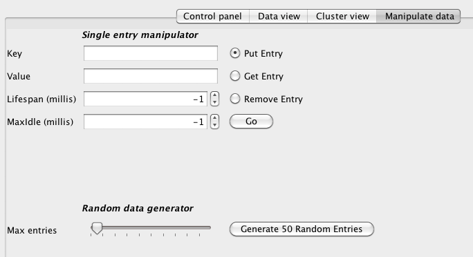

== Infinispan GUI demo
This document walks you through using the Infinispan GUI demo that ships with Infinispan, and assumes that you have link:$$http://www.infinispan.org/download$$[downloaded] the latest version of Infinispan and unzipped the archive. 
I will refer to the Infinispan directory created by unzipping the archive as `${INFINISPAN_HOME}`.

NOTE: You will need either the -bin.zip or -all.zip version for this demo.

=== Step 1: Start the demo GUI
Open up a console and type:

 $ cd ${INFINISPAN_HOME}
 $ bin/runGuiDemo.sh

An equivalent `runGuiDemo.bat` file is also provided for Windows users.

image::images/guidemo1.png[]

=== Step 2: Start the cache
Start the cache in the GUI that starts up, using the _Start Cache_ button. 
 
image::images/guidemo2.png[]
 
=== Step 3: Manipulate data
In the _Manipulate Data_ tab, add entries, generate random data, etc. 
 

=== Step 4: Start more cache instances
Repeat steps 1 and 2 to launch and start up more caches.
Watch cluster formation in the _Cluster View_ tab. 

image::images/guidemo4.png[]

=== Step 5: Manipulate more data
Add and remove data on any of the nodes, and watch state being distributed.
Shut nodes down as well to witness data durability.
 
image::images/guidemo5.png[]

