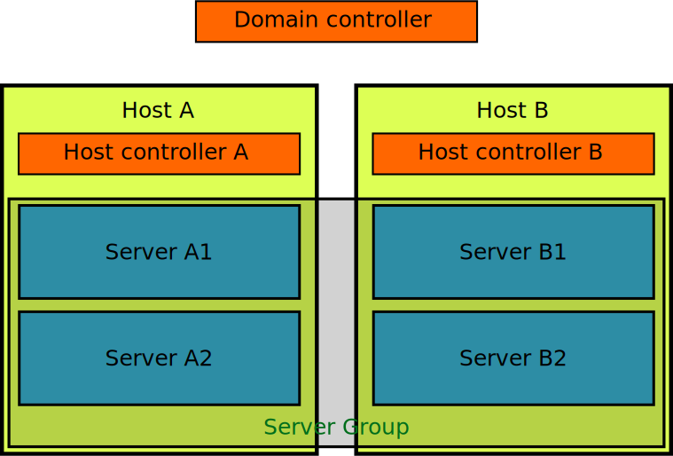

== Operating modes
{brandname} Server, like WildFly, can be booted in two different modes: standalone and domain.

=== Standalone mode
For simple configurations, standalone mode is the easiest to start with.
It allows both local and clustered configurations, although we only really recommend it for running single nodes, since the configuration, management and coordination of multiple nodes is up to the user's responsibility.
For example, adding a cache to a cluster of standalone server, the user would need to configure individually to all nodes.
Note that the default +standalone.xml+ configuration does not provide a JGroups subsystem and therefore cannot work in clustered mode.
To start standalone mode with an alternative configuration file, use the +-c+ command-line switch as follows:

 bin/standalone.sh -c clustered.xml

If you start the server in clustered mode on multiple hosts, they should automatically discover each other using UDP multicast and form a cluster. If you want to start multiple nodes on a single host, start each one by specifying a port offset using the jboss.socket.binding.port-offset property together with a unique jboss.node.name as follows:

 bin/standalone.sh -Djboss.socket.binding.port-offset=100 -Djboss.node.name=nodeA

If, for some reason, you cannot use UDP multicast, you can use TCP discovery. Read the *JGroups Subsystem Configuration* section below for details on how to configure TCP discovery.

=== Domain mode
Domain mode is the recommended way to run a cluster of servers, since they can all be managed centrally from a single control point.
The following diagram explains the topology of an example domain configuration, with 4 server nodes (A1, A2, B1, B2) running on two physical hosts (A, B):

==== Host
Each "Host" box in the above diagram represents a physical or virtual host. A physical host can contain zero, one or more server instances.

===== Host Controller
When the +domain.sh+ or +domain.bat+ script is run on a host, a process known as a Host Controller is launched.
The Host Controller is solely concerned with server management; it does not itself handle {brandname} server workloads.
The Host Controller is responsible for starting and stopping the individual {brandname} server processes that run on its host, and interacts with the Domain Controller to help manage them.

Each Host Controller by default reads its configuration from the domain/configuration/host.xml file located in the {brandname} Server installation on its host's filesystem.
The host.xml file contains configuration information that is specific to the particular host.
Primarily:

* the listing of the names of the actual {brandname} Server instances that are meant to run off of this installation.
* configuration of how the Host Controller is to contact the Domain Controller to register itself and access the domain configuration. This may either be configuration of how to find and contact a remote Domain Controller, or a configuration telling the Host Controller to itself act as the Domain Controller.
* configuration of items that are specific to the local physical installation. For example, named interface definitions declared in domain.xml (see below) can be mapped to an actual machine-specific IP address in host.xml. Abstract path names in domain.xml can be mapped to actual filesystem paths in host.xml.

==== Domain Controller
One Host Controller instance is configured to act as the central management point for the entire domain, i.e. to be the Domain Controller.
The primary responsibility of the Domain Controller is to maintain the domain's central management policy, to ensure all Host Controllers are aware of its current contents, and to assist the Host Controllers in ensuring any running {brandname} server instances are configured in accordance with this policy.
This central management policy is stored by default in the domain/configuration/domain.xml file in the {brandname} Server installation on Domain Controller's host's filesystem.

A +domain.xml+ file must be located in the +domain/configuration+ directory of an installation that's meant to run the Domain Controller.
It does not need to be present in installations that are not meant to run a Domain Controller; i.e. those whose Host Controller is configured to contact a remote Domain Controller.
The presence of a +domain.xml+ file on such a server does no harm.

The +domain.xml+ file includes, among other things, the configuration of the various "profiles" that {brandname} Server instances in the domain can be configured to run.
A profile configuration includes the detailed configuration of the various subsystems that comprise that profile (e.g. Cache Containers and Caches, Endpoints, Security Realms, DataSources, etc).
The domain configuration also includes the definition of groups of sockets that those subsystems may open. The domain configuration also includes the definition of "server groups".

==== Server Group
A server group is set of server instances that will be managed and configured as one.
In a managed domain each application server instance is a member of a server group.
Even if the group only has a single server, the server is still a member of a group.
It is the responsibility of the Domain Controller and the Host Controllers to ensure that all servers in a server group have a consistent configuration.
They should all be configured with the same profile and they should have the same deployment content deployed.
To keep things simple, ensure that all the nodes that you want to belong to an {brandname} cluster are configured as servers of one server group.

The domain can have multiple server groups, i.e. multiple {brandname} clusters.
Different server groups can be configured with different profiles and deployments; for example in a domain with different {brandname} Server clusters providing different services.
Different server groups can also run the same profile and have the same deployments.

An example server group definition is as follows:

[source,xml]
----

<server-group name="main-server-group" profile="clustered">
    <socket-binding-group ref="standard-sockets"/>
</server-group>

----

A server-group configuration includes the following required attributes:

* name -- the name of the server group
* profile -- the name of the profile the servers in the group should run

In addition, the following optional elements are available:

* socket-binding-group -- specifies the name of the default socket binding group to use on servers in the group. Can be overridden on a per-server basis in host.xml. If not provided in the server-group element, it must be provided for each server in host.xml.
* deployments -- the deployment content that should be deployed on the servers in the group.
* system-properties -- system properties that should be set on all servers in the group
* jvm -- default jvm settings for all servers in the group. The Host Controller will merge these settings with any provided in host.xml to derive the settings to use to launch the server's JVM. See JVM settings for further details.

==== Server
Each "Server" in the above diagram represents an actual {brandname} Server node.
The server runs in a separate JVM process from the Host Controller.
The Host Controller is responsible for launching that process.
In a managed domain the end user cannot directly launch a server process from the command line.

The Host Controller synthesizes the server's configuration by combining elements from the domain wide configuration (from +domain.xml+) and the host-specific configuration (from +host.xml+).

== Example configurations
The server distribution also provides a set of example configuration files in the docs/examples/configs (mostly using standalone mode) which illustrate a variety of possible configurations and use-cases.
To use them, just copy them to the standalone/configuration directory and start the server using the following syntax:

 bin/standalone.sh -c configuration_file_name.xml

For more information regarding the parameters supported by the startup scripts, refer to the WildFly documentation on
link:{wildflydocroot}/Command+line+parameters[Command line parameters].

