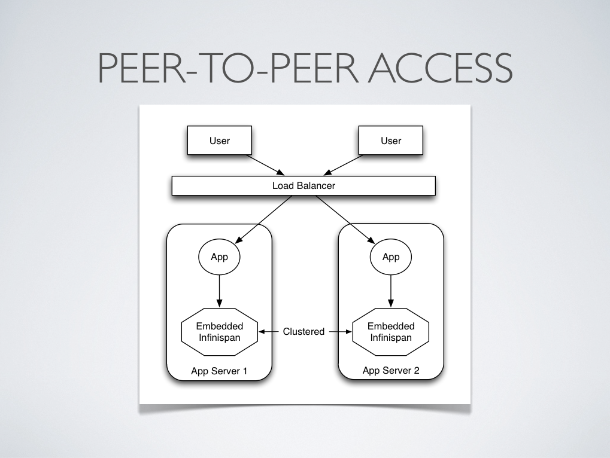
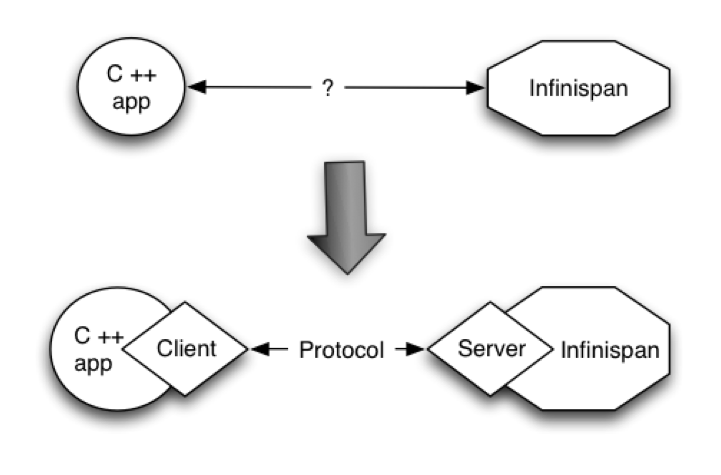
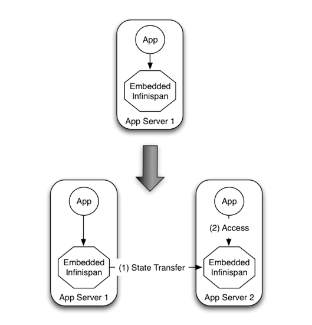
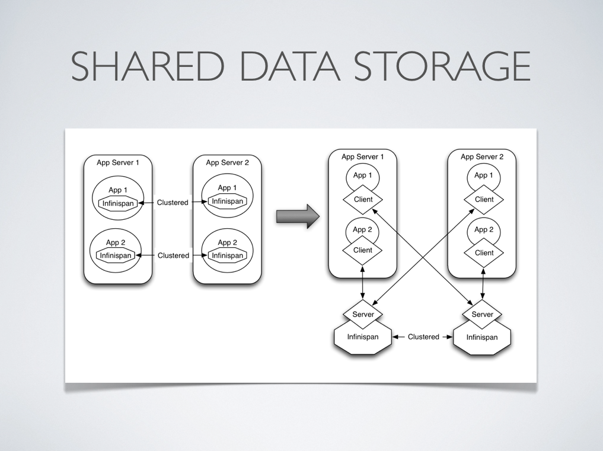

== Server Modules
Applications primarily interacted with Infinispan in a peer-to-peer (p2p), embedded fashion
where Infinispan and the client code that accessed it lived within the same JVM.

When Infinispan is accessed in this way, it is considered to be accessed in an embedded fashion,
as shown in the screenshot below

=== Why Client-Server?
However, there are situations when accessing Infinispan in a client-server mode might make more sense than accessing it via p2p.
For example, when trying to access Infinispan from a non-JVM environment.
Since Infinispan is written in Java, if someone had a $$C++$$ application that wanted to access it, it couldn't just do it in a p2p way.
On the other hand, client-server would be perfectly suited here assuming that a language neutral protocol was used and the corresponding client and server implementations were available. 
 

In other situations, Infinispan users want to have an elastic application tier where you start/stop business processing servers very regularly. Now, if users deployed Infinispan configured with distribution or state transfer, startup time could be greatly influenced by the shuffling around of data that happens in these situations. So in the following diagram, assuming Infinispan was deployed in p2p mode, the app in the second server could not access Infinispan until state transfer had completed. 

This effectively means that bringing up new application-tier servers is impacted by things like state transfer because applications cannot access Infinispan until these processes have finished and if the state being shifted around is large, this could take some time. This is undesirable in an elastic environment where you want quick application-tier server turnaround and predictable startup times. Problems like this can be solved by accessing Infinispan in a client-server mode because starting a new application-tier server is just a matter of starting a lightweight client that can connect to the backing data grid server. No need for rehashing or state transfer to occur and as a result server startup times can be more predictable which is very important for modern cloud-based deployments where elasticity in your application tier is important.

image::images/AchievingElasticity.png[]

Other times, it's common to find multiple applications needing access to data storage. In this cases, you could in theory deploy an Infinispan instance per each of those applications but this could be wasteful and difficult to maintain. Thing about databases here, you don't deploy a database alongside each of your applications, do you? So, alternatively you could deploy Infinispan in client-server mode keeping a pool of Infinispan data grid nodes acting as a shared storage tier for your applications. 

Deploying Infinispan in this way also allows you to manage each tier independently, for example, you can upgrade you application or app server without bringing down your Infinispan data grid nodes.

=== Why use embedded mode?
Before talking about individual Infinispan server modules, it's worth mentioning that in spite of all the benefits, client-server Infinispan still has disadvantages over p2p. Firstly, p2p deployments are simpler than client-server ones because in p2p, all peers are equals to each other and hence this simplifies deployment. So, if this is the first time you're using Infinispan, p2p is likely to be easier for you to get going compared to client-server.

Client-server Infinispan requests are likely to take longer compared to p2p requests, due to the serialization and network cost in remote calls. So, this is an important factor to take in account when designing your application. For example, with replicated Infinispan caches, it might be more performant to have lightweight HTTP clients connecting to a server side application that accesses Infinispan in p2p mode, rather than having more heavyweight client side apps talking to Infinispan in client-server mode, particularly if data size handled is rather large. With distributed caches, the difference might not be so big because even in p2p deployments, you're not guaranteed to have all data available locally.

Environments where application tier elasticity is not so important, or where server side applications access state-transfer-disabled, replicated Infinispan cache instances are amongst scenarios where Infinispan p2p deployments can be more suited than client-server ones.

=== Server Modules
So, now that it's clear when it makes sense to deploy Infinispan in client-server mode, what are available solutions? All Infinispan server modules are based on the same pattern where the server backend creates an embedded Infinispan instance and if you start multiple backends, they can form a cluster and share/distribute state if configured to do so. The server types below primarily differ in the type of listener endpoint used to handle incoming connections.

Here's a brief summary of the available server endpoints.

* *Hot Rod Server Module* - This module is an implementation of the <<_hot_rod_protocol, Hot Rod binary protocol>> backed by Infinispan which allows clients to do dynamic load balancing and failover and smart routing. 
 - A link:http://www.infinispan.org/hotrod-clients[variety of clients] exist for this protocol.
 - If you're clients are running Java, this should be your defacto server module choice because it allows for dynamic load balancing and failover. This means that Hot Rod clients can dynamically detect changes in the topology of Hot Rod servers as long as these are clustered, so when new nodes join or leave, clients update their Hot Rod server topology view. On top of that, when Hot Rod servers are configured with distribution, clients can detect where a particular key resides and so they can route requests smartly.
 - Load balancing and failover is dynamically provided by Hot Rod client implementations using information provided by the server.

* *REST Server Module* - The REST server, which is distributed as a WAR file, can be deployed in any servlet container to allow Infinispan to be accessed via a RESTful HTTP interface. 
 - To connect to it, you can use any HTTP client out there and there're tons of different client implementations available out there for pretty much any language or system.
 - This module is particularly recommended for those environments where HTTP port is the only access method allowed between clients and servers.
 - Clients wanting to load balance or failover between different Infinispan REST servers can do so using any standard HTTP load balancer such as link:$$http://www.jboss.org/mod_cluster$$[mod_cluster] . It's worth noting though these load balancers maintain a static view of the servers in the backend and if a new one was to be added, it would require manual update of the load balancer.

* *Memcached Server Module* - This module is an implementation of the link:$$http://github.com/memcached/memcached/blob/master/doc/protocol.txt$$[Memcached text protocol] backed by Infinispan. 
 - To connect to it, you can use any of the link:$$http://code.google.com/p/memcached/wiki/Clients$$[existing Memcached clients] which are pretty diverse. 
 - As opposed to Memcached servers, Infinispan based Memcached servers can actually be clustered and hence they can replicate or distribute data using consistent hash algorithms around the cluster. So, this module is particularly of interest to those users that want to provide failover capabilities to the data stored in Memcached servers.
 - In terms of load balancing and failover, there're a few clients that can load balance or failover given a static list of server addresses (perl's Cache::Memcached for example) but any server addition or removal would require manual intervention.

* *Websocket Server Module* - This module enables Infinispan to be accessed over a link:$$http://en.wikipedia.org/wiki/WebSockets$$[Websocket] interface via a Javascript API. 
 - This module is very specifically designed for Javascript clients and so that is the only client implementation available.
 - This module is particularly suited for developers wanting to enable access to Infinispan instances from their Javascript codebase.
 - Since websockets work on the same HTTP port, any HTTP load balancer would do to load balance and failover.
 - This module is [red]**EXPERIMENTAL**!  Beware!

include::chapter-48-Using_Hot_Rod_Server.adoc[]
include::chapter-59-Infinispan_REST_Server.adoc[]
include::chapter-10-Using_Infinispan_Memcached_Server.adoc[]
include::chapter-9-Infinispan_WebSocket_Server.adoc[]

[[sid-68355061]]

===  Portable Serialization with Apache Avro
Hot Rod clients can be configured with a marshaller that produces platform independent payloads using link:$$http://avro.apache.org/$$[Apache Avro] . This means that payloads generated by a Java, Avro-based, marshaller could be read by a Python, Avro-based, marshaller. When Hot Rod clients in other languages such as Python or Ruby become available, this will mean that for example, data stored via Java Hot Rod client will be readable by a Python Hot Rod client. 

==== Languages Supported
Avro currently supports providing portable serialization payloads for the following languages:

* C
* $$C++$$
* Java
* Python
* Ruby

So interoperability of payloads is limited to these languages. The choice of Avro over other existing portable serialization libraries (i.e. Google Protocol Buffers, Apache Thrift, MessagePack...etc) was done based languages supported, ease of use, and payload size.

==== Object Types Supported
Avro based marshaller currently supports basic type and collection marshalling:

* Basic types include:
* UTF-8 string
* Integer
* Long
* Float
* Double
* Boolean
* Byte Array
* Collections composed of the basic types
** Arrays
** Lists
** Maps
** Sets

Marshalling of complex objects is not supported because it's not fully solvable as some language don't support some concepts other languages offer. Instead, it is recommended that for any complex object marshalling requirements, users serialize these complex objects into byte arrays using portable serialization libraries such as link:$$http://code.google.com/apis/protocolbuffers/$$[Google Protocol Buffers] , link:$$http://incubator.apache.org/thrift/$$[Apache Thrift] , link:$$http://msgpack.org/$$[MessagePack] , or link:$$http://avro.apache.org/$$[Apache Avro] . Once the byte array has been created, simply pass it to the Hot Rod client API which will handle it accordingly. 

Therefore, it's clear that users are free to use any portable serialization library to transform their complex objects into byte arrays, regardless of the fact that Infinispan uses Apache Avro for basic type and collection marshalling. The only limitation here is that the target language used to serialize complex objects needs to be amongst the languages that Apache Avro supports.

Short and Byte Java primitive types are not supported per se. Instead, clients should pass integers which will be encoded efficiently using link:$$http://lucene.apache.org/java/2_4_0/fileformats.html#VInt$$[variable-length] link:$$http://code.google.com/apis/protocolbuffers/docs/encoding.html#types$$[zig zag] coding. Primitive arrays not supported except byte arrays. Instead, use their object counter partners, i.e. Integer...etc. 

===== Java Configuration
To configure a Java Hot Rod client with Avro marshaller, simply pass a infinispan.client.hotrod.marshaller property to the RemoteCacheManager constructor containing the value of org.infinispan.client.hotrod.marshall.ApacheAvroMarshaller. For example: 

[source,java]
----
Properties props = new Properties();
props.put("infinispan.client.hotrod.marshaller",
   "org.infinispan.client.hotrod.marshall.ApacheAvroMarshaller");
RemoteCacheManager remoteCacheManager = new RemoteCacheManager(props);

----

Note however that if all you're going to be using are Java Hot Rod clients, there's no need to configure Avro based marshaller. The default marshaller is capable of transforming any Serializable or Externalizable java object into a byte array in a quick and efficient manner.

Please remember as well that when remote java clients are configured with the Apache Avro marshaller, the server's marshaller does not need changing. This is because the server does not make any attempt at unmarshalling the data that's been passed to it. Internally, it keeps the data as byte arrays.

[[sid-68355066]]

===  Load Testing Infinispan Server Modules
This section details how to load test and benchmark these server implementations using link:$$http://grinder.sourceforge.net/$$[Grinder], which is a Java load testing framework that makes it easy to run a distributed test using many load injector machines. 

.  First of all, link:$$http://grinder.sourceforge.net/download.html$$[download Grinder version 3.4 or higher] and unzip it somewhere locally. 
.  Next, link:$$http://www.jboss.org/infinispan/downloads.html$$[download] and unzip the Infinispan version that you want to be testing. Make sure you download the -all.zip distribution to run these tests. Note that although Infinispan REST server was included in 4.0, Memcached and Hot Rod servers are only included from 4.1 onwards. 
.  Download Infinispan Grinder scripts and other material from link:$$http://github.com/galderz/infinispan-server-grinder/archives/master$$[this source repository] . 
.  Next up, modify bin/setGrinderEnv.sh file to set correct environment paths. Primarily, you should be looking at setting the following properties correctly (The rest of properties not mentioned below can be left as they are) : 
.. INFINISPAN_HOME : It should point to the location where Infinispan was unzipped. 
.. GRINDER_HOME : It should point to where Grinder was unzipped. 
.. GRINDER_PROPERTIES : It should point to the grinder.properties provided with the Infinispan Grinder scripts 
.. SPYMEMCACHED_HOME : It should only be modified to point to Spymemcached Memcached client library if you're planning to load test Infinispan Memcached server. 
.  It is time now to start the Infinispan server that you want to be testing. If you want to start the Hot Rod server quickly, the following command should do the job: 
.. $INFINISPAN_HOME/bin/startServer.sh -r hotrod -l 0.0.0.0
. Finally, let's start the load test. Currently, a single load test exists which after a warmup phase, it does a certain amount of put/get calls on a pool of keys with a configurable distribution. By default, it executes 20% put operations and 80% get operations. So, if you're going to start the Hot Rod test, you'd simply do:
.. cd infinispan-server-grinder/ 
.. ./bin/startHotRodAgent.sh 
. Once the test has finished, the output can be located in infinispan-server-grinder/log/out-${host}-0.log and will show something like this at the bottom: 

----
         Tests    Errors   Mean Test   Test Time   TPS         
                           Time (ms)   Standard                 
                                       Deviation                
                                       (ms)                     
 
Test 1   25       0        13742.56    457.22      0.29      "Warmup (1000 ops)"
Test 2   400136   0        1.92        2.55        4687.08   "Read (20000 ops per thread)"
Test 3   99864    0        2.41        4.97        1169.78   "Put (20000 ops per thread)"
 
Totals   500025   0        2.70        97.26       1952.38  

----

The output is saying that it first run 25 threads, each sending 1000 operations in order to warm up the cache. Afterwards, each of these 25 threads send 20.000 operations making a total of 500.000 operations, out of which 400136 were get calls and 99864 were put calls, and the test here indicates what was the mean test time for each of these operations, including standard deviation and how many operations per second (TPS) were executed. In this case, 4686 get operations per second and 1169 put operations per second. 

===  Server Command Line Options
Please find below the set of common command line parameters that can be passed to the startServer.sh and startServer.bat scripts.

----
$ ./bin/startServer.sh -h
usage: startServer [options]

options:
  -h, --help                         
        Show this help message

  -V, --version
        Show version information

  --                  
        Stop processing options

  -p, --port=<num>                   
        TCP port number to listen on
        (default: 11211 for Memcached, 11222 for Hot Rod
        and 8181 for WebSocket server)

  -l, --host=<host or ip>
        Interface to listen on
        (default: 127.0.0.1, localhost)

  -m, --master_threads=<num>
        Number of threads accepting incoming connections
        (default: unlimited while resources are available)

  -t, --work_threads=<num>
        Number of threads processing incoming requests and sending responses
        (default: unlimited while resources are available)

  -c, --cache_config=<filename>
        Cache configuration file
        (default: creates cache with default values)

  -r, --protocol=[memcached|hotrod|websocket]
        Protocol to understand by the server.
        This is a mandatory option and you should choose one of these options          
 
  -i, --idle_timeout=<num>
        Idle read timeout, in seconds, used to detect stale connections
        (default: -1)
        If no new messages have been read within this time, 
        the server disconnects the channel.
        Passing -1 disables idle timeout.

  -n, --tcp_no_delay=[true|false]
        TCP no delay flag switch (default: true)
 
  -s, --send_buf_size=<num>
        Send buffer size (default: as defined by the OS).
 
  -e, --recv_buf_size=<num>
        Receive buffer size (default: as defined by the OS).
 
  -o, --proxy_host=<host or ip>
        Host address to expose in topology information sent to clients.
        If not present, it defaults to configured host.
        Servers that do not transmit topology information ignore this setting.

  -x, --proxy_port=<num>
        Port to expose in topology information sent to clients.
        If not present, it defaults to configured port.
        Servers that do not transmit topology information ignore this setting.
 
  -k, --topo_lock_timeout=<num>
        Controls lock timeout (in milliseconds) for those servers that maintain
        the topology information in an internal cache.
 
  -u, --topo_repl_timeout=<num>
        Sets the maximum replication time (in milliseconds) for transfer of 
        topology information between servers.
        If state transfer is enabled, this setting also controls the topology 
        cache state transfer timeout.
        If state transfer is disabled, it controls the amount of time to wait 
        for this topology data to be lazily loaded from a different node when 
        not present locally.

  -a, --topo_state_trasfer=[true|false]
        Enabling topology information state transfer means that when a server
        starts it retrieves this information from a different node.
        Otherwise, if set to false, the topology information is lazily loaded
        if not available locally.
 
  -D<name>[=<value>]
        Set a system property
 

----

