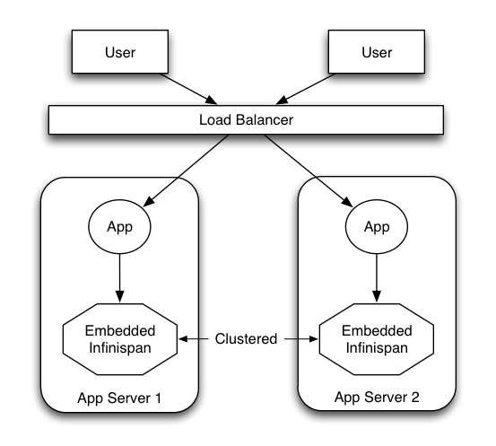

== Server Modules
Infinispan offers two alternative access methods: embedded mode and client-server mode.

* In Embedded mode the Infinispan libraries co-exist with the user application in the same JVM as shown in the following diagram

* Client-server mode is when applications access the data stored in a remote Infinispan server using some kind of network protocol

=== Why Client-Server?
There are situations when accessing Infinispan in a client-server mode might make more sense than embedding it within your application, for example, when trying to access Infinispan from a non-JVM environment.
Since Infinispan is written in Java, if someone had a $$C++$$ application that wanted to access it, it couldn't just do it in a p2p way.
On the other hand, client-server would be perfectly suited here assuming that a language neutral protocol was used and the corresponding client and server implementations were available. 
 
image::images/server_modules_2.png[]

In other situations, Infinispan users want to have an elastic application tier where you start/stop business processing servers very regularly. Now, if users deployed Infinispan configured with distribution or state transfer, startup time could be greatly influenced by the shuffling around of data that happens in these situations. So in the following diagram, assuming Infinispan was deployed in p2p mode, the app in the second server could not access Infinispan until state transfer had completed. 

image::images/server_modules_3.png[]

This effectively means that bringing up new application-tier servers is impacted by things like state transfer because applications cannot access Infinispan until these processes have finished and if the state being shifted around is large, this could take some time. This is undesirable in an elastic environment where you want quick application-tier server turnaround and predictable startup times. Problems like this can be solved by accessing Infinispan in a client-server mode because starting a new application-tier server is just a matter of starting a lightweight client that can connect to the backing data grid server. No need for rehashing or state transfer to occur and as a result server startup times can be more predictable which is very important for modern cloud-based deployments where elasticity in your application tier is important.

image::images/AchievingElasticity.png[]

Other times, it's common to find multiple applications needing access to data storage. In this cases, you could in theory deploy an Infinispan instance per each of those applications but this could be wasteful and difficult to maintain. Thing about databases here, you don't deploy a database alongside each of your applications, do you? So, alternatively you could deploy Infinispan in client-server mode keeping a pool of Infinispan data grid nodes acting as a shared storage tier for your applications. 

image::images/server_modules_4.png[]

Deploying Infinispan in this way also allows you to manage each tier independently, for example, you can upgrade you application or app server without bringing down your Infinispan data grid nodes.

=== Why use embedded mode?
Before talking about individual Infinispan server modules, it's worth mentioning that in spite of all the benefits, client-server Infinispan still has disadvantages over p2p. Firstly, p2p deployments are simpler than client-server ones because in p2p, all peers are equals to each other and hence this simplifies deployment. So, if this is the first time you're using Infinispan, p2p is likely to be easier for you to get going compared to client-server.

Client-server Infinispan requests are likely to take longer compared to p2p requests, due to the serialization and network cost in remote calls. So, this is an important factor to take in account when designing your application. For example, with replicated Infinispan caches, it might be more performant to have lightweight HTTP clients connecting to a server side application that accesses Infinispan in p2p mode, rather than having more heavyweight client side apps talking to Infinispan in client-server mode, particularly if data size handled is rather large. With distributed caches, the difference might not be so big because even in p2p deployments, you're not guaranteed to have all data available locally.

Environments where application tier elasticity is not so important, or where server side applications access state-transfer-disabled, replicated Infinispan cache instances are amongst scenarios where Infinispan p2p deployments can be more suited than client-server ones.

=== Server Modules
So, now that it's clear when it makes sense to deploy Infinispan in client-server mode, what are available solutions? All Infinispan server modules are based on the same pattern where the server backend creates an embedded Infinispan instance and if you start multiple backends, they can form a cluster and share/distribute state if configured to do so. The server types below primarily differ in the type of listener endpoint used to handle incoming connections.

Here's a brief summary of the available server endpoints.

* *Hot Rod Server Module* - This module is an implementation of the <<_hot_rod_protocol, Hot Rod binary protocol>> backed by Infinispan which allows clients to do dynamic load balancing and failover and smart routing. 
 - A link:http://www.infinispan.org/hotrod-clients[variety of clients] exist for this protocol.
 - If you're clients are running Java, this should be your defacto server module choice because it allows for dynamic load balancing and failover. This means that Hot Rod clients can dynamically detect changes in the topology of Hot Rod servers as long as these are clustered, so when new nodes join or leave, clients update their Hot Rod server topology view. On top of that, when Hot Rod servers are configured with distribution, clients can detect where a particular key resides and so they can route requests smartly.
 - Load balancing and failover is dynamically provided by Hot Rod client implementations using information provided by the server.

* *REST Server Module* - The REST server, which is distributed as a WAR file, can be deployed in any servlet container to allow Infinispan to be accessed via a RESTful HTTP interface. 
 - To connect to it, you can use any HTTP client out there and there're tons of different client implementations available out there for pretty much any language or system.
 - This module is particularly recommended for those environments where HTTP port is the only access method allowed between clients and servers.
 - Clients wanting to load balance or failover between different Infinispan REST servers can do so using any standard HTTP load balancer such as link:$$http://www.jboss.org/mod_cluster$$[mod_cluster] . It's worth noting though these load balancers maintain a static view of the servers in the backend and if a new one was to be added, it would require manual update of the load balancer.

* *Memcached Server Module* - This module is an implementation of the link:$$http://github.com/memcached/memcached/blob/master/doc/protocol.txt$$[Memcached text protocol] backed by Infinispan. 
 - To connect to it, you can use any of the link:$$http://code.google.com/p/memcached/wiki/Clients$$[existing Memcached clients] which are pretty diverse. 
 - As opposed to Memcached servers, Infinispan based Memcached servers can actually be clustered and hence they can replicate or distribute data using consistent hash algorithms around the cluster. So, this module is particularly of interest to those users that want to provide failover capabilities to the data stored in Memcached servers.
 - In terms of load balancing and failover, there're a few clients that can load balance or failover given a static list of server addresses (perl's Cache::Memcached for example) but any server addition or removal would require manual intervention.

* *Websocket Server Module* - This module enables Infinispan to be accessed over a link:$$http://en.wikipedia.org/wiki/WebSockets$$[Websocket] interface via a Javascript API. 
 - This module is very specifically designed for Javascript clients and so that is the only client implementation available.
 - This module is particularly suited for developers wanting to enable access to Infinispan instances from their Javascript codebase.
 - Since websockets work on the same HTTP port, any HTTP load balancer would do to load balance and failover.
 - This module is [red]**EXPERIMENTAL**!  Beware!

include::chapter-48-Using_Hot_Rod_Server.adoc[]
include::chapter-59-Infinispan_REST_Server.adoc[]
include::chapter-10-Using_Infinispan_Memcached_Server.adoc[]
include::chapter-9-Infinispan_WebSocket_Server.adoc[]

[[sid-68355061]]
