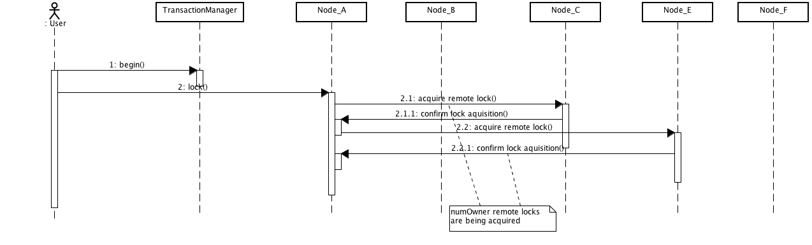
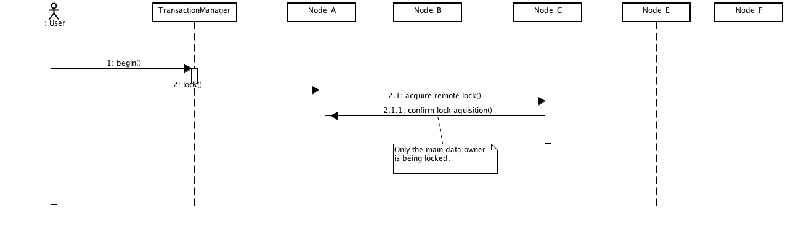

==  Locking and Concurrency
Infinispan makes use of multi-versioned concurrency control (link:$$http://en.wikipedia.org/wiki/Multiversion_concurrency_control$$[MVCC]) - a concurrency scheme popular with relational databases and other data stores.
MVCC offers many advantages over coarse-grained Java synchronization and even JDK Locks for access to shared data, including: 

* allowing concurrent readers and writers
* readers and writers do not block one another
* write skews can be detected and handled
* internal locks can be striped

=== Locking implementation details
Infinispan's MVCC implementation makes use of minimal locks and synchronizations, leaning heavily towards lock-free techniques such as link:$$http://en.wikipedia.org/wiki/Compare-and-swap$$[compare-and-swap] and lock-free data structures wherever possible, which helps optimize for multi-CPU and multi-core environments. 

In particular, Infinispan's MVCC implementation is heavily optimized for readers.  Reader threads do not acquire explicit locks for entries, and instead directly read the entry in question.

Writers, on the other hand, need to acquire a write lock.  This ensures only one concurrent writer per entry, causing concurrent writers to queue up to change an entry.  To allow concurrent reads, writers make a copy of the entry they intend to modify, by wrapping the entry in an link:$$http://docs.jboss.org/infinispan/6.0/apidocs/org/infinispan/container/entries/MVCCEntry.html$$[MVCCEntry] .  This copy isolates concurrent readers from seeing partially modified state.  Once a write has completed, MVCCEntry.commit() will flush changes to the data container and subsequent readers will see the changes written.

==== Isolation levels
Infinispan offers two isolation levels - link:$$http://en.wikipedia.org/wiki/Isolation_level#READ_COMMITTED$$[READ_COMMITTED] (the default) and link:$$http://en.wikipedia.org/wiki/Isolation_level#REPEATABLE_READ$$[REPEATABLE_READ], configurable via the link:$$http://docs.jboss.org/infinispan/5.1/configdocs/urn_infinispan_config_5.1/complexType/configuration.locking.html$$[`<locking />`] configuration element.

These isolation levels determine when readers see a concurrent write, and are internally implemented using different subclasses of link:$$http://docs.jboss.org/infinispan/6.0/apidocs/org/infinispan/container/entries/MVCCEntry.html$$[MVCCEntry], which have different behaviour in how state is committed back to the data container.

Here's a more detailed example that should help understand the difference between READ_COMMITTED and REPEATABLE_READ in the context of Infinispan. With read committed, if between two consecutive read calls on the same key, the key has been updated by another transaction, the second read will return the new updated value:

. Thread1: tx.begin()
. Thread1: cache.get(k) returns v
. Thread2: tx.begin()
. Thread2: cache.get(k) returns v
. Thread2: cache.put(k, v2)
. Thread2: tx.commit()
. Thread1: cache.get(k) returns v2!

With REPEATABLE_READ, step 7 will still return v. So, if you're going to retrieve the same key multiple times within a transaction, you should use REPEATABLE_READ.

==== The LockManager
The LockManager is a component that is responsible for locking an entry for writing.
The LockManager makes use of a LockContainer to locate/hold/create locks.
LockContainers come in two broad flavours, with support for lock striping and with support for one lock per entry.

==== Lock striping
Lock striping entails the use of a fixed-size, shared collection of locks for the entire cache, with locks being allocated to entries based on the entry's key's hash code.  Similar to the way the JDK's ConcurrentHashMap allocates locks, this allows for a highly scalable, fixed-overhead locking mechanism in exchange for potentially unrelated entries being blocked by the same lock.

The alternative is to disable lock striping - which would mean a _new_ lock is created per entry.  This approach _may_ give you greater concurrent throughput, but it will be at the cost of additional memory usage, garbage collection churn, etc. 

.Default lock striping settings
IMPORTANT: From Infinispan 5.0, lock striping is disabled by default, due to potential deadlocks that can happen if locks for different keys end up in the same lock stripe. Previously, in Infinispan 4.x lock striping used to be enabled by default.

The size of the shared lock collection used by lock striping can be tuned using the `concurrencyLevel` attribute of the link:$$http://docs.jboss.org/infinispan/5.1/configdocs/urn_infinispan_config_5.1/complexType/configuration.locking.html$$[`<locking />`] configuration element. 

==== Concurrency levels
In addition to determining the size of the striped lock container, this concurrency level is also used to tune any JDK ConcurrentHashMap based collections where related, such as internal to DataContainers.
Please refer to the JDK ConcurrentHashMap Javadocs for a detailed discussion of concurrency levels, as this parameter is used in exactly the same way in Infinispan.

=== Explicit and implicit distributed eager locking
Infinispan, by default, acquires remote locks lazily.
Locks are acquired locally on a node that runs a transaction while other cluster nodes attempt to lock cache keys involved in a transaction during two-phase prepare/commit phase.
However, if desired, Infinispan can eagerly lock cache keys either explicitly or implicitly.

Infinispan cache interface exposes lock API that allows cache users to explicitly lock set of cache keys eagerly during a transaction. Lock call attempts to lock specified cache keys across all cluster nodes and it either succeeds or fails. All locks are released during commit or rollback phase.

Consider a transaction running on one of the cache nodes: 

[source,java]
----
tx.begin()
cache.lock(K)    // acquire cluster wide lock on K
cache.put(K,V5)  // guaranteed to succeed
tx.commit()      // releases locks

----

Implicit locking goes one step ahead and locks cache keys behind the scene as keys are accessed for modification operations.

Consider a transaction running on one of the cache nodes: 

[source,java]
----
tx.begin()
cache.put(K,V)    // acquire cluster wide lock on K
cache.put(K2,V2)  // acquire cluster wide lock on K2
cache.put(K,V5)   // no-op, we already own cluster wide lock for K
tx.commit()       // releases locks

----

Implicit eager locking locks cache keys across cluster nodes only if it is necessary to do so. In a nutshell, if implicit eager locking is turned on then for each modification Infinispan checks if cache key is locked locally. If it is then a global cluster wide lock has already been obtained, otherwise a cluster wide lock request is sent and lock is acquired.

Implicit eager locking is enabled as follows:

[source,xml]
----
<transaction useEagerLocking="true" />
----

=== Locking a single remote node
Infinispan allows for an `eagerLockSingleNode` configuration option. This only applies to distributed mode.
Having this enabled would make the number of remote locks acquired to be always 1, regardless of the configured `numOwners`.
Following diagrams are intended to explain better this option.
All diagrams represent a cluster having 5 nodes, with `numOwners` set to 2.

Above diagram shows the situation where eagerLockSingleNode=false (default configuration). On each lock request, numOwners remote calls are performed (in our example 2).

Above diagram shows how lock on the same key are acquired when eagerLockSingleNode=true. The number of remote calls being performed is always 1, disregarding numOwners values (it can actually be 0, as we'll see later on).

In this scenario, if the lock owner fails (Node_C) then the transaction that holds the lock, which originated on Node_A is marked for rollback.

Combining eagerLockSingleNode with the <<_key_affinity_service, KeyAffinityService>> can bring some interesting advantages. The next diagram shows this: 

image::images/key_affinity.png[]

By using a KeyAffinityService one can generate keys that would always map to the local node. If eagerLockSingleNode=true, then the remote lock acquisition happens locally: this way one can benefit from eager locking semantics and having the same performance as non eager locking. The optimisation is affected by cluster topology changes, so keys might get relocated. But for clusters where topology changes are rather rare this can bring  a lot of value. 

The following xml snippet shows how can be configured:

[source,xml]
----

      <transaction
            transactionManagerLookupClass="org.infinispan.transaction.lookup.GenericTransactionManagerLookup"
            syncRollbackPhase="false"
            syncCommitPhase="false"
            useEagerLocking="true" eagerLockSingleNode="true"/>

----

Note that the configuration is ignored if eager locking is disabled or cache mode is not DIST.

==== Consistency
The fact that a single owner is locked (as opposed to all owners being locked) does not break the following consistency guarantee: if key K is hashed to nodes {A, B} and transaction TX1 acquires a lock for K, let's say on A. If another transaction, TX2, is started on B (or any other node) and TX2 tries to lock K then it will fail with a timeout as the lock is already held by TX1. The reason for this is the that the lock for a key K is always, deterministically, acquired on the same node of the cluster, regardless of where the transaction originates.

=== Transactional caches and concurrent updates
This configuration refers to non-transactional distributed and local caches only (doesn't apply to replicated caches) and was added in Infinispan 5.2. Depending on whether one needs to support concurrent updates (e.g. two threads concurrently writing the same key), the following configuration option can be used:

[source,xml]
----

<locking supportsConcurrentUpdates="true"/>

----

When enabled (default == true), the _supportConcurrentUpdates_ adds internal support for concurrent writes: a locking interceptor that would serialize writes to the same key and a delegation layer, that designates a lock owner and uses it in order to coordinate the writes to a key. 

More specific, when a thread running on node A writes on key _k_ that mapps according to the consistent hash to nodes {B, C} (given _numOwners_ ==2): 

* A forwards (RPC) the write to the primary owner. The primary owner is the first node in the list of owners, in our example B
* B acquires a lock on _k._ Once the lock successfully acquired,_ _it forwards (RPC) the request to the rest of owners (in this example C) that apply it locally 
* B applies the result locally, releases the lock and then it returns to A

Reasoning about the performance: in order to assure consistency under concurrent update, we do 2 RPCs: from operation originator to main owner and from main owner to the rest of the owners. That's one more than when _supportConcurrentUpdates == false_ : in this case the operation originator does a single (multicast) RPC to all the owners. This induces a performance cost and whenever one uses the cache in non-concurrent manner, it is recommended that this configuration to be set to false in order to increase the performance. When using Infinispan in client/server mode with a Hot Rod client, this would use the main data owner in order to write data, so in this scenario there should not be any performance cost when supporting concurrent updates. 

===  Data Versioning
Infinispan will offer three forms of data versioning, including simple, partition aware and external.  Each case is described in detail below.

==== Simple versioning
The purpose of simple versioning is to provide a reliable mechanism of write skew checks when using optimistic transactions, REPEATABLE_READ and a clustered cache.  Write skew checks are performed at prepare-time to ensure a concurrent transaction hasn't modified an entry while it was read and potentially updated based on the value read.

When operating in LOCAL mode, write skew checks rely on Java object references to compare differences and this is adequate to provide a reliable write-skew check, however this technique is useless in a cluster and a more reliable form of versioning is necessary to provide reliable write skew checks.

Simple versioning is an implementation of the proposed EntryVersion interface, backed by a long that is incremented each time the entry is updated. 

==== Partition-aware versioning
This versioning scheme makes use of link:$$http://en.wikipedia.org/wiki/Vector_clock$$[vector clocks] to provide a network partition resilient form of versioning. 

Unlike simple versioning, which is maintained per entry, a vector clock's node counter is maintained per-node.

==== External versioning

This scheme is used to encapsulate an external source of data versioning within Infinispan, such as when using Infinispan with Hibernate which in turn gets its data version information directly from a database.

In this scheme, a mechanism to pass in the version becomes necessary, and overloaded versions of put() and putForExternalRead() will be provided in AdvancedCache to take in an external data version.  This is then stored on the InvocationContext and applied to the entry at commit time. 

Write skew checks cannot and will not be performed in the case of external data versioning.

==== Tombstones
To deal with deletions of entries, tombstones will be maintained as null entries that have been deleted, so that version information of the deleted entry can be maintained and write skews can still be detected.  However this is an expensive thing to do, and as such, is a configuration option, disabled by default. Further, tombstones will follow a strict lifespan and will be cleared from the system after a specific amount of time. 

==== Configuration
By default versioning will be _disabled_.  This will mean write skew checks when using transactions and _$$REPEATABLE_READ$$_ as an isolation level will be unreliable when used in a cluster.
Note that this doesn't affect single-node, LOCAL mode usage. 

[source,xml]
----

<versioning enabled="false" type="SIMPLE|PARTITION_AWARE|EXTERNAL" useTombstones="false" tombstoneLifespan="60000"/>

----

Or

[source,java]
----

fluent().versioning().type(SIMPLE).useTombstones(true).tombstoneLifespan(1, TimeUnit.MINUTES);

----

