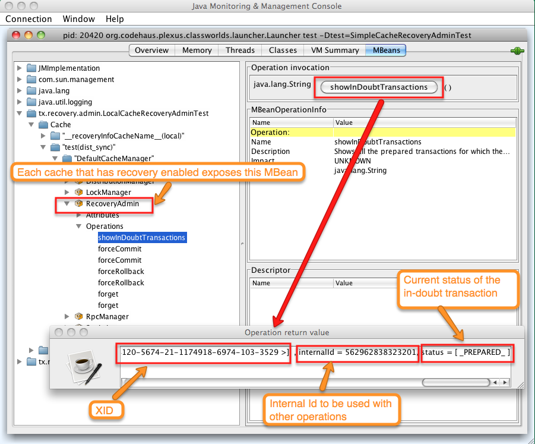
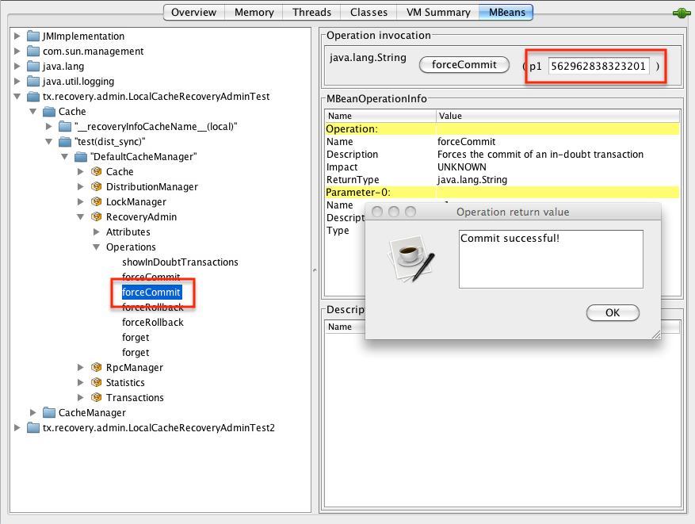

==  Transactions
Infinispan can be configured to use and to participate in JTA compliant transactions. Alternatively, if transaction support is disabled, it is equivalent to using autocommit in JDBC calls, where modifications are potentially replicated after every change (if replication is enabled).

On every cache operation Infinispan does the following:

. Retrieves the current link:$$http://docs.oracle.com/javaee/1.3/api/javax/transaction/Transaction.html$$[Transaction] associated with the thread
. If not already done, registers link:$$http://docs.oracle.com/javaee/1.3/api/javax/transaction/xa/XAResource.html$$[XAResource] with the transaction manager to be notified when a transaction commits or is rolled back.

In order to do this, the cache has to be provided with a reference to the environment's link:$$http://docs.oracle.com/javaee/1.3/api/javax/transaction/TransactionManager.html$$[TransactionManager] . This is usually done by configuring the cache with the class name of an implementation of the link:$$http://docs.jboss.org/infinispan/7.0/apidocs/org/infinispan/transaction/lookup/TransactionManagerLookup.html$$[TransactionManagerLookup] interface. When the cache starts, it will create an instance of this class and invoke its getTransactionManager() method, which returns a reference to the TransactionManager.

Infinispan ships with several transaction manager lookup classes:

.Transaction manager lookup implementations
*  link:$$http://docs.jboss.org/infinispan/7.0/apidocs/org/infinispan/transaction/lookup/DummyTransactionManagerLookup.html$$[DummyTransactionManagerLookup] : This provides with a dummy transaction manager which should only be used for testing.  Being a dummy, this is not recommended for production use a it has some severe limitations to do with concurrent transactions and recovery.

*  link:$$http://docs.jboss.org/infinispan/7.0/apidocs/org/infinispan/transaction/lookup/JBossStandaloneJTAManagerLookup.html$$[JBossStandaloneJTAManagerLookup] : If you're running Infinispan in a standalone environment, this should be your default choice for transaction manager. It's a fully fledged transaction manager based on link:$$http://www.jboss.org/jbosstm$$[JBoss Transactions] which overcomes all the deficiencies of the dummy transaction manager.

*  link:$$http://docs.jboss.org/infinispan/7.0/apidocs/org/infinispan/transaction/lookup/GenericTransactionManagerLookup.html$$[GenericTransactionManagerLookup] : This is a lookup class that locate transaction managers in the most  popular Java EE application servers. If no transaction manager can be found, it defaults on the dummy transaction manager.

*  link:$$http://docs.jboss.org/infinispan/7.0/apidocs/org/infinispan/transaction/lookup/JBossTransactionManagerLookup.html$$[JBossTransactionManagerLookup] : This lookup class locates the transaction manager running within a JBoss Application Server instance.

Once initialized, the TransactionManager can also be obtained from the Cache itself:

[source,java]
----

//the cache must have a transactionManagerLookupClass defined
Cache cache = cacheManager.getCache();

//equivalent with calling TransactionManagerLookup.getTransactionManager();
TransactionManager tm = cache.getAdvancedCache().getTransactionManager();

----

=== Configuring transactions
Transactions are being configured at cache level.

[source,xml]
----

<transaction 
      transaction-manager-lookup="org.infinispan.transaction.lookup.GenericTransactionManagerLookup"
      mode="FULL_XA"
      locking="OPTIMISTIC"/>

----

* transactionManagerLookupClass fully qualified class name of a class that looks up a reference to a javax.transaction.TransactionManager
* mode - configures whether the cache is transaction mode, the available options are:
** `NONE` - non transactional cache
** `FULL_XA` - XA transactional cache with recovery enabled.
** `NON_DURABLE_XA` - XA transactional cache with recovery disabled.
** `NON_XA` - Transactional cache with intergration via Synchronization instead of XA.
* locking - configures whether the cache uses optimistic or pessimistic locking.

For more details on how two phase commit (2PC) is implemented in Infinispan and how locks are being acquired see the section below. All possible transactional settings are available in link:$$http://docs.jboss.org/infinispan/7.0/configdocs/$$[Configuration reference]

=== Transaction modes
Starting with Infinispan 5.1 release a cache can accessed either transactionally or non-transactionally.
The mixed access mode that existed in Infinispan 4 and 5.0 is no longer supported.
There are several reasons for going this path, but one of them most important is a cleaner semantic on how concurrency is managed between multiple requestors for the same cache entry.

By default, all Infinispan caches are non-transactional. A cache can be made transactional by changing the `mode` attribute:

[source,xml]
----

<local-cache name="transactional">
  <transaction mode="NON_XA"/>
</local-cache>

----

One can configure a transactional cache programatically as well, the equivalent is:

[source,java]
----

Configuration c = new ConfigurationBuilder().transaction().transactionMode(TransactionMode.TRANSACTIONAL).build();
assert c.transaction().transactionalCache();

----

NOTE: Do not forget to configure a TransactionManagerLookup for transactional caches.

Supported transaction models are optimistic and pessimistic. Optimistic model is an improvement over the old transaction model as it completely defers lock acquisition to transaction prepare time. New approach reduces lock acquisition duration and increases throughput which in turn avoids deadlocks significantly. In pessimistic model, cluster wide-locks are acquired on each write operation only being released after the transaction completed.

==== Optimistic Transactions
With optimistic transactions locks are being acquired at transaction prepare time and are only being held up to the point the transaction commits (or rollbacks). This is different from the 5.0 default locking model where local locks are being acquire on writes and cluster locks are being acquired during prepare time.

Optimistic transactions can be enabled in the configuration file:

[source,xml]
----

<local-cache name="transactional">
  <transaction mode="NON_XA" locking="OPTIMISTIC"/>
</local-cache>

----

or programatically:

[source,java]
----

Configuration c = new ConfigurationBuilder().transaction().lockingMode(LockingMode.OPTIMISTIC).build();
assert c.transaction().lockingMode() == LockingMode.OPTIMISTIC;

----

NOTE: By default, a transactional cache is optimistic.

==== Pessimistic Transactions
From a lock acquisition perspective, pessimistic transactions obtain locks on keys at the time the key is written. E.g.

[source,java]
----

transactionManager.begin();
cache.put(k1,v1); //k1 is locked
cache.remove(k2); //k2 is locked when this returns
transactionManager.commit();

----

When `cache.put(k1,v1)` returns, k1 is locked and no other transaction running anywhere in the cluster can write to it.
Reading k1 is still possible. The lock on k1 is released when the transaction completes (commits or rollbacks).

Pessimistic transactions can be enabled in the configuration file:

[source,xml]
----

<local-cache name="transactional">
  <transaction mode="NON_XA" locking="PESSIMISTIC"/>
</local-cache>

----

or programatically:

[source,java]
----

Configuration c = new ConfigurationBuilder().transaction().lockingMode(LockingMode.PESSIMISTIC).build();
assert c.transaction().lockingMode() == LockingMode.PESSIMISTIC;

----

==== Backward compatibility
The `autoCommit` attribute was added in order to assure backward compatibility with Infinispan 4. If a cache is transactional and autoCommit is enabled (defaults to true) then any call that is performed outside of a transaction's scope is transparently wrapped within a transaction. In other words Infinispan adds the logic for starting a transaction before the call and committing it after the call.

Therefore if your code accesses a cache both transactionally and non-transactionally all you have to do when migrating to Infinispan 5.1 is mark the cache as transactional and enable autoCommit (that's actually enabled by default)

The autoCommit feature can be managed through configuration:

[source,xml]
----

<local-cache name="transactional">
  <transaction mode="NON_XA" autoCommit="true"/>
</local-cache>

----

==== What do I need - pessimistic or optimistic transactions?
From a use case perspective, optimistic transactions should be used when there is _not_ a lot of contention between multiple transactions running at the same time. That is because the optimistic transactions rollback if data has changed between the time it was read and the time it was committed (writeSkewCheck). 

On the other hand, pessimistic transactions might be a better fit when there is high contention on the keys and transaction rollbacks are less desirable. Pessimistic transactions are more costly by their nature: each write operation potentially involves a RPC for lock acquisition.

=== Deadlock detection
Deadlocks can significantly (up to one order of magnitude, see benchmarks) reduce the throughput of a system, especially when multiple transactions are operating agains the same key set. Deadlock detection is disabled by default, but can be enabled/configured per cache (i.e. under namedCache config element) by adding the following: 

[source,xml]
----
<local-cache deadlock-detection-spin="1000"/>

----

Some clues on when to enable deadlock detection. A high number of transaction rolling back due to link:$$http://docs.jboss.org/infinispan/7.0/apidocs/org/infinispan/util/concurrent/TimeoutException.html$$[TimeoutException] is an indicator that this functionality might help. TimeoutException might be caused by other causes as well, but deadlocks will always result in this exception being thrown. Generally, when you have a high contention on a set of keys, deadlock detection may help. But the best way is not to guess the performance improvement but to benchmark and monitor it: you can have access to statistics (e.g. number of deadlocks detected) through JMX, as it is exposed via the DeadlockDetectingLockManager MBean. For more details on how deadlock detection works, benchmarks and design details refer to link:$$http://infinispan.blogspot.com/2009/07/increase-transactional-throughput-with.html$$[this] article.

Note: deadlock detection only runs on an a per cache basis: deadlocks that spread over two or more caches won't be detected.

=== Dealing with exceptions
If a link:$$http://docs.jboss.org/infinispan/7.0/apidocs/org/infinispan/CacheException.html$$[CacheException] (or a subclass of it) is thrown by a cache method within the scope of a JTA transaction, then the transaction is automatically marked for rollback.

=== Enlisting Synchronizations
By default Infinispan registers itself as a first class participant in distributed transactions through link:$$http://docs.oracle.com/javaee/6/api/javax/transaction/xa/XAResource.html$$[XAResource] . There are situations where Infinispan is not required to be a participant in the transaction, but only to be notified by its lifecycle (prepare, complete): e.g. in the case Infinispan is used as a 2nd level cache in Hibernate.

Starting with 5.0  release, Infinispan allows transaction enlistment through link:$$http://docs.oracle.com/javaee/6/api/javax/transaction/Synchronization.html$$[Synchronisation] . To enable it just use `NON_XA` transaction mode:

[source,xml]
----
<transaction mode="NON_XA"/>

----

link:$$http://docs.oracle.com/javaee/6/api/javax/transaction/Synchronization.html$$[Synchronization]s have the advantage that they allow TransactionManager to optimize 2PC with a 1PC where only one other resource is enlisted with that transaction ( link:$$http://docs.redhat.com/docs/en-US/JBoss_Enterprise_Web_Platform/5/html/Administration_And_Configuration_Guide/ch09s04.html$$[last resource commit optimization] ). E.g. Hibernate second level cache: if Infinispan registers itself with the TransactionManager as an link:$$http://docs.oracle.com/javaee/6/api/javax/transaction/xa/XAResource.html$$[XAResource] than at commit time, the TransactionManager sees two link:$$http://docs.oracle.com/javaee/6/api/javax/transaction/xa/XAResource.html$$[XAResource] (cache and database) and does not make this optimization. Having to coordinate between two resources it needs to write the tx log to disk. On the other hand, registering Infinispan as a link:$$http://docs.oracle.com/javaee/6/api/javax/transaction/Synchronization.html$$[Synchronisation] makes the TransactionManager skip writing the log to the disk (performance improvement).

===  Batching
Batching allows atomicity and some characteristics of a transaction, but not full-blown JTA or XA capabilities.
Batching is often a lot lighter and cheaper than a full-blown transaction.

TIP: Generally speaking, one should use batching API whenever the only participant in the transaction is an Infinispan cluster. On the other hand, JTA transactions (involving TransactionManager) should be used whenever the transactions involves multiple systems. E.g. considering the "Hello world!" of transactions: transferring money from one bank account to the other. If both accounts are stored within Infinispan, then batching can be used. If one account is in a database and the other is Infinispan, then distributed transactions are required.

==== Configuring batching
To use batching, you need to enable invocation batching in your cache configuration, either on the Configuration object:

[source,java]
----
Configuration.setInvocationBatchingEnabled(true);

----

or in your XML file:

[source,xml]
----
<local-cache batching="true" />

----

By default, invocation batching is disabled.

Note that you _do not_ have to have a transaction manager defined to use batching.

==== API
Once you have configured your cache to use batching, you use it by calling startBatch() and endBatch() on Cache. E.g.,

[source,java]
----
Cache cache = cacheManager.getCache();
// not using a batch
cache.put("key", "value"); // will replicate immediately

// using a batch
cache.startBatch();
cache.put("k1", "value");
cache.put("k2", "value");
cache.put("k2", "value");
cache.endBatch(true); // This will now replicate the modifications since the batch was started.

// a new batch
cache.startBatch();
cache.put("k1", "value");
cache.put("k2", "value");
cache.put("k3", "value");
cache.endBatch(false); // This will "discard" changes made in the batch

----

==== Batching and JTA
Behind the scenes, the batching functionality starts a JTA transaction, and all the invocations in that scope are associated with it. For this it uses a very simple (e.g. no recovery) internal TransactionManager implementation. With batching, you get:

. Locks you acquire during an invocation are held until the batch completes
. Changes are all replicated around the cluster in a batch as part of the batch completion process. Reduces replication chatter for each update in the batch.
. If synchronous replication or invalidation are used, a failure in replication/invalidation will cause the batch to roll back.
. All the transaction related configurations apply for batching as well:

[source,xml]
----
<transaction mode="NON_XA" />

----

===  Transaction recovery
Recovery is a feature of XA transactions, which deal with the eventuality of a resource or possibly even the transaction manager failing, and recovering accordingly from such a situation.

==== When to use recovery
Consider a distributed transaction in which money is transferred from an account stored in an external database to an account stored in Infinispan.
When `TransactionManager.commit()` is invoked, both resources prepare successfully (1st phase). During the commit (2nd) phase, the database successfully applies the changes whilst Infinispan fails before receiving the commit request from the transaction manager. At this point the system is in an inconsistent state: money is taken from the account in the external database but not visible yet in Infinispan (since locks are only released during 2nd phase of a two-phase commit protocol). Recovery deals with this situation to make sure data in both the database and Infinispan ends up in a consistent state.

==== How does it work
Recovery is coordinated by the transaction manager. The transaction manager works with Infinispan to determine the list of in-doubt transactions that require manual intervention and informs the system administrator (via email, log alerts, etc). This process is transaction manager specific, but generally requires some configuration on the transaction manager.  

Knowing the in-doubt transaction ids, the system administrator can now connect to the Infinispan cluster and replay the commit of transactions or force the rollback. Infinispan provides JMX tooling for this - this is explained extensively in the link:$$http://community.jboss.org/docs/DOC-16646?uniqueTitle=false#Reconciliate_state$$[Reconciliate state] section. 

==== Configuring recovery   
Recovery is _not_ enabled by default in Infinispan. If disabled the TransactionManager won't be able to work with Infinispan to determine the in-doubt transactions. In order to enable recovery through xml configuration: 

[source,xml]
----
<transaction mode="FULL_XA" recovery-cache="noRecovery"/>

----

NOTE:  the _recovery-cache_ attribute is not mandatory.

Alternatively you can enable it through the fluent configuration API as follows:

[source,java]
----
//simply calling .recovery() enables it
configuration.transaction().recovery();

//then you can disable it
configuration.transaction().recovery().disable();

//or just check its status
boolean isRecoveryEnabled = configuration.isTransactionRecoveryEnabled();

----

Recovery can be enabled/disabled o a per cache level: e..g it is possible to have a transaction spanning a cache that is has it enabled and another one that doesn't.

NOTE: For recovery to work, `mode` must be set to `FULL_XA`, since full-blown XA transactions are needed.

===== Enable JMX support
IMPORTANT: In order to be able to use JMX for managing recovery JMX support must be explicitly enabled. More about enabling JMX link:$$http://community.jboss.org/docs/DOC-14865#Enabling_JMX_Statistics$$[here] . 

==== Recovery cache
In order to track in-doubt transactions and be able to reply them Infinispan caches all transaction state for future use. This state is held only for in-doubt transaction, being removed for successfully completed transactions after the commit/rollback phase completed.

This in-doubt transaction data is held within a local cache: this allows one to configure swapping this info to disk through cache loader in the case it gets too big. This cache can be specified through the  "recoveryInfoCacheName" configuration attribute. If not specified infinispan will configure a local cache for you.

It is possible (though not mandated) to share same recovery cache between all the Infinispan caches that have recovery enabled.  If default recovery cache is overridden then the specified recovery cache must use a link:$$http://docs.jboss.org/infinispan/7.0/apidocs/org/infinispan/transaction/lookup/class-use/TransactionManagerLookup.html$$[TransactionManagerLookup] that returns a different transaction manager than the one used by the cache itself.

==== Integration with the transaction manager
Even though this is transaction manager specific, generally a transaction manager would need a reference to an XAResource implementation in order to invoke `XAResource.recover()` on it. In order to obtain a reference to an Infinispan XAResource following API can be used:

[source,java]
----
XAResource xar = cache.getAdvancedCache().getXAResource();  

----

It is a common practice to run the recovery in a different process from the one running the transaction. At the moment it is not possible to do this with infinispan: the recovery must be run from the same process where the infinispan instance exists. This limitation will be dropped once link:$$https://issues.jboss.org/browse/ISPN-375$$[transactions over HotRod] are available. 

==== Reconciliation
The transaction manager informs the system administrator on in-doubt transaction in a proprietary way. At this stage it is assumed that the system administrator knows transaction's XID (a byte array).

A normal recovery flow is:

* *STEP 1*: The system administrator connects to an Infinispan server through JMX, and lists the in doubt transactions.  The image below demonstrates JConsole connecting to an Infinispan node that has an in doubt transaction.

The status of each in-doubt transaction is displayed(in this example " _PREPARED_ "). There might be multiple elements in the status field, e.g. "PREPARED" and "COMMITTED" in the case the transaction committed on certain nodes but not on all of them.   

* *STEP 2*: The system administrator visually maps the XID received from the transaction manager to an Infinispna internal id, represented as a number. This step is needed because the XID, a byte array, cannot conveniently be passed to the JMX tool (e.g. JConsole) and then re-assembled on infinispan's side.

* *STEP 3*: The system administrator forces the transaction's commit/rollback through the corresponding jmx operation, based on the internal id.  The image below is obtained by forcing the commit of the transaction based on its internal id.

TIP: All JMX operations described above can be executed on any node, regardless of where the transaction originated. 

===== Force commit/rollback based on XID
XID-based JMX operations for forcing in-doubt transactions' commit/rollback are available as well: these methods receive byte[] arrays describing the XID instead of the number associated with the transactions (as previously described at step 2). These can be useful e.g. if one wants to set up an automatic completion job for certain in-doubt transactions. This process is plugged into transaction manager's recovery and has access to the transaction manager's XID objects.

==== Want to know more?
The link:https://community.jboss.org/wiki/TransactionRecoveryDesign[recovery design document] describes in more detail the insides of transaction recovery implementation.

