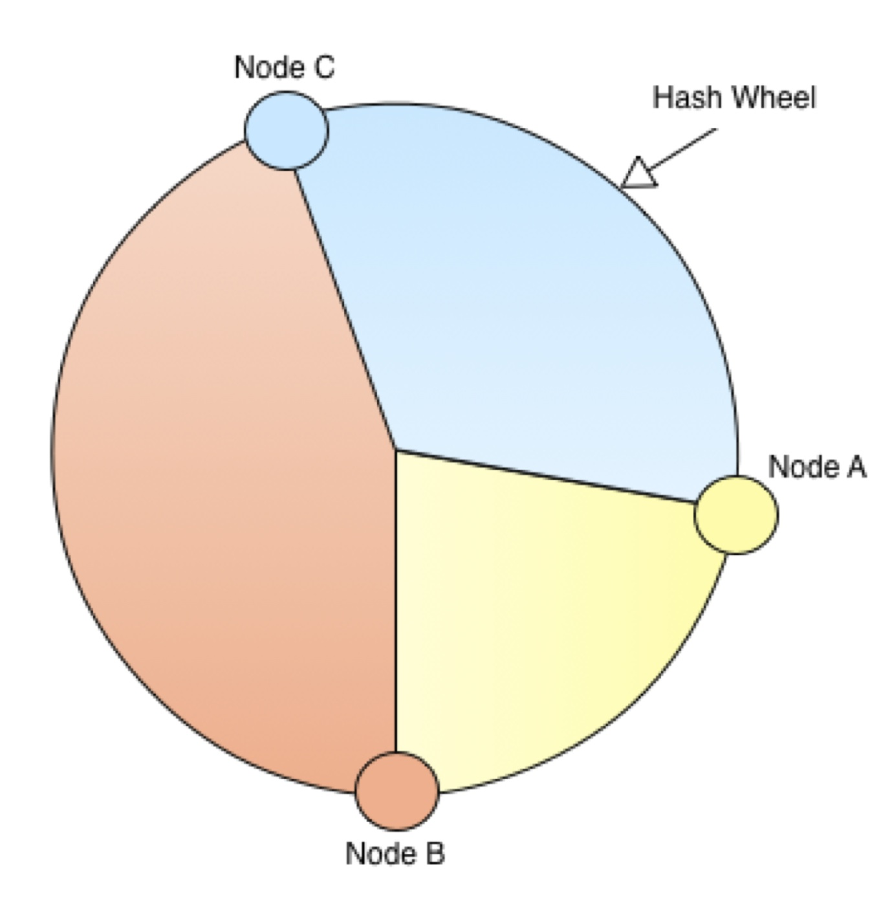
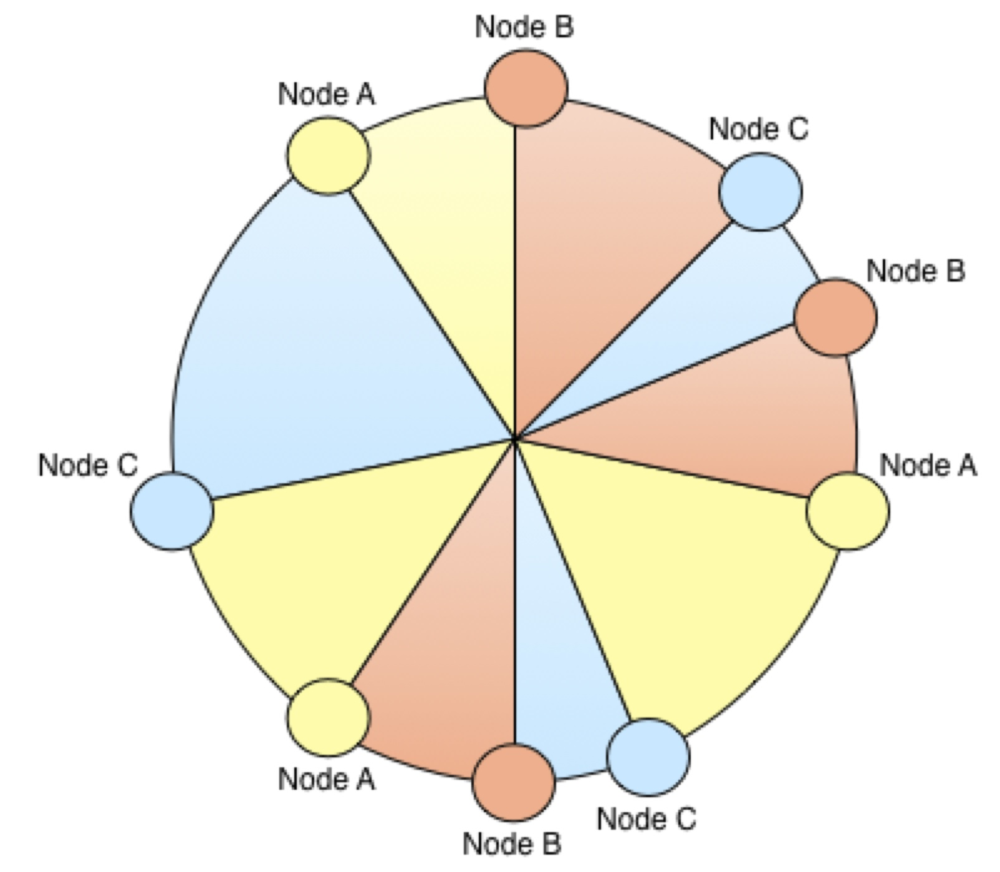

==  Clustering modes
Infinispan can be configured to be either local (standalone) or clustered.
If in a cluster, the cache can be configured to replicate changes to all nodes, to invalidate changes across nodes and finally to be used in distributed mode - state changes are replicated to a small subset of nodes enough to be fault tolerant but not to many nodes to prevent scalability.

=== Local Mode
While Infinispan is particularly interesting in clustered mode, it also offers a very capable local mode.
In this mode, it acts as a simple, in-memory data cache similar to JBoss Cache and EHCache.

But why would one use a local cache rather than a map? Caches offer a lot of features over and above a simple map, including write-through and write-behind caching to persist data, eviction of entries to prevent running out of memory, and support for expirable entries. Infinispan, specifically, is built around a high-performance, read-biased data container which uses modern techniques like MVCC locking - which buys you non-blocking, thread-safe reads even when concurrent writes are taking place. Infinispan also makes heavy use of compare-and-swap and other lock-free algorithms, making it ideal for high-throughput, multi-CPU/multi-core environments. Further, Infinispan's Cache API extends the JDK's ConcurrentMap - making migration from a map to Infinispan trivial.

=== Replicated Mode
Replication is a simple clustered mode where cache instances automatically discover neighboring instances on other JVMs on the same local network, and form a cluster. Entries added to any of these cache instances will be replicated to all other cache instances in the cluster, and can be retrieved locally from any instance. This clustered mode provides a quick and easy way to share state across a cluster, however replication practically only performs well in small clusters (under 10 servers), due to the number of replication messages that need to happen - as the cluster size increases. Infinispan can be configured to use UDP multicast which mitigates this problem to some degree.

.Replication mode
image::images/Figure1_6.png[]

Replication can be synchronous or asynchronous. Use of either one of the options is application dependent. Synchronous replication blocks the caller (e.g. on a put() ) until the modifications have been replicated successfully to all nodes in a cluster. Asynchronous replication performs replication in the background (the put() returns immediately). Infinispan offers a replication queue, where modifications are replicated periodically (i.e. interval-based), or when the queue size exceeds a number of elements, or a combination thereof. A replication queue can therefore offer much higher performance as the actual replication is performed by a background thread.

Asynchronous replication is faster (no caller blocking), because synchronous replication requires acknowledgments from all nodes in a cluster that they received and applied the modification successfully (round-trip time). However, when a synchronous replication returns successfully, the caller knows for sure that all modifications have been applied to all cache instances, whereas this is not be the case with asynchronous replication. With asynchronous replication, errors are simply written to a log. Even when using transactions, a transaction may succeed but replication may not succeed on all cache instances.

=== Invalidation Mode
Invalidation is a clustered mode that does not actually share any data at all, but simply aims to remove data that may be stale from remote caches. This cache mode only makes sense if you have another, permanent store for your data such as a database and are only using Infinispan as an optimization in a read-heavy system, to prevent hitting the database every time you need some state. If a cache is configured for invalidation rather than replication, every time data is changed in a cache other caches in the cluster receive a message informing them that their data is now stale and should be evicted from memory.

.Invalidation mode
image::images/Figure2_5.png[]

Invalidation, when used with a shared cache loader would cause remote caches to refer to the shared cache loader to retrieve modified data. The benefit of this is twofold: network traffic is minimized as invalidation messages are very small compared to replicating updated data, and also that other caches in the cluster look up modified data in a lazy manner, only when needed.

Invalidation messages are sent after each modification (no transactions or batches), or at the end of a transaction or batch, upon successful commit. This is usually more efficient as invalidation messages can be optimized for the transaction as a whole rather than on a per-modification basis.

Invalidation too can be synchronous or asynchronous, and just as in the case of replication, synchronous invalidation blocks until all caches in the cluster receive invalidation messages and have evicted stale data while asynchronous invalidation works in a 'fire-and-forget' mode, where invalidation messages are broadcast but doesn't block and wait for responses.

=== Distribution Mode
Distribution is a powerful clustering mode which allows Infinispan to scale linearly as more servers are added to the cluster. Distribution makes use of a link:$$http://en.wikipedia.org/wiki/Consistent_hashing$$[consistent hash] algorithm to determine where in a cluster entries should be stored. Hashing algorithm is configured with the number of copies each cache entry should be maintained cluster-wide. Number of copies represents the tradeoff between performance and durability of data. The more copies you maintain, the lower performance will be, but also the lower the risk of losing data due to server outages. Regardless of how many copies are maintained, distribution still scales linearly and this is key to Infinispan scalability. Another feature of the consistent hash algorithm is that it is deterministic in locating entries without resorting to multicasting requests or maintaining expensive metadata. Doing a PUT would result in at most num_copies remote calls, and doing a GET anywhere in the cluster would result in at most 1 remote call. In reality, num_copies remote calls are made even for a GET, but these are done in parallel and as soon as any one of these returns, the entry is passed back to the caller. 

NOTE: This behavior is due to change in Infinispan 5.3, where just a single GET call is made.  See link:$$https://issues.jboss.org/browse/ISPN-825$$[ISPN-825] . 

==== Read consistency
Since GETs are sent to all data owners in parallel and the first returning result is used, this can lead to data inconsistency when using an _asynchronous_ transport.  If an updating thread modifies the primary data owner, but updates are only sent to backup nodes asynchronously, a concurrent read may read a stale value for a short period of time until the asynchronous replication completes. 

Note that this is _only_ if the transport is _asynchronous_.  If using a _synchronous_ transport this behavior is not exhibited. 
 
.Distribution mode
image::images/Figure3_3.png[]

==== Virtual Nodes - Improving the distribution of data
Infinispan does not attempt to evenly split the hash space between nodes – by not trying to split it evenly, it means that if a node joins or leaves the grid, there is no need to adjust the ownership of every node, just the neighbours of the joiner/leaver. This has a positive impact on network traffic. However this can mean that some nodes take on substantially larger portions of the hash space than others. This, combined with potential irregularities in the hash functions of keys, can mean the distribution of entries across the grid becomes poor. In order to address the irregularities in the hash of keys, Infinispan uses an advanced hashing function (Murmur Hash 3) by default, as well as using a bit spreader. In order to address the irregularities in the node distribution, Infinispan uses virtual nodes.

First, let's consider how virtual nodes help conceptually by taking a couple of distribution examples, and armed with that knowledge, look at how Infinispan uses them.

Consider a hash space of 1000 (there are 1000 buckets into which data can be placed). If there were two nodes, it is possible you can have 1 node being used for 1 bucket, and 1 node for 999 buckets (this is the most pessimistic distribution!). If there were 200 nodes, the worst distribution of node would end up being 199 nodes responsible for one bucket each (199 buckets in total), and 1 node being responsible for 801 buckets. If there were 1000 nodes, then each node must be responsible for 1 bucket each. From this we can deduce that as the number of nodes tends to the size of the hash space, that the distribution of buckets to nodes improves.

A guiding principle of Infinispan is that it always uses an algorithm to locate a key in the hash space, never allowing the node on which the entry is stored to be specified manually. This scheme allows any node to know which nodes owns a key, without having to distribute such ownership information. This reduces the overhead of Infinispan, but more importantly improves redundancy as there is no need to replicate the ownership information in case of node failure.

With this in mind, we can see that virtual nodes are an ideal solution to the distribution of nodes problem, as it allows the location of an entry to be determined algorithmically.

Infinispan implements virtual nodes by altering the algorithm for splitting the hash space whenever a node joins or leaves the grid. Rather than allocating a block of the hashspace to the node, it allocates a number of blocks from throughout the hash space.

Often it's easier to understand the topology changes that virtual nodes introduce through diagrams.

 
.Topology Without Virtual Nodes

 
.Topology With Virtual Nodes

To use virtual nodes, simply set the number of virtual nodes higher than 1. For example

[source,xml]
----

   <namedCache name="cacheWithVirtualNodes">
      <clustering>
         <hash numVirtualNodes="10" />
      </clustering>
   </namedCache>

----

Alternatively, you can enable virtual nodes programmatically

[source,java]
----

new ConfigurationBuilder()
   .clustering()
      .hash()
         .numVirtualNodes(10)
   .build();

----

==== L1 Caching
To prevent repeated remote calls when doing multiple GETs, L1 caching can be enabled. L1 caching places remotely received values in a near cache for a short period of time (configurable) so repeated lookups would not result in remote calls. In the above diagram, if L1 was enabled, a subsequent GET for the same key on Server3 would not result in any remote calls.

.L1 caching
image::images/Figure4_4.png[]

L1 caching is not free though. Enabling it comes at a cost, and this cost is that every time a key is updated, an invalidation message needs to be multicast to ensure nodes with the entry in L1 invalidates the entry. L1 caching causes the requesting node to cache the retrieved entry locally and listen for changes to the key on the wire. L1-cached entries are given an internal expiry to control memory usage. Enabling L1 will improve performance for repeated reads of non-local keys, but will increase memory consumption to some degree. It offers a nice tradeoff between the "read-mostly" performance of an invalidated data grid with the scalability of a distributed one. Is L1 caching right for you? The correct approach is to benchmark your application with and without L1 enabled and see what works best for your access pattern.

TIP: Looking for Buddy Replication?  Buddy Replication - from JBoss Cache - does not exist in Infinispan.  See this blog article which discusses the reasons why Buddy Replication was not implemented in Infinispan, and how the same effects can be achieved using Infinispan - 
<a href="http://infinispan.blogspot.com/2009/08/distribution-instead-of-buddy.html">http://infinispan.blogspot.com/2009/08/distribution-instead-of-buddy.html</a>

==== Server Hinting
The motivations behind this feature is to ensure when using distribution, backups are not picked to reside on the same physical server, rack or data centre. For obvious reasons it doesn't work with total replication.

===== Configuration
The hints are configured at transport level: 

.infinispan.xml
[source,xml]
----
 <transport     clusterName = "MyCluster"
     machineId = "LinuxServer01"
     rackId = "Rack01"
     siteId = "US-WestCoast" />

----

Following topology hints can be specified:

* machineId - this is probably the most useful, to disambiguate between multiple JVM instances on the same node, or even multiple virtual hosts on the same physical host.
* rackId - in larger clusters with nodes occupying more than a single rack, this setting would help prevent backups being stored on the same rack.
* siteId - to differentiate between nodes in different data centres replicating to each other.    All of the above are optional, and if not provided, the distribution algorithms provide no guarantees that backups will not be stored in instances on the same host/rack/site.

===== Algorithm
This is an advanced topic, useful e.g. if you need to change distribution behaviour.

The consistent hash beyond this implementation is wheel based. Conceptually this works as follows: each node is placed on a wheel ordered by the hash code of its address. When an entry is added its owners are chosen using this algorithm:

* key's hash code is calculated
* the first node on the wheel with a value grater than key's hash code is the first owner
* for subsequent nodes, walk clockwise and pick nodes that have a different site id
* if not enough nodes found repeat walk again and pick nodes that have different site id and rack id
* if not enough nodes found repeat walk again and pick nodes that have different site id, rack id and machine id
* Ultimately cycle back to the first node selected, don't discard any nodes, regardless of machine id/rack

====  Key affinity service
The key affinity service solves the following problem: for a distributed Infinispan cluster one wants to make sure that a value is placed in a certain node. Based on a supplied cluster link:$$http://docs.jboss.org/infinispan/4.1/apidocs/org/infinispan/remoting/transport/Address.html$$[address] identifying the node, the service returns a key that will be hashed to that particular node. 

===== API
Following code snippet depicts how a reference to this service can be obtained and used. 

[source,java]
----
//1. obtain a reference to a cache manager
EmbeddedCacheManager cacheManager = getCacheManager();//obtain a reference to a cache manager
Cache cache = cacheManager.getCache();
 
//2. create the affinity service
KeyAffinityService keyAffinityService = KeyAffinityServiceFactory.newLocalKeyAffinityService(cache, new RndKeyGenerator(),
                                 Executors.newSingleThreadExecutor(), 100);
 
//3. obtain a key to be mapped to a certain address
Object localKey = keyAffinityService.getKeyForAddress(cacheManager.getAddress());
 
//4. this put makes sure that the key resigns on the local node (as obtained cacheManager.getAddress())
cache.put(localKey, "yourValue");

----

The service is started at step 2: after this point it uses the supplied Excutor to generate and queue keys. At step 3, we obtain a key for this service, and use it at step 4, with that guarantee that it is distributed in node identified by cacheManager.getAddress().

===== Lifecycle
`KeyAffinityService` extends `Lifecycle`, which allows stopping and (re)starting it: 

[source,java]
----
public interface Lifecycle {
   void start();
   void stop();
}

----

The service is instantiated through KeyAffinityServiceFactory. All the factory method have an Executors parameter, that is used for asynchronous key generation (so that it won't happen in the caller's thread). It is user's responsibility to handle the shutdown of this Executor.

The KeyAffinityService, once started, needs to be explicitly stopped. This stops the async key generation and releases other held resources.

The only situation in which KeyAffinityService stops by itself is when the cache manager with wich it was registered is shutdown.

===== Topology changes
When a topology change takes place the key ownership from the KeyAffinityService might change. The key affinity service keep tracks of these topology changes and updates and doesn't return stale keys, i.e. keys that would currently map to a different node than the one specified. However, this does not guarantee that at the time the key is used its node affinity hasn't changed, e.g.:

- thread T1 reads a key k1 that maps to node A

- a topology change happens which makes k1 map to node B

- T1 uses k1 to add something to the cache. At this point k1 maps to B, different node than the one requested at the time of read.

Whilst this is not ideal, it should be a supported behaviour for the application as all the already in-use keys might me moved over during cluster change. The KeyAffinityService provides an access proximity optimisation for stable clusters which doesn't apply during the instability of topology changes.

===  Asynchronous Options
When Infinispan instances are clustered, regardless of the cluster mode, data can be propagated to other nodes in a synchronous or asynchronous way. When synchronous, the sender waits for replies from the receivers and when asynchronous, the sender sends the data and does not wait for replies from other nodes in the cluster. 

With asynchronous modes, speed is more important than consistency and this is particularly advantageous in use cases such as HTTP session replication with sticky sessions enabled. In these scenarios, data, or in this case a particular session, is always accessed on the same cluster node and only in case of failure is data accessed in a different node. This type of architectures allow consistency to be relaxed in favour of increased performance.

In order to choose the asynchronous configuration that best suits your application, it's important to understand the following configuration settings:

==== Asynchronous Communications
Whenever you add link:$$http://docs.jboss.org/infinispan/5.1/configdocs/urn_infinispan_config_5.1/complexType/configuration.clustering.async.html$$[`<async />`] element within `<clustering />`, you're telling the underlying JGroups layer in Infinispan to use asynchronous communication. What this means is that JGroups will send any replication/distribution/invalidation request to the wire but will not wait for a reply from the receiver. 

==== Asynchronous Marshalling
This is a configurable boolean property of link:$$http://docs.jboss.org/infinispan/5.1/configdocs/urn_infinispan_config_5.1/complexType/configuration.clustering.async.html$$[`<async />`] element that indicates whether the actual call from Infinispan to the JGroups layer is done on a separate thread or not. When set to true, once Infinispan has figured out that a request needs to be sent to another node, it submits it to the async transport executor so that it can talk to the underlying JGroups layer. 

With asynchronous marshalling, Infinispan requests can return back to the client quicker compared to when async marshalling is set to false. The downside though is that client requests can be reordered before they have reached the JGroups layer. In other words, JGroups provides ordering guarantees even for async messages but with async marshalling turned on, requests can reach the JGroups in a different order in which they're called. This can effectively lead to data consistency issues in applications making multiple modifications on the same key/value pair. For example, with async marshalling turned on:

App calls:

[source,java]
----
cache.put("car", "bmw");
cache.remove("car");

----

Other nodes could receive these operations in this order:

[source,java]
----
cache.remove("car");
cache.put("car", "bmw");

----

The end result is clearly different which is often not desirable. So, if your application makes multiple modifications on the same key, you should either: turned off asynchronous marshalling, or set link:$$http://docs.jboss.org/infinispan/4.1/apidocs/config.html#ce_global_asyncTransportExecutor$$[`<asyncTransportExecutor />`] element's maxThreads to 1. The first modification only applies to a particular named cache, whereas the second option affects all named caches in configuration file that are configured with async marshalling. It's worth noting though that having this type of executor configured with a single thread would defeat its purpose adding unnecessary contention point. It'd be better to simply switch off async marshalling. 

On the contrary, if your application only ever makes one modification per key/value pair and there's no happens-before relationship between them, then async marshalling is a very valid optimization that can increase performance of your application without data consistency risks.

If you have async marshalling turned on and see exceptions related to java.util.concurrent.RejectedExecutionException, you should also consider switching off async marshalling. 

==== Replication Queue
The aim of the replication queue is to batch the individual cache operations and send them as one, as opposed to sending each cache operation individually. As a result, replication queue enabled configurations perform generally better compared to those that have it switched off because less RPC messages are sent, fewer envelopes are used...etc. The only real trade off to the replication queue is that the queue is flushed periodically (based on time or queue size) and hence it might take longer for the replication/distribution/invalidation to be realised across the cluster. When replication queue is turned off, data is placed directly on the wire and hence it takes less for data to arrive to other nodes.

==== Asynchronous API
Finally, the <<_asynchronous_api, Asynchronous API>> can be used to emulate non-blocking APIs, whereby calls are handed over to a different thread and asynchronous API calls return to the client immediately. Similar to async marshalling, using this API can lead to reordering, so you should avoid calling modifying asynchronous methods on the same keys. 

==== Return Values
Regardless of the asynchronous option used, the return values of cache operations are reliable. If talking about return values of cache operations that return previous value, the correctness of these returns are guaranteed as well regardless of the clustering mode. With replication, the previous value is already available locally, and with distribution, regardless of whether it's asynchronous or synchronous, Infinispan sends a synchronous request to get the previous value if not present locally. If on the other hand the asynchronous API is used, client code needs to get hold of the link:$$http://docs.jboss.org/infinispan/4.1/apidocs/org/infinispan/util/concurrent/NotifyingFuture.html$$[NotifiyngFuture] returned by the async operation in order to be able to query the previous value. 

