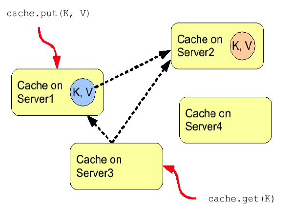
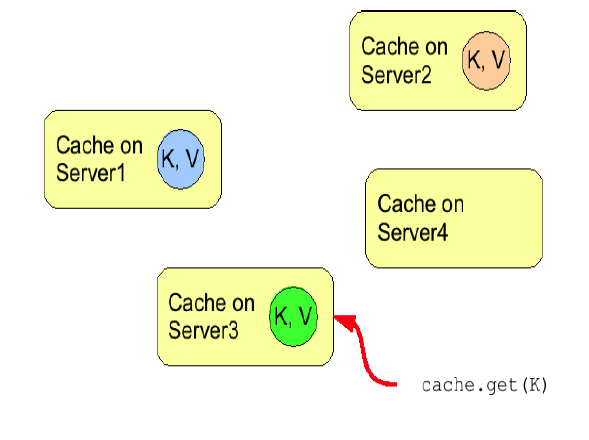

==  Clustering modes
Infinispan can be configured to be either local (standalone) or clustered.
If in a cluster, the cache can be configured to replicate changes to all nodes, to
invalidate changes across nodes and finally to be used in distributed mode - state
changes are replicated to a small subset of nodes enough to be fault tolerant but not
too many nodes to prevent scalability.

=== Local Mode
While Infinispan is particularly interesting in clustered mode, it also offers a very
capable local mode.
In this mode, it acts as a simple, in-memory data cache similar to JBoss Cache and EHCache.

But why would one use a local cache rather than a map? Caches offer a lot of features
over and above a simple map, including write-through and write-behind caching to persist
data, eviction of entries to prevent running out of memory, and support for expirable
entries.
Infinispan, specifically, is built around a high-performance, read-biased data container
which uses modern techniques similar to
link:$$http://en.wikipedia.org/wiki/Read-copy-update$$[read-copy-update]
-- which buys you non-blocking, thread-safe reads even when concurrent writes are taking
place.
Infinispan also makes heavy use of compare-and-swap and other lock-free algorithms,
making it ideal for high-throughput, multi-CPU/multi-core environments.
Further, Infinispan's Cache API extends the JDK's ConcurrentMap - making migration from a
map to Infinispan trivial.

=== Replicated Mode
Replication is a simple clustered mode where cache instances automatically discover
neighboring instances on other JVMs on the same local network, and form a cluster.
Entries added to any of these cache instances will be replicated to all other cache
instances in the cluster, and can be retrieved locally from any instance.
This clustered mode provides a quick and easy way to share state across a cluster,
however replication practically only performs well in small clusters (under 10 nodes),
due to the number of replication messages that need to happen - as the cluster size
increases.
Infinispan can be configured to use UDP multicast which mitigates this problem to some
degree.

.Replication mode
image::images/Figure1_6.png[]

Replication can be synchronous or asynchronous. Use of either one of the options is
application dependent.
Synchronous replication blocks the caller (e.g. on a put() ) until the modifications
have been replicated successfully to all nodes in a cluster.
Asynchronous replication performs replication in the background (the put() returns
immediately).
Infinispan offers a replication queue, where modifications are replicated periodically
(i.e. interval-based), or when the queue size exceeds a number of elements, or a
combination thereof.
A replication queue can therefore offer much higher performance as the actual replication
is performed by a background thread.

Asynchronous replication is faster (no caller blocking), because synchronous replication
requires acknowledgments from all nodes in a cluster that they received and applied the
modification successfully (round-trip time).
However, when a synchronous replication returns successfully, the caller knows for sure
that all modifications have been applied to all cache instances, whereas this is not be
the case with asynchronous replication. With asynchronous replication, errors are simply
written to a log.
Even when using transactions, a transaction may succeed but replication may not succeed
on all cache instances.

=== Invalidation Mode
Invalidation is a clustered mode that does not actually share any data at all, but simply
aims to remove data that may be stale from remote caches. This cache mode only makes
sense if you have another, permanent store for your data such as a database and are only
using Infinispan as an optimization in a read-heavy system, to prevent hitting the
database every time you need some state. If a cache is configured for invalidation rather
than replication, every time data is changed in a cache other caches in the cluster
receive a message informing them that their data is now stale and should be evicted from
memory.

.Invalidation mode
image::images/Figure2_5.png[]

Invalidation, when used with a shared cache loader would cause remote caches to refer to
the shared cache loader to retrieve modified data. The benefit of this is twofold:
network traffic is minimized as invalidation messages are very small compared to
replicating updated data, and also that other caches in the cluster look up modified
data in a lazy manner, only when needed.

Invalidation messages are sent after each modification (no transactions or batches), or
at the end of a transaction or batch, upon successful commit.
This is usually more efficient as invalidation messages can be optimized for the
transaction as a whole rather than on a per-modification basis.

Invalidation too can be synchronous or asynchronous, and just as in the case of
replication, synchronous invalidation blocks until all caches in the cluster receive
invalidation messages and have evicted stale data while asynchronous invalidation works
in a 'fire-and-forget' mode, where invalidation messages are broadcast but doesn't block
and wait for responses.

=== Distribution Mode
Distribution is a powerful clustering mode which allows Infinispan to scale linearly as
more nodes are added to the cluster.
Distribution makes use of a hash algorithm to determine on which node(s) entries should
be stored.
The number of copies that should be maintained in the cluster for each cache entry is
configurable (*numOwners*).
The number of copies represents the trade-off between performance and durability of data.
The more copies you maintain, the lower performance will be, but also the lower the risk
of losing data due to server outages.
Regardless of how many copies are maintained, distribution still scales linearly and this
is key to Infinispan's scalability.

Another feature of the hash algorithm is that it is deterministic in locating entries
without resorting to multicast requests or maintaining expensive metadata.
Doing a GET anywhere will result in at most _numOwners_ remote calls.
In fact, the remote GET requests are done in parallel, and as soon as any one of these
returns, the entry is passed back to the caller.
A GET may also result in 0 remote calls if the key is present in the local cache.
Doing a PUT can result in more remote calls, depending on the cache configuration (e.g.
whether the cache is transactional).

NOTE: We are investigating doing a single GET request and contacting the other owners
only after a timeout.
See link:$$https://issues.jboss.org/browse/ISPN-825$$[ISPN-825].

==== Read consistency
Since GETs are sent to all data owners in parallel and the first returning result is used,
this can lead to data inconsistency when using an _asynchronous_ transport.
If an updating thread modifies the primary data owner, but updates are only sent to backup
nodes asynchronously, a concurrent read from the same thread may read a stale value for a
short period of time until the asynchronous replication completes.

Note that this is _only_ if the transport is _asynchronous_.
If using a _synchronous_ transport this behavior is not exhibited.
 
.Distribution mode

==== Hashing Algorithms
The hashing algorithm in Infinispan is based on
link:$$http://en.wikipedia.org/wiki/Consistent_hashing$$[consistent hashing], and even
though our implementation has diverged a bit, we still use the term *consistent hash*.

Unlike in consistent hashing, we split the key space into fixed *segments*.
The number of segments is configurable (*numSegments*), and it cannot be changed without
restarting the cluster.
The mapping of keys to segments is also fixed -- a key should map to the same segment,
regardless of how the topology of the cluster changes.

Each hash segment is mapped to a list of nodes called *owners*.
The order matters, because the first owner, also known as the *primary owner*, has a
special role in many cache operations (e.g. locking).
The other owners are called *backup owners*.
There is no hard rule on how the segments are mapped to owners, although the hashing
algorithms generally try to balance the number of segments allocated to each node and at
the same time minimize the number of segments that have to move after a node joins or
leaves the cluster.

The hashing algorithm in Infinispan is customizable, and in fact there are five
implementations that ship with Infinispan by default:

org.infinispan.distribution.ch.DefaultConsistentHashFactory::
  The default hashing algorithm.
  It achieves a pretty even distribution, but it has one disadvantage: the mapping of
  segments to nodes depends on the order in which caches joined the cluster, so a key's
  owners are not guaranteed to be the same in all the caches running in a cluster.
org.infinispan.distribution.ch.TopologyAwareConsistentHashFactory::
  Selected automatically when <<ServerHinting, Server Hinting>> is enabled.
  Similar to the default algorithm, but also tries to spread each segment's copies across
  as many sites, racks, or machines as possible.
org.infinispan.distribution.ch.SyncConsistentHashFactory::
  An alternative algorithm, closer to consistent hashing (but still not exactly the same).
  It addresses the weakness of the default algorithm, and always assigns a key to the same
  node in every cache as long as the cluster is symmetric. It does have some weaknesses of
  itself, though: the load distribution is less even, and it also moves more segments than
  necessary on a join or leave.
org.infinispan.distribution.ch.TopologyAwareSyncConsistentHashFactory::
  Similar to _SyncConsistentHashFactory_, but adapted for <<ServerHinting, Server Hinting>>.
org.infinispan.distribution.ch.ReplicatedConsistentHashFactory::
  This algorithm is used internally to implement replicated caches.
  Users should never select this explicitly in a distributed cache.

===== Capacity Factors
The nodes in a cluster are not always identical.
It is possible to have "non-standard" nodes that take _2x_ as much load as a regular
node, or _0.5x_ as much load as a regular node, using the *capacityFactor* setting.
The capacity factor can be any non-negative number, and the hashing algorithm will try to
assign to each node a load weighted by its capacity factor (both as a primary owner and as
a backup owner).

NOTE: Capacity factors support is new in Infinispan 6.0.

One interesting use case is nodes with a capacity factor of _0_.
This could be useful when some nodes are too short-lived to be useful as data owners, but
they can't use HotRod (or other remote protocols) because they need transactions.
With cross-site replication as well, the "site master" should only deal with forwarding
commands between sites and shouldn't handle user requests, so it makes sense to configure
it with a capacity factor of 0.

===== Hashing Configuration
This is how you configure hashing declaratively, via XML:

[source,xml]
----
   <namedCache name="distributedCache">
      <clustering mode="dist">
         <hash numOwners="2" numSegments="100" capacityFactor="2"
            factory="org.infinispan.distribution.ch.SyncConsistentHashFactory"/>
      </clustering>
   </namedCache>
----

And this is how you can configure it programmatically, in Java:
[source,java]
----
Configuration c = new ConfigurationBuilder()
   .clustering()
      .cacheMode(CacheMode.DIST_SYNC)
      .hash()
         .numOwners(2)
         .numSegments(100)
         .capacityFactor(2)
         .consistentHashFactory(new SyncConsistentHashFactory())
   .build();
----

==== L1 Caching
To prevent repeated remote calls when doing multiple GETs, L1 caching can be enabled.
L1 caching places remotely received values in a near cache for a short period of time
(configurable) so repeated lookups would not result in remote calls.
In the above diagram, if L1 was enabled, a subsequent GET for the same key on Server3
would not result in any remote calls.

.L1 caching

L1 caching is not free though.
Enabling it comes at a cost, and this cost is that every time a key is updated, an
invalidation message needs to be multicast to ensure nodes with the entry in L1
invalidates the entry.
L1 caching causes the requesting node to cache the retrieved entry locally and listen for
changes to the key on the wire.
L1-cached entries are given an internal expiry to control memory usage.
Enabling L1 will improve performance for repeated reads of non-local keys, but will
increase memory consumption to some degree.
It offers a nice tradeoff between the "read-mostly" performance of an invalidated data
grid with the scalability of a distributed one.
Is L1 caching right for you?
The correct approach is to benchmark your application with and without L1 enabled and see
what works best for your access pattern.

TIP: Looking for Buddy Replication?  Buddy Replication - from JBoss Cache - does not exist
in Infinispan. 
See this blog article which discusses the reasons why Buddy Replication was not
implemented in Infinispan, and how the same effects can be achieved using Infinispan:
link:$$http://infinispan.blogspot.com/2009/08/distribution-instead-of-buddy.html$$[]

[[ServerHinting]]
==== Server Hinting
The motivations behind this feature is to ensure when using distribution, backups are not
picked to reside on the same physical server, rack or data centre.
For obvious reasons it doesn't work with total replication.

===== Configuration
The hints are configured at transport level: 

[source,xml]
----
<transport
    clusterName = "MyCluster"
    machineId = "LinuxServer01"
    rackId = "Rack01"
    siteId = "US-WestCoast" />
----

The following topology hints can be specified:

machineId::
  This is probably the most useful, to disambiguate between multiple JVM instances on the
  same node, or even multiple virtual hosts on the same physical host.
rackId::
  In larger clusters with nodes occupying more than a single rack, this setting would help
  prevent backups being stored on the same rack.
siteId::
  To differentiate between nodes in different data centres replicating to each other. Note
  that <<CrossSiteReplication, Cross site replication>> is another alternative for
  clusters that need to span two or more data centres.

All of the above are optional, and if not provided, the distribution algorithms provide no
guarantees that backups will not be stored in instances on the same machine/rack/site.

[[KeyAffinityService]]
====  Key affinity service
The key affinity service solves the following problem: for a distributed Infinispan
cluster one wants to make sure that a value is placed in a certain node.
Based on a supplied cluster
link:$$http://docs.jboss.org/infinispan/6.0/apidocs/org/infinispan/remoting/transport/Address.html$$[address]
identifying the node, the service returns a key that will be hashed to that particular
node.

===== API
Following code snippet depicts how a reference to this service can be obtained and used. 

[source,java]
----
// 1. Obtain a reference to a cache manager
EmbeddedCacheManager cacheManager = getCacheManager();//obtain a reference to a cache manager
Cache cache = cacheManager.getCache();
 
// 2. Create the affinity service
KeyAffinityService keyAffinityService = KeyAffinityServiceFactory.newLocalKeyAffinityService(
      cache,
      new RndKeyGenerator(),
      Executors.newSingleThreadExecutor(),
      100);
 
// 3. Obtain a key to be mapped to a certain address
Object localKey = keyAffinityService.getKeyForAddress(cacheManager.getAddress());
 
// 4. This put makes sure that the key resigns on the local node (as obtained cacheManager.getAddress())
cache.put(localKey, "yourValue");
----

The service is started at step 2: after this point it uses the supplied _Executor_ to
generate and queue keys.
At step 3, we obtain a key for this service, and use it at step 4, with that guarantee
that it is distributed on the node identified by `cacheManager.getAddress()`.

===== Lifecycle
_KeyAffinityService_ extends _Lifecycle_, which allows stopping and (re)starting it:

[source,java]
----
public interface Lifecycle {
   void start();
   void stop();
}
----

The service is instantiated through _KeyAffinityServiceFactory_. All the factory methods
have an _Executor_ parameter, that is used for asynchronous key generation (so that it
won't happen in the caller's thread).
It is the user's responsibility to handle the shutdown of this _Executor_.

The _KeyAffinityService_, once started, needs to be explicitly stopped. This stops the
background key generation and releases other held resources.

The only situation in which _KeyAffinityService_ stops by itself is when the cache manager
with which it was registered is shutdown.

===== Topology changes
When a topology change takes place the key ownership from the _KeyAffinityService_ might
change.
The key affinity service keep tracks of these topology changes and updates and doesn't
return stale keys, i.e. keys that would currently map to a different node than the one
specified.
However, this does not guarantee that at the time the key is used its node affinity hasn't
changed, e.g.:

- Thread `T1` reads a key `k1` that maps to node `A`.
- A topology change happens which makes `k1` map to node `B`.
- `T1` uses `k1` to add something to the cache. At this point `k1` maps to `B`, a different node than the one
  requested at the time of read.

Whilst this is not ideal, it should be a supported behaviour for the application as all
the already in-use keys might be moved over during cluster change.
The _KeyAffinityService_ provides an access proximity optimisation for stable clusters which
doesn't apply during the instability of topology changes.

====  The Grouping API
Complementary to <<KeyAffinityService, Key affinity service>> and similar to
link:$$https://docs.jboss.org/infinispan/6.0/apidocs/org/infinispan/atomic/AtomicMap.html$$[AtomicMap],
the grouping API allows you to co-locate a group of entries on the same nodes, but without
being able to select the actual nodes.

===== How does it work?
Normally, when you store an entry, Infinispan will take a hash code of the key, map the
hash to a hash segment, and store the entry on the nodes which own that segment.
Infinispan always uses an algorithm to locate a key, never allowing the nodes on which the
entry is stored to be specified manually.
This scheme allows any node to know which nodes owns a key, without having to distribute
such ownership information.
This reduces the overhead of Infinispan, but more importantly improves redundancy as there
is no need to replicate the ownership information in case of node failure.

If you use the grouping API, then Infinispan will ignore the hash of the key when deciding
which _node_ to store the entry on, and instead use a hash of the group.
Infinispan still uses the hash of the key in its internal data structures, so using the
grouping API will not slow things down.
When the group API is in use, it is important that every node can still compute, using an
algorithm, the owners of every key.
For this reason, the group cannot be specified manually.
The group can either be intrinsic to the entry (generated by the key class) or extrinsic
(generated by an external function).

===== How do I use the grouping API?
First, you must enable groups. If you are configuring Infinispan programmatically, then call:

[source,java]
----
Configuration c = new ConfigurationBuilder()
   .clustering().hash().groups().enabled()
   .build();
----

Or, if you are using XML:

[source,xml]
----
<clustering>
   <hash>
      <groups enabled="true" />
   </hash>
</clustering>
----

If you have control of the key class (you can alter the class definition, it's not part of
an unmodifiable library), and the determination of the group is not an orthogonal concern
to the key class, then we recommend you use an intrinsic group.
The intrinsic group can be specified using the _@Group_ annotation placed on the method.
Let's take a look at an example:

[source,java]
----
class User {
   ...
   String office;
   ...

   public int hashCode() {
      // Defines the hash for the key, normally used to determine location
      ...
   }

   // Override the location by specifying a group, all keys in the same
   // group end up with the same owner
   @Group
   public String getOffice() {
      return office;
   }
   }
}
----

NOTE: The group must be a `String`

If you don't have control over the key class, or the determination of the group is an
orthogonal concern to the key class, we recommend you use an extrinsic group.
An extrinsic group is specified by implementing the _Grouper_ interface, which has a
single method computeGroup, which should return the group.
_Grouper_ acts as an interceptor, passing the previously computed value in.
The group passed to the first _Grouper_ will be that determined by _@Group_ (if _@Group_
is defined).
This allows you even greater control over the group when using an intrinsic group.
For a grouper to be used when determining the group for a key, its _keyType_ must be
assignable from the key being grouped.

Let's take a look at an example of a _Grouper_:

[source,java]
----
public class KXGrouper implements Grouper<String> {

   // A pattern that can extract from a "kX" (e.g. k1, k2) style key
   // The pattern requires a String key, of length 2, where the first character is
   // "k" and the second character is a digit. We take that digit, and perform
   // modular arithmetic on it to assign it to group "1" or group "2".
   private static Pattern kPattern = Pattern.compile("(^k)(<a>\\d</a>)$");

    public String computeGroup(String key, String group) {
        Matcher matcher = kPattern.matcher(key);
        if (matcher.matches()) {
            String g = Integer.parseInt(matcher.group(2)) % 2 + "";
            return g;
        } else
            return null;
    }

    public Class<String> getKeyType() {
        return String.class;
    }
}
----

Here we determine a simple grouper that can take the key class and extract from the group
from the key using a pattern.
We ignore any group information specified on the key class.

You must register every grouper you wish to have used. If you are configuring Infinispan
programmatically:

[source,java]
----
Configuration c = new ConfigurationBuilder()
   .clustering().hash().groups().enabled().addGrouper(new KXGrouper())
   .build();
----

Or, if you are using XML:

[source,xml]
----
<clustering>
  <hash>
     <groups enabled="true">
        <grouper class="com.acme.KXGrouper" />
     </groups>
  </hash>
</clustering>
----

===  Asynchronous Options
When Infinispan instances are clustered, regardless of the cluster mode, data can be
propagated to other nodes in a synchronous or asynchronous way.
When synchronous, the sender waits for replies from the receivers and when asynchronous,
the sender sends the data and does not wait for replies from other nodes in the cluster.

With asynchronous modes, speed is more important than consistency and this is particularly
advantageous in use cases such as HTTP session replication with sticky sessions enabled.
In these scenarios, data, or in this case a particular session, is always accessed on the
same cluster node and only in case of failure is data accessed in a different node.
This type of architectures allow consistency to be relaxed in favour of increased
performance.

In order to choose the asynchronous configuration that best suits your application, it's
important to understand the following configuration settings:

==== Asynchronous Communications
Whenever you add
link:$$http://docs.jboss.org/infinispan/6.0/configdocs/infinispan-config-6.0.html$$[`<async />`]
element within `<clustering />`, you're telling the underlying JGroups layer in Infinispan
to use asynchronous communication. What this means is that JGroups will send any
replication/distribution/invalidation request to the wire but will not wait for a reply
from the receiver.

==== Asynchronous Marshalling
This is a configurable boolean property of
link:$$http://docs.jboss.org/infinispan/6.0/configdocs/infinispan-config-6.0.html$$[`<async />`]
element that indicates whether the actual call from Infinispan to the JGroups layer is
done on a separate thread or not.
When set to true, once Infinispan has figured out that a request needs to be sent to
another node, it submits it to the async transport executor so that it can talk to the
underlying JGroups layer.

With asynchronous marshalling, Infinispan requests can return back to the client quicker
compared to when async marshalling is set to false.
The downside though is that client requests can be reordered before they have reached the
JGroups layer.
In other words, JGroups provides ordering guarantees even for async messages but with
async marshalling turned on, requests can reach the JGroups in a different order in which
they're called.
This can effectively lead to data consistency issues in applications making multiple
modifications on the same key/value pair.
For example, with async marshalling turned on:

App calls:

[source,java]
----
cache.put("car", "bmw");
cache.remove("car");

----

Other nodes could receive these operations in this order:

[source,java]
----
cache.remove("car");
cache.put("car", "bmw");

----

The end result is clearly different which is often not desirable.
So, if your application makes multiple modifications on the same key, you should either:
turn off asynchronous marshalling, or set
link:$$http://docs.jboss.org/infinispan/6.0/configdocs/infinispan-config-6.0.html$$[`<asyncTransportExecutor />`]
element's maxThreads to 1.
The first modification only applies to a particular named cache, whereas the second option
affects all named caches in configuration file that are configured with async marshalling.
It's worth noting though that having this type of executor configured with a single thread
would defeat its purpose adding unnecessary contention point.
It'd be better to simply switch off async marshalling.

On the contrary, if your application only ever makes one modification per key/value pair
and there's no happens-before relationship between them, then async marshalling is a very
valid optimization that can increase performance of your application without data
consistency risks.

If you have async marshalling turned on and see exceptions related to
java.util.concurrent.RejectedExecutionException, you should also consider switching off
async marshalling.

==== Replication Queue
The aim of the replication queue is to batch the individual cache operations and send them
as one, as opposed to sending each cache operation individually.
As a result, replication queue enabled configurations perform generally better compared to
those that have it switched off because less RPC messages are sent, fewer envelopes are
used...etc.
The only real trade off to the replication queue is that the queue is flushed periodically
(based on time or queue size) and hence it might take longer for the
replication/distribution/invalidation to be realised across the cluster.
When replication queue is turned off, data is placed directly on the wire and hence it
takes less for data to arrive to other nodes.

==== Asynchronous API
Finally, the <<_asynchronous_api, Asynchronous API>> can be used to emulate non-blocking
APIs, whereby calls are handed over to a different thread and asynchronous API calls
return to the client immediately.
Similar to async marshalling, using this API can lead to reordering, so you should avoid
calling modifying asynchronous methods on the same keys.

==== Return Values
Regardless of the asynchronous option used, the return values of cache operations are
reliable.
If talking about return values of cache operations that return previous value, the
correctness of these returns are guaranteed as well regardless of the clustering mode.
With replication, the previous value is already available locally, and with distribution,
regardless of whether it's asynchronous or synchronous, Infinispan sends a synchronous
request to get the previous value if not present locally.
If on the other hand the asynchronous API is used, client code needs to get hold of the
link:$$https://docs.jboss.org/infinispan/6.0/apidocs/org/infinispan/commons/util/concurrent/NotifyingFuture.html$$[NotifiyngFuture]
returned by the async operation in order to be able to query the previous value.

