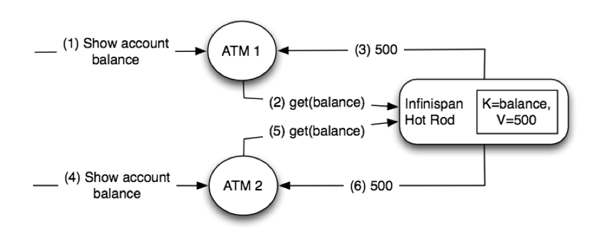
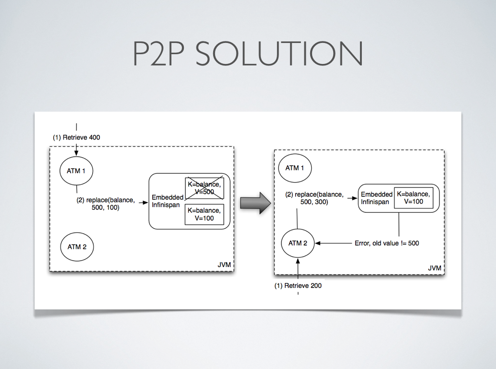
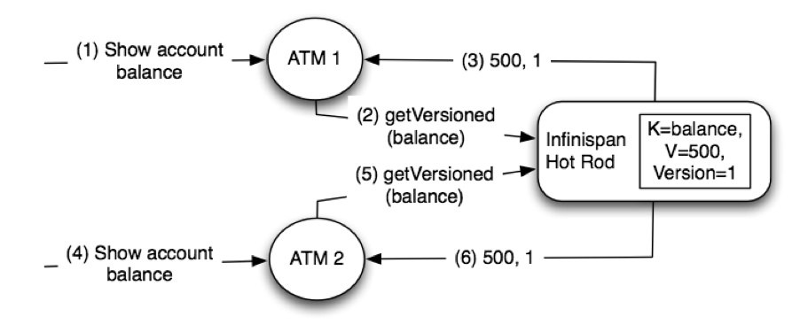
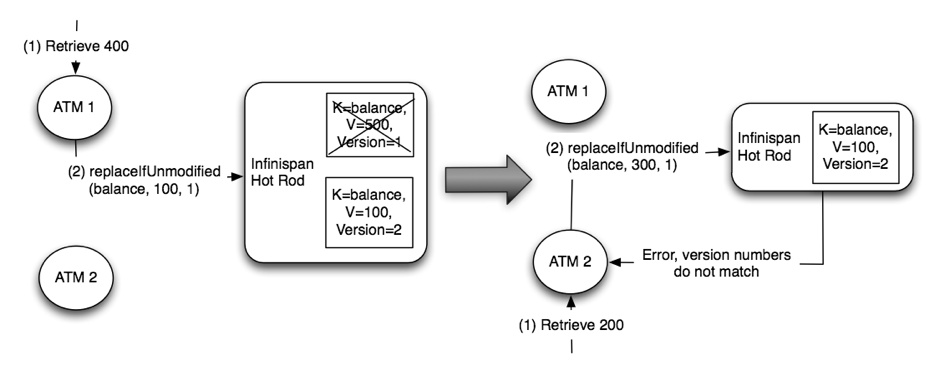
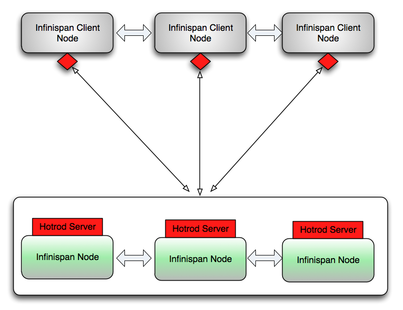

===  Using Hot Rod Server
The Infinispan Server distribution contains a server module that implements Infinispan's custom binary protocol called Hot Rod. The protocol was designed to enable faster client/server interactions compared to other existing text based protocols and to allow clients to make more intelligent decisions with regards to load balancing, failover and even data location operations. 
Please refer to Infinispan Server's link:$$../infinispan_server_guide/infinispan_server_guide.html$$[documentation] for instructions on how to configure and run a HotRod server.

include::chapter-64-Hot_Rod_Protocol.adoc[]

====  Java Hot Rod client
Hot Rod is a binary, language neutral protocol. This article explains how a Java client can interact with a server via the Hot Rod protocol. A reference implementation of the protocol written in Java can be found in all Infinispan distributions, and this article focuses on the capabilities of this java client.

TIP: Looking for more clients?  Visit link:$$http://infinispan.org/hotrod-clients$$[this website] for clients written in a variety of different languages.

===== Configuration
The Java Hot Rod client can be configured both programmatically and externally, through a configuration file.

The code snippet below illustrates the creation of a client instance using the available Java fluent API:

[source,java]
----
org.infinispan.client.hotrod.configuration.ConfigurationBuilder cb
      = new org.infinispan.client.hotrod.configuration.ConfigurationBuilder();
cb.tcpNoDelay(true)
  .connectionPool()
      .numTestsPerEvictionRun(3)
      .testOnBorrow(false)
      .testOnReturn(false)
      .testWhileIdle(true)
  .addServer()
      .host("localhost")
      .port(11222);
RemoteCacheManager rmc = new RemoteCacheManager(cb.build());

----

For a complete reference to the available configuration option please refer to the link:$$http://docs.jboss.org/infinispan/7.0/apidocs/org/infinispan/client/hotrod/configuration/ConfigurationBuilder.html$$[ConfigurationBuilder]'s javadoc.

It is also possible to configure the Java Hot Rod client using an properties file, e.g.:

[source]
----
infinispan.client.hotrod.transport_factory = org.infinispan.client.hotrod.impl.transport.tcp.TcpTransportFactory
infinispan.client.hotrod.server_list = 127.0.0.1:11222
infinispan.client.hotrod.marshaller = org.infinispan.commons.marshall.jboss.GenericJBossMarshaller
infinispan.client.hotrod.async_executor_factory = org.infinispan.client.hotrod.impl.async.DefaultAsyncExecutorFactory
infinispan.client.hotrod.default_executor_factory.pool_size = 1
infinispan.client.hotrod.default_executor_factory.queue_size = 10000
infinispan.client.hotrod.hash_function_impl.1 = org.infinispan.client.hotrod.impl.consistenthash.ConsistentHashV1
infinispan.client.hotrod.tcp_no_delay = true
infinispan.client.hotrod.ping_on_startup = true
infinispan.client.hotrod.request_balancing_strategy = org.infinispan.client.hotrod.impl.transport.tcp.RoundRobinBalancingStrategy
infinispan.client.hotrod.key_size_estimate = 64
infinispan.client.hotrod.value_size_estimate = 512
infinispan.client.hotrod.force_return_values = false

## below is connection pooling config
maxActive=-1
maxTotal = -1
maxIdle = -1
whenExhaustedAction = 1
timeBetweenEvictionRunsMillis=120000
minEvictableIdleTimeMillis=300000
testWhileIdle = true
minIdle = 1

----

The properties file is then passed to one of constructors of link:$$http://docs.jboss.org/infinispan/7.0/apidocs/org/infinispan/client/hotrod/RemoteCacheManager.html#RemoteCacheManager(java.net.URL)$$[RemoteCacheManager].
For a complete reference of the available configuration options for the properties file please refer to link:$$http://docs.jboss.org/infinispan/7.0/apidocs/org/infinispan/client/hotrod/RemoteCacheManager.html$$[RemoteCacheManager]'s javadoc.

===== Basic API
Below is a sample code snippet on how the client API can be used to store or retrieve information from a Hot Rod server using the Java Hot Rod client. It assumes that a Hot Rod server has been started bound to the default location (localhost:11222) 

[source,java]
----
//API entry point, by default it connects to localhost:11222
CacheContainer cacheContainer = new RemoteCacheManager();

//obtain a handle to the remote default cache
Cache<String, String> cache = cacheContainer.getCache();

//now add something to the cache and make sure it is there
cache.put("car", "ferrari");
assert cache.get("car").equals("ferrari");

//remove the data
cache.remove("car");
assert !cache.containsKey("car") : "Value must have been removed!";

----

The client API maps the local API: link:$$http://docs.jboss.org/infinispan/7.0/apidocs/org/infinispan/client/hotrod/RemoteCacheManager.html$$[RemoteCacheManager] corresponds to link:$$http://docs.jboss.org/infinispan/7.0/apidocs/org/infinispan/manager/DefaultCacheManager.html$$[DefaultCacheManager] (both implement link:$$http://docs.jboss.org/infinispan/7.0/apidocs/org/infinispan/manager/CacheContainer.html$$[CacheContainer] ). This common API facilitates an easy migration from local calls to remote calls through Hot Rod: all one needs to do is switch between link:$$http://docs.jboss.org/infinispan/7.0/apidocs/org/infinispan/manager/DefaultCacheManager.html$$[DefaultCacheManager] and link:$$http://docs.jboss.org/infinispan/7.0/apidocs/org/infinispan/client/hotrod/RemoteCacheManager.html$$[RemoteCacheManager] - which is further simplified by the common link:$$http://docs.jboss.org/infinispan/7.0/apidocs/org/infinispan/manager/CacheContainer.html$$[CacheContainer] interface that both inherit.

Starting from Infinispan 5.2, all keys can be retrieved from the remote cache (whether it's local, replicated, or distributed) by using keySet() method. If the remote cache is a distributed cache, the server will start a map/reduce job to retrieve all keys from clustered nodes, and return all keys to the client.  Please use this method with care if there are large number of keys.

[source,java]
----
Set keys = remoteCache.keySet();

----

===== Versioned API
A RemoteCacheManager provides instances of link:$$http://docs.jboss.org/infinispan/7.0/apidocs/org/infinispan/client/hotrod/RemoteCache.html$$[RemoteCache] interface that represents a handle to the named or default cache on the remote cluster. API wise, it extends the link:$$http://docs.jboss.org/infinispan/7.0/apidocs/org/infinispan/Cache.html$$[Cache] interface to which it also adds some new methods, including the so called versioned API. Please find below some examples of this API <<sid-68355052, but to understand the motivation behind it, make sure you read this section>>.

The code snippet bellow depicts the usage of these versioned methods: 

[source,java]
----
// To use the versioned API, remote classes are specifically needed
RemoteCacheManager remoteCacheManager = new RemoteCacheManager();
RemoteCache<String, String> cache = remoteCacheManager.getCache();

remoteCache.put("car", "ferrari");
RemoteCache.VersionedValue valueBinary = remoteCache.getVersioned("car");

// removal only takes place only if the version has not been changed
// in between. (a new version is associated with 'car' key on each change)
assert remoteCache.remove("car", valueBinary.getVersion());
assert !cache.containsKey("car");

----

In a similar way, for replace:

[source,java]
----
remoteCache.put("car", "ferrari");
RemoteCache.VersionedValue valueBinary = remoteCache.getVersioned("car");
assert remoteCache.replace("car", "lamborghini", valueBinary.getVersion());
----

For more details on versioned operations refer to link:$$http://docs.jboss.org/infinispan/7.0/apidocs/org/infinispan/client/hotrod/RemoteCache.html$$[RemoteCache] 's javadoc.

===== Async API
This cool feature is "borrowed" from the Infinispan core and it is largely discussed <<_asynchronous_api, here>>

===== Client Event Listener API

Starting with Infinispan 7.0, Java Hot Rod clients can register listeners to
receive cache-entry level events. In 7.0, cache entry created, modified and
removed events are supported.

====== Creating a Client Event Listener

Creating a client listener is very similar to embedded listeners, except that
different annotations and event classes are used. Here's an example of a
client listener that prints out each event received:

[source,java]
----
import org.infinispan.client.hotrod.annotation.*;
import org.infinispan.client.hotrod.event.*;

@ClientListener
public class EventPrintListener {

   @ClientCacheEntryCreated
   public void handleCreatedEvent(ClientCacheEntryCreatedEvent e) {
      System.out.println(e);
   }

   @ClientCacheEntryModified
   public void handleModifiedEvent(ClientCacheEntryModifiedEvent e) {
      System.out.println(e);
   }

   @ClientCacheEntryRemoved
   public void handleRemovedEvent(ClientCacheEntryRemovedEvent e) {
      System.out.println(e);
   }

}
----

`ClientCacheEntryCreatedEvent` and `ClientCacheEntryModifiedEvent` instances
provide information on the affected key, and the version of the entry. This
version can be used to invoke conditional operations on the server, such as
`replaceWithVersion` or `removeWithVersion`.

`ClientCacheEntryRemovedEvent` events are only sent when the remove operation
succeeds. In other words, if a remove operation is invoked but no entry is
found or no entry should be removed, no event is generated. Users interested
in removed events, even when no entry was removed, can develop event
customization logic to generate such events. More information can be found
in the link:$$#_customizing_client_events_contents$$[customizing client events section].

All `ClientCacheEntryCreatedEvent`, `ClientCacheEntryModifiedEvent` and
`ClientCacheEntryRemovedEvent` event instances also provide a `boolean isCommandRetried()`
method that will return true if the write command that caused this had to be retried
again due to a topology change.  This could be a sign that this event
has been duplicated or another event was dropped and replaced
(eg: ClientCacheEntryModifiedEvent replaced ClientCacheEntryCreatedEvent).

Once the client listener implementation has been created, it needs to be
registered with the server. To do so, execute:

[source,java]
----
RemoteCache<?, ?> cache = ...
cache.addClientListener(new EventPrintListener());
----

====== Remove a Client Event Listener

When an client event listener is not needed any more, it can be removed:

[source,java]
----
EventPrintListener listener = ...
cache.removeClientListener(listener);
----

====== Filtering Client Events

In order to avoid inundating clients with events, users can provide filtering
functionality to limit the number of events fired by the server for a
particular client listener. To enable filtering, a cache event filter factory
needs to be created that produces filter instances:

[source,java]
----
import org.infinispan.notifications.cachelistener.filter.CacheEventFilterFactory;
import org.infinispan.notifications.cachelistener.filter.NamedFactory;

@NamedFactory(name = "static-filter")
class StaticCacheEventFilterFactory implements CacheEventFilterFactory {
   @Override
   public CacheEventFilterFactory<Integer, String> getFilter(Object[] params) {
      return new StaticCacheEventFilter();
   }
}

// Serializable, Externalizable or marshallable with Infinispan Externalizers
// needed when running in a cluster
class StaticCacheEventFilter implements CacheEventFilter<Integer, String>, Serializable {
   @Override
   public boolean accept(Integer key, String value, Metadata metadata, String oldValue, Metadata oldMetadata, EventType eventType) {
      if (key.equals(1)) // static key
         return true;

      return false;
   }
}
----

The cache event filter factory instance defined above creates filter instances
which statically filter out all entries except the one whose key is `1`.

To be able to register a listener with this cache event filter factory,
the factory has to be given a unique name, and the Hot Rod server needs to be
plugged with the name and the cache event filter factory instance. Plugging the
Infinispan Server with a custom filter involves the following steps:

1. Create a JAR file with the filter implementation within it.
2. Create a `META-INF/services/org.infinispan.notifications.filter.CacheEventFilterFactory` file
within the JAR file and within it, write the fully qualified class name of the
filter class implementation.
3. Deploy the JAR file in the Infinispan Server.

On top of that, the client listener needs to be linked with this cache event
filter factory by adding the factory's name to the @ClientListener annotation:

[source,java]
----
@ClientListener(filterFactoryName = "static-filter")
public class EventPrintListener { ... }
----

And, register the listener with the server:

[source,java]
----
RemoteCache<?, ?> cache = ...
cache.addClientListener(new EventPrintListener());
----

Dynamic filter instances that filter based on parameters provided when the
listener is registered are also possible. Filters use the parameters received
by the filter factories to enable this option. For example:

[source,java]
----
import org.infinispan.notifications.cachelistener.filter.CacheEventFilterFactory;
import org.infinispan.notifications.cachelistener.filter.CacheEventFilter;

class DynamicCacheEventFilterFactory implements CacheEventFilterFactory {
   @Override
   public CacheEventFilter<Integer, String> getFilter(Object[] params) {
      return new DynamicCacheEventFilter(params);
   }
}

// Serializable, Externalizable or marshallable with Infinispan Externalizers
// needed when running in a cluster
class DynamicCacheEventFilter implements CacheEventFilter<Integer, String>, Serializable {
   final Object[] params;

   DynamicCacheEventFilter(Object[] params) {
      this.params = params;
   }

   @Override
   public boolean accept(Integer key, String value, Metadata metadata, String oldValue, Metadata oldMetadata, EventType eventType) {
      if (key.equals(params[0])) // dynamic key
         return true;

      return false;
   }
}
----

The dynamic parameters required to do the filtering are provided when the
listener is registered:

[source,java]
----
RemoteCache<?, ?> cache = ...
cache.addClientListener(new EventPrintListener(), new Object[]{1}, null);
----

WARNING: Filter instances have to marshallable when they are deployed in a
cluster so that the filtering can happen right where the event is generated,
even if the even is generated in a different node to where the listener is
registered. To make them marshallable, either make them extend `Serializable`,
`Externalizable`, or provide a custom `Externalizer` for them.

====== Customizing Client Events contents

The events generated by default contain just enough information to make the
event relevant but they avoid cramming too much information in order to reduce
the cost of sending them. Optionally, the information shipped in the events
can be customised in order to contain more information, such as values, or to
contain even less information. This customization is done with `CacheEventConverter`
instances generated by a `CacheEventConverterFactory`:

[source,java]
----
import org.infinispan.notifications.cachelistener.filter.CacheEventConverterFactory;
import org.infinispan.notifications.cachelistener.filter.CacheEventConverter;
import org.infinispan.notifications.cachelistener.filter.NamedFactory;

@NamedFactory(name = "static-converter")
class StaticConverterFactory implements ConverterFactory {
   final CacheEventConverter<Integer, String, CustomEvent> staticConverter = new StaticCacheEventConverter();
   public CacheEventConverter<Integer, String, CustomEvent> getConverter(final Object[] params) {
      return staticConverter;
   }
}

// Serializable, Externalizable or marshallable with Infinispan Externalizers
// needed when running in a cluster
class StaticCacheEventConverter implements CacheEventConverter<Integer, String, CustomEvent>, Serializable {
   public CustomEvent convert(Integer key, String value, Metadata metadata, String prevValue, Metadata prevMetadata, EventType eventType) {
      return new CustomEvent(key, value);
   }
}

// Needs to be Serializable, Externalizable or marshallable with Infinispan Externalizers
// regardless of cluster or local caches
static class CustomEvent implements Serializable {
   final Integer key;
   final String value;
   CustomEvent(Integer key, String value) {
      this.key = key;
      this.value = value;
   }
}
----

In the example above, the converter generates a new custom event which
includes the value as well as the key in the event. This will result in bigger
event payloads compared with default events, but if combined with filtering,
it can reduce its network bandwidth cost.

WARNING: The target type of the converter must be either `Serializable` or
`Externalizable`. In this particular case of converters, providing an
Externalizer will not work by default since the default Hot Rod client
marshaller does not support them.

Handling custom events requires a slightly different client listener
implementation to the one demonstrated previously. To be more precise, it
needs to handle `ClientCacheEntryCustomEvent` instances:

[source,java]
----
import org.infinispan.client.hotrod.annotation.*;
import org.infinispan.client.hotrod.event.*;

@ClientListener
public class CustomEventPrintListener {

   @ClientCacheEntryCreated
   @ClientCacheEntryModified
   @ClientCacheEntryRemoved
   public void handleCustomEvent(ClientCacheEntryCustomEvent<CustomEvent> e) {
      System.out.println(e);
   }

}
----

The `ClientCacheEntryCustomEvent` received in the callback exposes the custom
event via `getEventData` method, and the `getType` method provides information
on whether the event generated was as a result of cache entry creation,
modification or removal.

Similar to filtering, to be able to register a listener with this converter factory,
the factory has to be given a unique name, and the Hot Rod server needs to be
plugged with the name and the cache event converter factory instance. Plugging the
Infinispan Server with an event converter involves the following steps:

1. Create a JAR file with the converter implementation within it.
2. Create a `META-INF/services/org.infinispan.notifications.cachelistener.filter.CacheEventConverterFactory` file
within the JAR file and within it, write the fully qualified class name of the
converter class implementation.
3. Deploy the JAR file in the Infinispan Server.

On top of that, the client listener needs to be linked with this converter
factory by adding the factory's name to the @ClientListener annotation:

[source,java]
----
@ClientListener(converterFactoryName = "static-converter")
public class CustomEventPrintListener { ... }
----

And, register the listener with the server:

[source,java]
----
RemoteCache<?, ?> cache = ...
cache.addClientListener(new CustomEventPrintListener());
----

Dynamic converter instances that convert based on parameters provided when the
listener is registered are also possible. Converters use the parameters received
by the converter factories to enable this option. For example:

[source,java]
----
import org.infinispan.notifications.cachelistener.filter.CacheEventConverterFactory;
import org.infinispan.notifications.cachelistener.filter.CacheEventConverter;

class DynamicCacheEventConverterFactory implements CacheEventConverterFactory {
   public CacheEventConverter<Integer, String, CustomEvent> getConverter(final Object[] params) {
      return new DynamicCacheEventConverter(params);
   }
}

// Serializable, Externalizable or marshallable with Infinispan Externalizers needed when running in a cluster
class DynamicCacheEventConverter implements CacheEventConverter<Integer, String, CustomEvent>, Serializable {
   final Object[] params;

   DynamicCacheEventConverter(Object[] params) {
      this.params = params;
   }

   public CustomEvent convert(Integer key, String value, Metadata metadata, String prevValue, Metadata prevMetadata, EventType eventType) {
      // If the key matches a key given via parameter, only send the key information
      if (params[0].equals(key))
         return new CustomEvent(key, null);

      return new CustomEvent(key, value);
   }
}
----

The dynamic parameters required to do the conversion are provided when the
listener is registered:

[source,java]
----
RemoteCache<?, ?> cache = ...
cache.addClientListener(new EventPrintListener(), null, new Object[]{1});
----

WARNING: Converter instances have to marshallable when they are deployed in a
cluster, so that the conversion can happen right where the event is generated,
even if the even is generated in a different node to where the listener is
registered. To make them marshallable, either make them extend `Serializable`,
`Externalizable`, or provide a custom `Externalizer` for them.

====== Event Marshalling

Hot Rod servers store data as byte arrays, but in spite of that,
Java Hot Rod client users can still develop `CacheEventConverter` or `CacheEventFilter`
instances that worked on typed objects. The way this is done is by making the
Hot Rod server use the same marshaller as the one used by the Java Hot Rod client.
This is enabled by default.

However, users are free to plug a custom `org.infinispan.commons.marshall.Marshaller`
implementation in order to marshall objects using alternative techniques to the one
used by default by the Hot Rod Java client. For example, a user might want to
marshall objects using Google Protocol Buffers.

As indicated in the link:$$#_marshalling_data$$[Marshalling data] section, Hot Rod
Java clients can be configured to use a different `org.infinispan.commons.marshall.Marshaller`
instance. If doing this and deploying `CacheEventConverter` or `CacheEventFilter` instances,
the same marshaller instance needs to be deployed in the server so that callback parameters
of `CacheEventConverter` or `CacheEventFilter` instances can be correctly unmarshalled.

To deploy a Marshaller instance server-side, follow a similar method to the one
used to deploy `CacheEventConverter` or `CacheEventFilter` instances:

1. Create a JAR file with the converter implementation within it.
2. Create a `META-INF/services/org.infinispan.commons.marshall.Marshaller` file
within the JAR file and within it, write the fully qualified class name of the
marshaller class implementation.
3. Deploy the JAR file in the Infinispan Server.

Note that the Marshaller could be deployed in either a separate jar, or in the
same jar as the `CacheEventConverter` and/or `CacheEventFilter` instances. Also, currently
deployment of a single `org.infinispan.commons.marshall.Marshaller` instance
is supported. If multiple marshaller instances are deployed, warning messages
will be displayed as reminder indicating which marshaller instance will be used.

====== Client Event Listener State Consumption

Client listener annotation has an optional `includeCurrentState` attribute
that specifies whether state will be sent to the client when the listener is
added or when there's a failover of the listener.

By default, `includeCurrentState` is false, but if set to true and a client
listener is added in a cache already containing data, the server iterates over
the cache contents and sends an event for each entry to the client as a
`ClientCacheEntryCreated` (or custom event if configured). This allows clients
to build some local data structures based on the existing content. Once the
content has been iterated over, events are received as normal, as cache
updates are received.  If the cache is clustered, the entire cluster wide
contents are iterated over.

`includeCurrentState` also controls whether state is received when the node
where the client event listener is registered fails and it's moved to a
different node. The next section discusses this topic in depth.

====== Client Event Listener Failure Handling

When a Hot Rod client registers a client listener, it does so in a single
node in a cluster. If that node fails, the Java Hot Rod client detects that
transparently and fails over all listeners registered in the node that failed
to another node.

During this fail over the client might miss some events. To avoid missing
these events, the client listener annotation contains an optional parameter
called `includeCurrentState` which if set to true, when the failover happens,
the cache contents can iterated over and `ClientCacheEntryCreated` events
(or custom events if configured) are generated. By default,
`includeCurrentState` is set to false.

Java Hot Rod clients can be made aware of such fail over event by adding a
callback to handle it:

[source,java]
----
@ClientCacheFailover
public void handleFailover(ClientCacheFailoverEvent e) {
  ...
}
----

This is very useful in use cases where the client has cached some data, and
as a result of the fail over, taking in account that some events could be
missed, it could decide to clear any locally cached data when the fail over
event is received, with the knowledge that after the fail over event, it will
receive events for the contents of the entire cache.

===== Unsupported methods
Some of the link:$$http://docs.jboss.org/infinispan/7.0/apidocs/org/infinispan/Cache.html$$[Cache] methods are not being supported by the link:$$http://docs.jboss.org/infinispan/7.0/apidocs/org/infinispan/client/hotrod/RemoteCache.html$$[RemoteCache] . Calling one of these methods results in an link:$$http://docs.oracle.com/javase/6/docs/api/java/lang/UnsupportedOperationException.html$$[UnsupportedOperationException] being thrown. Most of these methods do not make sense on the remote cache (e.g. listener management operations), or correspond to methods that are not supported by local cache as well (e.g. containsValue). Another set of unsupported operations are some of the atomic operations inherited from link:$$http://docs.oracle.com/javase/6/docs/api/java/util/concurrent/ConcurrentMap.html$$[ConcurrentMap] :

[source,java]
----
boolean remove(Object key, Object value);
boolean replace(Object key, Object value);
boolean replace(Object key, Object oldValue, Object value);

----

link:$$http://docs.jboss.org/infinispan/7.0/apidocs/org/infinispan/client/hotrod/RemoteCache.html$$[RemoteCache] offers alternative versioned methods for these atomic operations, that are also network friendly, by not sending the whole value object over the network, but a version identifier. See the section on versioned API.

Each one of these unsupported operation is documented in the link:$$http://docs.jboss.org/infinispan/7.0/apidocs/org/infinispan/client/hotrod/RemoteCache.html$$[RemoteCache] javadoc.

==== Return values
There is a set of methods that alter a cached entry and return the previous existing value, e.g.: 

[source,java]
----
V remove(Object key);
V put(K key, V value);
----

By default on RemoteCache, these operations return null even if such a previous value exists. This approach reduces the amount of data sent over the network. However, if these return values are needed they can be enforced on a per invocation basis using flags: 

[source,java]
----
cache.put("aKey", "initialValue");
assert null == cache.put("aKey", "aValue");
assert "aValue".equals(cache.withFlags(Flag.FORCE_RETURN_VALUE).put("aKey",
   "newValue"));

----

This default behavior can can be changed through force-return-value=true configuration parameter (see configuration section bellow).

==== Intelligence
HotRod defines three level of intelligence for the clients:

. basic client, interested in neither cluster nor hash information
. topology-aware client, interested in cluster information
. hash-distribution-aware client, that is interested in both cluster and hash information

The java client supports all 3 levels of intelligence. It is transparently notified whenever a new server is added/removed from the HotRod cluster. At startup it only needs to know the address of one HotRod server (ip:host). On connection to the server the cluster topology is piggybacked to the client, and all further requests are being dispatched to all available servers. Any further topology change is also piggybacked.

===== Distribution-aware client
Another aspect of the 3rd level of intelligence is the fact that it is hash-distribution-aware. This means that, for each operation, the client chooses the most appropriate remote server to go to: the data owner. As an example, for a put(k,v) operation, the client calculates k's hash value and knows exactly on which server the data resides on. Then it picks up a tcp connection to that particular server and dispatches the operation to it. This means less burden on the server side which would otherwise need to lookup the value based on the key's hash. It also results in a quicker response from the server, as an additional network roundtrip is skipped. This hash-distribution-aware aspect is only relevant to the distributed HotRod clusters and makes no difference for replicated server deployments.

==== Request Balancing
Request balancing is only relevant when the server side is configured with replicated infinispan cluster (on distributed clusters the hash-distribution-aware client logic is used, as discussed in the previos paragraph). Because the client is topology-aware, it knows the list of available servers at all the time. Request balancing has to do with how the client dispatches requests to the available servers.

The default strategy is round-robin: requests are being dispatched to all existing servers in a circular manner. E.g. given a cluster of servers {s1, s2, s3} here is how request will be dispatched: 

[source,java]
----
CacheContainer cacheContainer = new RemoteCacheManager();
Cache<String, String> cache = cacheContainer.getCache();

cache.put("key1", "aValue"); //this goes to s1
cache.put("key2", "aValue"); //this goes to s2
String value = cache.get("key1"); //this goes to s3

cache.remove("key2"); //this is dispatched to s1 again, and so on...

----

Custom types of balancing policies can defined by implementing the link:$$http://docs.jboss.org/infinispan/7.0/apidocs/org/infinispan/client/hotrod/impl/transport/tcp/FailoverRequestBalancingStrategy.html$$[FailoverRequestBalancingStrategy] and by specifying it through the infinispan.client.hotrod.request-balancing-strategy configuration property. Please refer to configuration section for more details on this.

.WARNING: link:$$http://docs.jboss.org/infinispan/7.0/apidocs/org/infinispan/client/hotrod/impl/transport/tcp/FailoverRequestBalancingStrategy.html$$[FailoverRequestBalancingStrategy]
is a newly added interface in Infinispan 7.0. Previously, users had to provide
implementations of link:$$http://docs.jboss.org/infinispan/7.0/apidocs/org/infinispan/client/hotrod/impl/transport/tcp/FailoverRequestBalancingStrategy.html$$[FailoverRequestBalancingStrategy]
, which it has been deprecated starting with Infinispan 7.0.

===== Persistent connections
In order to avoid creating a TCP connection on each request (which is a costly operation), the client keeps a pool of persistent connections to all the available servers and it reuses these connections whenever it is possible. The validity of the connections is checked using an async thread that iterates over the connections in the pool and sends a HotRod ping command to the server. By using this connection validation process the client is being proactive: there's a hight chance for broken connections to be found while being idle in the pool and no on actual request from the application.

The number of connections per server, total number of connections, how long should a connection be kept idle in the pool before being closed - all these (and more) can be configured. Please refer to the javadoc of link:$$http://docs.jboss.org/infinispan/7.0/apidocs/org/infinispan/client/hotrod/RemoteCacheManager.html$$[RemoteCacheManager] for a list of all possible configuration elements.

===== Marshalling data
The Hot Rod client allows one to plug in a custom marshaller for transforming user objects into byte arrays and the other way around. This transformation is needed because of Hot Rod's binary nature - it doesn't know about objects.

The marshaller can be plugged through the "marshaller" configuration element (see Configuration section): the value should be the fully qualified name of a class implementing the link:$$http://docs.jboss.org/infinispan/7.0/apidocs/org/infinispan/marshall/Marshaller.html$$[Marshaller] interface. This is a optional parameter, if not specified it defaults to the link:$$http://docs.jboss.org/infinispan/7.0/apidocs/org/infinispan/marshall/jboss/GenericJBossMarshaller.html$$[GenericJBossMarshaller] - a highly optimized implementation based on the link:$$http://www.jboss.org/jbossmarshalling$$[JBoss Marshalling] library.

Since version 6.0, there's a new marshaller available to Java Hot Rod clients based on Protostream which generates portable payloads. You can find more information about it <<_querying_via_the_java_hot_rod_client,here>> 

===== Statistics
Various server usage statistics can be obtained through the link:$$http://docs.jboss.org/infinispan/7.0/apidocs/org/infinispan/client/hotrod/RemoteCache.html$$[RemoteCache] .stats() method. This returns a link:$$http://docs.jboss.org/infinispan/7.0/apidocs/org/infinispan/client/hotrod/ServerStatistics.html$$[ServerStatistics] object - please refer to javadoc for details on the available statistics.

===== Configuration
All the configurations are passed to the RemoteCacheManager's constructor as key-value pairs, through an instance of link:$$http://docs.oracle.com/javase/6/docs/api/java/util/Properties.html$$[java.util.Properties] or reference to a .properties file. Please refer to the javadoc of RemoteCacheManager for a exhaustive list of the possible configuration elements.

===== Multi-Get Operations
The Java Hot Rod client does not provide multi-get functionality out of the box but clients can build it themselves with the given APIs. 

===== More info
It is highly recommended to read the following Javadocs (this is pretty much all the public API of the client):

*  link:$$http://docs.jboss.org/infinispan/7.0/apidocs/org/infinispan/client/hotrod/RemoteCacheManager.html$$[RemoteCacheManager]
*  link:$$http://docs.jboss.org/infinispan/7.0/apidocs/org/infinispan/client/hotrod/RemoteCache.html$$[RemoteCache]

[[sid-68355052]]

==== Failover capabilities

Hot Rod clients' capabilities to keep up with topology changes helps with request
balancing and more importantly, with the ability to failover operations
if one or several of the servers fail.

Some of the conditional operations mentioned above, including `putIfAbsent`,
`replace` with and without version, and conditional `remove` have strict method
return guarantees, as well as those operations where returning the previous
value is forced.

In spite of failures, these methods return values need to be guaranteed, and
in order to do so, it's necessary that these methods are not applied partially
in the cluster in the event of failure. For example, imagine a `replace()`
operation called in a server for key=k1 with `Flag.FORCE_RETURN_VALUE`, whose
current value is `A` and the replace wants to set it to `B`. If the replace
fails, it could happen that some servers contain `B` and others contain `A`,
and during the failover, the original `replace()` could end up returning `B`,
if the replace failovers to a node where `B` is set, or could end up returning
`A`.

To avoid this kind of situations, whenever Java Hot Rod client users want to
use conditional operations, or operations whose previous value is required,
it's important that the cache is configured to be transactional in order to
avoid incorrect conditional operations or return values.

====  Consistent Concurrent Updates With Hot Rod Versioned Operations
Data structures, such as Infinispan link:$$http://docs.jboss.org/infinispan/7.0/apidocs/org/infinispan/Cache.html$$[Cache] , that are accessed and modified concurrently can suffer from data consistency issues unless there're mechanisms to guarantee data correctness. Infinispan Cache, since it implements link:$$http://docs.oracle.com/javase/6/docs/api/java/util/concurrent/ConcurrentMap.html$$[ConcurrentMap] , provides operations such as link:$$http://docs.oracle.com/javase/6/docs/api/java/util/concurrent/ConcurrentMap.html#replace(K, V, V)$$[conditional replace] , link:$$http://docs.oracle.com/javase/6/docs/api/java/util/concurrent/ConcurrentMap.html#putIfAbsent(K, V)$$[putIfAbsent] , and link:$$http://docs.oracle.com/javase/6/docs/api/java/util/concurrent/ConcurrentMap.html#remove(java.lang.Object, java.lang.Object)$$[conditional remove] to its clients in order to guarantee data correctness. It even allows clients to operate against cache instances within JTA transactions, hence providing the necessary data consistency guarantees.

However, when it comes to link:$$http://community.jboss.org/wiki/HotRodProtocol$$[Hot Rod protocol] backed servers, clients do not yet have the ability to start remote transactions but they can call instead versioned operations to mimic the conditional methods provided by the embedded Infinispan cache instance API.  Let's look at a real example to understand how it works. 

===== Data Consistency Problem
Imagine you have two ATMs that connect using Hot Rod to a bank where an account's balance is stored.  Two closely followed operations to retrieve the latest balance could return 500 CHF (swiss francs) as shown below:
 

Next a customer connects to the first ATM and requests 400 CHF to be retrieved.  Based on the last value read, the ATM could calculate what the new balance is, which is 100 CHF, and request a put with this new value. Let's imagine now that around the same time another customer connects to the ATM and requests 200 CHF to be retrieved.  Let's assume that the ATM thinks it has the latest balance and based on its calculations it sets the new balance to 300 CHF:
 
image::images/server_modules_7.png[]

Obviously, this would be wrong.  Two concurrent updates have resulted in an incorrect account balance.  The second update should not have been allowed since the balance the second ATM had was incorrect. Even if the ATM would have retrieved the balance before calculating the new balance, someone could have updated between the new balance being retrieved and the update. Before finding out how to solve this issue in a client-server scenario with Hot Rod, let's look at how this is solved when Infinispan clients run in peer-to-peer mode where clients and Infinispan live within the same JVM.

====== Embedded-mode Solution

If the ATM and the Infinispan instance storing the bank account lived in the same JVM, the ATM could use the link:$$http://docs.oracle.com/javase/6/docs/api/java/util/concurrent/ConcurrentMap.html#replace(K, V, V)$$[conditional replace API] referred at the beginning of this article.  So, it could send the previous known value to verify whether it has changed since it was last read.  By doing so, the first operation could double check that the balance is still 500 CHF when it was to update to 100 CHF.  Now, when the second operation comes, the current balance would not be 500 CHF any more and hence the conditional replace call would fail, hence avoiding data consistency issues:
 

====== Client-Server Solution
In theory, Hot Rod could use the same p2p solution but sending the previous value would be not practical.  In this example, the previous value is just an integer but the value could be a lot bigger and hence forcing clients to send it to the server would be rather wasteful.  Instead, Hot Rod offers versioned operations to deal with this situation.

Basically, together with each key/value pair, Hot Rod stores a version number which uniquely identifies each modification. So, using an operation called link:$$http://community.jboss.org/wiki/HotRodProtocol#getWithVersion_response$$[getVersioned or getWithVersion] , clients can retrieve not only the value associated with a key, but also the current version. So, if we look at the previous example once again, the ATMs could call getVersioned and get the balance's version: 
 

When the ATMs wanted to modify the balance, instead of just calling put, they could call link:$$http://community.jboss.org/wiki/HotRodProtocol#removeIfUnmodified_request$$[replaceIfUnmodified] operation passing the latest version number of which the clients are aware of.  The operation will only succeed if the version passed matches the version in the server.  So, the first modification by the ATM would be allowed since the client passes 1 as version and the server side version for the balance is also 1.  On the other hand, the second ATM would not be able to make the modification because after the first ATMs modification the version would have been incremented to 2, and now the passed version (1) and the server side version (2) would not match: 
 

[[sid-68355104]]

====  Interacting With Hot Rod Server From Within Same JVM
Normally, a Hot Rod server is accessed via a Hot Rod protocol client such as the Java Hot Rod client. However, there might be situations where not only do you want to access the Hot Rod server remotely, you might also want to access it locally from within the same JVM that the Hot Rod server is running. For example, you might have an Infinispan cache pushing changes <<_remote_cache_loader, via the RemoteCacheStore to a Hot Rod server>>, and if the cache goes down, you might want to access the data directly from the Hot Rod server itself. 

In this situations, we have to remember that the Hot Rod protocol specifies that keys and values are stored as byte arrays. This means that if the client code, using an existing Hot Rod client, stored Strings or Integers, or any other complex serializable or externalizable object, you won't be able to retrieve these objects straight from the cache that the Hot Rod server uses. 

To actually get the fully constructed objects that you're after, you're gonna need to take the byte arrays stored within the Hot Rod server and unmarshall them into something that you can use. In the future, this is something that might be done for you, as suggested in link:$$https://jira.jboss.org/browse/ISPN-706$$[ISPN-706] (superseded by link:$$https://issues.jboss.org/browse/ISPN-2281$$[ISPN-2281] ), but for the time being, clients wanting to access Hot Rod server data will have to do it themselves. 

Two different use cases need to be differentiated at this stage and to explain how to transform the Hot Rod server data into something usable, we'll assume that the clients are java clients:

===== Data Stored Directly Via A Hot Rod Client
The most common case is for a client to use a Hot Rod client library directly to store data in the Hot Rod server. In this case, assuming that the client used the existing Java Hot Rod client, the default marshaller used to marshall objects into byte arrays is the link:$$http://docs.jboss.org/infinispan/7.0/apidocs/org/infinispan/marshall/jboss/GenericJBossMarshaller.html$$[GenericJBossMarshaller] . So, if a user wants to read data from the Hot Rod server directly, it would need to execute something along the lines of:

[source,java]
----
import org.infinispan.marshall.jboss.GenericJBossMarshaller;
import org.infinispan.util.ByteArrayKey;
import org.infinispan.server.core.CacheValue;
...

// Create a new instance of the marshaller:
GenericJBossMarshaller marshaller = new GenericJBossMarshaller();
Object key = ...

// Take the cache key and convert into a byte array,
// and wrap it with an instance of ByteArrayKey
ByteArrayKey bytesKey = new ByteArrayKey(marshaller.objectToByteBuffer(key));

// Internally, Hot Rod stores values wrapped in a CacheValue, so retrieve it
CacheValue cacheValue = (CacheValue) cache.get(bytesKey);

// Take the data part which is byte array and unmarshall it to retrieve the value
Object value = marshaller.objectFromByteBuffer(cacheValue.data());

----

If you want to store data directly in the HotRod server, you'd have to execute something like this:

[source,java]
----
import org.infinispan.marshall.jboss.GenericJBossMarshaller;
import org.infinispan.util.ByteArrayKey;
import org.infinispan.server.core.CacheValue;
...

// Create a new instance of the marshaller:
GenericJBossMarshaller marshaller = new GenericJBossMarshaller();
Object key = ...
Object value = ...

// Take the cache key and convert into a byte array,
// and wrap it with an instance of ByteArrayKey
ByteArrayKey bytesKey = new ByteArrayKey(marshaller.objectToByteBuffer(key));

// Internally, Hot Rod stores values wrapped in a CacheValue, so create instance
// Remember that you need to give it a version number, so either:
// 1. Increment previous value's version
// 2. Or generate a new version number that minimises potential clash
//    with a concurrent update to the same key in the cluster
CacheValue cacheValue = new CacheValue(marshaller.objectToByteBuffer(value), 1)

// Finally, store it in the cache
cache.put(bytesKey, cacheValue);

----

===== Data Stored Via Remote Cache Store
Other times, Hot Rod server might be storing data coming from a link:$$https://docs.jboss.org/author/pages/viewpage.action?pageId=3737163$$[RemoteCacheStore] , rather than user code. In this case, there're a couple of differences to the code above. First of all, the marshaller is slightly different. Instead, the RemoteCacheStore uses the link:$$http://docs.jboss.org/infinispan/7.0/apidocs/org/infinispan/marshall/VersionAwareMarshaller.html$$[VersionAwareMarshaller] which all it does is add Infinispan version information to the byte array generated. The second difference is that RemoteCacheStore stores internal cache entry classes, which apart from the value part, they contain other extra information. So, any code trying to read these directly from the Hot Rod server would need to take in account. For example, to read data from such Hot Rod server:

[source,java]
----
import org.infinispan.marshall.VersionAwareMarshaller;
import org.infinispan.util.ByteArrayKey;
import org.infinispan.server.core.CacheValue;
import org.infinispan.container.entries.CacheEntry;
...

// Create a new instance of the marshaller
VersionAwareMarshaller marshaller = new VersionAwareMarshaller();
Object key = ...

// Take the cache key and convert into a byte array,
// and wrap it with an instance of ByteArrayKey
ByteArrayKey bytesKey = new ByteArrayKey(marshaller.objectToByteBuffer(key));

// Internally, Hot Rod stores values wrapped in a CacheValue, so retrieve it
CacheValue cacheValue = (CacheValue) cache.get(bytesKey);

// However, in this case the data part of CacheValue does not contain directly
// the value Instead, it contains an instance of CacheEntry, so we need to
// unmarshall that and then get the actual value
CacheEntry cacheEntry = (CacheEntry)
   marshaller.objectFromByteBuffer(cacheValue.data());
Object value = cacheEntry.getValue();

----

And to actually write data back into the Hot Rod server directly:

[source,java]
----
import org.infinispan.marshall.VersionAwareMarshaller;
import org.infinispan.util.ByteArrayKey;
import org.infinispan.server.core.CacheValue;
import org.infinispan.container.entries.CacheEntry;
import org.infinispan.container.entries.InternalEntryFactory;
...

// Create a new instance of the marshaller:
VersionAwareMarshaller marshaller = new VersionAwareMarshaller();
Object key = ...
Object value = ...

// Take the cache key and convert into a byte array
ByteArrayKey bytesKey = new ByteArrayKey(marshaller.objectToByteBuffer(key));

// With the value to store, a new CacheEntry instance needs to be created:
CacheEntry cacheEntry = InternalEntryFactory.create(bytesKey, value, ...)

// Internally, Hot Rod stores values wrapped in a CacheValue, so create instance
// Remember that you need to give it a version number, so either:
// 1. Increment previous value's version
// 2. Or generate a new version number that minimises potential clash
//    with a concurrent update to the same key in the cluster
CacheValue cacheValue = new CacheValue(
   marshaller.objectToByteBuffer(cacheEntry), 1)

// Finally, store it in the cache
cache.put(bytesKey, cacheValue);

----

===== Multiple Tiers of Caches
A combination of the Hot Rod protocol and link:$$http://community.jboss.org/docs/DOC-14893?uniqueTitle=false#Remote_cache_loader$$[RemoteCacheLoader] opened the way for a set of new architectures in Infinispan, where layers of caches can exists and interact. This article takes a look at such a layered architecture. 

====== Sample architecture/near caching

The diagram above shows an Infinispan server cluster running 3 hotrod servers. This cluster is accessed remotely, through HotRod, by another infinispan cluster:  client cluster (upper part of the image). All the nodes in the server cluster are configured to run HotRod servers, so requests from remote loader are being balanced between them. The client cluster is configured with invalidation as cluster mode and a RemoteCacheLoader to access data stored in the server cluster. Application data is held on the server cluster which runs in DIST mode for scalability. 

In this deployment the client code, running in same address space with the client cluster,  holds all its data in the server cluster. Client cluster acts as an _near-cache_ for frequently accessed entries. 

====  Querying via the Java Hot Rod client
While previous Infinispan versions were already providing link:$$#_querying_infinispan$$[indexing and searching] of Java
entities to embedded clients, starting with Infinispan 6.0 and the introduction of the new
link:$$#_hot_rod_protocol_1_3$$[Hot Rod protocol version 1.3] we add support for remote, language neutral, querying.

This leap required two major changes:

* Since non-JVM clients cannot benefit from directly using link:$$http://lucene.apache.org/$$[Apache Lucene]'s Java
API, Infinispan defines its own new link:$$#_infinispan_s_query_dsl$$[query language], based on an internal DSL that is easily
implementable in all languages for which we currently have an implementation of the Hot Rod client.
* In order to enable indexing, the entities put in the cache by clients can no longer be opaque binary blobs understood
solely by the client. Their structure has to be known to both server and client, so a common way of
encoding structured data had to be adopted. Furthermore, allowing multi-language clients to access the data requires a
language and platform-neutral encoding. Google's link:$$http://code.google.com/p/protobuf/$$[Protocol Buffers] was
elected as an encoding format for both over-the-wire and storage due to its efficiency, robustness, good multi-language
support and support for schema evolution.

NOTE: As of 6.0, only the Java implementation of the Hot Rod client was upgraded to support querying. Clients for other
languages will follow soon.

===== Storing Protobuf encoded entities
Remote clients that want to be able to index and query their stored entities must do so using the Protobuf encoding
format. This is _key_ for the search capability to work. But it's also possible to store Protobuf entities just for
gaining the benefit of platform independence and not enable indexing if you do not need it.

Protobuf is all about structured data, so first thing you do to use it is define the structure of your data. This is
accomplished by declaring protocol buffer message types in .proto files, like in the following example. Protobuf is a
broad subject, we will not detail it here, so please consult the Protobuf
link:$$https://developers.google.com/protocol-buffers/docs/overview$$[Developer Guide] for an in-depth
explanation. It suffices to say for now that our example defines an entity (message type in protobuf speak) named _Book_,
placed in a package named _book_sample_. Our entity declares several fields of primitive types and a repeatable field (an
array basically) named _authors_. The _Author_ message instances are embedded in the _Book_ message instance.

.library.proto
[source,proto]
----
package book_sample;

message Book {
  required string title = 1;
  required string description = 2;
  required int32 publicationYear = 3; // no native Date type available in Protobuf

  repeated Author authors = 4;
}

message Author {
  required string name = 1;
  required string surname = 2;
}
----

There are a few important notes we need to make about Protobuf messages:

* nesting of messages is possible, but the resulting structure is strictly a tree, never a graph
* there is no concept of type inheritance
* collections are not supported but arrays can be easily emulated using repeated fields

Using Protobuf with the Java Hot Rod client is a two step process. First, the client must be configured to use a
dedicated marshaller, link:$$http://docs.jboss.org/infinispan/7.0/apidocs/org/infinispan/client/hotrod/marshall/ProtoStreamMarshaller.html$$[_ProtoStreamMarshaller_].
This marshaller uses the link:$$https://github.com/infinispan/protostream$$[_ProtoStream_] library to assist you in
encoding your objects. The second step is instructing _ProtoStream_ library on how to marshall your message types. The
following example highlights this process.

[source,java,numbered]
----
import org.infinispan.client.hotrod.configuration.ConfigurationBuilder;
import org.infinispan.client.hotrod.marshall.ProtoStreamMarshaller;
import org.infinispan.protostream.SerializationContext;
...

ConfigurationBuilder clientBuilder = new ConfigurationBuilder();
clientBuilder.addServer()
    .host("127.0.0.1").port(11234)
    .marshaller(new ProtoStreamMarshaller());

RemoteCacheManager remoteCacheManager = new RemoteCacheManager(clientBuilder.build());

SerializationContext srcCtx = ProtoStreamMarshaller.getSerializationContext(remoteCacheManager);

serCtx.registerProtofiles("/library.proto");
serCtx.registerMarshaller(Book.class, new BookMarshaller());
serCtx.registerMarshaller(Author.class, new AuthorMarshaller());

// Book and Author classes omitted for brevity
----

The interesting part in this sample is obtaining the _SerializationContext_ associated to the _RemoteCacheManager_ and
then instructing ProtoStream about the protobuf types we want to marshall. The _SerializationContext_ is provided by the
library for this purpose. The `SerializationContext.registerProtoFiles` method receives the name of one or more 
classpath resources that is expected to be a protobuf definition containing our type declarations.

NOTE: A _RemoteCacheManager_ has no _SerializationContext_ associated with it unless it was configured to use
a _ProtoStreamMarshaller_.

The next relevant part is the registration of per entity marshallers for our domain model types. They must be
provided by the user for each type or marshalling will fail. Writing marshallers is a simple process. The
_BookMarshaller_ example should get you started. The most important thing you need to consider is they need to be
stateless and threadsafe as a single instance of them is being used.

.BookMarshaller.java
[source,java]
----
import org.infinispan.protostream.MessageMarshaller;
...

public class BookMarshaller implements MessageMarshaller<Book> {

   @Override
   public String getTypeName() {
      return "book_sample.Book";
   }

   @Override
   public Class<? extends Book> getJavaClass() {
      return Book.class;
   }

   @Override
   public void writeTo(ProtoStreamWriter writer, Book book) throws IOException {
      writer.writeString("title", book.getTitle());
      writer.writeString("description", book.getDescription());
      writer.writeCollection("authors", book.getAuthors(), Author.class);
   }

   @Override
   public Book readFrom(ProtoStreamReader reader) throws IOException {
      String title = reader.readString("title");
      String description = reader.readString("description");
      int publicationYear = reader.readInt("publicationYear");
      Set<Author> authors = reader.readCollection("authors", new HashSet<Author>(), Author.class);
      return new Book(title, description, publicationYear, authors);
   }
}
----

Once you've followed these steps to setup your client you can start reading and writing Java objects to the remote cache
and the actual data stored in the cache will be protobuf encoded provided that marshallers were registered with the
remote client for all involved types (_Book_ and _Author_ in our example). Keeping your objects stored in protobuf
format has the benefit of being able to consume them with compatible clients written in different languages.

TODO Add reference to sample in C++ client user guide

===== Indexing of Protobuf encoded entries
After configuring the client as described in the previous section you can start configuring indexing for your caches on
the server side. Activating indexing and the various indexing specific configurations is identical to embedded mode and
is detailed in the link:$$#_configuration_7$$[Querying Infinispan] chapter.

There is however an extra configuration step involved. While in embedded mode the indexing metadata is obtained via Java
reflection by analyzing the presence of various Hibernate Search annotations on the entry's class, this is obviously not
possible if the entry is protobuf encoded. The server needs to extract the relevant metadata from the same descriptor
(.proto file) as the client. The descriptor is currently supplied to the server by remotely invoking the
_ProtobufMetadataManager_ MBean via JMX. The _ProtobufMetadataManager_ is a cluster-wide replicated repository of
protobuf descriptors. For each running cache manager a separate _ProtobufMetadataManager_ MBean instance exists. Its
ObjectName follows this pattern:

 <jmx domain>:type=RemoteQuery,name=<cache manager name>,component=ProtobufMetadataManager

The method relevant for registering the protobuf descriptor file has the signature:

 void registerProtofile(String names[]. String contents[])

A detailed example for all the described steps can be seen in the Java Hot Rod client test suite, particularly in
link:$$https://github.com/infinispan/infinispan/blob/master/client/hotrod-client/src/test/java/org/infinispan/client/hotrod/query/HotRodQueryTest.java$$[HotRodQueryTest]

NOTE: Once indexing is enabled for a cache all fields of Protobuf encoded entries are going to be indexed. Future
versions will allow you to select which fields to index (see link:$$https://issues.jboss.org/browse/ISPN-3718$$[ISPN-3718]).

===== A remote query example
You've managed to configure both client and server to talk protobuf and you've enabled indexing. Let's put some data in
the cache and try to search for it then!

[source,java]
----
import org.infinispan.client.hotrod.*;
import org.infinispan.query.dsl.*;
...

RemoteCacheManager remoteCacheManager = ...;
RemoteCache<Integer, Book> remoteCache = remoteCacheManager.getCache();

Book book1 = new Book();
book1.setTitle("Hibernate in Action");
remoteCache.put(1, book1);

Book book2 = new Book();
book2.setTile("Infinispan Data Grid Platform");
remoteCache.put(2, book2);

QueryFactory qf = Search.getQueryFactory(remoteCache);
Query query = qf.from(Book.class)
            .having("title").like("%Infinispan%").toBuilder()
            .build();

List<Book> list = query.list(); // Voila! We have our book back from the cache!
----

The key part of creating a query is obtaining the _QueryFactory_ for the remote cache using the
_org.infinispan.client.hotrod.Search.getQueryFactory()_ method. Once you have this creating the query is similar to
embedded mode which is covered in link:$$#_infinispan_s_query_dsl$$[this] section.

===== Running in Compatibility Mode
TODO

