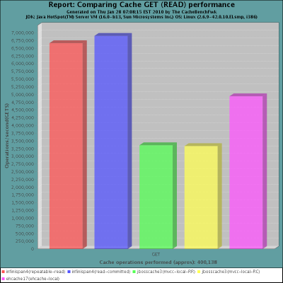
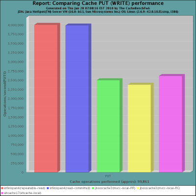

==  Local mode cache
Even though Infinispan's biggest potential is as distributed, in-memory data grid platform, one aspect of it often gets overlooked - it can be used as a standalone cache node. But why would anyone use Infinispan over, say, a link:$$http://docs.oracle.com/javase/6/docs/api/java/util/concurrent/ConcurrentHashMap.html$$[ConcurrentHashMap] ? Here are some reasons:

.Why a Cache is better than a Map
*  _Eviction._ Built-in eviction ensures you don't run out of memory. 
*  _Write-through and write-behind caching._ Going beyond memory and onto disk (or any other pluggable link:$$http://docs.jboss.org/infinispan/4.0/apidocs/org/infinispan/loaders/CacheStore.html$$[CacheStore] ) means that your state survives restarts, and preloaded hot caches can be configured.
*  _JTA support and XA compliance._ Participate in ongoing transactions with any link:$$http://java.sun.com/javaee/technologies/jta/index.jsp$$[JTA] -compliant transaction manager. 
*  _MVCC-based concurrency._ Highly optimized for fast, non-blocking readers. 
*  _Manageability._ link:$$http://docs.jboss.org/infinispan/7.0/apidocs/jmxComponents.html$$[Simple JMX] or rich GUI management console via link:$$http://community.jboss.org/docs/DOC-13721$$[JOPR] , you have a choice.
*  _Not just for the JVM._ <<_server_modules, server modules>> speaking REST, Memcached and Hot Rod protocols help non-JVM platforms use Infinispan. 
*  _Cluster-ready._ Should the need arise.

So how do you get started with Infinispan in local mode? The simplest configuration file containing just 

[source,xml]
----
<infinispan/>

----
is enough to get you started, or you can create DefaultCacheManager with _no-argument_ constructor. Either approach creates local default cache. 

All the features above are exposed via an easy-to-use link:$$http://docs.jboss.org/infinispan/7.0/apidocs/org/infinispan/Cache.html$$[Cache] interface, which extends link:$$http://docs.oracle.com/javase/6/docs/api/java/util/concurrent/ConcurrentMap.html$$[ConcurrentMap] and is compatible with many other cache systems. Infinispan even ships with <<_configuration_migration_tools, migration tools>> to help you move off other cache solutions onto Infinispan, whether you need a cache to store data retrieved remotely or simply as a <<_using_infinispan_as_jpa_hibernate_second_level_cache_provider, 2nd level cache for Hibernate>>.

=== Performance
In the process of testing and tuning Infinispan on very large clusters, we have started to put together a benchmarking framework called link:https://github.com/radargun/radargun[RadarGun].
Thanks to RadarGun, we have the ability to measure cache performance in standalone, local mode. We compared Infinispan 4.0 in local mode against the latest JBoss Cache release (3.2.2.GA) and EHCache (1.7.2). Some background on the tests: 

*  Used a latest snapshot of RadarGun
*  Run on an link:$$http://www.redhat.com/rhel/$$[RHEL] 5 server with 4 Intel Xeon cores, 4GB of RAM 
* Sun JDK 1.6.0_18, with `-Xms1g -Xmx1g`
* Test run on a single node, with 25 concurrent threads, using randomly generated Strings as keys and values and a 1kb payload for each entry, with a 80/20 read/write ratio.
* Performance measured in transactions per second (higher = better).

 

 

In summary, what we have here is that when run in local mode, Infinispan is a high-performance standalone caching engine which offers a rich set of features while still being trivially simple to configure and use. 

NOTE: These tests were run in 2010.  An updated benchmark is expected soon.

