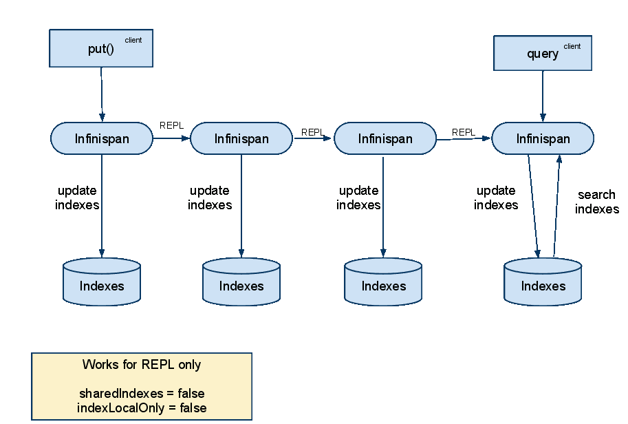
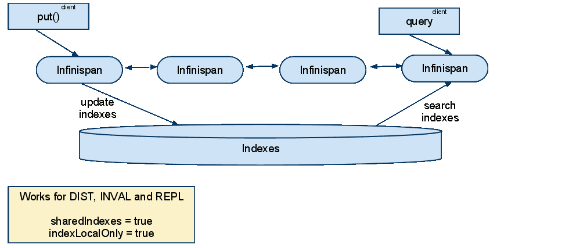

==  Querying Infinispan
Infinispan supports indexing of entries stored in the grid, and searching for entries using a querying API.

=== The infinispan-query module
This module adds querying capabilities to Infinispan. It uses link:$$http://hibernate.org/subprojects/search$$[Hibernate Search] and link:$$http://lucene.apache.org/$$[Apache Lucene] to index and search objects in the cache. It allows users to obtain objects within the cache without needing to know the keys to each object that they want to obtain, so you can search your objects basing on some of it's properties, for example to retrieve all red cars (exact metadata match), or all books about a specific topic (full text search and relevance scoring). 

==== Configuration
Indexing must be enabled in the configuration (as explained in <<sid-68355029,XML Configuration>> or <<sid-68355029,Programmatic configuration>> ). This will trigger automatic indexing of objects stored in the cache; there are several different ways to specify how these objects need to be indexed explained in the following paragraphs. To run queries you use the _SearchManager_ which exposes all necessary methods to get started. 

=== Simple example
We're going to store _Book_ instances in Infinispan; each _Book_ will be defined as in the following example; we have to choose which properties are indexed, and for each property we can optionally choose advanced indexing options using the annotations defined in the Hibernate Search project. 

[source,java]
----
// example values stored in the cache and indexed:
import org.hibernate.search.annotations.*;

//Values you want to index need to be annotated with @Indexed, then you pick which fields and how they are to be indexed:
@Indexed
public class Book {
   @Field String title;
   @Field String description;
   @Field @DateBridge(resolution=Resolution.YEAR) Date publicationYear;
   @IndexedEmbedded Set<Author> authors = new HashSet<Author>();
}

public class Author {
   @Field String name;
   @Field String surname;
   // hashCode() and equals() omitted
}

----

Now assuming we stored several _Book_ instances in our Infinispan _Cache_ , we can search them for any matching field as in the following example. 

[source,java]
----
// get the search manager from the cache:
SearchManager searchManager = org.infinispan.query.Search.getSearchManager(cache);

// create any standard Lucene query, via Lucene's QueryParser or any other means:
org.apache.lucene.search.Query fullTextQuery = //any Apache Lucene Query

// convert the Lucene query to a CacheQuery:
CacheQuery cacheQuery = searchManager.getQuery( fullTextQuery );

// get the results:
List<Object> found = cacheQuery.list();

----

A Lucene Query is often created by parsing a query in text format such as "title:infinispan AND authors.name:sanne", or by using the query builder provided by Hibernate Search. 

[source,java]
----
// get the search manager from the cache:
SearchManager searchManager = org.infinispan.query.Search.getSearchManager( cache );

// you could make the queries via Lucene APIs, or use some helpers:
QueryBuilder queryBuilder = searchManager.buildQueryBuilderForClass(Book.class).get();

// the queryBuilder has a nice fluent API which guides you through all options.
// this has some knowledge about your object, for example which Analyzers
// need to be applied, but the output is a failry standard Lucene Query.
org.apache.lucene.search.Query luceneQuery = queryBuilder.phrase()
                  .onField("description")
                  .andField("title")
                  .sentence("a book on highly scalable query engines")
                  .createQuery();

// the query API itself accepts any Lucene Query, and on top of that
// you can restrict the result to selected class types:
CacheQuery query = searchManager.getQuery(luceneQuery, Book.class);

// and there are your results!
List objectList = query.list();

for (Object book : objectList) {
      System.out.println(book);
}

----

A part from _list()_ you have the option for streaming results, or use pagination. 

This barely scratches the surface of all what is possible to do: see the link:$$http://docs.jboss.org/hibernate/stable/search/reference/en-US/html_single$$[Hibernate Search reference documentation] to learn about sorting, numeric fields, declarative filters, caching filters, complex object graph indexing, custom types and the powerful faceting search API. 

==== Notable differences with Hibernate Search
Using _@DocumentId_ to mark a field as identifier does not apply to Infinispan values; in Infinispan Query the identifier for all _@Indexed_ objects is the key used to store the value. You can still customize how the key is indexed using a combination of _@Transformable_ , _@ProvidedId_ , custom types and custom _FieldBridge_ implementations. 

==== Requirements for the Key: @Transformable and @ProvidedId
The key for each value needs to be indexed as well, and the key instance must be transformed in a String. Infinispan includes some default transformation routines to encode common primitives, but to use a custom key you must provide an implementation of _org.infinispan.query.Transformer_ . 

===== Registering a Transformer via annotations
You can annotate your key type with _org.infinispan.query.Transformable_ : 

[source,java]
----

@Transformable(transformer = CustomTransformer.class)
public class CustomKey {
   ...
}

public class CustomTransformer implements Transformer {
   @Override
   public Object fromString(String s) {
      ...
      return new CustomKey(...);
   }

   @Override
   public String toString(Object customType) {
      CustomKey ck = (CustomKey) customType;
      return ...
   }
}

----

===== Registering a Transformer programmatically
Using this technique, you don't have to annotated your custom key type:

[source,java]
----
org.infinispan.query.SearchManager.registerKeyTransformer(Class<?>, Class<? extends Transformer>)
----

===== @ProvidedId
The _org.hibernate.search.annotations.ProvidedId_ annotation lets you apply advanced indexing options to the key field: the field name to be used, and/or specify a custom _FieldBridge_ . 

=== Configuration
==== Configuration via XML
To enable indexing via XML, you need to add the `<indexing />` element to your cache configuration, and optionally pass additional properties to the embedded Hibernate Search engine: 

[source,xml]
----
<infinispan>
   <default>
      <indexing enabled="true" indexLocalOnly="true">
         <properties>
            <property name="default.directory_provider" value="ram" />
         </properties>
      </indexing>
   </default>
</infinispan>

----

In this example the index is stored in memory, so when this nodes is shutdown the index is lost: good for a quick demo, but in real world cases you'll want to use the default (store on filesystem) or store the index in Infinispan as well. For the complete reference of properties to define, refer to the link:$$http://docs.jboss.org/hibernate/stable/search/reference/en-US/html_single/#search-configuration$$[Hibernate Search documentation] . 

==== Lucene Directory
Infinispan Query isn't aware of where you store the indexes, it just passes the configuration of which _Lucene Directory_ implementation you want to use to the Hibernate Search engine. There are several _Lucene Directory_ implementations bundled, and you can plug your own or add third party implementations: the Directory is the IO API for Lucene to store the indexes. 

The most common _Lucene Directory_ implementations used with _Infinispan Query_ are: 

* Ram - stores the index in a local map to the node. This index can't be shared.
* Filesystem - stores the index in a locally mounted filesystem. This could be a network shared FS, but sharing this way is generally not recommended.
* Infinispan - stores the index in a different dedicated Infinispan cache. This cache can be configured as replicated or distributed, to share the index among nodes. See also the dedicated chapter on the Lucene Directory in this guide. 

Of course having a shared index vs. an independent index on each node directly affects behaviour of the Query module; some combinations might not make much sense.

==== Using programmatic configuration and index mapping

In the following example we start Infinispan programmatically, avoiding XML configuration files, and also map an object _Author_ which is to be stored in the grid and made searchable on two properties but without annotating the class. 

[source,java]
----

SearchMapping mapping = new SearchMapping();
mapping.entity(Author.class).indexed().providedId()
      .property("name", ElementType.METHOD).field()
      .property("surname", ElementType.METHOD).field();

Properties properties = new Properties();
properties.put(org.hibernate.search.Environment.MODEL_MAPPING, mapping);
properties.put("hibernate.search.[other options]", "[...]");

Configuration infinispanConfiguration = new ConfigurationBuilder()
      .indexing()
         .enable()
         .indexLocalOnly(true)
         .withProperties(properties)
      .build();

DefaultCacheManager cacheManager = new DefaultCacheManager(infinispanConfiguration);

Cache<Long, Author> cache = cacheManager.getCache();
SearchManager sm = Search.getSearchManager(cache);

Author author = new Author(1, "Manik", "Surtani");
cache.put(author.getId(), author);

QueryBuilder qb = sm.buildQueryBuilderForClass(Author.class).get();
Query q = qb.keyword().onField("name").matching("Manik").createQuery();
CacheQuery cq = sm.getQuery(q, Author.class);
Assert.assertEquals(cq.getResultSize(), 1);

----

=== Cache modes and managing indexes
Index management is currently controlled by the _Configuration.setIndexLocalOnly()_ setter, or the `<indexing indexLocalOnly="true" />` XML element. If you set this to true, only modifications made locally on each node are considered in indexing. Otherwise, remote changes are considered too. 

Regarding actually configuring a Lucene directory, refer to the link:$$http://docs.jboss.org/hibernate/stable/search/reference/en-US/html_single/#search-configuration$$[Hibernate Search documentation] on how to pass in the appropriate Lucene configuration via the Properties object passed to QueryHelper. 

==== LOCAL
In local mode, you may use any Lucene Directory implementation. Also the option _indexLocalOnly_ isn't meaningful. 

==== REPLICATION
In replication mode, each node can have it's own local copy of the index. So indexes can either be stored locally on each node (RAMDirectory, FSDirectory, etc) but you need to set _indexLocalOnly_ to _false_ , so that each node will apply needed updates it receives from other nodes in addition to the updates started locally. Any Directory implementation can be used, but you have to make sure that when a new node is started it receives an up to date copy of the index; typically rsync is well suited for this task, but being an external operation you might end up with a slightly out-of-sync index, especially if updates are very frequent. 

Alternately, if you use some form of shared storage for indexes (see _Sharing the Index_ ), you then have to set _indexLocalOnly_ to _true_ so that each node will apply only the changes originated locally; in this case there's no risk in having an out-of-sync index, but to avoid write contention on the index you should make sure that a single node is "in charge" of updating the index. Again, the Hibernate Search reference documentation describes means to use link:$$http://docs.jboss.org/hibernate/stable/search/reference/en-US/html_single/#jms-backend$$[a JMS queue] or link:$$http://docs.jboss.org/hibernate/stable/search/reference/en-US/html_single/#jgroups-backend$$[JGroups] to send indexing tasks to a master node. 

The diagram below shows a replicated deployment, in which each node has a local index.

==== DISTRIBUTION
For these 2 cache modes, you _need_ to use a shared index and set _indexLocalOnly_ to true. 

The diagram below shows a deployment with a shared index. Note that while not mandatory, a shared index can be used for replicated (vs. distributed) caches as well.

==== INVALIDATION
Indexing or searching of elements under INVALIDATION mode is not supported.

=== Sharing the Index
The most simple way to share an index is to use some form of shared storage for the indexes, like an _FSDirectory_ on a shared disk; however this form is problematic as the _FSDirectory_ relies on specific locking semantics which are often incompletely implemented on network filesystems, or not reliable enough; if you go for this approach make sure to search for potential problems on the Lucene mailing lists for other experiences and workarounds. Good luck, test well. 

There are many alternative Directory implementations you can find, one of the most suited approaches when working with Infinispan is of course to store the index in an Infinispan cache: have a look at the <<sid-68355039,InfinispanDirectoryProvider>> , as all Infinispan based layers it can be combined with persistent CacheLoaders to keep the index on a shared filesystem without the locking issues, or alternatively in a database, cloud storage, or any other CacheLoader implementation; you could backup the index in the same store used to backup your values. 

For full documentation on clustering the Lucene engine, refer to the link:$$http://docs.jboss.org/hibernate/stable/search/reference/en-US/html_single/#search-configuration$$[Hibernate Search documentation] to properly configure it clustered. 

=== Clustering the Index in Infinispan
Again the configuration details are in the Hibernate Search reference, in particular in the link:$$http://docs.jboss.org/hibernate/stable/search/reference/en-US/html_single/#infinispan-directories$$[infinispan-directories] section. This backend will by default start a secondary Infinispan CacheManager, and optionally take another Infinispan configuration file: don't reuse the same configuration or you will start grids recursively! It is currently not possible to share the same CacheManager. 

=== Rebuilding the Index
Occasionally you might need to rebuild the Lucene index by reconstructing it from the data stored in the Cache. You need to rebuild the index if you change the definition of what is indexed on your types, or if you change for example some _Analyzer_ parameter, as Analyzers affect how the index is defined. Also, you might need to rebuild the index if you had it destroyed by some system administration mistake. To rebuild the index just get a reference to the MassIndexer and start it; beware if might take some time as it needs to reprocess all data in the grid! 

[source,java]
----
SearchManager searchManager = Search.getSearchManager(cache);
searchManager.getMassIndexer().start();
----

TIP: This is also available as a JMX operation.

WARNING: There is currently one limitation: the MassIndexer is implemented using Map/Reduce, which in Infinispan 5.2 requires the underlying caches to use distribution. In other words, the MassIndexer isn't currently functional in LOCAL and REPL cache modes.
