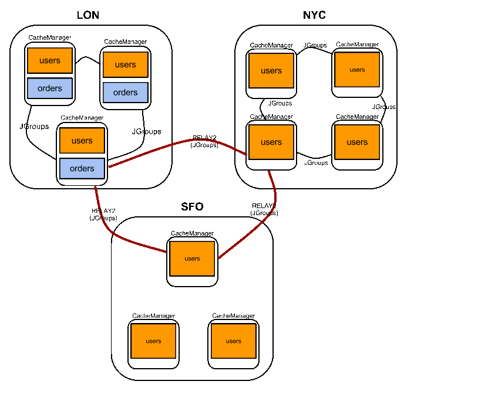

== Cross site replication
Cross site (x-site) replication allows backing up the data from one cluster to other clusters, potentially situated in different geographical location. The cross-site replication is built on top of JGroups' link:$$http://www.jgroups.org/manual-3.x/html/user-advanced.html#Relay2Advanced$$[RELAY2 protocol] . link:$$https://community.jboss.org/wiki/DesignForCrossSiteReplication$$[This document] describes the technical design of cross site replication in more detail. 

=== Sample deployment
The diagram below depicts a possible setup of replicated sites, followed by a description of individual elements present in the deployment. Options are then explained at large in future paragraphs. Comments on the diagram above: 

* there are 3 sites: LON, NYC and SFO.

* in each site there is a running Infinispan cluster with a (potentially) different number of physical nodes: 3 nodes in LON, 4 nodes in NYC and 3 nodes in SFO

* the "users" cache is active in LON, NYC and SFO. Updates on the "users" cache in any of these sites gets replicated to the other sites as well

* it is possible to use different replication mechanisms between sites. E.g. One can configure SFO to backup data synchronously to NYC and asynchronously to LON

* the "users" cache can have a different configuration from one site to the other. E.g. it might be configured as distributed with numOwners=2 in the LON site, REPL in the NYC site and distributed with numOwners=1 in the SFO site

*  JGroups is used for both inter-site and intra-site communication. link:$$http://www.jgroups.org/manual-3.x/html/user-advanced.html#Relay2Advanced$$[RELAY2] is used for inter-site communication 

*  "orders" is a site local to LON, i.e. updates to the data in "orders" don't get replicated to the remote sites The following sections discuss specific aspects of cross site replication into more detail. The foundation of the cross-site replication functionality is RELAY2 so it highly recommended to read JGroups' link:$$http://www.jgroups.org/manual-3.x/html/user-advanced.html#Relay2Advanced$$[RELAY2] documentation before moving on into cross-site. Configuration 

The cross-site replication configuration spreads over the following files:

.  the backup policy for each individual cache is defined in infinispan's .xml configuration file (link:https://gist.github.com/maniksurtani/cdd5420af764c907e342[infinispan.xml]) 

.  cluster's JGroups xml configuration file: link:$$http://www.jgroups.org/manual-3.x/html/user-advanced.html#Relay2Advanced$$[RELAY2] protocol needs to be added to the JGroups protocol stack (link:https://gist.github.com/maniksurtani/409fe5ece5fe4bcf679f[jgroups.xml]) 

.  RELAY2 configuration file: RELAY2 has an own configuration file ( link:https://gist.github.com/maniksurtani/8c7238dae7921d2c883e[relay2.xml] ) 

.  the JGroups channel that is used by RELAY2 has its own configuration file (link:https://gist.github.com/maniksurtani/cbc1a297a367b1176feb[jgroups-relay2.xml]) Infinispan XML configuration file 

The local site is defined in the the global configuration section. The local is the site where the node using this configuration file resides (in the example above local site is "LON").

.infinispan.xml
[source,xml]
----

<global>
  ...
  <site local="LON"/>
  ...
</global>

----

The same setup can be achieved programatically:

[source,java]
----

GlobalConfigurationBuilder lonGc = GlobalConfigurationBuilder.defaultClusteredBuilder();
lonGc.site().localSite("LON");

----

The names of the site (case sensitive) should match the name of a site as defined within JGroups' RELAY2 protocol configuration file. Besides the global configuration, each cache specifies its backup policy in the "site" element: 

.infinispan.xml
[source,xml]
----

<namedCache name="users">
   <sites>
     <backups>
       <backup site="NYC" backupFailurePolicy="WARN" strategy="SYNC" timeout="12000"/>
       <backup site="SFO" backupFailurePolicy="IGNORE" strategy="ASYNC"/>
       <backup site="LON" strategy="SYNC" enabled="false"/>
     </backups>
  </sites>
</namedCache>

----

The "users" cache backups its data to the "NYC" and "SFO" sites. Even though the "LON" appears as a backup site, it has the "enabled" attribute set to _false_ so it will be ignored . For each site backup, the following configuration attributes can be specified: 

* strategy - the strategy used for backing up data, either "SYNC" or "ASYNC". Defaults to "ASYNC"
* backupFailurePolicy - Decides what the system would do in case of failure during backup. Possible values are:
** IGNORE - allow the local operation/transaction to succeed
** WARN - same as IGNORE but also logs an warning message. Default.
** FAIL - only in effect if "strategy" is "SYNC" - fails local cluster operation/transaction by throwing an exception to the user
** CUSTOM - user provided, see "failurePolicyClass" below

* failurePolicyClass - If the 'backupFailurePolicy' is set to 'CUSTOM' then this attribute is required and should contain the fully qualified name of a class implementing org.infinispan.xsite.CustomFailurePolicy
* timeout - The timeout(milliseconds) to be used when backing up data remotely. Defaults to 10000 (10 seconds)

The same setup can be achieved programatically:

[source,java]
----

ConfigurationBuilder lon = new ConfigurationBuilder();
lon.sites().addBackup()
      .site("NYC")
      .backupFailurePolicy(BackupFailurePolicy.WARN)
      .strategy(BackupConfiguration.BackupStrategy.SYNC)
      .replicationTimeout(12000)
      .sites().addInUseBackupSite("NYC")
    .sites().addBackup()
      .site("SFO")
      .backupFailurePolicy(BackupFailurePolicy.IGNORE)
      .strategy(BackupConfiguration.BackupStrategy.ASYNC)
      .sites().addInUseBackupSite("SFO")

----

The "users" cache above doesn't know on which cache on the remote sites its data is being replicated. By default the remote site writes the backup data to a cache having the same name as the originator, i.e. "users". This behaviour can be overridden with an "backupFor" element. For example the following configuration in SFO makes the "usersLONBackup" cache act as the backup cache for the "users" cache defined above in the LON site:

.infinispan.xml
[source,xml]
----

<infinispan>
  <namedCache name="usersLONBackup">
    <sites>
      <backupFor remoteCache="users" remoteSite="LON"/>
    </sites>
  </namedCache>
</infinispan>

----

The same setup can be achieved programatically:

[source,java]
----

ConfigurationBuilder cb = new ConfigurationBuilder();
cb.sites().backupFor().remoteCache("users").remoteSite("LON");

----

==== Local cluster's jgroups .xml configuration

This is the configuration file for the local (intra-site) infinispan cluster. It is referred from the infinispan configuration file, see "configurationFile" below:

.infinispan.xml
[source,xml]
----

<infinispan>
..
  <global>
    <transport clusterName="infinispan-cluster">
      <properties>
        <property name="configurationFile" value="jgroups.xml"/>
      </properties>
    </transport>
  </global>
..
</infinispan>

----

In order to allow inter-site calls, the RELAY2 protocol needs to be added to the protocol stack defined in the jgroups configuration (see attached $$https://gist.github.com/maniksurtani/409fe5ece5fe4bcf679f[jgroups.xml] for an example). 

==== RELAY2 configuration file

The RELAY2 configuration file is linked from the jgroups.xml (see attached link:https://gist.github.com/maniksurtani/8c7238dae7921d2c883e[relay2.xml]). It defines the sites seen by this cluster and also the JGroups configuration file that is used by RELAY2 in order to communicate with the remote sites. 

=== Data replication
For both transactional and non-transactional caches, the backup calls are performed in parallel with local cluster calls, e.g. if we write data to node N1 in LON then replication to the local nodes N2 and N3 and remote backup sites SFO and NYC happen in parallel.

==== Non transactional caches
In the case of non-transactional caches the replication happens during each operation. Given that data is sent in parallel to backups and local caches, it is possible for the operations to succeed locally and fail remotely, or the other way, causing inconsistencies

==== Transactional caches
For synchronous transactional caches, Infinispan internally uses a two phase commit protocol: lock acquisition during the 1st phase (prepare) and apply changes during the 2nd phase (commit). For asynchronous caches the two phases are merged, the "apply changes" message being sent asynchronously to the owners of data. This 2PC protocol maps to 2PC received from the JTA transaction manager. For transactional caches, both optimistic and pessimistic, the backup to remote sites happens during the prepare and commit phase only. 

===== Synchronous local cluster with async backup
In this scenario the backup call happens during local commit phase(2nd phase). That means that if the local prepare fails, no remote data is being sent to the remote backup.

===== Synchronous local cluster with sync backup
In this case there are two backup calls:

* during prepare a message is sent across containing all the modifications that happened within this transaction

* if the remote backup cache is transactional then a transaction is started remotely and all these modifications are being written within this transaction's scope. The transaction is not committed yet (see below)

* if the remote backup cache is not transactional, then the changes are applied remotely

* during the commit/rollback, a commit/rollback message is sent across

* if the remote backups cache is transactional then the transaction started at the previous phase is committed/rolled back

* if the remote backup is not transactional then this call is ignored

Both the local and the backup call(if the "backupFailurePolicy" is set to "FAIL") can veto transaction's prepare outcome

===== Asynchronous local cluster
In the case of asynchronous local clusters, the backup data is sent during the commit phase. If the backup call fails and the "backupFailurePolicy" is set to "FAIL" then the user is notified through an exception.

=== Taking a site offline
If backing up to a site fails for a certain number of times during an time interval, then it is possible to automatically mark that site as offline. When a site is marked as offline the local site won't try to backup data to it anymore. In order to be taken online a system administrator intervention being required.

==== Configuration
The taking offline of a site can be configured as follows:

.infinispan.xml
[source,xml]
----

<namedCache name="bestEffortBackup">
   ...
    <sites>
        <backups>
           <backup site="NYC" strategy="SYNC" backupFailurePolicy="FAIL">
               <takeOffline afterFailures="500" minTimeToWait="10000"/>
           </backup>
        </backups>
    </sites>
    ...
</namedCache>

----

The _takeOfline_ element under the _backup_ configures the taking offline of a site: * _afterFailure_ - the number of failed backup operations after which this site should be taken offline. Defaults to 0 (never). A negative value would mean that the site will be taken offline after _minTimeToWait_ * _minTimeToWait_ - the number of milliseconds in which a site is not marked offline even if it is unreachable for 'afterFailures' number of times. If smaller or equal to 0, then only _afterFailures_ is considered. 

The equivalent programmatic configuration is:

[source,java]
----

lon.sites().addBackup()
      .site("NYC")
      .backupFailurePolicy(BackupFailurePolicy.FAIL)
      .strategy(BackupConfiguration.BackupStrategy.SYNC)
      .takeOffline()
         .afterFailures(500)
         .minTimeToWait(10000);

----

==== Taking a site back online
In order to bring a site back online after being taken offline, one can use the JMX console and invoke the "bringSiteOnline(siteName)" operation on the _XSiteAdmin_ managed bean. At the moment this method would need to be invoked on all the nodes within the site(further releases will overcome this limitation). 

=== Reference
link:$$https://community.jboss.org/wiki/DesignForCrossSiteReplication$$[This document] (Sept 2012) describes the technical design of cross site replication in more detail. 

