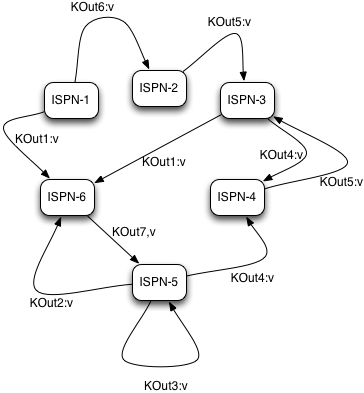
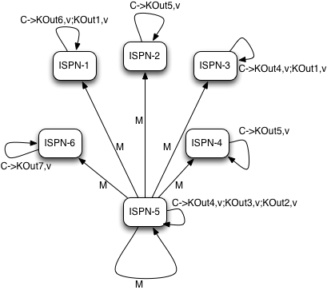
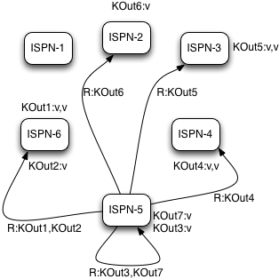

==  Map/Reduce

MapReduce is a programming model allowing transparent distributed processing of very large data sets over data grids. The name MapReduce comes from an idea of using two distinct computational phases of map and reduce. In the map phase, master node that initiates a task takes the task input, divides it and sends tasks for map phase execution on the grid. Each node in turns executes a map function on its input returning intermediate results back to master node. Master node task collects all intermediate results from map phase combines them by intermediate result keys and sends intermediate keys/values for reduction on the grid. Finally master tasks node receives all results from reduction phases and returns the final result to invoker of the MapReduce task.

=== API
Infinispan's own MapReduce model is an adaptation of Google's original link:$$http://research.google.com/archive/mapreduce.html$$[MapReduce] . There are four main components in each map reduce task: Mapper, Reducer, Collator and MapReduceTask. 

Implementation of a Mapper class is a component of MapReduceTask invoked once for each input entry K,V. Every Mapper instance is migrated to an Infinispan node, given a cache entry K,V input pair which it transforms into an intermediate key/value pair emitted into Infinispan provided Collector instance. Intermediate results are further reduced using a Reducer.

[source,java]
----

public interface Mapper<KIn, VIn, KOut, VOut> extends Serializable {

   /**
    * Invoked once for each input cache entry KIn,VOut pair.
    */
   void map(KIn key, VIn value, Collector<KOut, VOut> collector);
}

----

The Reducer, as its name implies, reduces a list of intermediate results from map phase of MapReduceTask. Infinispan distributed execution environment creates one instance of Reducer per execution node.

[source,java]
----
public interface Reducer<KOut, VOut> extends Serializable {

   /**
    * Combines/reduces all intermediate values for a particular intermediate key to a single value.
    * 

    *
    */
   VOut reduce(KOut reducedKey, Iterator<VOut> iter);

}
----

Collator coordinates results from Reducers executed on Infinispan cluster and assembles a final result returned to an invoker of MapReduceTask. Collator is applied to final `Map<KOut, VOut>` result of MapReduceTask.

[source,java]
----
public interface Reducer<KOut, VOut> extends Serializable {

   /**
    * Combines/reduces all intermediate values for a particular intermediate key to a single value.
    * 

    *
    */
   VOut reduce(KOut reducedKey, Iterator<VOut> iter);

}
----

Finally, link:$$https://github.com/infinispan/infinispan/blob/master/core/src/main/java/org/infinispan/distexec/mapreduce/MapReduceTask.java$$[MapReduceTask] is a distributed task unifying Mapper, Reducer and Collator into a cohesive large scale computation to be transparently parallelized across Infinispan cluster nodes. Users of MapReduceTask need to provide a cache whose data is used as input for this task. Infinispan execution environment will instantiate and migrate instances of provided mappers and reducers seamlessly across Infinispan nodes. Unless otherwise specified using onKeys method input keys filter all available key value pairs of a specified cache will be used as input data for this task. 

==== Task timeout

NOTE: The timeout per Map/Reduce task is only available for Infinispan 5.3 and higher.

It is possible to set a timeout value for each Map/Reduce tasks. However, if no timeout is specified, it uses the replication timeout as a default timeout (the same behavior as the previous Infinispan versions). You can set the timeout in your task by doing the following: 

[source,java]
----
MapReduceTask task = new MapReduceTask(cache);
task.timeout(1, TimeUnit.MINUTES);
----

Also, it is possible to know which is the current timeout value for the task:

[source,java]
----
System.out.println("Map/Reduce task timeout is " + task.timeout(TimeUnit.MILLISECONDS) + " millseconds"); 
----

For more information about this, please check the java doc in link:$$http://docs.jboss.org/infinispan/7.0/apidocs/org/infinispan/distexec/mapreduce/MapReduceTask.html$$[Map Reduce Task API Documentation]

=== Mapper and CDI

Although Mapper gets invoked with an appropriate input key/value pairs on an executing node, Infinispan also provides CDI injection of an input Cache in case users might need some additional data from input cache in order to complete map transformation. Upon arrival of user's Mapper to an Infinispan executing node, Infinispan CDI mechanism will provide appropriate cache reference and inject it to executing Mapper. All one has to do is to declare a Cache field in Mapper and annotate it with @org.infinispan.cdi.Input annotation along with the mandatory @Inject annotation.

[source,java]
----
public class WordCountCacheInjectedMapper implements Mapper<String, String, String, Integer> {

      @Inject
      @Input
      private Cache<String, String> cache;

      @Override
      public void map(String key, String value, Collector<String, Integer> collector) {

         //use injected cache if needed
         StringTokenizer tokens = new StringTokenizer(value);
         while (tokens.hasMoreElements()) {
            String s = (String) tokens.nextElement();
            collector.emit(s, 1);
         }
      }
}
----

=== MapReduceTask distributed execution
As our MapReduce implementation grew out of the proof of concept phase (and especially after our users had already production tested it), we needed to remove the most prominent impediment to an industrial grade MapReduce solution that we strive for: distributing reduce phase execution.

* Reduce phase: prior to the Infinispan 5.2 release was done on a single Infinispan master task node. Therefore, the size of map reduce problems we could support (data size wise) was effectively shrunk to a working memory of a single Infinispan node. Starting with the Infinispan 5.2 release, we have removed this limitation, and reduce phase execution is distributed across the cluster as well. Of course, users still have an option to use MapReduceTask the old way, and we even recommend that particular approach for smaller sized input tasks. We have achieved distribution of reduce phase by relying on Infinispan's consistent hashing and DeltaAware cache insertion. Here is how we distributed reduce phase execution:

* Map phase: MapReduceTask, as it currently does, will hash task input keys and group them by execution node N they are hashed to. After key node mapping, MapReduceTask sends map function and input keys to each node N. Map function is invoked using given keys and locally loaded corresponding values. 

 

* Results are collected with an Infinispan supplied Collector, and combine phase is initiated. A Combiner, if specified, takes KOut keys and immediately invokes reduce phase on keys. The result of mapping phase executed on each node is KOut/VOut map. There will be one resulting map per execution node N per launched MapReduceTask.

* Intermediate KOut/VOut migration phase
** In order to proceed with reduce phase, all intermediate keys and values need to be grouped by intermediate KOut keys. More specifically, as map phases around the cluster can produce identical intermediate keys, all those identical intermediate keys and their values need to be grouped before reduce is executed on any particular intermediate key.
** Therefore at the end of combine phase, instead of returning map with intermediate keys and values to the master task node, we instead hash each intermediate key KOut and migrate it with its VOut values to Infinispan node where keys KOut are hashed to. We achieve this using a temporary DIST cache and underlying consistent hashing mechanism. Using DeltaAware cache insertion we effectively collect all VOut values under each KOut for all executed map functions across the cluster

 
 

* At this point, map and combine phase have finished its execution; list of KOut keys is returned to a master node and its initiating MapReduceTask. We do not return VOut values as we do not need them at master task node. MapReduceTask is ready to start with reduce phase.

Reduce phase
* Reduce phase is easy to accomplish now as Infinispan's consistent hashing already finished all the hard lifting for us. To complete reduce phase, MapReduceTask groups KOut keys by execution node N they are hashed to. For each node N and its grouped input KOut keys, MapReduceTask sends a reduce command to a node N where KOut keys are hashed. Once reduce command arrives on target execution node, it looks up temporary cache belonging to MapReduce task - and for each KOut key, grabs a list of VOut values, wraps it with an Iterator and invokes reduce on it._ 

 
 

A result of each reduce is a map where each key is KOut and value is VOut. Each Infinispan execution node N returns one map with KOut/VOut result values. As all initiated reduce commands return to a calling node, MapReduceTask simply combines all resulting maps into map M and returns M as a result of MapReduceTask.

Distributed reduce phase is turned on by using a MapReduceTask link:$$http://docs.jboss.org/infinispan/7.0/apidocs/org/infinispan/distexec/mapreduce/MapReduceTask.html#MapReduceTask(org.infinispan.Cache, boolean)$$[constructor] specifying cache to use as input data for the task and boolean parameter distributeReducePhase set to true. Map/Reduce API link:$$http://docs.jboss.org/infinispan/7.0/apidocs/org/infinispan/distexec/mapreduce/package-summary.html$$[javadoc] and demos are included in distribution.

=== Examples
Word count is a classic, if not overused, example of map/reduce paradigm. Assume we have a mapping of key --> sentence stored on Infinispan nodes. Key is a String, each sentence is also a String, and we have to count occurrence of all words in all sentences available. The implementation of such a distributed task could be defined as follows:

[source,java]
----
public class WordCountExample {

   /**
    * In this example replace c1 and c2 with
    * real Cache references
    *
    * @param args
    */
   public static void main(String[] args) {
      Cache c1 = null;
      Cache c2 = null;

      c1.put("1", "Hello world here I am");
      c2.put("2", "Infinispan rules the world");
      c1.put("3", "JUDCon is in Boston");
      c2.put("4", "JBoss World is in Boston as well");
      c1.put("12","JBoss Application Server");
      c2.put("15", "Hello world");
      c1.put("14", "Infinispan community");
      c2.put("15", "Hello world");

      c1.put("111", "Infinispan open source");
      c2.put("112", "Boston is close to Toronto");
      c1.put("113", "Toronto is a capital of Ontario");
      c2.put("114", "JUDCon is cool");
      c1.put("211", "JBoss World is awesome");
      c2.put("212", "JBoss rules");
      c1.put("213", "JBoss division of RedHat ");
      c2.put("214", "RedHat community");

      MapReduceTask<String, String, String, Integer> t =
         new MapReduceTask<String, String, String, Integer>(c1);
      t.mappedWith(new WordCountMapper())
         .reducedWith(new WordCountReducer());
      Map<String, Integer> wordCountMap = t.execute();
   }

   static class WordCountMapper implements Mapper<String,String,String,Integer> {
      /** The serialVersionUID */
      private static final long serialVersionUID = -5943370243108735560L;

      @Override
      public void map(String key, String value, Collector<String, Integer> c) {
         StringTokenizer tokens = new StringTokenizer(value);
         while (tokens.hasMoreElements()) {
            String s = (String) tokens.nextElement();
            c.emit(s, 1);
         }
      }
   }

   static class WordCountReducer implements Reducer<String, Integer> {
      /** The serialVersionUID */
      private static final long serialVersionUID = 1901016598354633256L;

      @Override
      public Integer reduce(String key, Iterator<Integer> iter) {
         int sum = 0;
         while (iter.hasNext()) {
            Integer i = (Integer) iter.next();
            sum += i;
         }
         return sum;
      }
   }
}

----

As we have seen it is relatively easy to specify map reduce task counting number of occurrences for each word in all sentences. Best of all result is returned to task invoker in the form of `Map<KOut, VOut>` rather than being written to a stream.

What if we need to find the most frequent word in our word count example? All we have to do is to define a Collator that will transform the result of MapReduceTask `Map<KOut, VOut>` into a String which in turn is returned to a task invoker. We can think of Collator as transformation function applied to a final result of MapReduceTask.

[source,java]
----
MapReduceTask<String, String, String, Integer> t = new MapReduceTask<String, String, String, Integer>(cache);
t.mappedWith(new WordCountMapper()).reducedWith(new WordCountReducer());
String mostFrequentWord = t.execute(
      new Collator<String,Integer,String>() {

         @Override
         public String collate(Map<String, Integer> reducedResults) {
            String mostFrequent = "";
            int maxCount = 0;
            for (Entry<String, Integer> e : reducedResults.entrySet()) {
               Integer count = e.getValue();
               if(count > maxCount) {
                  maxCount = count;
                  mostFrequent = e.getKey();
               }
            }
         return mostFrequent;
         }

      });
System.out.println("The most frequent word is " + mostFrequentWord);

----

