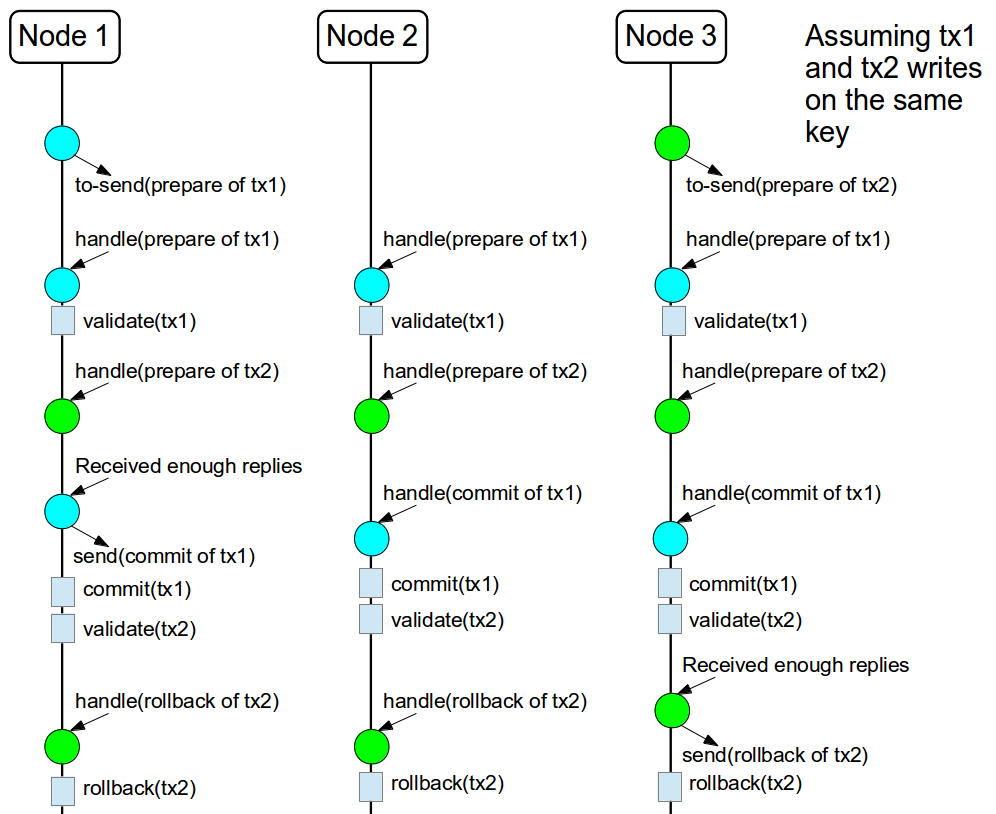
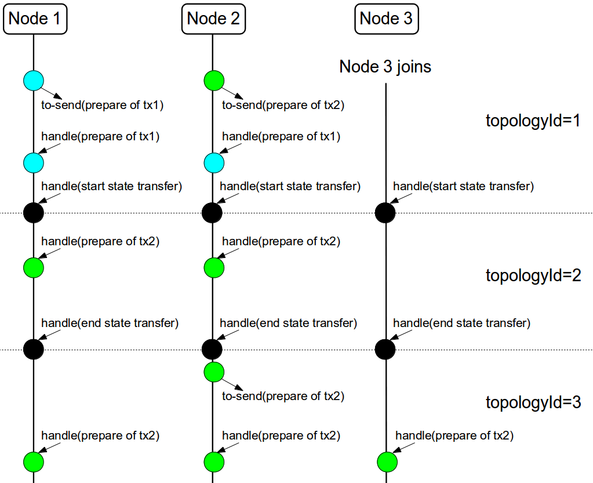
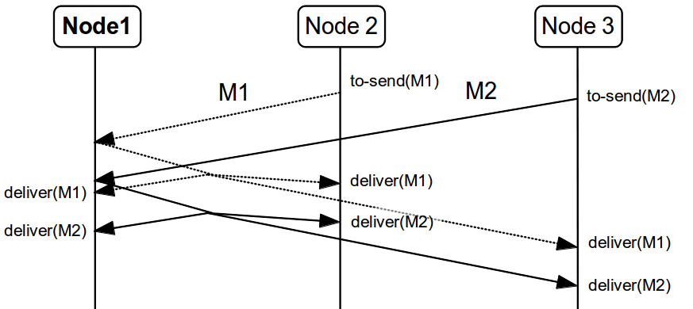
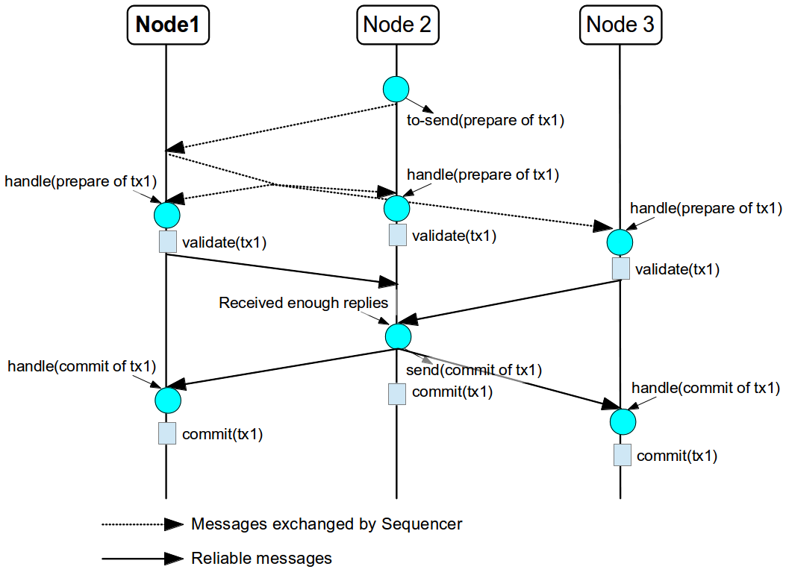
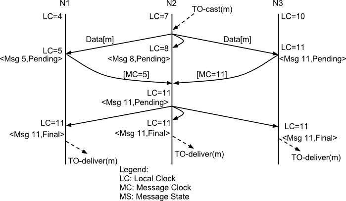
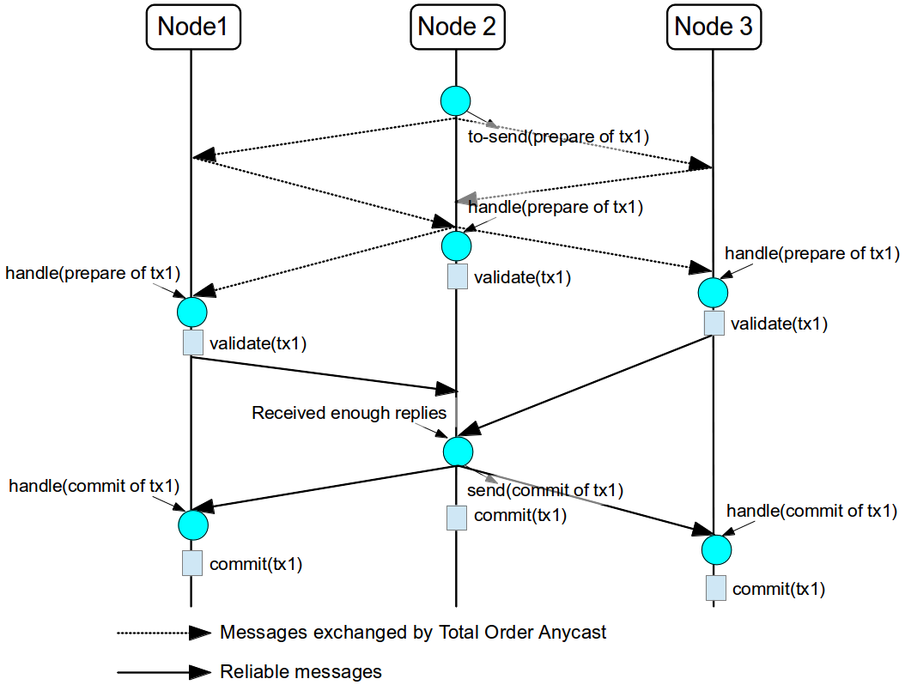
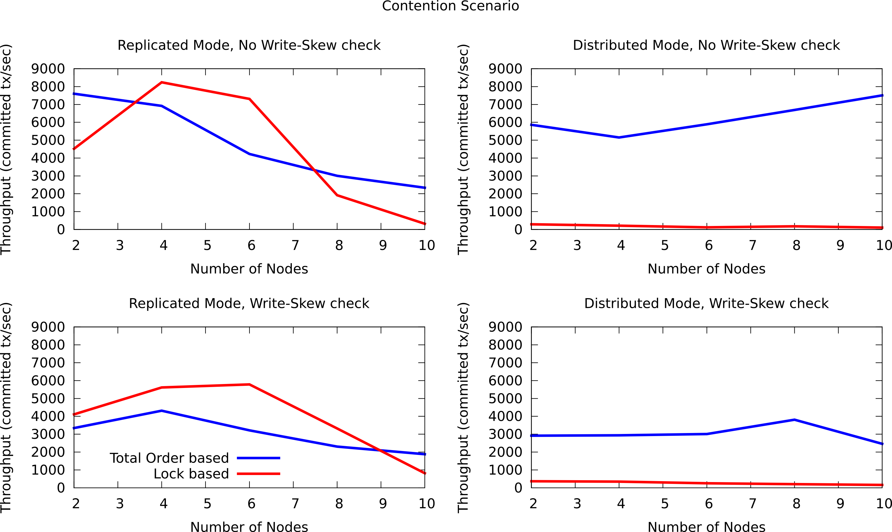
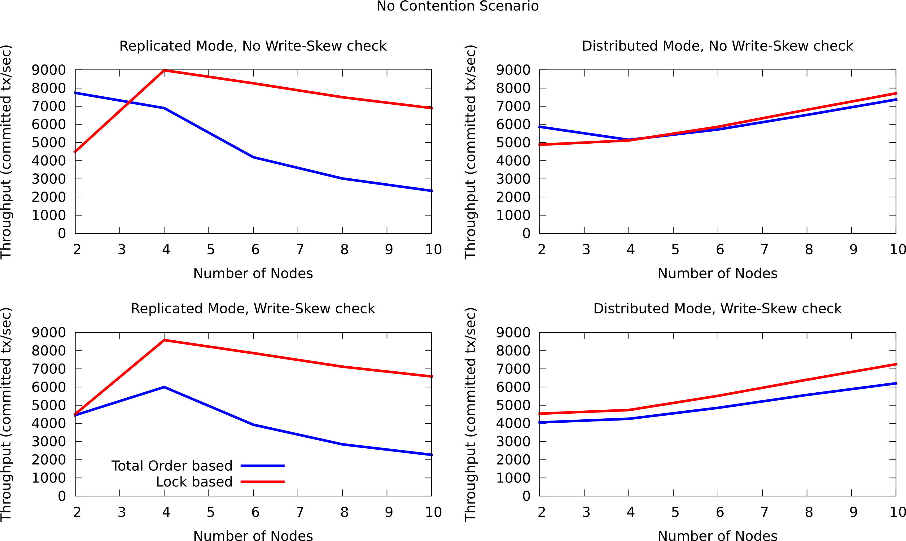

==  Total Order based commit protocol
The Total Order based protocol is a multi-master scheme (in this context, multi-master scheme means that all nodes can update all the data) as the (optimistic/pessimist) locking model implemented in Infinispan. This commit protocol relies on the concept of totally ordered delivery of messages which, informally, implies that each node which delivers a set of messages, delivers them in the same order.

This protocol comes with this advantages.

. transactions can be committed in one phase, as they are delivered in the same order by the nodes that receive them.
. it mitigates distributed deadlocks.

The weaknesses of this approach are the fact that its implementation relies on a single thread per node which delivers the transaction and its modification, and the slightly higher number of messages exchanged by JGroups.

Thus, this protocol delivers best performance in scenarios of _high contention_ , in which it can benefit from the single-phase commit and the deliver thread is not the bottleneck. 

Currently, the Total Order based protocol is available only in _transactional_ caches for _replicated_ and _distributed_ modes. 

=== Overview
The Total Order based commit protocol only affects how transactions are committed and it depends of the isolation level configured, more precisely the _write skew check_ . Note that it only provides the _same isolation levels_ as the locking model, i.e. _read-committed_ and _repeatable-read_ . If the write skew check is not enabled, then all the transaction are committed in one phase (independently if Infinispan is enlisted as _Synchronization_ or _XaResource_ ). In this case, the isolation level is not violated because it is ensured during the transaction execution. Also the transactions always commit successfully because they do not need to perform any validation in prepare phase. 

 On other hand, when write skew check is enabled, the protocol adapts using one phase commit when it is safe. However, if Infinispan is enlisted as _Synchronization_ , it always commit in two phases, because the _Transaction Manager_ does not provide any information if Infinispan is the only resource enlisted or not. In _XaResource_ enlistment, we can use one phase if the _Transaction Manager_ request a commit in one phase (i.e. one-phase optimization, usually used when the transaction has a single _XaResource_ registered, see link:$$http://docs.jboss.org/jbossas/javadoc/4.0.5/j2ee/javax/transaction/xa/XAResource.html#commit(javax.transaction.xa.Xid, boolean)$$[XaResource.commit()] ) and the Infinispan cache is configured in replicated mode or in distributed mode (the last one, when the _writeSkew==false_ ). This optimization is not safe in distributed mode when _writeSkew==true_ because each node performs the validation in different keys subset. 

==== Commit in one phase
When the transaction ends, Infinispan sends the transaction (and its modification) in total order. This ensures all the transactions are deliver in the same order in all the involved Infinispan nodes. As a result, when a transaction is delivered, it performs a deterministic validation over the same state, leading to the same outcome (transaction commit or rollback). Also, if the transactional mode is configured with _syncCommitPhase==false_ , the node that sent the transaction still needs to wait for the self-deliver of the transaction because it needs to know the transaction outcome. In other hand, it does not need to wait for the replies from other nodes because they will reply with the same outcome. Although, if _syncCommitPhase==true_ , it needs to wait for the replies in order to respect the semantic of the flag. 

image::images/fig1.png[]

The figure above demonstrates a high level example with 3 nodes. _Node1_ and _Node3_ are running one transaction each and lets assume that both transaction writes on the same key. To make it more interesting, lets assume that both nodes tries to commit at the same time, represented by the first colored circle in the figure. The _blue_ circle represents the transaction _tx1_ and the _green_ the transaction _tx2_ . Both nodes do a remote invocation in total order ( _to-send_ ) with the transaction's modifications. At this moment, all the nodes will agree in the same deliver order, for example, _tx1_ followed by _tx2_ . Then, each node delivers _tx1_ , perform the validation and commits the modifications. The same steps are performed for _tx2_ but, in this case, the validation will fail and the transaction is rollback in all the involved nodes. 

==== Commit in two phases
The first phase is the same as described above except that the nodes will not apply the modifications after the validation, including the modifications sent in total order and the same scheme to wait for the replies. As soon as it has the confirmation that all keys are successfully validated, it give a positive response to the _Transaction Manager_ (remember that the _Transaction Manager_ is responsive to invoke the _prepare()_ of the transaction). On other hand, if it receives a negative reply, it returns a negative response to the _Transaction Manager_ . Finally, the transaction is committed or aborted in the second phase depending of the _Transaction Manager_ . 

The figure above shows the scenario described in the first figure but now committing the transactions using two phases. When _tx1_ is deliver, it performs the validation and it replies to the _Transaction Manager_ . Next, lets assume that _tx2_ is deliver before the _Transaction Manager_ request the second phase for _tx1_ . In this case, _tx2_ will be enqueued and it will be validated only when _tx1_ is completed. Eventually, the _Transaction Manager_ for _tx1_ will request the second phase (the commit) and all the nodes are free to perform the validation of _tx2_ . 

==== Transaction Recovery
<<_transaction_recovery, Transaction recovery>> is currently not available for Total Order based commit protocol 

==== Total order executor service
As previous said, only one thread is delivering the transactions, which makes this thread a possible bottleneck of the system. Although, only conflicting transactions (i.e. which the write set intercepts) needs to be validated in order. For example, if a node delivers _tx1(write(A))_ , _tx2(write(A))_ and _tx3(write(B))_ , _tx2_ must wait until the _tx1_ is completed, but _tx3_ can be validated concurrently with _tx1_ and _tx2_ . After analyzing the transaction dependencies, is possible to enqueue the transactions that conflicts to non-completed transactions and move to a executor service the transaction that can be concurrently validated. 

WARNING: The total order executor service needs an _ExecutorService_ (see the Configuration section). Please make sure that the _ExecutorService_ _does not reject tasks_ otherwise your data becomes _inconsistent_. 

==== State Transfer
For simplicity reasons, the total order based commit protocol uses a blocking version of the current state transfer. The main differences are:

. enqueue the transaction deliver while the state transfer is in progress;

.  the state transfer control messages ( _CacheTopologyControlCommand_ ) are sent in total order. 

This way, it provides a synchronization between the state transfer and the transactions deliver that is the same all the nodes. Although, the transactions caught in the middle of state transfer (i.e. sent before the state transfer start and deliver after it) needs to be re-sent to find a new total order involving the new joiners.

The figure above describes a node joining. In the scenario, the _tx2_ is sent in _topologyId=1_ but when it is received, it is in _topologyId=2_ . So, the transaction is re-sent involving the new nodes. 

=== Configuration

To use Total Order based commit protocol in your Infinispan cache, you need to configure a couple of thing:

* add the total order protocols in JGroups configuration file:

.jgroups.xml
[source,xml]
----

<SEQUENCER />
<tom.TOA />

----

Check the JGroups manual for more detail in here: link:$$http://jgroups.org/manual-3.x/html/index.html$$[JGroups Manual] 

* configure the Infinispan cache as a transactional cache and set the transaction protocol to total order:

.infinispan.xml
[source,xml]
----

<namedCache >
  <transaction
    transactionMode="TRANSACTIONAL"
    transactionProtocol="TOTAL_ORDER" />
</namedCache>

----

You can build the same configuration programmatically in the following way:

[source,java]
----

ConfigurationBuilder cb = new ConfigurationBuilder();
cb.transaction().transactionMode(TransactionMode.TRANSACTIONAL).transactionProtocol(TransactionProtocol.TOTAL_ORDER);

----

Optionally, you can configure the total order executor to use your own executor services. By default, it creates an executor service with _coreThreads=1_ and _maxThreads=32_ . It can be configured in the following way: 

.infinispan.xml
[source,xml]
----

<global>
  <totalOrderExecutor factory="org.infinispan.executor.DefaultExecutorFactory>
    <property name="coreThreads" value="1" />
    <property name="maxThreads" value="32" />
  </totalOrderExecutor>
</global>

----

or programmaticaly:

[source,java]
----

GlobalConfigurationBuilder gcb = new GlobalConfigurationBuilder();
gcb.totalOrderExectutor().factory(new DefaultExecutorFactory()).addProperty("coreThread", "1").addProperty("maxThreads", "32");

----

Beside the _coreThreads_ and the _maxThreads_ , the _DefaultExecutorFactory_ also accepts as properties as the _queueSize_ , _keepAliveTime_ (in milliseconds), _threadPriority_ , _threadNamePrefix_ and _threadNameSuffix_ . Note that, this parameters are used by the _ExecutorService_ . The total order executor uses an unbouded queue. Also, when you provide an _ExecutorService_ , make sure that _it will no reject tasks_ , otherwise your data can became _inconsistent_ . 

=== Total Order support in JGroups.
==== SEQUENCER
The _SEQUENCER_ protocol ensures total order involving all the members in the cluster. It is a sequencer-based implementation in which the sender forwards the messages to a sequencer (the current cluster coordinator), and the sequencer sends it back to the cluster on behalf of the original sender. Because it is always the same sender (whose messages are delivered in FIFO order), a global (or total) order is established. 

The figure above shows the the communication steps to total order broadcast two messages _M1_ and _M2_ from different senders. Below, the figure shows the communication steps needed to commit a single transaction, when two phase are used. The dotted line represents the communications steps performed by the _SEQUENCER_ . As it is possible to see, ensure total order is not a cheap operation and it has a cost of an extra communication step comparing with the lock based implementation. 

More information about the _SEQUENCER_ in JGroups manual: link:$$http://jgroups.org/manual-3.x/html/protlist.html#SEQUENCER$$[SEQUENCER - JGroups Manual page] 

==== TOA - Total Order Anycast
The _TOA_ protocol is implemented based on the Skeen Algorithm. Each node has an ordered (by the message logical clock) queue with the messages and a local logical clock and it works in a centralized way. The sender sends _N_ unicast messages with the data to all destination nodes. When the message is received, each replica increments it logical clock and it sends back the value to the sender. Meanwhile, the message is put on the queue with the value of logical clock and marked as _temporary_ . The sender collects all values and calculates the maximum value of them. Finally it sends other _N_ unicast message with the final value of the message. This number indicates the final order number of deliver for the message. Each replica updates it logical clock, if the value is lower than the final value received, and updates the message in the queue, re-ordered if necessary. Then the message is marked as _final_ . The messages are delivered when it is on the top of the queue and is _final_ . The figure below explains in a graphical way how it is done. 

The next figure show one transaction to be committed in detail, including all the communication steps. The dotted line represents the messages exchanged by _TOA_ and the solid lines a single unicast message. This figure shows that the total order protocol has 2 more communications steps than the lock based implementation. 
 

More information about the Total Order Anycast in JGroups manual: link:$$http://jgroups.org/manual-3.x/html/protlist.html#TOA$$[TOA - JGroups Manual page] 

=== Benchmark results
In order to compare the performance of total order with the locking model, link:$$https://github.com/radargun/radargun/wiki$$[RadarGun] was used to perform a benchmark evaluation in two different scenarios: a _no contention_ scenario and a _contention_ scenario. 

The Infinispan configuration used is:

.infinispan.xml
[source, xml]
----
<infinispan xmlns:xsi="http://www.w3.org/2001/XMLSchema-instance" xmlns="urn:infinispan:config:5.3">
    <global>
        <transport clusterName="x">
            <properties>
                <property name="configurationFile" value="jgroups/jgroups.xml"/>
            </properties>
        </transport>
    </global>
    <default>
        <transaction
                transactionManagerLookupClass="org.infinispan.transaction.lookup.GenericTransactionManagerLookup"
                transactionMode="TRANSACTIONAL"
                transactionProtocol="TOTAL_ORDER"> <!-- transactionProtocol="DEFAULT" for the locking model -->
            <recovery enabled="false"/>
        </transaction>

        <locking concurrencyLevel="1000" useLockStriping="false" isolationLevel="REPEATABLE_READ" writeSkewCheck="true"/> <!-- writeSkewCheck="false" for the no write skew experiments -->
        <clustering mode="r"> <!-- mode="d" for distributed mode -->
            <sync replTimeout="10000"/>
            <stateTransfer fetchInMemoryState="false"/>
            <hash numOwners="2" /> <!-- for distributed mode only -->
        </clustering>
    </default>
    <namedCache name="testCache"/>
</infinispan>

----

and the benchmark configuration, using link:https://github.com/radargun/radargun[Radar Gun], is:

.benchmark.xml
[source, xml]
----

...
    <benchmark initSize="2" maxSize="${10:slaves}" increment="2">
        <DestroyWrapper runOnAllSlaves="true"/>
        <StartCluster staggerSlaveStartup="true" delayAfterFirstSlaveStarts="5000" delayBetweenStartingSlaves="500"/>
        <ClusterValidation partialReplication="false"/>
        <StressTestWarmup duration="1m" opsCountStatusLog="5000" numThreads="8" transactionSize="10"
                          useTransactions="true" writePercentage="50" numEntries="1000" sharedKeys="false"/>
        <StressTest duration="5m" opsCountStatusLog="5000" numThreads="8" transactionSize="10"
                    useTransactions="true" writePercentage="50" numEntries="1000" sharedKeys="false"/>
        <CsvReportGeneration targetDir="no_contention"/>
        <ClearCluster/>
        <StressTestWarmup duration="1m" opsCountStatusLog="5000" numThreads="8" transactionSize="10"
                          useTransactions="true" writePercentage="50" numEntries="1000" sharedKeys="true"/>
        <StressTest duration="5m" opsCountStatusLog="5000" numThreads="8" transactionSize="10"
                    useTransactions="true" writePercentage="50" numEntries="1000" sharedKeys="true"/>
        <CsvReportGeneration targetDir="contention"/>
    </benchmark>
...

----

The difference between the contention and no contention is the pool of key. In the first case the pool of keys are shared among all the threads (and nodes) and in the last case each threads has it own private pool of keys.

The first group of plots shows the performance in the _contented_ scenario: 

 

and the next group of plots the _no contended_ scenario: 

 

