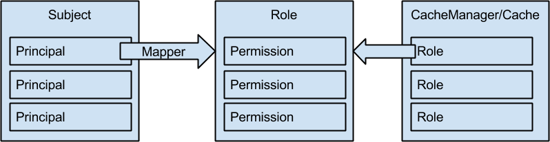

== Security

Security within Infinispan is implemented at several layers:

* within the core library, to provide coarse-grained access control to CacheManagers, Caches and data
* over remote protocols, to obtain credentials from remote clients and to secure the transport using encryption
* between nodes in a cluster, so that only authorized nodes can join and to secure the transport using encryption

In order to maximize compatibility and integration, Infinispan uses widespread security standards where possible and appropriate, such as X.509 certificates, SSL/TLS encryption and Kerberos/GSSAPI.
Also, to avoid pulling in any external dependencies and to increase the ease of integration with third party libraries and containers, the implementation makes use of any facilities provided by the 
standard Java security libraries (JAAS, JSSE, JCA, JCE, SASL, etc).
For this reason, the Infinispan core library only provides interfaces and a set of basic implementations.

== Embedded Security
Applications interact with Infinispan using its API within the same JVM. The two main components which are exposed by the Infinispan API are CacheManagers and Caches. If an application wants to interact with a secured CacheManager and Cache, it should provide an identity which Infinispan’s security layer will validate against a set of required roles and permissions. If the identity provided by the user application has sufficient permissions, then access will be granted, otherwise an exception indicating a security violation will be thrown. The identity is represented by the javax.security.auth.Subject class which is a wrapper around multiple Principals, e.g. a user and all the groups it belongs to. Since the Principal name is dependent on the owning system (e.g. a Distinguished Name in LDAP), Infinispan needs to be able to map Principal names to roles.
Roles, in turn, represent one or more permissions. The following diagram shows the relationship between the various elements:

.Roles/Permissions mapping 

 
=== Embedded Permissions

Access to a cache manager or a cache is controlled by using a list of required permissions. Permissions are concerned with the type of action that is performed on one of the above entities and not with the type of data being manipulated. Some of these permissions can be narrowed to specifically named entities, where applicable (e.g. a named cache). Depending on the type of entity, there are different types of permission available:

==== Cache Manager permissions
* CONFIGURATION (defineConfiguration): whether a new cache configuration can be defined
* LISTEN (addListener): whether listeners can be registered against a cache manager
* LIFECYCLE (stop): whether the cache manager can be stopped
* ALL: a convenience permission which includes all of the above

==== Cache permissions
* READ (get, contains): whether entries can be retrieved from the cache
* WRITE (put, putIfAbsent, replace, remove, evict): whether data can be written/replaced/removed/evicted from the cache
* EXEC (distexec, mapreduce): whether code execution can be run against the cache
* LISTEN (addListener): whether listeners can be registered against a cache
* BULK_READ (keySet, values, entrySet, query): whether bulk retrieve operations can be executed
* BULK_WRITE (clear, putAll): whether bulk write operations can be executed
* LIFECYCLE (start, stop): whether a cache can be started / stopped
* ADMIN (getVersion, addInterceptor*, removeInterceptor, getInterceptorChain, getEvictionManager, getComponentRegistry, getDistributionManager, getAuthorizationManager, evict, getRpcManager, getCacheConfiguration, getCacheManager, getInvocationContextContainer, setAvailability, getDataContainer, getStats, getXAResource): whether access to the underlying components/internal structures is allowed
* ALL: a convenience permission which includes all of the above
* ALL_READ: combines READ and BULK_READ
* ALL_WRITE: combines WRITE and BULK_WRITE

Some permissions might need to be combined with others in order to be useful. For example, suppose you want to allow only "supervisors" to be able to run map/reduce jobs, while "standard" users can only perform puts and gets, you would define the following mappings:

[source,xml]
----
<role name="standard" permission="READ WRITE" />
<role name="supervisors" permission="READ WRITE EXEC BULK"/>
----

=== Embedded API
When a DefaultCacheManager has been constructed with security enabled using either the programmatic or declarative configuration, it returns a SecureCache which will check the security context before invoking any operations on the underlying caches. A SecureCache also makes sure that applications cannot retrieve lower-level insecure objects (such as DataContainer).
In Java, executing code with a specific identity usually means wrapping the code to be executed within a PrivilegedAction:

[source,java]
----
import org.infinispan.security.Security;

Security.doAs(subject, new PrivilegedExceptionAction<Void>() {
public Void run() throws Exception {
    cache.put("key", "value");
}
});
----

If you are using Java 8, the above call can be simplified to:

[source,java]
----
Security.doAs(mySubject, PrivilegedAction<String>() -> cache.put("key", "value"));
----

Notice the use of +Security.doAs()+ in place of the typical +Subject.doAs()+. While in Infinispan you can use either, unless you really need to modify the AccessControlContext for reasons specific to your application's security model, using +Security.doAs()+ provides much better performance. If you need the current Subject, use the following:

[source,java]
----
Security.getSubject();
----

which will automatically retrieve the Subject either from the Infinispan's context or from the AccessControlContext.

Infinispan also fully supports running under a full-blown SecurityManager. The Infinispan distribution contains an example security.policy file which you should customize with the appropriate paths before supplying it to your JVM.

=== Embedded Configuration
There are two levels of configuration: global and per-cache. The global configuration defines the set of roles/permissions mappings while each cache can decide whether to enable authorization checks and the required roles.

.Programmatic
[source,java]
----
  GlobalConfigurationBuilder global = new GlobalConfigurationBuilder();
  global
     .security()
        .authorization()
           .principalRoleMapper(new IdentityRoleMapper())
           .role("admin")
              .permission(CachePermission.ALL)
           .role("supervisor")
              .permission(CachePermission.EXEC)
              .permission(CachePermission.READ)
              .permission(CachePermission.WRITE)
           .role("reader")
              .permission(CachePermission.READ);
  ConfigurationBuilder config = new ConfigurationBuilder();
  config
     .security()
        .enable()
        .authorization()
           .role("admin")
           .role("supervisor")
           .role("reader");
----

.Declarative
[source,xml]
----
<infinispan>
   <cache-container default-cache="secured">
      <security>
         <authorization enabled="true">
            <identity-role-mapper />
            <role name="admin" permissions="ALL" />
            <role name="reader" permissions="READ" />
            <role name="writer" permissions="WRITE" />
            <role name="supervisor" permissions="READ WRITE EXEC BULK"/>
         </authorization>
      </security>
      <local-cache name="secured">
         <security>
            <authorization roles="admin reader writer supervisor" />
         </security>
      </local-cache>
   </cache-container>

</infinispan>
----

==== Role Mappers

In order to convert the Principals in a Subject into a set of roles to be used when authorizing, a suitable +PrincipalRoleMapper+ must be specified in the global configuration. Infinispan comes with 3 mappers and also allows you to provide a custom one:

* IdentityRoleMapper (Java: +org.infinispan.security.impl.IdentityRoleMapper+, XML: +<identity-role-mapper />+): this mapper just uses the Principal name as the role name
* CommonNameRoleMapper (Java: +org.infinispan.security.impl.CommonRoleMapper+, XML: +<common-name-role-mapper />+): if the Principal name is a Distinguished Name (DN), this mapper extracts the Common Name (CN) and uses it as a role name. For example
the DN +cn=managers,ou=people,dc=example,dc=com+ will be mapped to the role +managers+
* ClusterRoleMapper (Java: +org.infinispan.security.impl.ClusterRoleMapper+ XML: +<cluster-role-mapper />+): a mapper which uses the ClusterRegistry to store principal to role mappings. This allows the use of the CLI's GRANT and DENY commands to add/remove roles to a principal.
* Custom role mappers (XML: +<custom-role-mapper class="a.b.c" />+): just supply the fully-qualified class name of an implementation of +org.infinispan.security.PrincipalRoleMapper+

== Security Audit

Infinispan offers a pluggable audit logger which tracks whether a cache or a cache manager operation was allowed or denied.
The audit logger is configured at the cache container authorization level:

.Programmatic
[source,java]
----
  GlobalConfigurationBuilder global = new GlobalConfigurationBuilder();
  global
     .authorization()
        .auditLogger(new LoggingAuditLogger());
----

.Declarative
[source,xml]
----
<infinispan>
   <cache-container default-cache="secured">
      <security>
         <authorization audit-logger="org.infinispan.security.impl.LoggingAuditLogger">
            ...
         </authorization>
      </security>
      ...
   </cache-container>
</infinispan>
----

In embedded mode the default audit logger is +org.infinispan.security.impl.NullAuditLogger+ which does nothing. Infinispan also comes with the +org.infinispan.security.impl.LoggingAuditLogger+ which outputs audit logs through the available logging framework (e.g. Log4J) at level TRACE and category AUDIT. These logs look like: 

----
[ALLOW|DENY] user READ cache[defaultCache]
----

Using an appropriate logging appender it is possible to send the AUDIT category either to a log file, a JMS queue, a database, etc.
The +user+ which is included in the log above is the name of the first non-+java.security.acl.Group+ principal in the Subject.

== Cluster security

JGroups can be configured so that nodes need to authenticate each other when joining / merging. The authentication uses SASL and is setup by adding the +SASL+ protocol to your JGroups XML configuration above the GMS protocol, as follows:

[source,xml]
----
<SASL mech="DIGEST-MD5"
    client_name="node_user"
    client_password="node_password"
    server_callback_handler_class="org.example.infinispan.security.JGroupsSaslServerCallbackHandler"
    client_callback_handler_class="org.example.infinispan.security.JGroupsSaslClientCallbackHandler" 
    sasl_props="com.sun.security.sasl.digest.realm=test_realm" /> 
----

In the above example, the SASL mech will be +DIGEST-MD5+. Each node will need to declare the user and password it will use when joining the cluster. The behaviour of a node differs depending on whether it is the coordinator or any other node. The coordinator acts as the SASL server, whereas joining/merging nodes act as SASL clients. Therefore two different CallbackHandlers are required, the +server_callback_handler_class+ will be used by the coordinator, and the +client_callback_handler_class+ will be used by the other nodes.
The +SASL+ protocol in JGroups is only concerned with the authentication process. If you wish to implement node authorization, you can do so within the server callback handler, by throwing an Exception. The following example shows how this can be done:

[source,java]
----
public class AuthorizingServerCallbackHandler implements CallbackHandler {

    @Override
    public void handle(Callback[] callbacks) throws IOException, UnsupportedCallbackException {
        for (Callback callback : callbacks) {
            ...
            if (callback instanceof AuthorizeCallback) {
                AuthorizeCallback acb = (AuthorizeCallback) callback;
                UserProfile user = UserManager.loadUser(acb.getAuthenticationID());
                if (!user.hasRole("myclusterrole")) {
                    throw new SecurityException("Unauthorized node " +user);
                }
            }
            ...
        }
    }
}
----
