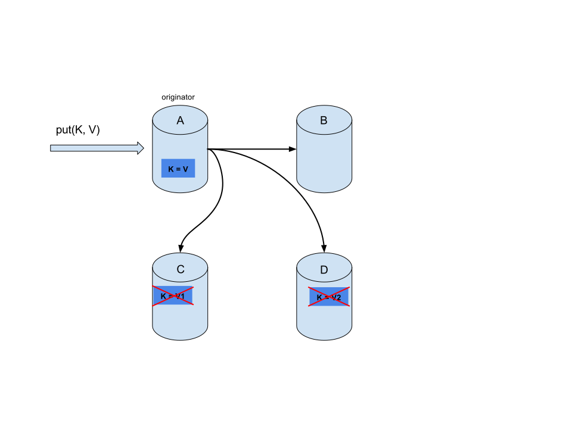
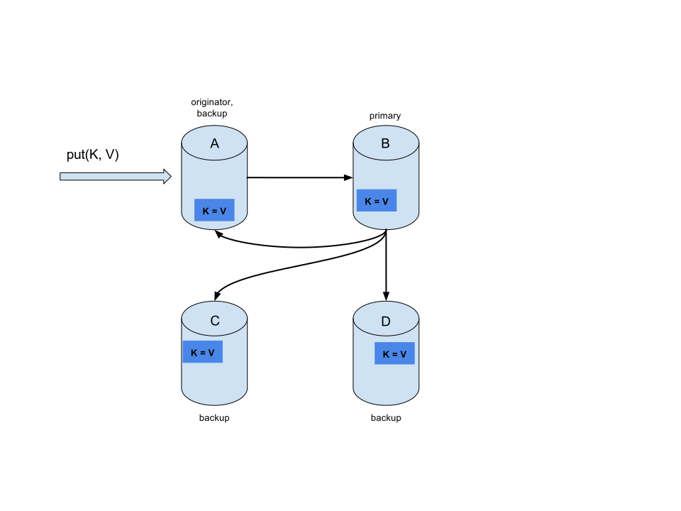
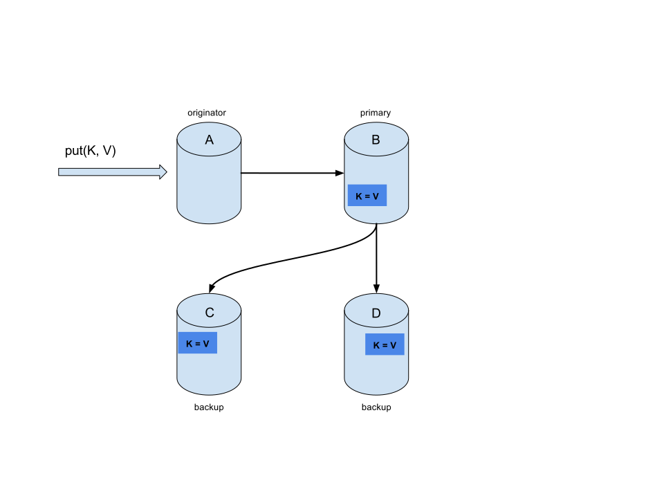
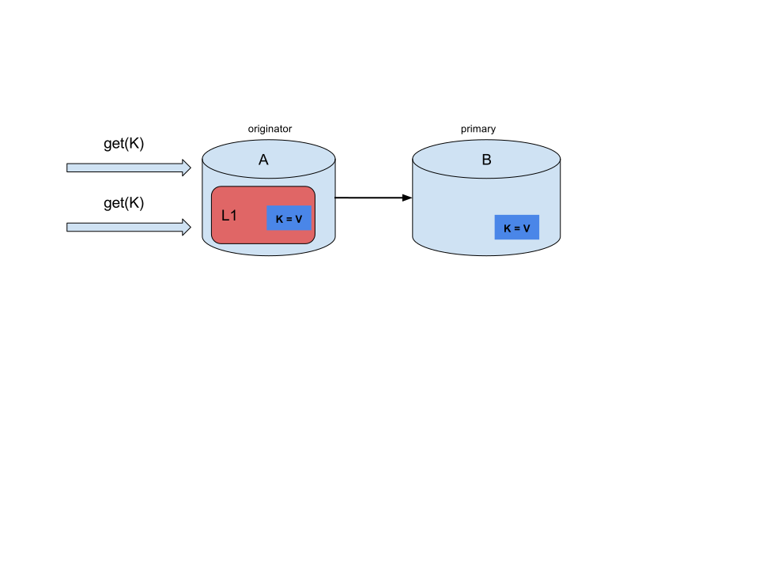

== Clustering
A cache manager can be configured to be either local (standalone) or clustered.
When clustered, manager instances use JGroups' discovery protocols to automatically
discover neighboring instances on the same local network and form a cluster.

Creating a local-only cache manager is trivial: just use the no-argument
`DefaultCacheManager` constructor, or supply the following XML configuration file.

[source,xml]
----
<infinispan/>
----

To start a clustered cache manager, you need to create a clustered configuration.

[source,java]
----
GlobalConfigurationBuilder gcb = GlobalConfigurationBuilder.defaultClusteredBuilder();
DefaultCacheManager manager = new DefaultCacheManager(gcb.build());
----

[source,xml]
----
<infinispan>
  <cache-container>
    <transport/>
  </cache-container>
</infinispan>
----

Individual caches can then be configured in different modes:

* *Local*: changes and reads are never replicated. This is the only mode available in
non-clustered cache managers.
* *Invalidation*: changes are not replicated, instead the key is invalidated on all
nodes; reads are local.
* *Replicated*: changes are replicated to all nodes, reads are always local.
* *Distributed*: changes are replicated to a fixed number of nodes, reads request the
value from at least one of the owner nodes.

=== Which cache mode should I use?

Which cache you should use depends on the qualities/guarantees you need for your data. The following table summarizes the most important ones:

[cols="20,^15,^15,^15,^15,^15,^15",options="header"]
|============================================================
|                  | Simple      | Local       | Invalidation | Replicated | Distributed | Scattered
| Clustered        | [red]*No*    | [red]*No*    | [green]*Yes*   | [green]*Yes* | [green]*Yes* | [green]*Yes*
| Read performance | [green]*Highest* +
(local) | [green]*High* +
(local) | [green]*High* +
(local) | [green]*High* +
(local) | [yellow]*Medium* +
(owners) | [yellow]*Medium* +
(primary)
| Write performance| [green]*Highest* +
(local) | [green]*High* +
(local) | [red]*Low* +
(all nodes, no data)| [red]*Lowest* +
(all nodes)| [yellow]*Medium* +
(owner nodes) | [yellow]*Higher* +
(single RPC)
| Capacity         | [red]*Single node*| [red]*Single node*| [red]*Single node*| [red]*Smallest node*| [green]*Cluster* +
stem:[(sum_(i=1)^"nodes""node_capacity")/"owners"] | [green]*Cluster* +
stem:[(sum_(i=1)^"nodes""node_capacity")/"2"]
| Availability     | [red]*Single node*| [red]*Single node*| [red]*Single node*| [green]*All nodes*| [yellow]*Owner nodes* | [yellow]*Owner nodes*
| Features         | [red]*No TX, persistence, indexing*| [green]*All* | [green]*All* | [green]*All* | [green]*All* | [yellow]*No TX*
|============================================================

=== Local Mode
While Infinispan is particularly interesting in clustered mode, it also offers a very
capable local mode.
In this mode, it acts as a simple, in-memory data cache similar to a `ConcurrentHashMap`.

But why would one use a local cache rather than a map?
Caches offer a lot of features over and above a simple map, including write-through and
write-behind to a persistent store, eviction of entries to prevent running out of memory,
and expiration.

Infinispan's `Cache` interface extends JDK's `ConcurrentMap` -- making migration from a
map to Infinispan trivial.

Infinispan caches also support transactions, either integrating with an existing
transaction manager or running a separate one.
Local caches transactions have two choices:

1. When to lock?
*Pessimistic locking* locks keys on a write operation or when the user calls
`AdvancedCache.lock(keys)` explicitly.
*Optimistic locking* only locks keys during the transaction commit, and instead it throws
a `WriteSkewCheckException` at commit time, if another transaction modified the same keys
after the current transaction read them.

2. Isolation level.
We support *read-committed* and *repeatable read*.

include::simple_cache.adoc[]

=== Invalidation Mode
In invalidation, the caches on different nodes do not actually share any data.
Instead, when a key is written to, the cache only aims to remove data that may be stale
from other nodes.
This cache mode only makes sense if you have another, permanent store for your data such
as a database and are only using Infinispan as an optimization in a read-heavy system,
to prevent hitting the database for every read.
If a cache is configured for invalidation, every time data is changed in a cache, other
caches in the cluster receive a message informing them that their data is now stale and
should be removed from memory and from any local store.

.Invalidation mode

Sometimes the application reads a value from the external store and wants to write it to
the local cache, without removing it from the other nodes.
To do this, it must call `Cache.putForExternalRead(key, value)` instead of
`Cache.put(key, value)`.

Invalidation mode can be used with a shared cache store.
A write operation will both update the shared store, and it would remove the stale values
from the other nodes' memory.
The benefit of this is twofold: network traffic is minimized as invalidation messages are
very small compared to replicating the entire value, and also other caches in the cluster
look up modified data in a lazy manner, only when needed.

NOTE: Never use invalidation mode with a *local* store.
The invalidation message will not remove entries in the local store, and some
nodes will keep seeing the stale value.

An invalidation cache can also be configured with a special cache loader, `ClusterLoader`.
When `ClusterLoader` is enabled, read operations that do not find the key on the local
node will request it from all the other nodes first, and store it in memory locally.
In certain situation it will store stale values, so only use it if you have a high
tolerance for stale values.

Invalidation mode can be synchronous or asynchronous.
When synchronous, a write blocks until all nodes in the cluster have evicted the stale
value. When asynchronous, the originator broadcasts invalidation messages but doesn't
wait for responses.
That means other nodes still see the stale value for a while after the write completed on
the originator.

Transactions can be used to batch the invalidation messages.
They won't behave like regular transactions though, as locks are only acquired on the
local node, and entries can be invalidated by other transactions at any time.

=== Replicated Mode
Entries written to a replicated cache on any node will be replicated to all other nodes
in the cluster, and can be retrieved locally from any node.
Replicated mode provides a quick and easy way to share state across a cluster,
however replication practically only performs well in small clusters (under 10 nodes),
due to the number of messages needed for a write scaling linearly with the cluster size.
Infinispan can be configured to use UDP multicast, which mitigates this problem to some
degree.

Each key has a primary owner, which serializes data container updates in order to
provide consistency.
To find more about how primary owners are assigned, please read the
<<key_ownership,Key Ownership>> section.

.Replicated mode

Replicated mode can be synchronous or asynchronous.

* Synchronous replication blocks the caller (e.g. on a `cache.put(key, value)`) until
the modifications have been replicated successfully to all the nodes in the cluster.
* Asynchronous replication performs replication in the background, and write operations
return immediately.
Asynchronous replication is not recommended, because communication errors, or errors
that happen on remote nodes are not reported to the caller.

If transactions are enabled, write operations are not replicated through the primary
owner.

* With pessimistic locking, each write triggers a lock message, which is
broadcast to all the nodes.
During transaction commit, the originator broadcasts a one-phase prepare message and an
unlock message (optional).
Either the one-phase prepare or the unlock message is fire-and-forget.

* With optimistic locking, the originator broadcasts a prepare message, a commit message,
and an unlock message (optional).
Again, either the one-phase prepare or the unlock message is fire-and-forget.

=== Distribution Mode
Distribution tries to keep a fixed number of copies of any entry in the cache,
configured as `numOwners`.
This allows the cache to scale linearly, storing more data as nodes are added to the
cluster.

As nodes join and leave the cluster, there will be times when a key has more or less than
`numOwners` copies.
In particular, if `numOwners` nodes leave in quick succession, some entries will be lost,
so we say that a distributed cache tolerates `numOwners - 1` node failures.

The number of copies represents a trade-off between performance and durability of data.
The more copies you maintain, the lower performance will be, but also the lower the risk
of losing data due to server or network failures.
Regardless of how many copies are maintained, distribution still scales linearly, and
this is key to Infinispan's scalability.

The owners of a key are split into one *primary owner*, which coordinates writes to the
key, and zero or more *backup owners*.
To find more about how primary and backup owners are assigned, please read the
<<key_ownership,Key Ownership>> section.

.Distributed mode

A read operation will request the value from the primary owner, but if it doesn't respond
in a reasonable amount of time, we request the value from the backup owners as well.
(The `infinispan.stagger.delay` system property, in milliseconds, controls the delay
between requests.)
A read operation may require `0` messages if the key is present in the local cache,
or up to `2 * numOwners` messages if all the owners are slow.

A write operation will also result in at most `2 * numOwners` messages: one message from
the originator to the primary owner, `numOwners - 1` messages from the primary to the
backups, and the corresponding ACK messages.

NOTE: Cache topology changes may cause retries and additional messages, both for reads
and for writes.

Just as replicated mode, distributed mode can also be synchronous or asynchronous.
And as in replicated mode, asynchronous replication is not recommended because it can
lose updates.
In addition to losing updates, asynchronous distributed caches can also see a stale value
when a thread writes to a key and then immediately reads the same key.

Transactional distributed caches use the same kinds of messages as transactional
replicated caches, except lock/prepare/commit/unlock messages are sent only to the
*affected nodes* (all the nodes that own at least one key affected by the transaction)
instead of being broadcast to all the nodes in the cluster.
As an optimization, if the transaction writes to a single key and the originator is the
primary owner of the key, lock messages are not replicated.

==== Read consistency
Even with synchronous replication, distributed caches are not linearizable.
(For transactional caches, we say they do not support serialization/snapshot isolation.)
We can have one thread doing a single put:

[source,java]
----
cache.get(k) -> v1
cache.put(k, v2)
cache.get(k) -> v2
----

But another thread might see the values in a different order:

[source,java]
----
cache.get(k) -> v2
cache.get(k) -> v1
----

The reason is that read can return the value from *any* owner, depending on how fast
the primary owner replies.
The write is not atomic across all the owners -- in fact, the primary commits the update
only after it receives a confirmation from the backup.
While the primary is waiting for the confirmation message from the backup, reads from the
backup will see the new value, but reads from the primary will see the old one.

[[key_ownership]]
==== Key ownership
Distributed caches split entries into a fixed number of segments, and assign each segment
to a list of owner nodes.
Replicated caches do the same, except every node is an owner.

The first node in the owners list is called the *primary owner*, and the others are
called *backup owners*.
The segment ownership table is broadcast to every node when the cache topology changes
(i.e. a node joins or leaves the cluster).
This way, a node can compute the location of a key itself, without resorting to multicast
requests or maintaining per-key metadata.

The number of segments is configurable (`numSegments`), but it cannot be changed without
restarting the cluster.
The mapping of keys to segments is also fixed -- a key must map to the same segment,
regardless of how the topology of the cluster changes.
The key-to-segment mapping can be customized by configuring a
link:https://docs.jboss.org/infinispan/{infinispanversion}/apidocs/org/infinispan/distribution/ch/KeyPartitioner.html[KeyPartitioner]
or by using the <<grouping,Grouping API>>.

There is no hard rule on how segments must be mapped to owners, but the goal is to
balance the number of segments allocated to each node and at the same time minimize the
number of segments that have to move after a node joins or leaves the cluster.
The segment mapping is customizable, and in fact there are five implementations that
ship with Infinispan:

SyncConsistentHashFactory::
  An algorithm based on
  link:http://en.wikipedia.org/wiki/Consistent_hashing[consistent hashing].
  It always assigns a key to the same node in every cache as long as the cluster is
  symmetric (i.e. all caches run on all nodes).
  It does have some weaknesses: the load distribution is a bit uneven, and it also moves
  more segments than strictly necessary on a join or leave.
  Selected by default when server hinting is disabled.
TopologyAwareSyncConsistentHashFactory::
  Similar to `SyncConsistentHashFactory`, but adapted for
  <<ServerHinting, Server Hinting>>.
  Selected by default when server hinting is enabled.
DefaultConsistentHashFactory::
  It achieves a more even distribution than `SyncConsistentHashFactory`, but it has one
  disadvantage: the mapping of segments to nodes depends on the order in which caches
  joined the cluster, so a key's owners are not guaranteed to be the same in all the
  caches running in a cluster.
  Used to be the default from version 5.2 to version 8.1 (with server hinting disabled).
TopologyAwareConsistentHashFactory::
  Similar to _DefaultConsistentHashFactory_, but adapted for
  <<ServerHinting, Server Hinting>>.
  Used to be the default with from version 5.2 to version 8.1 (with server hinting enabled).
ReplicatedConsistentHashFactory::
  This algorithm is used internally to implement replicated caches.
  Users should never select this explicitly in a distributed cache.

===== Capacity Factors
Capacity factors are another way to customize the mapping of segments to nodes.
The nodes in a cluster are not always identical.
If a node has 2x the memory of a "regular" node, configuring it with a `capacityFactor`
of `2` tells Infinispan to allocate 2x segments to that node.
The capacity factor can be any non-negative number, and the hashing algorithm will try to
assign to each node a load weighted by its capacity factor (both as a primary owner and as
a backup owner).

One interesting use case is nodes with a capacity factor of `0`.
This could be useful when some nodes are too short-lived to be useful as data owners, but
they can't use HotRod (or other remote protocols) because they need transactions.
With cross-site replication as well, the "site master" should only deal with forwarding
commands between sites and shouldn't handle user requests, so it makes sense to configure
it with a capacity factor of `0`.

===== Hashing Configuration
This is how you configure hashing declaratively, via XML:

[source,xml]
----
   <distributed-cache name="distributedCache" owners="2" segments="100" capacity-factor="2" />
----

And this is how you can configure it programmatically, in Java:
[source,java]
----
Configuration c = new ConfigurationBuilder()
   .clustering()
      .cacheMode(CacheMode.DIST_SYNC)
      .hash()
         .numOwners(2)
         .numSegments(100)
         .capacityFactor(2)
   .build();
----

==== Initial cluster size
Infinispan's very dynamic nature in handling topology changes (i.e. nodes being added / removed
at runtime) means that, normally, a node doesn't wait for the presence of other nodes before
starting. While this is very flexible, it might not be suitable for applications which require
a specific number of nodes to join the cluster before caches are started. For this reason,
you can specify how many nodes should have joined the cluster before proceeding with cache
initialization. To do this, use the `initialClusterSize` and `initialClusterTimeout` transport
properties. The declarative XML configuration:

[source,xml]
----
   <transport initial-cluster-size="4" initial-cluster-timeout="30000" />
----

The programmatic Java configuration:
[source,java]
----
GlobalConfiguration global = new GlobalConfigurationBuilder()
   .transport()
       .initialClusterSize(4)
       .initialClusterTimeout(30000)
   .build();
----

The above configuration will wait for _4_ nodes to join the cluster before initialization. If
the initial nodes do not appear within the specified timeout, the cache manager will fail to
start.

==== L1 Caching
When L1 is enabled, a node will keep the result of remote reads locally for a short
period of time (configurable, 10 minutes by default), and repeated lookups will return
the local L1 value instead of asking the owners again.

.L1 caching

L1 caching is not free though.
Enabling it comes at a cost, and this cost is that every entry update must broadcast an
invalidation message to all the nodes.
L1 entries can be evicted just like any other entry when the the cache is configured
with a maximum size.
Enabling L1 will improve performance for repeated reads of non-local keys, but it will
slow down writes and it will increase memory consumption to some degree.

Is L1 caching right for you?
The correct approach is to benchmark your application with and without L1 enabled and see
what works best for your access pattern.

[[ServerHinting]]
==== Server Hinting
The following topology hints can be specified:

Machine::
  This is probably the most useful, when multiple JVM instances run on the
  same node, or even when multiple virtual machines run on the same physical machine.
Rack::
  In larger clusters, nodes located on the same rack are more likely to experience a
  hardware or network failure at the same time.
Site::
  Some clusters may have nodes in multiple physical locations for extra resilience.
  Note that <<CrossSiteReplication, Cross site replication>> is another alternative for
  clusters that need to span two or more data centres.

All of the above are optional.
When provided, the distribution algorithm will try to spread the ownership of each
segment across as many sites, racks, and machines (in this order) as possible.

===== Configuration
The hints are configured at transport level:

[source,xml]
----
<transport
    cluster="MyCluster"
    machine="LinuxServer01"
    rack="Rack01"
    site="US-WestCoast" />
----

[[KeyAffinityService]]
====  Key affinity service
In a distributed cache, a key is allocated to a list of nodes with an opaque algorithm.
There is no easy way to reverse the computation and generate a key that maps to a
particular node.
However, we can generate a sequence of (pseudo-)random keys, see what their primary
owner is, and hand them out to the application when it needs a key mapping to a
particular node.

===== API
Following code snippet depicts how a reference to this service can be obtained and used.

[source,java]
----
// 1. Obtain a reference to a cache
Cache cache = ...
Address address = cache.getCacheManager().getAddress();

// 2. Create the affinity service
KeyAffinityService keyAffinityService = KeyAffinityServiceFactory.newLocalKeyAffinityService(
      cache,
      new RndKeyGenerator(),
      Executors.newSingleThreadExecutor(),
      100);

// 3. Obtain a key for which the local node is the primary owner
Object localKey = keyAffinityService.getKeyForAddress(address);

// 4. Insert the key in the cache
cache.put(localKey, "yourValue");
----

The service is started at step 2: after this point it uses the supplied _Executor_ to
generate and queue keys.
At step 3, we obtain a key from the service, and at step 4 we use it.

===== Lifecycle
`KeyAffinityService` extends `Lifecycle`, which allows stopping and (re)starting it:

[source,java]
----
public interface Lifecycle {
   void start();
   void stop();
}
----

The service is instantiated through `KeyAffinityServiceFactory`. All the factory methods
have an `Executor` parameter, that is used for asynchronous key generation (so that it
won't happen in the caller's thread).
It is the user's responsibility to handle the shutdown of this `Executor`.

The `KeyAffinityService`, once started, needs to be explicitly stopped. This stops the
background key generation and releases other held resources.

The only situation in which `KeyAffinityService` stops by itself is when the cache manager
with which it was registered is shutdown.

===== Topology changes
When the cache topology changes (i.e. nodes join or leave the cluster), the ownership of
the keys generated by the `KeyAffinityService` might change.
The key affinity service keep tracks of these topology changes and doesn't return keys
that would currently map to a different node, but it won't do anything about keys
generated earlier.

As such, applications should treat `KeyAffinityService` purely as an optimization, and
they should not rely on the location of a generated key for correctness.

In particular, applications should not rely on keys generated by `KeyAffinityService`
for the same address to always be located together.
Collocation of keys is only provided by the <<grouping, Grouping API>>.

[[grouping]]
====  The Grouping API
Complementary to <<KeyAffinityService, Key affinity service>> and similar to
link:{javadocroot}/org/infinispan/atomic/AtomicMap.html[AtomicMap],
the grouping API allows you to co-locate a group of entries on the same nodes, but without
being able to select the actual nodes.

===== How does it work?
By default, the segment of a key is computed using the key's `hashCode()`.
If you use the grouping API, Infinispan will compute the segment of the group and use
that as the segment of the key.
See the <<key_ownership, Key Ownership>> section for more details on how segments are
then mapped to nodes.

When the group API is in use, it is important that every node can still compute the
owners of every key without contacting other nodes.
For this reason, the group cannot be specified manually.
The group can either be intrinsic to the entry (generated by the key class) or extrinsic
(generated by an external function).

===== How do I use the grouping API?
First, you must enable groups. If you are configuring Infinispan programmatically, then call:

[source,java]
----
Configuration c = new ConfigurationBuilder()
   .clustering().hash().groups().enabled()
   .build();
----

Or, if you are using XML:

[source,xml]
----
<distributed-cache>
   <groups enabled="true"/>
</distributed-cache>
----

If you have control of the key class (you can alter the class definition, it's not part of
an unmodifiable library), then we recommend using an intrinsic group.
The intrinsic group is specified by adding the `@Group` annotation to a method.
Let's take a look at an example:

[source,java]
----
class User {
   ...
   String office;
   ...

   public int hashCode() {
      // Defines the hash for the key, normally used to determine location
      ...
   }

   // Override the location by specifying a group
   // All keys in the same group end up with the same owners
   @Group
   public String getOffice() {
      return office;
   }
   }
}
----

NOTE: The group method must return a `String`

If you don't have control over the key class, or the determination of the group is an
orthogonal concern to the key class, we recommend using an extrinsic group.
An extrinsic group is specified by implementing the `Grouper` interface.

[source,java]
----
public interface Grouper<T> {
    String computeGroup(T key, String group);

    Class<T> getKeyType();
}
----

If multiple `Grouper` classes are configured for the same key type, all of them will be
called, receiving the value computed by the previous one.
If the key class also has a `@Group` annotation, the first `Grouper` will receive the
group computed by the annotated method.
This allows you even greater control over the group when using an intrinsic group.
Let's take a look at an example `Grouper` implementation:

[source,java]
----
public class KXGrouper implements Grouper<String> {

   // The pattern requires a String key, of length 2, where the first character is
   // "k" and the second character is a digit. We take that digit, and perform
   // modular arithmetic on it to assign it to group "0" or group "1".
   private static Pattern kPattern = Pattern.compile("(^k)(<a>\\d</a>)$");

   public String computeGroup(String key, String group) {
      Matcher matcher = kPattern.matcher(key);
      if (matcher.matches()) {
         String g = Integer.parseInt(matcher.group(2)) % 2 + "";
         return g;
      } else {
         return null;
      }
   }

   public Class<String> getKeyType() {
      return String.class;
   }
}
----

`Grouper` implementations must be registered explicitly in the cache configuration.
If you are configuring Infinispan programmatically:

[source,java]
----
Configuration c = new ConfigurationBuilder()
   .clustering().hash().groups().enabled().addGrouper(new KXGrouper())
   .build();
----

Or, if you are using XML:

[source,xml]
----
<distributed-cache>
   <groups enabled="true">
      <grouper class="com.acme.KXGrouper" />
   </groups>
</distributed-cache>
----

===== Advanced Interface

`AdvancedCache` has two group-specific methods:

link:http://docs.jboss.org/infinispan/{infinispanVersion}/apidocs/org/infinispan/AdvancedCache.html#getGroup-java.lang.String-[getGroup(groupName)]::
  Retrieves all keys in the cache that belong to a group.
link:http://docs.jboss.org/infinispan/{infinispanVersion}/apidocs/org/infinispan/AdvancedCache.html#removeGroup-java.lang.String-[removeGroup(groupName)]::
  Removes all the keys in the cache that belong to a group.

Both methods iterate over the entire data container and store (if present), so they can
be slow when a cache contains lots of small groups.

NOTE: This interface is available since Infinispan 7.0.0.

=== Scattered Mode

Scattered mode is very similar to Distribution Mode as it allows linear scaling of the cluster.
It allows single node failure by maintaining two copies of the data (as Distribution Mode with numOwners=2).
Unlike Distributed, the location of data is not fixed; while we use the same Consistent Hash algorithm
to locate the primary owner, the backup copy is stored on the node that wrote the data last time.
When the write originates on the primary owner, backup copy is stored on any other node (the exact location
of this copy is not important).

This has the advantage of single RPC for any write (Distribution Mode requires one or two RPCs), but reads
have to always target the primary owner. That results in faster writes but possibly slower reads, and therefore this
mode is more suitable for write-intensive applications.

Storing multiple backup copies also results in slightly higher memory consumption. In order to remove out-of-date
backup copies, invalidation messages are broadcast in the cluster, which generates some overhead. This makes
scattered mode less performant in very big clusters (this behaviour might be optimized in the future).

When a node crashes, the primary copy may be lost. Therefore, the cluster has to reconcile the backups
and find out the last written backup copy. This process results in more network traffic during state transfer.

Since the writer of data is also a backup, even if we specify machine/rack/site ids on the transport level the cluster
cannot be resilient to more than one failure on the same machine/rack/site.

Currently it is not possible to use scattered mode in transactional cache. Asynchronous replication
is not supported either; use asynchronous Cache API instead. Functional commands are not implemented neither
but these are expected to be added soon.

The cache is configured in a similar way as the other cache modes, here is an example of declarative configuration:

[source,xml]
----
   <scattered-cache name="scatteredCache" />
----

And this is how you can configure it programmatically:
[source,java]
----
Configuration c = new ConfigurationBuilder()
   .clustering().cacheMode(CacheMode.SCATTERED_SYNC)
   .build();
----

Scattered mode is not exposed in the server configuration as the server is usually accessed through the Hot Rod
protocol. The protocol automatically selects primary owner for the writes and therefore the write (in distributed
mode with two owner) requires single RPC inside the cluster, too. Therefore, scattered cache would not bring
the performance benefit.

===  Asynchronous Options

==== Asynchronous Communications
All clustered cache modes can be configured to use asynchronous communications with the
link:http://docs.jboss.org/infinispan/{infinispanversion}/configdocs/infinispan-config-{infinispanversion}.html[`mode="ASYNC"`]
attribute on the `<replicated-cache/>`, `<distributed-cache>`, or `<invalidation-cache/>`
element.

With asynchronous communications, the originator node does not receive any
acknowledgement from the other nodes about the status of the operation, so there is no
way to check if it succeeded on other nodes.

We do not recommend asynchronous communications in general, as they can cause
inconsistencies in the data, and the results are hard to reason about.
Nevertheless, sometimes speed is more important than consistency, and the option is
available for those cases.

==== Asynchronous API
The <<_asynchronous_api, Asynchronous API>> allows you to use synchronous communications,
but without blocking the user thread.

There is one caveat:
The asynchronous operations do NOT preserve the program order.
If a thread calls `cache.putAsync(k, v1); cache.putAsync(k, v2)`, the final value of `k`
may be either `v1` or `v2`.
The advantage over using asynchronous communications is that the final value can't be
`v1` on one node and `v2` on another.

NOTE: Prior to version 9.0, the asynchronous API was emulated by borrowing a thread from
an internal thread pool and running a blocking operation on that thread.

==== Return Values
Because the `Cache` interface extends `java.util.Map`, write methods like
`put(key, value)` and `remove(key)` return the previous value by default.

In some cases, the return value may not be correct:

1. When using `AdvancedCache.withFlags()` with `Flag.IGNORE_RETURN_VALUE`,
`Flag.SKIP_REMOTE_LOOKUP`, or `Flag.SKIP_CACHE_LOAD`.
2. When the cache is configured with `unreliable-return-values="true"`.
3. When using asynchronous communications.
4. When there are multiple concurrent writes to the same key, and the cache topology
changes.
The topology change will make Infinispan retry the write operations, and a retried
operation's return value is not reliable.

Transactional caches return the correct previous value in cases 3 and 4.
However, transactional caches also have a gotcha: in distributed mode, the
read-committed isolation level is implemented as repeatable-read.
That means this example of "double-checked locking" won't work:

[source,java]
----
Cache cache = ...
TransactionManager tm = ...

tm.begin();
try {
   Integer v1 = cache.get(k);
   // Increment the value
   Integer v2 = cache.put(k, v1 + 1);
   if (Objects.equals(v1, v2) {
      // success
   } else {
      // retry
   }
} finally {
  tm.commit();
}
----

The correct way to implement this is to use
`cache.getAdvancedCache().withFlags(Flag.FORCE_WRITE_LOCK).get(k)`.

In caches with optimistic locking writes can return a stale previous value as well, and
the only way protect against it is to enable write-skew checks and to catch
`WriteSkewException`.

=== Partition handling

An Infinispan cluster is built out of a number of nodes where data is stored. In order
not to lose data in the presence of node failures, Infinispan copies the same data -- cache
entry in Infinispan parlance -- over multiple nodes. This level of data redundancy is
configured through the `numOwners` configuration attribute and ensures that as long as
fewer than `numOwners` nodes crash simultaneously, Infinispan has a copy of the data
available.

However, there might be catastrophic situations in which more than `numOwners` nodes
disappear from the cluster:

Split brain:: Caused e.g. by a router crash, this splits the cluster in two or more
partitions, or sub-clusters that operate independently. In these circumstances,
multiple clients reading/writing from different partitions see different versions
of the same cache entry, which for many application is problematic. Note there are
ways to alleviate the possibility for the split brain to happen, such as redundant networks or
 link:https://access.redhat.com/documentation/en-US/Red_Hat_Enterprise_Linux/6/html/Deployment_Guide/s2-networkscripts-interfaces-chan.html[IP bonding].
 These only reduce the window of time for the problem to occur, though.
`numOwners` nodes crash in sequence:: When at least `numOwners` nodes crash in rapid
succession and Infinispan does not have the time to properly rebalance its state between
crashes, the result is partial data loss.

The partition handling functionality discussed in this section allows the user to configure what operations can be
performed on a cache in the event of a split brain occurring. Infinispan provides multiple partition handling strategies,
which in terms of Brewer's link:http://en.wikipedia.org/wiki/CAP_theorem[CAP theorem] determine whether availability or
consistency is sacrificed in the presence of partition(s). Below is a list of the provided strategies:

|===
| Strategy | Description | CAP

| DENY_READ_WRITES
| If the partition does not have all owners for a given segment, both reads and writes are denied for all keys in that segment.
| Consistency

| ALLOW_READS
| Allows reads for a given key if it exists in this partition, but only allows writes if this partition contains all owners of a segment.
| Availability

| ALLOW_READ_WRITES
| Allow entries on each partition to diverge, with conflicts resolved during merge.
| Availability
|===

The requirements of your application should determine which strategy is appropriate. For example, DENY_READ_WRITES is more
appropriate for applications that have high consistency requirements; i.e. when the data read from the system must be accurate.
Whereas if Infinispan is used as a best-effort cache, partitions maybe perfectly tolerable and the ALLOW_READ_WRITES might
be more appropriate as it favours availability over consistency.

The following sections describe how Infinispan handles <<split-brain,split brain>> and
<<successive-node-failures,successive failures>> for each of the partition handling strategies. This is followed by a section
describing how Infinispan allows for automatic conflict resolution upon partition merges via <<merge-policies, merge policies>>.
Finally, we provide a section describing <<partition-handling-configuration, how to configure partition handling strategies and merge policies>>.

[[split-brain]]
==== Split brain

In a split brain situation, each network partition will install its own
JGroups view, removing the nodes from the other partition(s).
We don't have a direct way of determining whether the has been split into
two or more partitions, since the partitions are unaware of each other.
Instead, we assume the cluster has split when one or more nodes
disappear from the JGroups cluster without sending an explicit leave message.

===== Split Strategies

In this section, we detail how each partition handling strategy behaves in the event of split brain occurring.

====== ALLOW_READ_WRITES
Each partition continues to function as an independent cluster, with all partitions remaining in AVAILABLE mode.
This means that each partition may only see a part of the data, and each partition could write conflicting updates in
the cache. During a partition merge these conflicts are automatically resolved by utilising the <<conflict-manager, ConflictManager>>
and the configured <<merge-policies, EntryMergePolicy>>.

====== DENY_READ_WRITES
When a split is detected each partition does not start a rebalance immediately, but first it checks whether it should
enter *DEGRADED* mode instead:

- If at least one segment has lost all its owners (meaning at least
  _numOwners_ nodes left since the last rebalance ended), the partition enters
  DEGRADED mode.
- If the partition does not contain a simple majority of the nodes (floor(numNodes/2) + 1)
  in the _latest stable topology_, the partition also enters DEGRADED mode.
- Otherwise the partition keeps functioning normally, and it starts a rebalance.

The _stable topology_ is updated every time a rebalance operation ends and the coordinator determines
that another rebalance is not necessary.

These rules ensures that at most one partition stays in AVAILABLE mode, and
the other partitions enter DEGRADED mode.

When a partition is in DEGRADED mode, it only allows access to the keys that are wholly owned:

- Requests (reads and writes) for entries that have all the copies on nodes within
this partition are honoured.
- Requests for entries that are partially or totally owned by nodes that disappeared
are rejected with an `AvailabilityException`.

This guarantees that partitions cannot write different values for the same key
(cache is consistent), and also that one partition can not read keys that have been
updated in the other partitions (no stale data).

To exemplify, consider the initial cluster `M = {A, B, C, D}`, configured in distributed
mode with `numOwners = 2`.
Further on, consider three keys `k1`, `k2` and `k3` (that might exist in the cache or not)
such that `owners(k1) = {A,B}`, `owners(k2) = {B,C}` and `owners(k3) = {C,D}`.
Then the network splits in two partitions, `N1 = {A, B}` and `N2 = {C, D}`, they enter
DEGRADED mode and behave like this:

- on `N1`, `k1` is available for read/write, `k2` (partially owned) and `k3` (not owned)
are not available and accessing them results in an `AvailabilityException`
- on `N2`, `k1` and `k2` are not available for read/write, `k3` is available

A relevant aspect of the partition handling process is the fact that when a
split brain happens, the resulting partitions rely on the original segment
mapping (the one that existed before the split brain) in order
to calculate key ownership. So it doesn't matter if `k1`, `k2`, or `k3` already
existed cache or not, their availability is the same.

If at a further point in time the network heals and `N1` and `N2` partitions
merge back together into the initial cluster `M`, then `M` exits the degraded
mode and becomes fully available again. During this merge operation, because
`M` has once again become fully available, the <<conflict-manager, ConflictManager>>
and the configured <<merge-policies, EntryMergePolicy>> are used to check for
any conflicts that may have occurred in the interim period between the split
brain occurring and being detected.

As another example, the cluster could split in two partitions `O1 = {A, B, C}`
and `O2 = {D}`, partition `O1` will stay fully
available (rebalancing cache entries on the remaining members).
Partition `O2`, however, will detect a split and enter the degraded mode.
Since it doesn't have any fully owned keys, it will reject any read or write
operation with an `AvailabilityException`.

If afterwards partitions `O1` and `O2` merge back into `M`, then the <<conflict-manager, ConflictManager>>
attempts to resolve any conflicts and `D` once again becomes fully available.

====== ALLOW_READS
Partitions are handled in the same manner as DENY_READ_WRITES, except that when a partition is in DEGRADED mode read
operations on a partially owned key WILL not throw an AvailabilityException.

===== Current limitations
Two partitions could start up isolated, and as long as they don't merge they
can read and write inconsistent data. In the future, we will allow custom
availability strategies (e.g. check that a certain node is part of the cluster,
or check that an external machine is accessible) that could handle that
situation as well.

[[successive-node-failures]]
==== Successive nodes stopped
As mentioned in the previous section, Infinispan can't detect whether a node
left the JGroups view because of a process/machine crash, or because of a
network failure: whenever a node leaves the JGroups cluster abruptly, it is
assumed to be because of a network problem.

If the configured number of copies (`numOwners`) is greater than 1, the
cluster can remain available and will try to make new replicas of the data
on the crashed node. However, other nodes might crash during the rebalance process.
If more than `numOwners` nodes crash in a short interval of time, there is a
chance that some cache entries have disappeared from the cluster altogether.
In this case, with the DENY_READ_WRITES or ALLOW_READS strategy enabled, Infinispan
assumes (incorrectly) that there is a split brain and enters DEGRADED mode
as described in the split-brain section.

The administrator can also shut down more than `numOwners` nodes in
rapid succession, causing the loss of the data stored only on those nodes.
When the administrator shuts down a node gracefully, Infinispan knows that
the node can't come back.
However, the cluster doesn't keep track of how each node left, and the cache
still enters DEGRADED mode as if those nodes had crashed.

At this stage there is no way for the cluster to recover its state,
except stopping it and repopulating it on restart with the data from an
external source.
Clusters are expected to be configured with an appropriate `numOwners` in
order to avoid `numOwners` successive node failures, so this situation
should be pretty rare.
If the application can handle losing some of the data in the cache, the
administrator can force the availability mode back to AVAILABLE
<<partition-handling-monitoring,via JMX>>.

[[conflict-manager]]
==== Conflict Manager
The conflict manager is a tool that allows users to retrieve all stored replica values for a given key. In addition to
allowing users to process a stream of cache entries whose stored replicas have conflicting values. Furthermore, by
utilising implementations of the <<merge-policies, EntryMergePolicy>> interface it is possible for said conflicts to
be resolved automatically.

[[detecting_conflicts]]
===== Detecting Conflicts
Conflicts are detected by retrieving each of the stored values for a given key. The conflict manager retrieves the value stored
from each of the key's write owners defined by the current consistent hash. The .equals method of the stored values is
then used to determine whether all values are equal. If all values are equal then no conflicts exist for the key, otherwise
a conflict has occurred. Note that null values are returned if no entry exists on a given node, therefore we deem a conflict
to have occurred if both a null and non-null value exists for a given key.

[[merge-policies]]
===== Merge Policies
In the event of conflicts arising between one or more replicas of a given CacheEntry, it is necessary for a conflict
resolution algorithm to be defined, therefore we provide the
link:{javadocroot}/org/infinispan/conflict/EntryMergePolicy.html[EntryMergePolicy] interface. This interface consists
of a single method, "merge", whose returned CacheEntry is utilised as the "resolved" entry for a given key. When a non-null
CacheEntry is returned, this entries value is "put" to all replicas in the cache. However when the merge implementation
returns a null value, all replicas associated with the conflicting key are removed from the cache.

The merge method takes two parameters: the "preferredEntry" and "otherEntries". In the context of a partition merge,
the preferredEntry is the CacheEntry associated with the partition whose coordinator is conducting the merge (or if
multiple entries exist in this partition, it's the primary replica). However, in all other contexts, the preferredEntry
is simply the primary replica. The second parameter, "otherEntries" is simply a list of all other entries associated
with the key for which a conflict was detected.

NOTE: EntryMergePolicy::merge is only called when a conflict has been detected, it is not called if all CacheEntrys are
the same.

Currently Infinispan provides the following implementations of EntryMergePolicy:
|===
| Policy | Description

| MergePolicies.PREFERRED_ALWAYS
| Always utilise the "preferredEntry".

| MergePolicies.PREFERRED_NON_NULL
| Utilise the "preferredEntry" if it is non-null, otherwise utilise the first entry from "otherEntries".

| MergePolicies.REMOVE_ALL
| Always remove a key from the cache when a conflict is detected.
|===

==== Usage
During a partition merge the ConflictManager automatically attempts to resolve conflicts utilising the configured
EntryMergePolicy, however it is also possible to manually search for/resolve conflicts as required by your application.

The code below shows how to retrieve an EmbeddedCacheManager's ConflictManager, how to retrieve all versions of a given
key and how to check for conflicts across a given cache.

[source,java]
----
EmbeddedCacheManager manager = new DefaultCacheManager("example-config.xml");
Cache<Integer, String> cache = manager.getCache("testCache");
ConflictManager<Integer, String> crm = ConflictManagerFactory.get(cache.getAdvancedCache());

// Get All Versions of Key
Map<Address, InternalCacheValue<String>> versions = crm.getAllVersions(1);

// Process conflicts stream and perform some operation on the cache
Stream<Map<Address, InternalCacheEntry<Integer, String>>> stream = crm.getConflicts();
stream.forEach(map -> {
   CacheEntry<Object, Object> entry = map.values().iterator().next();
   Object conflictKey = entry.getKey();
   cache.remove(conflictKey);
});

// Detect and then resolve conflicts using the configured EntryMergePolicy
crm.resolveConflicts();

// Detect and then resolve conflicts using the passed EntryMergePolicy instance
crm.resolveConflicts((preferredEntry, otherEntries) -> preferredEntry);
----

NOTE: Although the ConflictManager::getConflicts stream is processed per entry, the underlying spliterator is in
fact lazily-loading cache entries on a per segment basis.

[[partition-handling-configuration]]
==== Configuring partition handling
Unless the cache is distributed or replicated, partition handling configuration is ignored. The default partition
handling strategy is ALLOW_READ_WRITES and the default EntryMergePolicy is MergePolicies::PREFERRED_ALWAYS.

[source,xml]
----
<distributed-cache name="the-default-cache">
   <partition-handling when-split="ALLOW_READ_WRITES" merge-policy="PREFERRED_NON_NULL"/>
</distributed-cache>
----

The same can be achieved programmatically:
[source,java]
----
ConfigurationBuilder dcc = new ConfigurationBuilder();
dcc.clustering().partitionHandling()
                    .whenSplit(PartitionHandling.ALLOW_READ_WRITES)
                    .mergePolicy(MergePolicies.PREFERRED_ALWAYS);
----

It's also possible to provide custom implementations of the EntryMergePolicy:

[source,xml]
----
<distributed-cache name="the-default-cache">
   <partition-handling when-split="ALLOW_READ_WRITES" merge-policy="org.example.CustomMergePolicy"/>
</distributed-cache>
----

[source,java]
----
ConfigurationBuilder dcc = new ConfigurationBuilder();
dcc.clustering().partitionHandling()
                    .whenSplit(PartitionHandling.ALLOW_READ_WRITES)
                    .mergePolicy(new CustomMergePolicy());
----

[[partition-handling-monitoring]]
==== Monitoring and administration

The availability mode of a cache is exposed in JMX as an attribute in the
link:{javadocroot}/jmxComponents.html#Cache[Cache MBean].
The attribute is writable, allowing an administrator to forcefully migrate
a cache from DEGRADED mode back to AVAILABLE (at the cost of
consistency).

The availability mode is also accessible via the
link:{javadocroot}/org/infinispan/AdvancedCache.html[AdvancedCache]
interface:

[source,java]
----
AdvancedCache ac = cache.getAdvancedCache();

// Read the availability
boolean available = ac.getAvailability() == AvailabilityMode.AVAILABLE;

// Change the availability
if (!available) {
   ac.setAvailability(AvailabilityMode.AVAILABLE);
}
----
