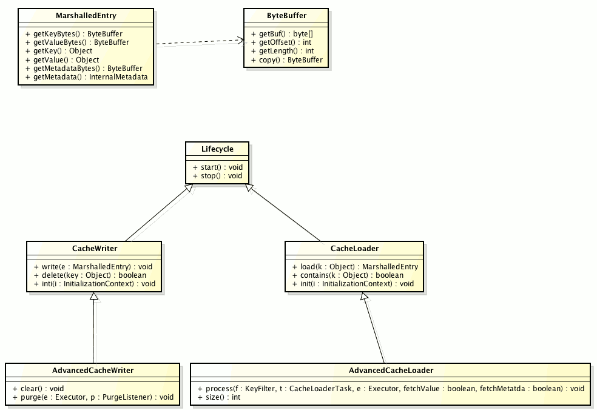

==  Persistence
Persistence allows configuring external (persistent) storage engines complementary to the default in memory storage offered by Infinispan.
An external persistent storage might be useful for several reasons:

* Increased Durability. Memory is volatile, so a cache store could increase the life-span of the information store in the cache.

* Write-through. Interpose Infinispan as a caching layer between an application and a (custom) external storage engine.

* Overflow Data. By using eviction and passivation, one can store only the "hot" data in memory and overflow the data that is less frequently used to disk.

The integration with the persistent store is done through the following SPI: CacheLoader, CacheWriter, AdvancedCacheLoader and AdvancedCacheWriter (discussed in the following sections).

These SPIs allow for the following features:

* Alignment with link:http://jcp.org/en/jsr/detail?id=107[JSR-107]. The link:{javadocroot}/org/infinispan/persistence/spi/CacheWriter.html[CacheWriter] and link:{javadocroot}/org/infinispan/persistence/spi/CacheLoader.html[CacheLoader] interface are similar to the the loader and writer in JSR 107. This should considerably help writing portable stores across JCache compliant vendors.

* Simplified Transaction Integration. All necessary locking is handled by Infinispan automatically and implementations don’t have to be concerned with coordinating concurrent access to the store. Even though concurrent writes on the same key are not going to happen (depending locking mode in use), implementors should expect operations on the store to happen from multiple/different threads and code the implementation accordingly.

* Parallel Iteration. It is now possible to iterate over entries in the store with multiple threads in parallel.

* Reduced Serialization. This translates in less CPU usage. The new API exposes the stored entries in serialized format. If an entry is fetched from persistent storage for the sole purpose of being sent remotely, we no longer need to deserialize it (when reading from the store) and serialize it back (when writing to the wire). Now we can write to the wire the serialized format as read from the storage directly.

=== Configuration
Stores (readers and/or writers) can be configured in a chain. Cache read operation looks at all of the specified `CacheLoader` s, in the order they are configured, until it finds a valid and non-null element of data. When performing writes all cache `CacheWriter` s are written to, except if the `ignoreModifications` element has been set to true for a specific cache writer.

.Implementing both a CacheWriter and CacheLoader
IMPORTANT: it is possible and recommended for a store provider to implement both the `CacheWriter` and the `CacheLoader` interface. The stores that do this are considered both for reading and writing(assuming `read-only=false`) data.

[source,xml]
----
This is the configuration of a custom(not shipped with infinispan) store:
   <local-cache name="myCustomStore">
      <persistence passivation="false">
         <store
            class="org.acme.CustomStore"
            fetch-state="false" preload="true" shared="false"
            purge="true" read-only="false" singleton="false">

            <write-behind modification-queue-size="123" thread-pool-size="23" />

            <property name="myProp">${system.property}</property>
         </store>
      </persistence>
   </local-cache>

----

Explanation of the configuration options:

* `passivation` (false by default) has a significant impact on how Infinispan interacts with the loaders, and is discussed in the <<cache-passivation,Cache Passivation>> section.

* `class` defines the class of the store and must implement CacheLoader, CacheWriter or both

* `fetch-state` (false by default) determines whether or not to fetch the persistent state of a cache when joining a cluster. The aim here is to take the persistent state of a cache and apply it to the local cache store of the joining node. Fetch persistent state is ignored if a cache store is configured to be shared, since they access the same data. Only one configured cache loader may set this property to true; if more than one cache loader does so, a configuration exception will be thrown when starting your cache service.

* `preload` (false by default) if true, when the cache starts, data stored in the cache loader will be pre-loaded into memory. This is particularly useful when data in the cache loader is needed immediately after startup and you want to avoid cache operations being delayed as a result of loading this data lazily. Can be used to provide a 'warm-cache' on startup, however there is a performance penalty as startup time is affected by this process. Note that preloading is done in a local fashion, so any data loaded is only stored locally in the node. No replication or distribution of the preloaded data happens. Also, Infinispan only preloads up to the maximum configured number of entries in <<eviction_anchor,eviction>>.

* `shared` (false by default) indicates that the cache loader is shared among different cache instances, for example where all instances in a cluster use the same JDBC settings to talk to the same remote, shared database. Setting this to true prevents repeated and unnecessary writes of the same data to the cache loader by different cache instances.

* `purge` (false by default) empties the specified cache loader (if `read-only` is false) when the cache loader starts up.

* `read-only` (false by default) prevents new data to be persisted to the store.

* `max-batch-size` (#{AbstractStore-maxBatchSize} by default) The maximum size of a batch to be inserted/deleted from the store. If the value is less than one, then no upper limit is placed on the number of operations in a batch.

* `write-behind` (disabled by default) element has to do with a persisting data asynchronously to the actual store. It is discussed in detail <<_write_behind_asynchronous, here>>.

* `singleton` (disabled by default) attribute enables modifications to be stored by only one node in the cluster, the coordinator. Essentially, whenever any data comes in to some node it is always replicated(or distributed) so as to keep the caches in-memory states in sync; the coordinator, though, has the sole responsibility of pushing that state to disk. This functionality must be configured by setting the enabled attribute to true in all nodes. Only the coordinator of the cluster will persist data, but all nodes must have this configured to prevent others from persisting as well. You cannot configure a store as shared and singleton.

* additional attributes can be configures within the `properties` section. These attributes configure aspects specific to each cache loader, e.g. the `myProp` attribute in the previous example. Other loaders, with more complex configuration, also introduce additional sub-elements to the basic configuration. See for example the JDBC cache store configuration examples below

The configuration above is used for a generic store implementation. However the store implementation provided by default with Infinispan have a more rich configuration schema, in which the `properties` section is replaced with XML attributes:

[source,xml]
----
<persistence passivation="false">
   <!-- note that class is missing and is induced by the fileStore element name -->
   <file-store
           shared="false" preload="true"
           fetch-state="true"
           read-only="false"
           purge="false"
           path="${java.io.tmpdir}">
      <write-behind thread-pool-size="5" />
   </file-store>
</persistence>

----

The same configuration can be achieved programmatically:

[source,java]
----
   ConfigurationBuilder builder = new ConfigurationBuilder();
   builder.persistence()
         .passivation(false)
         .addSingleFileStore()
            .preload(true)
            .shared(false)
            .fetchPersistentState(true)
            .ignoreModifications(false)
            .purgeOnStartup(false)
            .location(System.getProperty("java.io.tmpdir"))
            .async()
               .enabled(true)
               .threadPoolSize(5)
            .singleton()
               .enabled(true)
               .pushStateWhenCoordinator(true)
               .pushStateTimeout(20000);

----

[[cache-passivation]]
=== Cache Passivation
A CacheWriter can be used to enforce entry passivation and activation on eviction in a cache. Cache passivation is the
process of removing an object from in-memory cache and writing it to a secondary data store (e.g., file system, database)
on eviction. Cache activation is the process of restoring an object from the data store into the in-memory cache when
it's needed to be used. In order to fully support passivation, a store needs to be both a CacheWriter and a CacheLoader.
In both cases, the configured cache store is used to read from the loader and write to the data writer.

When an eviction policy in effect evicts an entry from the cache, if passivation is enabled, a notification that the
entry is being passivated will be emitted to the cache listeners and the entry will be stored. When a user attempts to
retrieve a entry that was evicted earlier, the entry is (lazily) loaded from the cache loader into memory. When the
entry has been loaded a notification is emitted to the cache listeners that the entry has been activated. In order to
enable passivation just set passivation to true (false by default). When passivation is used, only the first cache loader
configured is used and all others are ignored.

NOTE: Entries which have been activated, i.e. brought back from the store to memory, will still continue to exist in
the cache store if this has been configured as `shared`. This happens because backup owners might still need to access it.

==== Cache Loader Behavior with Passivation Disabled vs Enabled
When passivation is disabled, whenever an element is modified, added or removed, then that modification is persisted in
the backend store via the cache loader. There is no direct relationship between eviction and cache loading.
If you don't use eviction, what's in the persistent store is basically a copy of what's in memory. If you do use eviction,
what's in the persistent store is basically a superset of what's in memory (i.e. it includes entries that have been
evicted from memory). When passivation is enabled, and with an unshared store, there is a direct relationship between
eviction and the cache loader.
Writes to the persistent store via the cache loader only occur as part of the eviction process. Data is deleted from the
persistent store when the application reads it back into memory. In this case, what's in memory and what's in the
persistent store are two subsets of the total information set, with no intersection between the subsets.
With a shared store, entries which have been passivated in the past will continue to exist in the store, although they
may have a stale value if this has been overwritten in memory.

The following is a simple example, showing what state is in RAM and in the persistent store after each step of a 6 step process:

[options="header"]
|===============
|Operation|Passivation Off|Passivation On, Shared Off|Passivation On, Shared On
|Insert keyOne|*Memory:* keyOne +
*Disk:* keyOne|*Memory:* keyOne +
*Disk:* (none)|*Memory:* keyOne +
*Disk:* (none)
|Insert keyTwo|*Memory:* keyOne, keyTwo +
*Disk:* keyOne, keyTwo|*Memory:* keyOne, keyTwo +
*Disk:* (none)|*Memory:* keyOne, keyTwo +
*Disk:* (none)
|Eviction thread runs, evicts keyOne|*Memory:* keyTwo +
*Disk:* keyOne, keyTwo|*Memory:* keyTwo +
*Disk:* keyOne|*Memory:* keyTwo +
*Disk:* keyOne
|Read keyOne|*Memory:* keyOne, keyTwo +
*Disk:* keyOne, keyTwo|*Memory:* keyOne, keyTwo +
*Disk:* (none)|*Memory:* keyOne, keyTwo +
*Disk:* keyOne
|Eviction thread runs, evicts keyTwo|*Memory:* keyOne +
*Disk:* keyOne, keyTwo|*Memory:* keyOne +
*Disk:* keyTwo|*Memory:* keyOne +
*Disk:* keyOne, keyTwo
|Remove keyTwo|*Memory:* keyOne +
*Disk:* keyOne|*Memory:* keyOne +
*Disk:* (none)|*Memory:* keyOne +
*Disk:* keyOne
|===============

=== Cache Loaders and transactional caches
When a cache is transactional and a cache loader is present, the cache loader won't be enlisted in the transaction in which the cache is part.
That means that it is possible to have inconsistencies at cache loader level: the transaction to succeed applying the in-memory state but (partially) fail applying the changes to the store.
Manual recovery would not work with caches stores.

===  Write-Through And Write-Behind Caching
Infinispan can optionally be configured with one or several cache stores allowing it to store data in a persistent location such as shared JDBC database, a local filesystem, etc. Infinispan can handle updates to the cache store in two different ways:

* Write-Through (Synchronous)
* Write-Behind (Asynchronous)

==== Write-Through (Synchronous)
In this mode, which is supported in version 4.0, when clients update a cache entry, i.e. via a Cache.put() invocation, the call will not return until Infinispan has gone to the underlying cache store and has updated it. Normally, this means that updates to the cache store are done within the boundaries of the client thread.

The main advantage of this mode is that the cache store is updated at the same time as the cache, hence the cache store is consistent with the cache contents. On the other hand, using this mode reduces performance because the latency of having to access and update the cache store directly impacts the duration of the cache operation.

Configuring a write-through or synchronous cache store does not require any particular configuration option. By default, unless marked explicitly as write-behind or asynchronous, all cache stores are write-through or synchronous. Please find below a sample configuration file of a write-through unshared local file cache store:

[source,xml]
----
<persistence passivation="false">
   <file-store fetch-state="true"
               read-only="false"
               purge="false" path="${java.io.tmpdir}"/>
</persistence>

----

==== Write-Behind (Asynchronous)
In this mode, updates to the cache are asynchronously written to the cache store. Normally, this means that updates to the cache store are done by a separate thread to the client thread interacting with the cache.

One of the major advantages of this mode is that the performance of a cache operation does not get affected by the update of the underlying store. On the other hand, since the update happens asynchronously, there's a time window during the which the cache store can contain stale data compared to the cache. Even within write-behind, there are different strategies that can be used to store data:

===== Unscheduled Write-Behind Strategy
In this mode, which is supported in version 4.0, Infinispan tries to store changes as quickly as possible by taking the pending changes and applying them in parallel. Normally, this means that there are several threads waiting for modifications to occur and once they're available, they apply them to underlying cache store.

This strategy is suited for cache stores with low latency and cheap operation cost. One such example would a local unshared file based cache store, where the cache store is local to the cache itself. With this strategy, the window of inconsistency between the contents of the cache and the cache store are reduced to the lowest possible time. Please find below a sample configuration file of this strategy:

[source,xml]
----
<persistence passivation="false">
   <file-store fetch-state="true"
               read-only="false"
               purge="false" path="${java.io.tmpdir}">
   <!-- write behind configuration starts here -->
   <write-behind />
   <!-- write behind configuration ends here -->
   </file-store>
</persistence>
----

===== Scheduled Write-Behind Strategy
First of all, please note that this strategy is not included in version 4.0 but it will be implemented at a later stage. link:https://jira.jboss.org/jira/browse/ISPN-328[ISPN-328] has been created to track this feature request. If you want it implemented, please vote for it on that page, and watch it to be notified of any changes. The following explanation refers to how we envision it to work.

In this mode, Infinispan would periodically store changes to the underlying cache store. The periodicity could be defined in seconds, minutes, days, etc.

Since this strategy is oriented at cache stores with high latency or expensive operation cost, it makes sense to coalesce changes, so that if there are multiple operations queued on the same key, only the latest value is applied to cache store. With this strategy, the window of inconsistency between the contents of the cache and the cache store depends on the delay or periodicity configured. The higher the periodicity, the higher the chance of inconsistency.

=== Filesystem based cache stores

A filesystem-based cache store is typically used when you want to have a
cache with a cache store available locally which stores data that has
overflowed from memory, having exceeded size and/or time restrictions.

WARNING: Usage of filesystem-based cache stores on shared filesystems like NFS,
Windows shares, etc. should be avoided as these do not implement proper
file locking and can cause data corruption. File systems are inherently
not transactional, so when attempting to use your cache in a transactional
context, failures when writing to the file (which happens during the commit
phase) cannot be recovered.

include::persistence_sfs.adoc[]

include::persistence_sifs.adoc[]

include::persistence_jdbc.adoc[]

include::persistence_remote.adoc[]

include::persistence_cluster.adoc[]

include::persistence_cli.adoc[]
include::persistence_rocksdb.adoc[]
include::persistence_leveldb.adoc[]
include::persistence_jpa.adoc[]

include::persistence_custom.adoc[]

[[_Data_migration_section]]
=== Data Migration

The format in which data is persisted has changed in Infinispan 6.0, so this
means that if you stored data using Infinispan 4.x or Infinispan 5.x,
Infinispan 6.0 won't be able to read it. The best way to upgrade persisted
data from Infinispan 4.x/5.x to Infinispan 6.0 is to use the mechanisms
explained in the <<_Rolling_chapter,Rolling Upgrades section>>.
In other words, by starting a rolling upgrade, data stored in Infinispan
4.x/5.x can be migrated to a Infinispan 6.0 installation where persitence
is configured with a different location for the data. The location
configuration varies according to the specific details of each cache store.

Following sections describe the SPI and also discuss the SPI implementations that Infinispan ships out of the box.

=== API

The following class diagram presents the main SPI interfaces of the persistence API:

Some notes about the classes:

* link:{javadocroot}/org/infinispan/commons/io/ByteBuffer.html[ByteBuffer] - abstracts the serialized form of an object

* link:{javadocroot}/org/infinispan/persistence/spi/MarshalledEntry.html[MarshalledEntry] - abstracts the information held within
  a persistent store corresponding to a key-value added to the cache. Provides method for reading this information both in serialized (link:{javadocroot}/org/infinispan/commons/io/ByteBuffer.html[ByteBuffer]) and deserialized (Object) format. Normally data read from the store is kept in serialized format and lazily deserialized on demand, within the
  link:{javadocroot}/org/infinispan/persistence/spi/MarshalledEntry.html[MarshalledEntry] implementation

* link:{javadocroot}/org/infinispan/persistence/spi/CacheWriter.html[CacheWriter] and link:{javadocroot}/org/infinispan/persistence/spi/CacheLoader.html[CacheLoader] provide basic methods for reading and writing to a store

* link:{javadocroot}/org/infinispan/persistence/spi/AdvancedCacheLoader.html[AdvancedCacheLoader] and link:{javadocroot}/org/infinispan/persistence/spi/AdvancedCacheWriter.html[AdvancedCacheWriter] provide operations to manipulate the underlaying storage in bulk: parallel iteration and purging of expired entries, clear and size.

A provider might choose to only implement a subset of these interfaces:

* Not implementing the  link:{javadocroot}/org/infinispan/persistence/spi/AdvancedCacheWriter.html[AdvancedCacheWriter] makes the given writer not usable for purging expired entries or clear

* If a loader does not implement the link:{javadocroot}/org/infinispan/persistence/spi/AdvancedCacheWriter.html[AdvancedCacheWriter]
inteface, then it will not participate in preloading nor in cache iteration
(required also for stream operations).

If you're looking at migrating your existing store to the new API or to write a new store implementation, the link:https://github.com/infinispan/infinispan/blob/master/core/src/main/java/org/infinispan/persistence/file/SingleFileStore.java[SingleFileStore] might be a good starting point/example.

=== More implementations
Many more cache loader and cache store implementations exist.
Visit link:http://infinispan.org/cache-store-implementations[this website] for more details.

