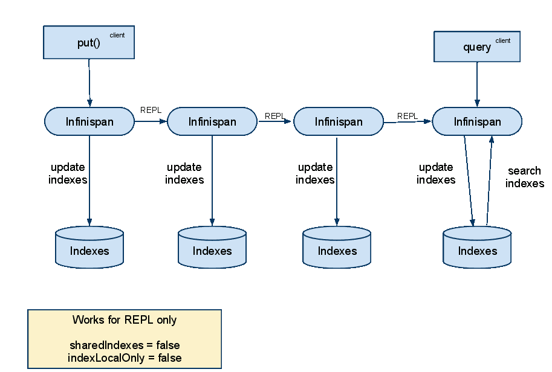
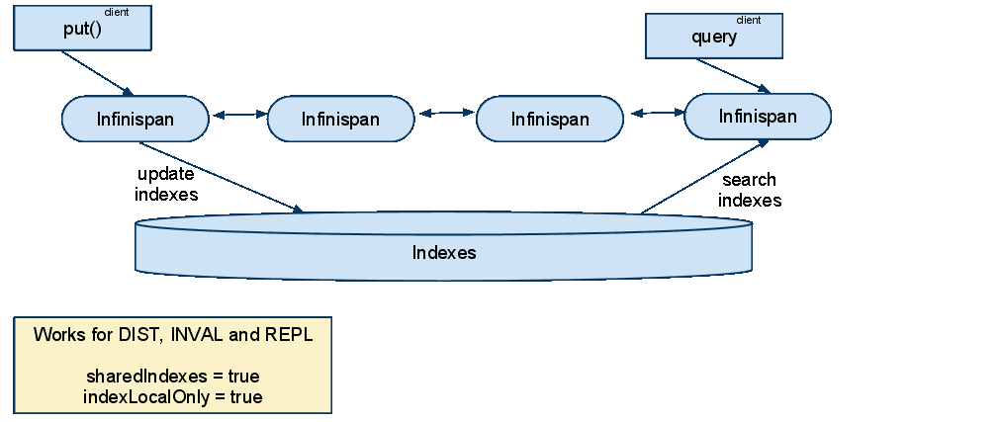

==  Querying
Infinispan supports indexing and searching of Java objects stored in the grid using powerful search APIs
which complement its main Map-like API. Historically, searching was first available in Infinispan via
link:$$http://lucene.apache.org/$$[Apache Lucene]'s API but since version 6.0 Infinispan provides its own link:$$#_infinispan_s_query_dsl$$[query API]
based on a simple and expressive internal DSL. Searching with the new API is available for both embedded and remote
clients while the Lucene based API is only available to embedded clients. The remote querying capability is further
described in the link:$$#_querying_via_the_java_hot_rod_client$$[Hot Rod client chapter].

=== The infinispan-query module
This module adds indexing and querying capabilities to Infinispan. It uses link:$$http://hibernate.org/subprojects/search$$[Hibernate Search]
and link:$$http://lucene.apache.org/$$[Apache Lucene] to index and search objects in the cache. It allows users to
obtain objects within the cache without needing to know the keys to each object that they want to obtain. You can search
your objects based on some of its properties. For example to retrieve all red cars (exact metadata match), or all books
about a specific topic (full text search and relevance scoring).

The queries can be expressed as Lucene queries, built directly using the Lucene Query API or built with the help of Hibernate Search Query DSL. Alternatively, you can also use Infinispan's own query DSL which most users might find easier to use than the one based on Lucene at the cost of not being able to access some of the powerful capabilities which are specific to the underlying Lucene implementation.

==== Configuration
Indexing must be enabled in the configuration (as explained in <<sid-68355029,XML Configuration>> or <<sid-68355029,Programmatic configuration>> ). This will trigger automatic indexing of objects stored in the cache; there are several different ways to specify how these objects need to be indexed explained in the following paragraphs. To run queries you use the _SearchManager_ which exposes all necessary methods to get started.

=== Simple example
We're going to store _Book_ instances in Infinispan; each _Book_ will be defined as in the following example; we have to choose which properties are indexed, and for each property we can optionally choose advanced indexing options using the annotations defined in the Hibernate Search project.

[source,java]
----
// example values stored in the cache and indexed:
import org.hibernate.search.annotations.*;

//Values you want to index need to be annotated with @Indexed, then you pick which fields and how they are to be indexed:
@Indexed
public class Book {
   @Field String title;
   @Field String description;
   @Field @DateBridge(resolution=Resolution.YEAR) Date publicationYear;
   @IndexedEmbedded Set<Author> authors = new HashSet<Author>();
}

public class Author {
   @Field String name;
   @Field String surname;
   // hashCode() and equals() omitted
}

----

Now assuming we stored several _Book_ instances in our Infinispan _Cache_ , we can search them for any matching field as in the following example.

[source,java]
----
// get the search manager from the cache:
SearchManager searchManager = org.infinispan.query.Search.getSearchManager(cache);

// create any standard Lucene query, via Lucene's QueryParser or any other means:
org.apache.lucene.search.Query fullTextQuery = //any Apache Lucene Query

// convert the Lucene query to a CacheQuery:
CacheQuery cacheQuery = searchManager.getQuery( fullTextQuery );

// get the results:
List<Object> found = cacheQuery.list();

----

A Lucene Query is often created by parsing a query in text format such as "title:infinispan AND authors.name:sanne", or by using the query builder provided by Hibernate Search.

[source,java]
----
// get the search manager from the cache:
SearchManager searchManager = org.infinispan.query.Search.getSearchManager( cache );

// you could make the queries via Lucene APIs, or use some helpers:
QueryBuilder queryBuilder = searchManager.buildQueryBuilderForClass(Book.class).get();

// the queryBuilder has a nice fluent API which guides you through all options.
// this has some knowledge about your object, for example which Analyzers
// need to be applied, but the output is a fairly standard Lucene Query.
org.apache.lucene.search.Query luceneQuery = queryBuilder.phrase()
                  .onField("description")
                  .andField("title")
                  .sentence("a book on highly scalable query engines")
                  .createQuery();

// the query API itself accepts any Lucene Query, and on top of that
// you can restrict the result to selected class types:
CacheQuery query = searchManager.getQuery(luceneQuery, Book.class);

// and there are your results!
List objectList = query.list();

for (Object book : objectList) {
      System.out.println(book);
}

----

A part from _list()_ you have the option for streaming results, or use pagination.

This barely scratches the surface of all what is possible to do: see the link:$$http://docs.jboss.org/hibernate/stable/search/reference/en-US/html_single$$[Hibernate Search reference documentation] to learn about sorting, numeric fields, declarative filters, caching filters, complex object graph indexing, custom types and the powerful faceting search API.

==== Notable differences with Hibernate Search
Using _@DocumentId_ to mark a field as identifier does not apply to Infinispan values; in Infinispan Query the identifier for all _@Indexed_ objects is the key used to store the value. You can still customize how the key is indexed using a combination of _@Transformable_ , custom types and custom _FieldBridge_ implementations.

==== Requirements for the Key: @Transformable
The key for each value needs to be indexed as well, and the key instance must be transformed in a _String_. Infinispan includes some default transformation routines to encode common primitives, but to use a custom key you must provide an implementation of _org.infinispan.query.Transformer_ .

===== Registering a Transformer via annotations
You can annotate your key type with _org.infinispan.query.Transformable_ :

[source,java]
----

@Transformable(transformer = CustomTransformer.class)
public class CustomKey {
   ...
}

public class CustomTransformer implements Transformer {
   @Override
   public Object fromString(String s) {
      ...
      return new CustomKey(...);
   }

   @Override
   public String toString(Object customType) {
      CustomKey ck = (CustomKey) customType;
      return ...
   }
}

----

===== Registering a Transformer programmatically
Using this technique, you don't have to annotated your custom key type:

[source,java]
----
org.infinispan.query.SearchManager.registerKeyTransformer(Class<?>, Class<? extends Transformer>)
----

=== Configuration
==== Configuration via XML
To enable indexing via XML, you need to add the `<indexing />` element to your cache configuration, and optionally pass additional properties to the embedded Hibernate Search engine:

[source,xml]
----
<infinispan>
   <cache-container default-cache="default">
      <local-cache name="default">
         <indexing index="LOCAL">
            <property name="default.directory_provider">ram</property>
         </indexing>
      </local-cache>
   </cache-container>
</infinispan>

----

In this example the index is stored in memory, so when this nodes is shutdown the index is lost: good for a quick demo, but in real world cases you'll want to use the default (store on filesystem) or store the index in Infinispan as well. For the complete reference of properties to define, refer to the link:$$http://docs.jboss.org/hibernate/stable/search/reference/en-US/html_single/#search-configuration$$[Hibernate Search documentation] .

==== Automatic configuration

[source,xml]
----
      <local-cache name="default">
         <indexing index="LOCAL" auto-config="true">
         </indexing>
      </local-cache>

----

Tha attribute auto-config provides a simple way of configuring indexing based on the cache type. For replicated and local caches, the indexing is configured to be persisted on disk and not shared
with any other processes. Also, it is configured so that minimum delay exists between the moment an object is indexed and the moment it is available for searches (near real time).

NOTE: it is possible to redefine any property added via auto-config, and also add new properties, allowing for advanced tuning.

The auto config adds the following properties for replicated and local caches:

[options="header",cols="1,3,10"]
|==============================================================================
| Property name | value | description
| hibernate.search.default.directory_provider | filesystem | Filesystem based index. More details at link:$$http://docs.jboss.org/hibernate/stable/search/reference/en-US/html_single/#search-configuration-directory$$[Hibernate Search documentation]
| hibernate.search.default.exclusive_index_use | true | indexing operation in exclusive mode, allowing Hibernate Search to optimize writes
| hibernate.search.default.indexmanager | near-real-time | make use of Lucene near real time feature, meaning indexed objects are promptly available to searches
| hibernate.search.default.reader.strategy | shared | Reuse index reader across several queries, thus avoiding reopening it
|==============================================================================

For distributed caches, the auto-config configure indexes in infinispan itself, internally handled as a master-slave mechanism where indexing operations are sent to a single node which is responsible to
write to the index.

The auto config properties for distributed caches are:

[options="header",cols="1,3,10"]
|==============================================================================
| Property name | value | description
| hibernate.search.default.directory_provider | infinispan | Indexes stored in Infinispan. More details at link:$$http://docs.jboss.org/hibernate/stable/search/reference/en-US/html_single/#infinispan-directories$$[Hibernate Search documentation]
| hibernate.search.default.exclusive_index_use | true | indexing operation in exclusive mode, allowing Hibernate Search to optimize writes
| hibernate.search.default.indexmanager | org.infinispan.query.indexmanager.InfinispanIndexManager | Delegates index writing to a single node in the Infinispan cluster
| hibernate.search.default.reader.strategy | shared | Reuse index reader across several queries, avoiding reopening it
|==============================================================================

==== Lucene Directory
Infinispan Query isn't aware of where you store the indexes, it just passes the configuration of which _Lucene Directory_ implementation you want to use to the Hibernate Search engine. There are several _Lucene Directory_ implementations bundled, and you can plug your own or add third party implementations: the Directory is the IO API for Lucene to store the indexes.

The most common _Lucene Directory_ implementations used with _Infinispan Query_ are:

* Ram - stores the index in a local map to the node. This index can't be shared.
* Filesystem - stores the index in a locally mounted filesystem. This could be a network shared FS, but sharing this way is generally not recommended.
* Infinispan - stores the index in a different dedicated Infinispan cache. This cache can be configured as replicated or distributed, to share the index among nodes. See also the dedicated chapter on the Lucene Directory in this guide.

Of course having a shared index vs. an independent index on each node directly affects behaviour of the Query module; some combinations might not make much sense.

==== Using programmatic configuration and index mapping

In the following example we start Infinispan programmatically, avoiding XML configuration files, and also map an object _Author_ which is to be stored in the grid and made searchable on two properties but without annotating the class.

[source,java]
----

SearchMapping mapping = new SearchMapping();
mapping.entity(Author.class).indexed()
      .property("name", ElementType.METHOD).field()
      .property("surname", ElementType.METHOD).field();

Properties properties = new Properties();
properties.put(org.hibernate.search.Environment.MODEL_MAPPING, mapping);
properties.put("hibernate.search.[other options]", "[...]");

Configuration infinispanConfiguration = new ConfigurationBuilder()
      .indexing()
         .enable()
         .indexLocalOnly(true)
         .withProperties(properties)
      .build();

DefaultCacheManager cacheManager = new DefaultCacheManager(infinispanConfiguration);

Cache<Long, Author> cache = cacheManager.getCache();
SearchManager sm = Search.getSearchManager(cache);

Author author = new Author(1, "Manik", "Surtani");
cache.put(author.getId(), author);

QueryBuilder qb = sm.buildQueryBuilderForClass(Author.class).get();
Query q = qb.keyword().onField("name").matching("Manik").createQuery();
CacheQuery cq = sm.getQuery(q, Author.class);
Assert.assertEquals(cq.getResultSize(), 1);

----

=== Cache modes and managing indexes
Index management is currently controlled by the _Configuration.setIndexLocalOnly()_ setter, or the `<indexing index="LOCAL" />` XML element. If you set this to true, only modifications made locally on each node are considered in indexing. Otherwise, remote changes are considered too.

Regarding actually configuring a Lucene directory, refer to the link:$$http://docs.jboss.org/hibernate/stable/search/reference/en-US/html_single/#search-configuration$$[Hibernate Search documentation] on how to pass in the appropriate Lucene configuration via the Properties object passed to QueryHelper.

==== LOCAL
In local mode, you may use any Lucene Directory implementation. Also the option _indexLocalOnly_ isn't meaningful.

==== REPLICATION
In replication mode, each node can have its own local copy of the index. So indexes can either be stored locally on each node (RAMDirectory, FSDirectory, etc) but you need to set _indexLocalOnly_ to _false_ , so that each node will apply needed updates it receives from other nodes in addition to the updates started locally. Any Directory implementation can be used, but you have to make sure that when a new node is started it receives an up to date copy of the index; typically rsync is well suited for this task, but being an external operation you might end up with a slightly out-of-sync index, especially if updates are very frequent.

Alternately, if you use some form of shared storage for indexes (see _Sharing the Index_ ), you then have to set _indexLocalOnly_ to _true_ so that each node will apply only the changes originated locally; in this case there's no risk in having an out-of-sync index, but to avoid write contention on the index you should make sure that a single node is "in charge" of updating the index. Again, the Hibernate Search reference documentation describes means to use link:$$http://docs.jboss.org/hibernate/stable/search/reference/en-US/html_single/#jms-backend$$[a JMS queue] or link:$$http://docs.jboss.org/hibernate/stable/search/reference/en-US/html_single/#jgroups-backend$$[JGroups] to send indexing tasks to a master node.

The diagram below shows a replicated deployment, in which each node has a local index.

==== DISTRIBUTION
For these 2 cache modes, you _need_ to use a shared index and set _indexLocalOnly_ to true.

The diagram below shows a deployment with a shared index. Note that while not mandatory, a shared index can be used for replicated (vs. distributed) caches as well.

==== INVALIDATION
Indexing or searching of elements under INVALIDATION mode is not supported.

=== Sharing the Index
The most simple way to share an index is to use some form of shared storage for the indexes, like an _FSDirectory_ on a shared disk; however this form is problematic as the _FSDirectory_ relies on specific locking semantics which are often incompletely implemented on network filesystems, or not reliable enough; if you go for this approach make sure to search for potential problems on the Lucene mailing lists for other experiences and workarounds. Good luck, test well.

There are many alternative Directory implementations you can find, one of the most suited approaches when working with Infinispan is of course to store the index in an Infinispan cache: have a look at the <<sid-68355039,InfinispanDirectoryProvider>> , as all Infinispan based layers it can be combined with persistent CacheLoaders to keep the index on a shared filesystem without the locking issues, or alternatively in a database, cloud storage, or any other CacheLoader implementation; you could backup the index in the same store used to backup your values.

For full documentation on clustering the Lucene engine, refer to the link:$$http://docs.jboss.org/hibernate/stable/search/reference/en-US/html_single/#search-configuration$$[Hibernate Search documentation] to properly configure it clustered.

=== Clustering the Index in Infinispan
Again the configuration details are in the Hibernate Search reference, in particular in the link:$$http://docs.jboss.org/hibernate/stable/search/reference/en-US/html_single/#infinispan-directories$$[infinispan-directories] section. This backend will by default start a secondary Infinispan CacheManager, and optionally take another Infinispan configuration file: don't reuse the same configuration or you will start grids recursively! It is currently not possible to share the same CacheManager.

=== Rebuilding the Index
Occasionally you might need to rebuild the Lucene index by reconstructing it from the data stored in the Cache. You need to rebuild the index if you change the definition of what is indexed on your types, or if you change for example some _Analyzer_ parameter, as Analyzers affect how the index is defined. Also, you might need to rebuild the index if you had it destroyed by some system administration mistake. To rebuild the index just get a reference to the MassIndexer and start it; beware if might take some time as it needs to reprocess all data in the grid!

[source,java]
----
SearchManager searchManager = Search.getSearchManager(cache);
searchManager.getMassIndexer().start();
----

TIP: This is also available as a `start` JMX operation on the link:http://docs.jboss.org/infinispan/{infinispanversion}/apidocs/jmxComponents.html#MassIndexer[MassIndexer MBean]
registered under the name `org.infinispan:type=Query,manager="{name-of-cache-manager}",cache="{name-of-cache}",component=MassIndexer`.

=== Obtaining query statistics
Query link:$$http://docs.jboss.org/hibernate/search/4.4/api/org/hibernate/search/stat/Statistics.html$$[_Statistics_]
can be obtained from the _SearchManager_, as demonstrated in the following code snippet.

[source,java]
----
SearchManager searchManager = Search.getSearchManager(cache);
org.hibernate.search.stat.Statistics statistics = searchManager.getStatistics();
----

TIP: This data is also available via JMX through the link:$$http://docs.jboss.org/hibernate/search/4.4/reference/en-US/html/search-monitoring.html#d0e7624$$[Hibernate Search StatisticsInfoMBean]
registered under the name `org.infinispan:type=Query,manager="{name-of-cache-manager}",cache="{name-of-cache}",component=Statistics`.
Please note this MBean is always registered by Infinispan but the statistics are collected only if
link:$$#_enabling_jmx_statistics$$[statistics collection is enabled] at cache level.

WARNING: Hibernate Search has its own configuration properties `hibernate.search.jmx_enabled` and `hibernate.search.generate_statistics`
for JMX statistics as explained link:$$http://docs.jboss.org/hibernate/search/4.4/reference/en-US/html/search-monitoring.html#d0e7595$$[here].
Using them with Infinispan Query is forbidden as it will only lead to duplicated MBeans and unpredictable results.

=== Infinispan's Query DSL

WARNING: This is a new API undergoing refinements and changes that might break compatibility in future releases.

Starting with 6.0 Infinispan provides its own query DSL, independent of Lucene and Hibernate Search.
Decoupling the query API from the underlying query and indexing mechanism makes it possible to introduce new alternative
engines in the future, besides Lucene, and still being able to use the same uniform query API.
The current implementation of indexing and searching is still based on
Hibernate Search and Lucene so all indexing related aspects presented in this chapter still apply.

The new API simplifies the writing of queries by not exposing the user to the low level details of constructing Lucene
query objects and also has the advantage of being available to link:$$#_querying_via_the_java_hot_rod_client$$[remote Hot Rod clients].
But before delving into further details, let's examine first a simple example of writing a query for the _Book_ entity
from link:$$#_simple_example$$[previous example].

.Query example using Infinispan's query DSL
[source,java]
----
import org.infinispan.query.dsl.*;

// get the DSL query factory from the cache, to be used for constructing the Query object:
QueryFactory qf = org.infinispan.query.Search.getQueryFactory(cache);

// create a query for all the books that have a title which contains the word "engine":
org.infinispan.query.dsl.Query query = qf.from(Book.class)
      .having("title").like("%engine%")
      .toBuilder().build();

// get the results:
List<Book> list = query.list();
----
The API is located in the _org.infinispan.query.dsl_ package. A query is created with the help of the _QueryFactory_
instance which is obtained from the per-cache _SearchManager_. Each _QueryFactory_ instance is bound to the same _Cache_
instance as the _SearchManager_, but it is otherwise a stateless and thread-safe object that can be used for creating
multiple queries in parallel.

Query creation starts with the invocation of the `from(Class entityType)` method which returns a _QueryBuilder_ object
that is further responsible for creating queries targeted to the specified entity class from the given cache.

NOTE: A query will always target a single entity type and is evaluated over the contents of a single cache. Running a
query over multiple caches or creating queries that target several entity types (joins) is not supported.

The _QueryBuilder_ accumulates search criteria and configuration specified through the invocation of its DSL methods and is
ultimately used to build a _Query_ object by the invocation of the `QueryBuilder.build()` method that completes the
construction. Being a stateful object, it cannot be used for constructing multiple queries at the same time
(except for link:$$#_nested_conditions$$[nested queries]) but can be reused afterwards.

NOTE: This _QueryBuilder_ is different from the one from Hibernate Search but has a somewhat similar purpose, hence the
same name. We are considering renaming it in near future to prevent ambiguity.

Executing the query and fetching the results is as simple as invoking the `list()` method of the _Query_ object. Once
executed the _Query_ object is not reusable. If you need to re-execute it in order to obtain fresh results then a new
instance must be obtained by calling `QueryBuilder.build()`.

=== Filtering operators
Constructing a query is a hierarchical process of composing multiple criteria and is best explained following this hierarchy.

The simplest possible form of a query criteria is a restriction on the values of an entity attribute according to a
filtering operator that accepts zero or more arguments. The entity attribute is specified by invoking the
`having(String attributePath)` method of the query builder which returns an intermediate context object
(link:http://docs.jboss.org/infinispan/{infinispanversion}/apidocs/org/infinispan/query/dsl/FilterConditionEndContext.html[_FilterConditionEndContext_])
that exposes all the available operators. Each of the methods defined by _FilterConditionEndContext_ is an operator that
accepts an argument, except for `between` which has two arguments and `isNull` which has no arguments. The arguments are
statically evaluated at the time the query is constructed, so if you're looking for a feature similar to SQL's
correlated sub-queries, that is not currently available.

[source,java]
----
// a single query criterion
QueryBuilder qb = ...
qb.having("title").eq("Infinispan Data Grid Platform");
----

._FilterConditionEndContext_ exposes the following filtering operators:
[options="header",cols="1,3,10"]
|==============================================================================
| Filter | Arguments | Description
| in | Collection values | Checks that the left operand is equal to one of the elements from the Collection of values given as argument.
| in | Object... values | Checks that the left operand is equal to one of the (fixed) list of values given as argument.
| contains | Object value | Checks that the left argument (which is expected to be an array or a Collection) contains the given element.
| containsAll | Collection values | Checks that the left argument (which is expected to be an array or a Collection) contains all the elements of the given collection, in any order.
| containsAll | Object... values | Checks that the left argument (which is expected to be an array or a Collection) contains all of the the given elements, in any order.
| containsAny | Collection values | Checks that the left argument (which is expected to be an array or a Collection) contains any of the elements of the given collection.
| containsAny | Object... values | Checks that the left argument (which is expected to be an array or a Collection) contains any of the the given elements.
| isNull | | Checks that the left argument is null.
| like | String pattern | Checks that the left argument (which is expected to be a String) matches a wildcard pattern that follows the JPA rules.
| eq | Object value | Checks that the left argument is equal to the given value.
| equal | Object value | Alias for eq.
| gt | Object value | Checks that the left argument is greater than the given value.
| gte | Object value | Checks that the left argument is greater than or equal to the given value.
| lt | Object value | Checks that the left argument is less than the given value.
| lte | Object value | Checks that the left argument is less than or equal to the given value.
| between | Object from, Object to | Checks that the left argument is between the given range limits.
|==============================================================================

It's important to note that query construction requires a multi-step chaining of method invocation that must be done in
the proper sequence, must be properly completed exactly _once_ and must not be done twice, or it will result in an error.
The following examples are invalid, and depending on each case they lead to criteria being ignored (in benign cases) or
an exception being thrown (in more serious ones).

[source,java]
----
// Incomplete construction. This query does not have any filter on "title" attribute yet,
// although the author may have intended to add one.
QueryBuilder qb1 = ...
qb1.having("title");
Query q1 = qb1.build(); // consequently, this query matches all Book instances regardless of title!

// Duplicated completion. This results in an exception at run-time.
// Maybe the author intended to connect two conditions with a boolean operator,
// but this does NOT actually happen here.
QueryBuilder qb2 = ...
qb2.having("title").like("%Infinispan%");
qb2.having("description").like("%clustering%");   // will throw java.lang.IllegalStateException: Sentence already started. Cannot use 'having(..)' again.
Query q2 = qb2.build();
----

==== Filtering based on attributes of embedded entities

The `having` method also accepts dot separated attribute paths for referring to _embedded entity_ attributes, so the following
is a valid query:

[source,java]
----
// match all books that have an author named "Manik"
Query query = queryFactory.from(Book.class)
      .having("author.name").eq("Manik")
      .toBuilder().build();
----

Each part of the attribute path must refer to an existing indexed attribute in the corresponding entity or embedded
entity class respectively. It's possible to have multiple levels of embedding.

=== Boolean conditions
Combining multiple attribute conditions with logical conjunction (`and`) and disjunction (`or`) operators in order to
create more complex conditions is demonstrated in the following example. The well known operator precedence rule for
boolean operators applies here, so the order of DSL method invocations during construction is irrelevant. Here `and`
operator still has higher priority than `or` even though `or` was invoked first.

[source,java]
----
// match all books that have the word "Infinispan" in their title
// or have an author named "Manik" and their description contains the word "clustering"
Query query = queryFactory.from(Book.class)
  .having("title").like("%Infinispan%")
  .or().having("author.name").eq("Manik")
  .and().having("description").like("%clustering%")
  .toBuilder().build();
----

Boolean negation is achieved with the `not` operator, which has highest precedence among logical operators and applies
only to the next simple attribute condition.

[source,java]
----
// match all books that do not have the word "Infinispan" in their title and are authored by "Manik"
Query query = queryFactory.from(Book.class)
  .not().having("title").like("%Infinispan%")
  .and().having("author.name").eq("Manik")
  .toBuilder().build();
----

=== Nested conditions
Changing the precendece of logical operators is achieved with nested filter conditions. Logical operators can be used to
connect two simple attribute conditions as presented before, but can also connect a simple attribute condition with the
subsequent complex condition created with the same query factory.

[source,java]
----
// match all books that have an author named "Manik" and their title contains
// the word "Infinispan" or their description contains the word "clustering"
Query query = queryFactory.from(Book.class)
  .having("author.name").eq("Manik");
  .and(queryFactory.having("title").like("%Infinispan%")
          .or().having("description").like("%clustering%"))
  .toBuilder().build();
----

=== Projections
In some use cases returning the whole domain object is overkill if only a small subset of the attributes are actually
used by the application, especially if the domain entity has embedded entities. The query language allows you to specify
a subset of attributes (or attribute paths) to return - the projection. If projections are used then the `Query.list()`
will not return the whole domain entity but will return a _List_ of _Object[]_, each slot in the array corresponding to
a projected attribute.

TODO document what needs to be configured for an attribute to be available for projection.

[source,java]
----
// match all books that have the word "Infinispan" in their title or description
// and return only their title and publication year
Query query = queryFactory.from(Book.class)
  .select("title", "publicationYear")
  .having("title").like("%Infinispan%")
  .or().having("description").like("%Infinispan%"))
  .toBuilder().build();
----

=== Sorting
Ordering the results based on one or more attributes or attribute paths is done with the `QueryBuilder.orderBy(  )`
method which accepts an attribute path and a sorting direction. If multiple sorting criteria are specified, then
the order of invocation of `orderBy` method will dictate their precedence. But you have to think of the multiple sorting
criteria as acting together on the tuple of specified attributes rather than in a sequence of individual sorting
operations on each attribute.

TODO document what needs to be configured for an attribute to be available for sorting.

[source,java]
----
// match all books that have the word "Infinispan" in their title or description
// and return them sorted by the publication year and title
Query query = queryFactory.from(Book.class)
  .orderBy("publicationYear", SortOrder.DESC)
  .orderBy("title", SortOrder.ASC)
  .having("title").like("%Infinispan%")
  .or().having("description").like("%Infinispan%"))
  .toBuilder().build();
----

=== Pagination

You can limit the number of returned results by setting the _maxResults_ property of _QueryBuilder_. This can be used in
conjunction with setting the _startOffset_ in order to achieve pagination of the result set.

[source,java]
----
// match all books that have the word "clustering" in their title
// sorted by publication year and title
// and return 3'rd page of 10 results
Query query = queryFactory.from(Book.class)
  .orderBy("publicationYear", SortOrder.DESC)
  .orderBy("title", SortOrder.ASC)
  .setStartOffset(20)
  .maxResults(10)
  .having("title").like("%clustering%")
  .toBuilder().build();
----

NOTE: Even if the results being fetched are limited to _maxResults_ you can still find the total number of matching
results by calling `Query.getResultSize()`.

TODO Does pagination make sense if no stable sort criteria is defined? Luckily when running on Lucene and no sort criteria is specified we still have the order of relevance, but this has to be defined for other search engines.

=== Grouping and Aggregation

Infinispan has the ability to group query results according to a set of grouping fields and construct aggregations of
the results from each group by applying an aggregation function to the set of values that fall into each group. Grouping
and aggregation can only be applied to projection queries. The supported aggregations are: avg, sum, count, max, min.
The set of grouping fields is specified with the _groupBy(field)_ method, which can be invoked multiple times. The order
used for defining grouping fields is not relevant. All fields selected in the projection must either be grouping fields
or else they must be aggregated using one of the grouping functions described below. A projection field can be
aggregated and used for grouping at the same time. A query that selects only grouping fields but no aggregation fields
is legal.
⁠

Example: Grouping Books by author and counting them.
[source,java]
----
Query query = queryFactory.from(Book.class)
    .select(Expression.property("author"), Expression.count("title"))
    .having("title").like("%engine%")
    .toBuilder()
    .groupBy("author")
    .build();
----

NOTE: A projection query in which all selected fields have an aggregation function applied and no fields are used for
grouping is allowed. In this case the aggregations will be computed globally as if there was a single global group.

==== Aggregations

The following aggregation functions may be applied to a field: avg, sum, count, max, min

* avg() - Computes the average of a set of numbers. Accepted values are primitive numbers and instances of _java.lang.Number_. The result is represented as _java.lang.Double_. If there are no non-null values the result is _null_ instead.
* count() - Counts the number of non-null rows and returns a _java.lang.Long_. If there are no non-null values the result is _0_ instead.
* max() - Returns the greatest value found. Accepted values must be instances of _java.lang.Comparable_. If there are no non-null values the result is _null_ instead.
* min() - Returns the smallest value found. Accepted values must be instances of _java.lang.Comparable_. If there are no non-null values the result is _null_ instead.
* sum() - Computes the sum of a set of Numbers. If there are no non-null values the result is _null_ instead. The following table indicates the return type based on the specified field.

.Table sum return type
|===
|Field Type |Return Type

|Integral (other than BigInteger)
|Long

|Float or Double
|Double

|BigInteger
|BigInteger

|BigDecimal
|BigDecimal
|===

==== Evaluation of queries with grouping and aggregation

Aggregation queries can include filtering conditions, like usual queries. Filtering can be performed in two stages: before
and after the grouping operation. All filter conditions defined before invoking the _groupBy_ method will be applied
before the grouping operation is performed, directly to the cache entries (not to the final projection). These filter
conditions may reference any fields of the queried entity type, and are meant to restrict the data set that is going to
be the input for the grouping stage. All filter conditions defined after invoking the _groupBy_ method will be applied to
the projection that results from the projection and grouping operation. These filter conditions can either reference any
of the _groupBy_ fields or aggregated fields. Referencing aggregated fields that are not specified in the select clause
is allowed; however, referencing non-aggregated and non-grouping fields is forbidden. Filtering in this phase will
reduce the amount of groups based on their properties. Sorting may also be specified similar to usual queries. The
ordering operation is performed after the grouping operation and can reference any of the _groupBy_ fields or aggregated
fields.

=== Using Named Query Parameters

Instead of building a new Query object for every execution it is possible to include named parameters in the query which
can be substituted with actual values before execution. This allows a query to be defined once and be efficiently
executed many times. Parameters can only be used on the right-hand side of an operator and are defined when the query is
created by supplying an object produced by the _org.infinispan.query.dsl.Expression.param(String paramName)_ method to
the operator instead of the usual constant value. Once the parameters have been defined they can be set by invoking either
_Query.setParameter(parameterName, value)_ or _Query.setParameters(parameterMap)_ as shown in the examples below.
⁠
[source,java,tile="Using Named Parameters"]
----
import org.infinispan.query.Search;
import org.infinispan.query.dsl.*;
[...]

QueryFactory queryFactory = Search.getQueryFactory(cache);
// Defining a query to search for various authors and publication years
Query query = queryFactory.from(Book.class)
    .select("title")
    .having("author").eq(Expression.param("authorName"))
    .and()
    .having("publicationYear").eq(Expression.param("publicationYear"))
    .toBuilder().build();

// Set actual parameter values
query.setParameter("authorName", "Doe");
query.setParameter("publicationYear", 2010);

// Execute the query
List<Book> found = query.list();
----

Alternatively, multiple parameters may be set at once by supplying a map of actual parameter values:
⁠
[source,java,title="Setting multiple named parameters at once"]
----
import java.util.Map;
import java.util.HashMap;

[...]

Map<String, Object> parameterMap = new HashMap<>();
parameterMap.put("authorName", "Doe");
parameterMap.put("publicationYear", 2010);

query.setParameters(parameterMap);
----

NOTE: A significant portion of the query parsing, validation and execution planning effort is performed during the first
execution of a query with parameters. This effort is not repeated during subsequent executions leading to better
performance compared to a similar query using constant values instead of query parameters.

=== Continuous Queries

Continuous Queries allow an application to register a listener which will receive the entries that currently match a
query filter, and will be continuously notified of any changes to the queried data set that result from further cache
operations. This includes incoming matches, for values that have joined the set, updated matches, for matching values
that were modified and continue to match, and outgoing matches, for values that have left the set. By using a Continuous
Query the application receives a steady stream of events instead of having to repeatedly execute the same query to
discover changes, resulting in a more efficient use of resources. For instance, all of the following use cases could
utilize Continuous Queries:

* Return all persons with an age between 18 and 25 (assuming the Person entity has an _age_ property and is updated by
the user application).
* Return all transactions higher than $2000.
* Return all times where the lap speed of F1 racers were less than 1:45.00s (assuming the cache contains Lap entries and
that laps are entered live during the race).

==== Continuous Query Execution

A continuous query uses a listener that is notified when:

* An entry starts matching the specified query, represented by a _Join_ event.
* A matching entry is updated and continues to match the query, represented by an _Update_ event.
* An entry stops matching the query, represented by a _Leave_ event.

When a client registers a continuous query listener it immediately begins to receive the results currently matching the
query, received as _Join_ events as described above. In addition, it will receive subsequent notifications when other
entries begin matching the query, as _Join_ events, or stop matching the query, as _Leave_ events, as a consequence of
any cache operations that would normally generate creation, modification, removal, or expiration events. Updated cache
entries will generate _Update_ events if the entry matches the query filter before and after the operation. To
summarize, the logic used to determine if the listener receives a _Join_, _Update_ or _Leave_ event is:

. If the query on both the old and new values evaluate false, then the event is suppressed.
. If the query on the old value evaluates false and on the new value evaluates true, then a _Join_ event is sent.
. If the query on both the old and new values evaluate true, then an _Update_ event is sent.
. If the query on the old value evaluates true and on the new value evaluates false, then a _Leave_ event is sent.
. If the query on the old value evaluates true and the entry is removed or expired, then a _Leave_ event is sent.

NOTE: Continuous Queries can use the full power of the Query DSL except: grouping, aggregation, and sorting operations.

==== Running Continuous Queries

To create a continuous query you'll start by creating a Query object first. This is described in
link:$$#infinispan_s_query_dsl$$[the Query DSL section]. Then you'll need to obtain the ContinuousQuery (_org.infinispan.query.api.continuous.ContinuousQuery_)
object of your cache and register the query and a continuous query listener (_org.infinispan.query.api.continuous.ContinuousQueryListener_)
with it. A ContinuousQuery object associated to a cache can be obtained by calling the static method _org.infinispan.client.hotrod.Search.getContinuousQuery(RemoteCache<K, V> cache)_
if running in remote mode or _org.infinispan.query.Search.getContinuousQuery(Cache<K, V> cache)_ when running in embedded mode.
Once the listener has been created it may be registered by using the addContinuousQueryListener method of ContinuousQuery:

[source,java]
----
continuousQuery.addContinuousQueryListener(query, listener);
----

The following example demonstrates a simple continuous query use case in embedded mode:
⁠
[source,java,title="Registering a Continuous Query"]
----
import org.infinispan.query.api.continuous.ContinuousQuery;
import org.infinispan.query.api.continuous.ContinuousQueryListener;
import org.infinispan.query.Search;
import org.infinispan.query.dsl.QueryFactory;
import org.infinispan.query.dsl.Query;

import java.util.Map;
import java.util.concurrent.ConcurrentHashMap;

[...]

// We have a cache of Persons
Cache<Integer, Person> cache = ...

// We begin by creating a ContinuousQuery instance on the cache
ContinuousQuery<Integer, Person> continuousQuery = Search.getContinuousQuery(cache);

// Define our query. In this case we will be looking for any Person instances under 21 years of age.
QueryFactory queryFactory = Search.getQueryFactory(cache);
Query query = queryFactory.from(Person.class)
    .having("age").lt(21)
    .toBuilder().build();

final Map<Integer, Person> matches = new ConcurrentHashMap<Integer, Person>();

// Define the ContinuousQueryListener
ContinuousQueryListener<Integer, Person> listener = new ContinuousQueryListener<Integer, Person>() {
    @Override
    public void resultJoining(Integer key, Person value) {
        matches.put(key, value);
    }

    @Override
    public void resultUpdated(Integer key, Person value) {
        // just ignore it
    }

    @Override
    public void resultLeaving(Integer key) {
        matches.remove(key);
    }
};

// Add the listener and the query
continuousQuery.addContinuousQueryListener(query, listener);

[...]

// Remove the listener to stop receiving notifications
continuousQuery.removeContinuousQueryListener(listener);
----

As Person instances having an age less than 21 are added to the cache they will be received by the listener and will be
placed into the _matches_ map, and when these entries are removed from the cache or their age is modified to be greater
or equal than 21 they will be removed from _matches_.

==== Removing Continuous Queries
To stop the query from further execution just remove the listener:

[source,java]
----
continuousQuery.removeContinuousQueryListener(listener);
----

==== Notes on performance of Continuous Queries

Continuous queries are designed to provide a constant stream of updates to the application, potentially resulting in a
very large number of events being generated for particularly broad queries. A new temporary memory allocation is made
for each event. This behavior may result in memory pressure, potentially leading to _OutOfMemoryErrors_ (especially in
remote mode) if queries are not carefully designed. To prevent such issues it is strongly recommended to ensure that
each query captures the minimal information needed both in terms of number of matched entries and size of each match
(projections can be used to capture the interesting properties), and that each _ContinuousQueryListener_ is designed
to quickly process all received events without blocking and to avoid performing actions that will lead to the generation
of new matching events from the cache it listens to.

=== More Query DSL samples

Probably the best way to explore using the Query DSL API is to have a look at our tests suite.
link:$$https://github.com/infinispan/infinispan/blob/master/query/src/test/java/org/infinispan/query/dsl/embedded/QueryDslConditionsTest.java$$[QueryDslConditionsTest]
is a fine example.

