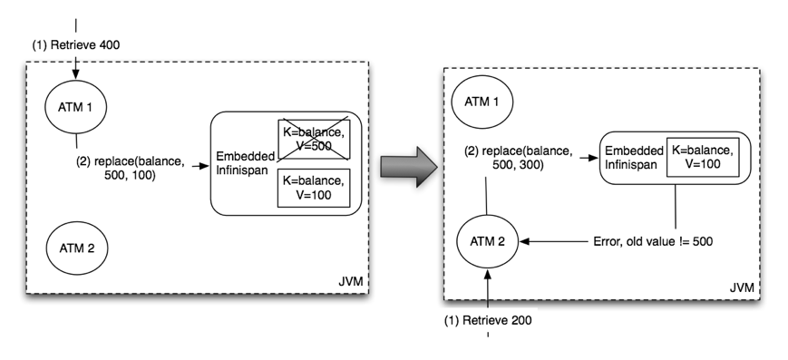

===  Using Hot Rod Server
The Infinispan Server distribution contains a server module that implements Infinispan's custom binary protocol called Hot Rod. The protocol was designed to enable faster client/server interactions compared to other existing text based protocols and to allow clients to make more intelligent decisions with regards to load balancing, failover and even data location operations.
Please refer to Infinispan Server's link:../infinispan_server_guide/infinispan_server_guide.html[documentation] for instructions on how to configure and run a HotRod server.

To connect to Infinispan over this highly efficient Hot Rod protocol you can
either use one of the clients described in this chapter, or use higher level
tools such as <<integrations:hibernate-ogm,Hibernate OGM>>.

include::server_protocols_hotrod_wire.adoc[]

===  Java Hot Rod client [[hotrod:java-client]]
Hot Rod is a binary, language neutral protocol. This article explains how a Java client can interact with a server via the Hot Rod protocol. A reference implementation of the protocol written in Java can be found in all Infinispan distributions, and this article focuses on the capabilities of this java client.

TIP: Looking for more clients?  Visit link:http://infinispan.org/hotrod-clients[this website] for clients written in a variety of different languages.

==== Configuration
The Java Hot Rod client can be configured both programmatically and externally, through a configuration file.

The code snippet below illustrates the creation of a client instance using the available Java fluent API:

[source,java]
----
org.infinispan.client.hotrod.configuration.ConfigurationBuilder cb
      = new org.infinispan.client.hotrod.configuration.ConfigurationBuilder();
cb.tcpNoDelay(true)
  .connectionPool()
      .numTestsPerEvictionRun(3)
      .testOnBorrow(false)
      .testOnReturn(false)
      .testWhileIdle(true)
  .addServer()
      .host("localhost")
      .port(11222);
RemoteCacheManager rmc = new RemoteCacheManager(cb.build());

----

For a complete reference to the available configuration option please refer to the link:{javadocroot}/org/infinispan/client/hotrod/configuration/ConfigurationBuilder.html[ConfigurationBuilder]'s javadoc.

It is also possible to configure the Java Hot Rod client using an properties file, e.g.:

[source]
----
infinispan.client.hotrod.transport_factory = org.infinispan.client.hotrod.impl.transport.tcp.TcpTransportFactory
infinispan.client.hotrod.server_list = 127.0.0.1:11222
infinispan.client.hotrod.marshaller = org.infinispan.commons.marshall.jboss.GenericJBossMarshaller
infinispan.client.hotrod.async_executor_factory = org.infinispan.client.hotrod.impl.async.DefaultAsyncExecutorFactory
infinispan.client.hotrod.default_executor_factory.pool_size = 1
infinispan.client.hotrod.default_executor_factory.queue_size = 10000
infinispan.client.hotrod.tcp_no_delay = true
infinispan.client.hotrod.request_balancing_strategy = org.infinispan.client.hotrod.impl.transport.tcp.RoundRobinBalancingStrategy
infinispan.client.hotrod.key_size_estimate = 64
infinispan.client.hotrod.value_size_estimate = 512
infinispan.client.hotrod.force_return_values = false
infinispan.client.hotrod.client_intelligence = HASH_DISTRIBUTION_AWARE
infinispan.client.hotrod.batch_Size = 10000

## below is connection pooling config
maxActive=-1
maxTotal = -1
maxIdle = -1
whenExhaustedAction = 1
timeBetweenEvictionRunsMillis=120000
minEvictableIdleTimeMillis=300000
testWhileIdle = true
minIdle = 1

----

The properties file is then passed to one of constructors of link:{javadocroot}/org/infinispan/client/hotrod/RemoteCacheManager.html#RemoteCacheManager-java.net.URL-[RemoteCacheManager].
You can use property substitution to replace values at runtime with link:https://docs.oracle.com/javase/tutorial/essential/environment/sysprop.html[Java system properties]:

[source]
----
infinispan.client.hotrod.server_list = ${server_list}

----

In the above example the value of the _infinispan.client.hotrod.server_list_ property will be expanded to the value of the _server_list_ Java system property.

which means that the value should be taken from a system property named jboss.bind.address.management and if it is not defined use 127.0.0.1.

For a complete reference of the available configuration options for the properties file please refer to link:{javadocroot}/org/infinispan/client/hotrod/RemoteCacheManager.html[RemoteCacheManager]'s javadoc.

==== Basic API [[hr:basic-api]]
Below is a sample code snippet on how the client API can be used to store or retrieve information from a Hot Rod server using the Java Hot Rod client. It assumes that a Hot Rod server has been started bound to the default location (localhost:11222)

[source,java]
----
//API entry point, by default it connects to localhost:11222
CacheContainer cacheContainer = new RemoteCacheManager();

//obtain a handle to the remote default cache
Cache<String, String> cache = cacheContainer.getCache();

//now add something to the cache and make sure it is there
cache.put("car", "ferrari");
assert cache.get("car").equals("ferrari");

//remove the data
cache.remove("car");
assert !cache.containsKey("car") : "Value must have been removed!";

----

The client API maps the local API: link:{javadocroot}/org/infinispan/client/hotrod/RemoteCacheManager.html[RemoteCacheManager] corresponds to link:{javadocroot}/org/infinispan/manager/DefaultCacheManager.html[DefaultCacheManager] (both implement link:{javadocroot}/org/infinispan/manager/CacheContainer.html[CacheContainer] ). This common API facilitates an easy migration from local calls to remote calls through Hot Rod: all one needs to do is switch between link:{javadocroot}/org/infinispan/manager/DefaultCacheManager.html[DefaultCacheManager] and link:{javadocroot}/org/infinispan/client/hotrod/RemoteCacheManager.html[RemoteCacheManager] - which is further simplified by the common link:{javadocroot}/org/infinispan/manager/CacheContainer.html[CacheContainer] interface that both inherit.

==== RemoteCache(.keySet|.entrySet|.values)

The collection methods `keySet`, `entrySet` and `values` are backed by the remote cache.
That is that every method is called back into the `RemoteCache`. This is useful as
it allows for the various keys, entries or values to be retrieved lazily, and not
requiring them all be stored in the client memory at once if the user does not want.
These collections adhere to the `Map` specification being that `add` and `addAll`
are not supported but all other methods are supported.

One thing to note is the `Iterator.remove` and `Set.remove` or `Collection.remove`
methods require more than 1 round trip to the server to operate. You can check
out the link:{javadocroot}/org/infinispan/client/hotrod/RemoteCache.html[RemoteCache]
Javadoc to see more details about these and the other methods.

*Iterator Usage*

The iterator method of these collections uses `retrieveEntries` internally, which
is described below. If you notice `retrieveEntries` takes an argument for the batch
size. There is no way to provide this to the iterator. As such the batch size can be
configured via system property `infinispan.client.hotrod.batch_size` or through
the link:{javadocroot}/org/infinispan/client/hotrod/configuraion/ConfigurationBuilder.html#batchSize-int-[ConfigurationBuilder]
when configuring the `RemoteCacheManager`.

Also the `retrieveEntries` iterator returned is `Closeable` as such the iterators
from `keySet`, `entrySet` and `values` return an `AutoCloseable` variant. Therefore
you should always close these `Iterator`s when you are done with them.

[source,java]
----
try (CloseableIterator<Entry<K, V>> iterator = remoteCache.entrySet().iterator) {
 ...
}
----

*What if I want a deep copy and not a backing collection?*

Previous version of `RemoteCache` allowed for the retrieval of a deep copy
of the `keySet`. This is still possible with the new backing map, you just
have to copy the contents yourself. Also you can do this with `entrySet` and
`values`, which we didn't support before.

[source,java]
----
Set<K> keysCopy = remoteCache.keySet().stream().collect(Collectors.toSet());
----

Please use extreme cautiong with this as a large number of keys can and will cause
OutOfMemoryError in the client.

[source,java]
----
Set keys = remoteCache.keySet();

----

==== Remote Iterator

Alternatively, if memory is a concern (different batch size) or you wish to do server side
filtering or conversion), use the remote iterator api to retrieve entries from the server.
With this method you can limit the entries that are retrieved or even returned a converted
value if you dont' need all properties of your entry.

[source,java]
----
// Retrieve all entries in batches of 1000
int batchSize = 1000;
try (CloseableIterator<Entry<Object, Object>> iterator = remoteCache.retrieveEntries(null, batchSize)) {
     while(iterator.hasNext()) {
        // Do something
     }
}

// Filter by segment
Set<Integer> segments = ...
try (CloseableIterator<Entry<Object, Object>> iterator = remoteCache.retrieveEntries(null, segments, batchSize)) {
     while(iterator.hasNext()) {
        // Do something
     }
}

// Filter by custom filter
try (CloseableIterator<Entry<Object, Object>> iterator = remoteCache.retrieveEntries("myFilterConverterFactory", segments, batchSize)) {
     while(iterator.hasNext()) {
        // Do something
     }
}
----

In order to use custom filters, it's necessary to deploy them first in the server. Follow the steps:

* Create a factory for the filter extending link:{javadocroot}/org/infinispan/filter/KeyValueFilterConverterFactory.html[KeyValueFilterConverterFactory], annotated with @NamedFactory containing the name of the factory, example:

[source,java]
----

import java.io.Serializable;

import org.infinispan.filter.AbstractKeyValueFilterConverter;
import org.infinispan.filter.KeyValueFilterConverter;
import org.infinispan.filter.KeyValueFilterConverterFactory;
import org.infinispan.filter.NamedFactory;
import org.infinispan.metadata.Metadata;

@NamedFactory(name = "myFilterConverterFactory")
public class MyKeyValueFilterConverterFactory implements KeyValueFilterConverterFactory {

   @Override
   public KeyValueFilterConverter<String, SampleEntity1, SampleEntity2> getFilterConverter() {
      return new MyKeyValueFilterConverter();
   }
   // Filter implementation. Should be serializable or externalizable for DIST caches
   static class MyKeyValueFilterConverter extends AbstractKeyValueFilterConverter<String, SampleEntity1, SampleEntity2> implements Serializable {
      @Override
      public SampleEntity2 filterAndConvert(String key, SampleEntity1 entity, Metadata metadata) {
         // returning null will case the entry to be filtered out
         // return SampleEntity2 will convert from the cache type SampleEntity1
      }
   }
}
----

* Create a jar with a `META-INF/services/org.infinispan.filter.KeyValueFilterConverterFactory` file and within it, write the fully qualified class name of the filter factory class implementation.
* Optional: If the filter uses custom key/value classes, these must be included in the JAR so that the filter can correctly unmarshall key and/or value instances.
* Deploy the JAR file in the Infinispan Server.

==== Versioned API [[hr:versioned-api]]
A RemoteCacheManager provides instances of link:{javadocroot}/org/infinispan/client/hotrod/RemoteCache.html[RemoteCache] interface that represents a handle to the named or default cache on the remote cluster.
API wise, it extends the link:{javadocroot}/org/infinispan/Cache.html[Cache] interface to which it also adds some new methods, including the so called versioned API.
Please find below some examples of this API <<server-hotrod:failover,but to understand the motivation behind it, make sure you read this section>>.

The code snippet bellow depicts the usage of these versioned methods:

[source,java]
----
// To use the versioned API, remote classes are specifically needed
RemoteCacheManager remoteCacheManager = new RemoteCacheManager();
RemoteCache<String, String> cache = remoteCacheManager.getCache();

remoteCache.put("car", "ferrari");
RemoteCache.VersionedValue valueBinary = remoteCache.getVersioned("car");

// removal only takes place only if the version has not been changed
// in between. (a new version is associated with 'car' key on each change)
assert remoteCache.remove("car", valueBinary.getVersion());
assert !cache.containsKey("car");

----

In a similar way, for replace:

[source,java]
----
remoteCache.put("car", "ferrari");
RemoteCache.VersionedValue valueBinary = remoteCache.getVersioned("car");
assert remoteCache.replace("car", "lamborghini", valueBinary.getVersion());
----

For more details on versioned operations refer to link:{javadocroot}/org/infinispan/client/hotrod/RemoteCache.html[RemoteCache] 's javadoc.

==== Async API

This is "borrowed" from the Infinispan core and it is largely discussed <<_asynchronous_api, here>>

==== Streaming API

When sending / receiving large objects, it might make sense to stream them between the client and the server. The
Streaming API implements methods similar to the <<hr:basic-api>> and <<hr:versioned-api>> described above but, instead of taking the value as a parameter,
they return instances of InputStream and OutputStream. The following example shows how one would write a potentially large
object:

[source,java]
----
RemoteStreamingCache<String> streamingCache = remoteCache.streaming();
OutputStream os = streamingCache.put("a_large_object");
os.write(...);
os.close();
----

Reading such an object through streaming:

[source,java]
----
RemoteStreamingCache<String> streamingCache = remoteCache.streaming();
InputStream is = streamingCache.get("a_large_object");
for(int b = is.read(); b >= 0; b = is.read()) {
   ...
}
is.close();
----

NOTE: The streaming API does *not* apply marshalling/unmarshalling to the values. For this reason you cannot access
the same entries using both the streaming and non-streaming API at the same time, unless you provide your own
marshaller to detect this situation.

The InputStream returned by the `RemoteStreamingCache.get(K key)` method implements the `VersionedMetadata` interface, so
you can retrieve version and expiration information:

[source,java]
----
RemoteStreamingCache<String> streamingCache = remoteCache.streaming();
InputStream is = streamingCache.get("a_large_object");
int version = ((VersionedMetadata) is).getVersion();
for(int b = is.read(); b >= 0; b = is.read()) {
   ...
}
is.close();
----

NOTE: Conditional write methods (`putIfAbsent`, `replace`) only perform the actual condition check once the value has
been completely sent to the server (i.e. when the `close()` method has been invoked on the `OutputStream`.

==== Creating Event Listeners

Starting with Infinispan 7.0, Java Hot Rod clients can register listeners to
receive cache-entry level events. In 7.0, cache entry created, modified and
removed events are supported.

Creating a client listener is very similar to embedded listeners, except that
different annotations and event classes are used. Here's an example of a
client listener that prints out each event received:

[source,java]
----
import org.infinispan.client.hotrod.annotation.*;
import org.infinispan.client.hotrod.event.*;

@ClientListener
public class EventPrintListener {

   @ClientCacheEntryCreated
   public void handleCreatedEvent(ClientCacheEntryCreatedEvent e) {
      System.out.println(e);
   }

   @ClientCacheEntryModified
   public void handleModifiedEvent(ClientCacheEntryModifiedEvent e) {
      System.out.println(e);
   }

   @ClientCacheEntryRemoved
   public void handleRemovedEvent(ClientCacheEntryRemovedEvent e) {
      System.out.println(e);
   }

}
----

`ClientCacheEntryCreatedEvent` and `ClientCacheEntryModifiedEvent` instances
provide information on the affected key, and the version of the entry. This
version can be used to invoke conditional operations on the server, such as
`replaceWithVersion` or `removeWithVersion`.

`ClientCacheEntryRemovedEvent` events are only sent when the remove operation
succeeds. In other words, if a remove operation is invoked but no entry is
found or no entry should be removed, no event is generated. Users interested
in removed events, even when no entry was removed, can develop event
customization logic to generate such events. More information can be found
in the <<customizing_client_events_contents,customizing client events section>>.

All `ClientCacheEntryCreatedEvent`, `ClientCacheEntryModifiedEvent` and
`ClientCacheEntryRemovedEvent` event instances also provide a `boolean isCommandRetried()`
method that will return true if the write command that caused this had to be retried
again due to a topology change.  This could be a sign that this event
has been duplicated or another event was dropped and replaced
(eg: ClientCacheEntryModifiedEvent replaced ClientCacheEntryCreatedEvent).

Once the client listener implementation has been created, it needs to be
registered with the server. To do so, execute:

[source,java]
----
RemoteCache<?, ?> cache = ...
cache.addClientListener(new EventPrintListener());
----

==== Removing Event Listeners

When an client event listener is not needed any more, it can be removed:

[source,java]
----
EventPrintListener listener = ...
cache.removeClientListener(listener);
----

==== Filtering Events

In order to avoid inundating clients with events, users can provide filtering
functionality to limit the number of events fired by the server for a
particular client listener. To enable filtering, a cache event filter factory
needs to be created that produces filter instances:

[source,java]
----
import org.infinispan.notifications.cachelistener.filter.CacheEventFilterFactory;
import org.infinispan.filter.NamedFactory;

@NamedFactory(name = "static-filter")
class StaticCacheEventFilterFactory implements CacheEventFilterFactory {
   @Override
   public CacheEventFilterFactory<Integer, String> getFilter(Object[] params) {
      return new StaticCacheEventFilter();
   }
}

// Serializable, Externalizable or marshallable with Infinispan Externalizers
// needed when running in a cluster
class StaticCacheEventFilter implements CacheEventFilter<Integer, String>, Serializable {
   @Override
   public boolean accept(Integer key, String oldValue, Metadata oldMetadata,
         String newValue, Metadata newMetadata, EventType eventType) {
      if (key.equals(1)) // static key
         return true;

      return false;
   }
}
----

The cache event filter factory instance defined above creates filter instances
which statically filter out all entries except the one whose key is `1`.

To be able to register a listener with this cache event filter factory,
the factory has to be given a unique name, and the Hot Rod server needs to be
plugged with the name and the cache event filter factory instance. Plugging the
Infinispan Server with a custom filter involves the following steps:

1. Create a JAR file with the filter implementation within it.
2. Optional: If the cache uses custom key/value classes, these must be
included in the JAR so that the callbacks can be executed with the correctly
unmarshalled key and/or value instances. If the client listener has `useRawData`
enabled, this is not necessary since the callback key/value instances will be
provided in binary format.
3. Create a `META-INF/services/org.infinispan.notifications.cachelistener.filter.CacheEventFilterFactory` file
within the JAR file and within it, write the fully qualified class name of the
filter class implementation.
4. Deploy the JAR file in the Infinispan Server.

On top of that, the client listener needs to be linked with this cache event
filter factory by adding the factory's name to the @ClientListener annotation:

[source,java]
----
@ClientListener(filterFactoryName = "static-filter")
public class EventPrintListener { ... }
----

And, register the listener with the server:

[source,java]
----
RemoteCache<?, ?> cache = ...
cache.addClientListener(new EventPrintListener());
----

Dynamic filter instances that filter based on parameters provided when the
listener is registered are also possible. Filters use the parameters received
by the filter factories to enable this option. For example:

[source,java]
----
import org.infinispan.notifications.cachelistener.filter.CacheEventFilterFactory;
import org.infinispan.notifications.cachelistener.filter.CacheEventFilter;

class DynamicCacheEventFilterFactory implements CacheEventFilterFactory {
   @Override
   public CacheEventFilter<Integer, String> getFilter(Object[] params) {
      return new DynamicCacheEventFilter(params);
   }
}

// Serializable, Externalizable or marshallable with Infinispan Externalizers
// needed when running in a cluster
class DynamicCacheEventFilter implements CacheEventFilter<Integer, String>, Serializable {
   final Object[] params;

   DynamicCacheEventFilter(Object[] params) {
      this.params = params;
   }

   @Override
   public boolean accept(Integer key, String oldValue, Metadata oldMetadata,
         String newValue, Metadata newMetadata, EventType eventType) {
      if (key.equals(params[0])) // dynamic key
         return true;

      return false;
   }
}
----

The dynamic parameters required to do the filtering are provided when the
listener is registered:

[source,java]
----
RemoteCache<?, ?> cache = ...
cache.addClientListener(new EventPrintListener(), new Object[]{1}, null);
----

WARNING: Filter instances have to marshallable when they are deployed in a
cluster so that the filtering can happen right where the event is generated,
even if the even is generated in a different node to where the listener is
registered. To make them marshallable, either make them extend `Serializable`,
`Externalizable`, or provide a custom `Externalizer` for them.

==== Customizing Events

The events generated by default contain just enough information to make the
event relevant but they avoid cramming too much information in order to reduce
the cost of sending them. Optionally, the information shipped in the events
can be customised in order to contain more information, such as values, or to
contain even less information. This customization is done with `CacheEventConverter`
instances generated by a `CacheEventConverterFactory`:

[source,java]
----
import org.infinispan.notifications.cachelistener.filter.CacheEventConverterFactory;
import org.infinispan.notifications.cachelistener.filter.CacheEventConverter;
import org.infinispan.filter.NamedFactory;

@NamedFactory(name = "static-converter")
class StaticConverterFactory implements CacheEventConverterFactory {
   final CacheEventConverter<Integer, String, CustomEvent> staticConverter = new StaticCacheEventConverter();
   public CacheEventConverter<Integer, String, CustomEvent> getConverter(final Object[] params) {
      return staticConverter;
   }
}

// Serializable, Externalizable or marshallable with Infinispan Externalizers
// needed when running in a cluster
class StaticCacheEventConverter implements CacheEventConverter<Integer, String, CustomEvent>, Serializable {
   public CustomEvent convert(Integer key, String oldValue, Metadata oldMetadata, String newValue, Metadata newMetadata, EventType eventType) {
      return new CustomEvent(key, newValue);
   }
}

// Needs to be Serializable, Externalizable or marshallable with Infinispan Externalizers
// regardless of cluster or local caches
static class CustomEvent implements Serializable {
   final Integer key;
   final String value;
   CustomEvent(Integer key, String value) {
      this.key = key;
      this.value = value;
   }
}
----

In the example above, the converter generates a new custom event which
includes the value as well as the key in the event. This will result in bigger
event payloads compared with default events, but if combined with filtering,
it can reduce its network bandwidth cost.

WARNING: The target type of the converter must be either `Serializable` or
`Externalizable`. In this particular case of converters, providing an
Externalizer will not work by default since the default Hot Rod client
marshaller does not support them.

Handling custom events requires a slightly different client listener
implementation to the one demonstrated previously. To be more precise, it
needs to handle `ClientCacheEntryCustomEvent` instances:

[source,java]
----
import org.infinispan.client.hotrod.annotation.*;
import org.infinispan.client.hotrod.event.*;

@ClientListener
public class CustomEventPrintListener {

   @ClientCacheEntryCreated
   @ClientCacheEntryModified
   @ClientCacheEntryRemoved
   public void handleCustomEvent(ClientCacheEntryCustomEvent<CustomEvent> e) {
      System.out.println(e);
   }

}
----

The `ClientCacheEntryCustomEvent` received in the callback exposes the custom
event via `getEventData` method, and the `getType` method provides information
on whether the event generated was as a result of cache entry creation,
modification or removal.

Similar to filtering, to be able to register a listener with this converter factory,
the factory has to be given a unique name, and the Hot Rod server needs to be
plugged with the name and the cache event converter factory instance. Plugging the
Infinispan Server with an event converter involves the following steps:

1. Create a JAR file with the converter implementation within it.
2. Optional: If the cache uses custom key/value classes, these must be
included in the JAR so that the callbacks can be executed with the correctly
unmarshalled key and/or value instances. If the client listener has `useRawData`
enabled, this is not necessary since the callback key/value instances will be
provided in binary format.
3. Create a `META-INF/services/org.infinispan.notifications.cachelistener.filter.CacheEventConverterFactory` file
within the JAR file and within it, write the fully qualified class name of the
converter class implementation.
4. Deploy the JAR file in the Infinispan Server.

On top of that, the client listener needs to be linked with this converter
factory by adding the factory's name to the @ClientListener annotation:

[source,java]
----
@ClientListener(converterFactoryName = "static-converter")
public class CustomEventPrintListener { ... }
----

And, register the listener with the server:

[source,java]
----
RemoteCache<?, ?> cache = ...
cache.addClientListener(new CustomEventPrintListener());
----

Dynamic converter instances that convert based on parameters provided when the
listener is registered are also possible. Converters use the parameters received
by the converter factories to enable this option. For example:

[source,java]
----
import org.infinispan.notifications.cachelistener.filter.CacheEventConverterFactory;
import org.infinispan.notifications.cachelistener.filter.CacheEventConverter;

@NamedFactory(name = "dynamic-converter")
class DynamicCacheEventConverterFactory implements CacheEventConverterFactory {
   public CacheEventConverter<Integer, String, CustomEvent> getConverter(final Object[] params) {
      return new DynamicCacheEventConverter(params);
   }
}

// Serializable, Externalizable or marshallable with Infinispan Externalizers needed when running in a cluster
class DynamicCacheEventConverter implements CacheEventConverter<Integer, String, CustomEvent>, Serializable {
   final Object[] params;

   DynamicCacheEventConverter(Object[] params) {
      this.params = params;
   }

   public CustomEvent convert(Integer key, String oldValue, Metadata oldMetadata,
         String newValue, Metadata newMetadata, EventType eventType) {
      // If the key matches a key given via parameter, only send the key information
      if (params[0].equals(key))
         return new CustomEvent(key, null);

      return new CustomEvent(key, newValue);
   }
}
----

The dynamic parameters required to do the conversion are provided when the
listener is registered:

[source,java]
----
RemoteCache<?, ?> cache = ...
cache.addClientListener(new EventPrintListener(), null, new Object[]{1});
----

WARNING: Converter instances have to marshallable when they are deployed in a
cluster, so that the conversion can happen right where the event is generated,
even if the even is generated in a different node to where the listener is
registered. To make them marshallable, either make them extend `Serializable`,
`Externalizable`, or provide a custom `Externalizer` for them.

==== Filter and Custom Events

If you want to do both event filtering and customization, it's easier to
implement `org.infinispan.notifications.cachelistener.filter.CacheEventFilterConverter`
which allows both filter and customization to happen in a single step.
For convenience, it's recommended to extend
`org.infinispan.notifications.cachelistener.filter.AbstractCacheEventFilterConverter`
instead of implementing `org.infinispan.notifications.cachelistener.filter.CacheEventFilterConverter`
directly. For example:

[source,java]
----
import org.infinispan.notifications.cachelistener.filter.CacheEventConverterFactory;
import org.infinispan.notifications.cachelistener.filter.CacheEventConverter;

@NamedFactory(name = "dynamic-filter-converter")
class DynamicCacheEventFilterConverterFactory implements CacheEventFilterConverterFactory {
   public CacheEventFilterConverter<Integer, String, CustomEvent> getFilterConverter(final Object[] params) {
      return new DynamicCacheEventFilterConverter(params);
   }
}

// Serializable, Externalizable or marshallable with Infinispan Externalizers needed when running in a cluster
//
class DynamicCacheEventFilterConverter extends AbstractCacheEventFilterConverter<Integer, String, CustomEvent>, Serializable {
   final Object[] params;

   DynamicCacheEventFilterConverter(Object[] params) {
      this.params = params;
   }

   public CustomEvent filterAndConvert(Integer key, String oldValue, Metadata oldMetadata,
         String newValue, Metadata newMetadata, EventType eventType) {
      // If the key matches a key given via parameter, only send the key information
      if (params[0].equals(key))
         return new CustomEvent(key, null);

      return new CustomEvent(key, newValue);
   }
}
----

Similar to filters and converters, to be able to register a listener with this
combined filter/converter factory, the factory has to be given a unique name via the
`@NamedFactory` annotation, and the Hot Rod server needs to be plugged with the
name and the cache event converter factory instance. Plugging the Infinispan
Server with an event converter involves the following steps:

1. Create a JAR file with the converter implementation within it.
2. Optional: If the cache uses custom key/value classes, these must be
included in the JAR so that the callbacks can be executed with the correctly
unmarshalled key and/or value instances. If the client listener has `useRawData`
enabled, this is not necessary since the callback key/value instances will be
provided in binary format.
3. Create a `META-INF/services/org.infinispan.notifications.cachelistener.filter.CacheEventFilterConverterFactory` file
within the JAR file and within it, write the fully qualified class name of the
converter class implementation.
4. Deploy the JAR file in the Infinispan Server.

From a client perspective, to be able to use the combined filter and
converter class, the client listener must define the same filter factory and
converter factory names, e.g.:

[source,java]
----
@ClientListener(filterFactoryName = "dynamic-filter-converter", converterFactoryName = "dynamic-filter-converter")
public class CustomEventPrintListener { ... }
----

The dynamic parameters required in the example above are provided when the
listener is registered via either filter or converter parameters. If filter
parameters are non-empty, those are used, otherwise, the converter parameters:

[source,java]
----
RemoteCache<?, ?> cache = ...
cache.addClientListener(new CustomEventPrintListener(), new Object[]{1}, null);
----

==== Event Marshalling

Hot Rod servers store data as byte arrays, but in spite of that,
Java Hot Rod client users can still develop `CacheEventConverter` or `CacheEventFilter`
instances that worked on typed objects. The way this is done is by making the
Hot Rod server use the same marshaller as the one used by the Java Hot Rod client.
This is enabled by default.

However, users are free to plug a custom `org.infinispan.commons.marshall.Marshaller`
implementation in order to marshall objects using alternative techniques to the one
used by default by the Hot Rod Java client. For example, a user might want to
marshall objects using Google Protocol Buffers.

As indicated in the <<marshalling_data,Marshalling data>> section, Hot Rod
Java clients can be configured to use a different `org.infinispan.commons.marshall.Marshaller`
instance. If doing this and deploying `CacheEventConverter` or `CacheEventFilter` instances,
the same marshaller instance needs to be deployed in the server so that callback parameters
of `CacheEventConverter` or `CacheEventFilter` instances can be correctly unmarshalled.

To deploy a Marshaller instance server-side, follow a similar method to the one
used to deploy `CacheEventConverter` or `CacheEventFilter` instances:

1. Create a JAR file with the converter implementation within it.
2. Create a `META-INF/services/org.infinispan.commons.marshall.Marshaller` file
within the JAR file and within it, write the fully qualified class name of the
marshaller class implementation.
3. Deploy the JAR file in the Infinispan Server.

Note that the Marshaller could be deployed in either a separate jar, or in the
same jar as the `CacheEventConverter` and/or `CacheEventFilter` instances. Also, currently
deployment of a single `org.infinispan.commons.marshall.Marshaller` instance
is supported. If multiple marshaller instances are deployed, warning messages
will be displayed as reminder indicating which marshaller instance will be used.

==== Listener State Handling

Client listener annotation has an optional `includeCurrentState` attribute
that specifies whether state will be sent to the client when the listener is
added or when there's a failover of the listener.

By default, `includeCurrentState` is false, but if set to true and a client
listener is added in a cache already containing data, the server iterates over
the cache contents and sends an event for each entry to the client as a
`ClientCacheEntryCreated` (or custom event if configured). This allows clients
to build some local data structures based on the existing content. Once the
content has been iterated over, events are received as normal, as cache
updates are received.  If the cache is clustered, the entire cluster wide
contents are iterated over.

`includeCurrentState` also controls whether state is received when the node
where the client event listener is registered fails and it's moved to a
different node. The next section discusses this topic in depth.

==== Listener Failure Handling

When a Hot Rod client registers a client listener, it does so in a single
node in a cluster. If that node fails, the Java Hot Rod client detects that
transparently and fails over all listeners registered in the node that failed
to another node.

During this fail over the client might miss some events. To avoid missing
these events, the client listener annotation contains an optional parameter
called `includeCurrentState` which if set to true, when the failover happens,
the cache contents can iterated over and `ClientCacheEntryCreated` events
(or custom events if configured) are generated. By default,
`includeCurrentState` is set to false.

Java Hot Rod clients can be made aware of such fail over event by adding a
callback to handle it:

[source,java]
----
@ClientCacheFailover
public void handleFailover(ClientCacheFailoverEvent e) {
  ...
}
----

This is very useful in use cases where the client has cached some data, and
as a result of the fail over, taking in account that some events could be
missed, it could decide to clear any locally cached data when the fail over
event is received, with the knowledge that after the fail over event, it will
receive events for the contents of the entire cache.

==== Near Caching

The Java Hot Rod client can be optionally configured with a near cache, which
means that the Hot Rod client can keep a local cache that stores recently used
data. Enabling near caching can significantly improve the performance of read
operations `get` and `getVersioned` since data can potentially be located
locally within the Hot Rod client instead of having to go remote.

To enable near caching, the user must set the near cache mode to `INVALIDATED`.
By doing that near cache is populated upon retrievals from the server via
calls to `get` or `getVersioned` operations. When near cached entries are
updated or removed server-side, the cached near cache entries are invalidated.
If a key is requested after it's been invalidated, it'll have to be re-fetched
from the server.

When near cache is enabled, its size must be configured by defining
the maximum number of entries to keep in the near cache. When the maximum is
reached, near cached entries are evicted using a least-recently-used (LRU)
algorithm. If providing 0 or a negative value, it is assumed that the near
cache is unbounded.

WARNING: Users should be careful when configuring near cache to be
unbounded since it shifts the responsibility to keep the near cache's size
within the boundaries of the client JVM to the user.

The Hot Rod client's near cache mode is configured using the `NearCacheMode`
enumeration and calling:

[source,java]
----
import org.infinispan.client.hotrod.configuration.ConfigurationBuilder;
import org.infinispan.client.hotrod.configuration.NearCacheMode;
...

// Unbounded invalidated near cache
ConfigurationBuilder unbounded = new ConfigurationBuilder();
unbounded.nearCache().mode(NearCacheMode.INVALIDATED).maxEntries(-1);

// Bounded invalidated near cache
ConfigurationBuilder bounded = new ConfigurationBuilder();
bounded.nearCache().mode(NearCacheMode.INVALIDATED).maxEntries(100);
----

NOTE: Near caches work the same way for local caches as they do for clustered
caches, but in a clustered cache scenario, if the server node sending the near
cache notifications to the Hot Rod client goes down, the Hot Rod client
transparently fails over to another node in the cluster, clearing the near
cache along the way.

==== Unsupported methods
Some of the link:{javadocroot}/org/infinispan/Cache.html[Cache] methods are not being supported by the link:{javadocroot}/org/infinispan/client/hotrod/RemoteCache.html[RemoteCache] . Calling one of these methods results in an link:{jdkdocroot}/java/lang/UnsupportedOperationException.html[UnsupportedOperationException] being thrown. Most of these methods do not make sense on the remote cache (e.g. listener management operations), or correspond to methods that are not supported by local cache as well (e.g. containsValue). Another set of unsupported operations are some of the atomic operations inherited from link:{jdkdocroot}/java/util/concurrent/ConcurrentMap.html[ConcurrentMap] :

[source,java]
----
boolean remove(Object key, Object value);
boolean replace(Object key, Object value);
boolean replace(Object key, Object oldValue, Object value);

----

link:{javadocroot}/org/infinispan/client/hotrod/RemoteCache.html[RemoteCache] offers alternative versioned methods for these atomic operations, that are also network friendly, by not sending the whole value object over the network, but a version identifier. See the section on versioned API.

Each one of these unsupported operation is documented in the link:{javadocroot}/org/infinispan/client/hotrod/RemoteCache.html[RemoteCache] javadoc.

==== Return values
There is a set of methods that alter a cached entry and return the previous existing value, e.g.:

[source,java]
----
V remove(Object key);
V put(K key, V value);
----

By default on RemoteCache, these operations return null even if such a previous value exists. This approach reduces the amount of data sent over the network. However, if these return values are needed they can be enforced on a per invocation basis using flags:

[source,java]
----
cache.put("aKey", "initialValue");
assert null == cache.put("aKey", "aValue");
assert "aValue".equals(cache.withFlags(Flag.FORCE_RETURN_VALUE).put("aKey",
   "newValue"));

----

This default behavior can can be changed through force-return-value=true configuration parameter (see configuration section bellow).

==== Client Intelligence
HotRod defines three level of intelligence for the clients:

. basic client, interested in neither cluster nor hash information
. topology-aware client, interested in cluster information
. hash-distribution-aware client, that is interested in both cluster and hash information

The java client supports all 3 levels of intelligence. It is transparently notified whenever a new server is added/removed from the HotRod cluster. At startup it only needs to know the address of one HotRod server (ip:host). On connection to the server the cluster topology is piggybacked to the client, and all further requests are being dispatched to all available servers. Any further topology change is also piggybacked.

===== Distribution-aware client
Another aspect of the 3rd level of intelligence is the fact that it is hash-distribution-aware. This means that, for each operation, the client chooses the most appropriate remote server to go to: the data owner. As an example, for a put(k,v) operation, the client calculates k's hash value and knows exactly on which server the data resides on. Then it picks up a tcp connection to that particular server and dispatches the operation to it. This means less burden on the server side which would otherwise need to lookup the value based on the key's hash. It also results in a quicker response from the server, as an additional network roundtrip is skipped. This hash-distribution-aware aspect is only relevant to the distributed HotRod clusters and makes no difference for replicated server deployments.

==== Request Balancing
Request balancing is only relevant when the server side is configured with replicated infinispan cluster (on distributed clusters the hash-distribution-aware client logic is used, as discussed in the previos paragraph). Because the client is topology-aware, it knows the list of available servers at all the time. Request balancing has to do with how the client dispatches requests to the available servers.

The default strategy is round-robin: requests are being dispatched to all existing servers in a circular manner. E.g. given a cluster of servers {s1, s2, s3} here is how request will be dispatched:

[source,java]
----
CacheContainer cacheContainer = new RemoteCacheManager();
Cache<String, String> cache = cacheContainer.getCache();

cache.put("key1", "aValue"); //this goes to s1
cache.put("key2", "aValue"); //this goes to s2
String value = cache.get("key1"); //this goes to s3

cache.remove("key2"); //this is dispatched to s1 again, and so on...

----

Custom types of balancing policies can defined by implementing the link:{javadocroot}/org/infinispan/client/hotrod/impl/transport/tcp/FailoverRequestBalancingStrategy.html[FailoverRequestBalancingStrategy] and by specifying it through the infinispan.client.hotrod.request-balancing-strategy configuration property. Please refer to configuration section for more details on this.

.WARNING: link:{javadocroot}/org/infinispan/client/hotrod/impl/transport/tcp/FailoverRequestBalancingStrategy.html[FailoverRequestBalancingStrategy]
is a newly added interface in Infinispan 7.0. Previously, users had to provide
implementations of link:{javadocroot}/org/infinispan/client/hotrod/impl/transport/tcp/FailoverRequestBalancingStrategy.html[FailoverRequestBalancingStrategy]
, which it has been deprecated starting with Infinispan 7.0.

==== Persistent connections
In order to avoid creating a TCP connection on each request (which is a costly operation), the client keeps a pool of persistent connections to all the available servers and it reuses these connections whenever it is possible. The validity of the connections is checked using an async thread that iterates over the connections in the pool and sends a HotRod ping command to the server. By using this connection validation process the client is being proactive: there's a hight chance for broken connections to be found while being idle in the pool and no on actual request from the application.

The number of connections per server, total number of connections, how long should a connection be kept idle in the pool before being closed - all these (and more) can be configured. Please refer to the javadoc of link:{javadocroot}/org/infinispan/client/hotrod/RemoteCacheManager.html[RemoteCacheManager] for a list of all possible configuration elements.

==== Marshalling data
The Hot Rod client allows one to plug in a custom marshaller for transforming user objects into byte arrays and the other way around. This transformation is needed because of Hot Rod's binary nature - it doesn't know about objects.

The marshaller can be plugged through the "marshaller" configuration element (see Configuration section): the value should be the fully qualified name of a class implementing the link:{javadocroot}/org/infinispan/marshall/Marshaller.html[Marshaller] interface. This is a optional parameter, if not specified it defaults to the link:{javadocroot}/org/infinispan/marshall/jboss/GenericJBossMarshaller.html[GenericJBossMarshaller] - a highly optimized implementation based on the link:http://www.jboss.org/jbossmarshalling[JBoss Marshalling] library.

Since version 6.0, there's a new marshaller available to Java Hot Rod clients based on Protostream which generates portable payloads. You can find more information about it <<_querying_via_the_java_hot_rod_client,here>>

==== Statistics
Various server usage statistics can be obtained through the link:{javadocroot}/org/infinispan/client/hotrod/RemoteCache.html[RemoteCache] .stats() method. This returns a link:{javadocroot}/org/infinispan/client/hotrod/ServerStatistics.html[ServerStatistics] object - please refer to javadoc for details on the available statistics.

==== Multi-Get Operations
The Java Hot Rod client does not provide multi-get functionality out of the box but clients can build it themselves with the given APIs.

==== Failover capabilities [[server-hotrod:failover]]

Hot Rod clients' capabilities to keep up with topology changes helps with request
balancing and more importantly, with the ability to failover operations
if one or several of the servers fail.

Some of the conditional operations mentioned above, including `putIfAbsent`,
`replace` with and without version, and conditional `remove` have strict method
return guarantees, as well as those operations where returning the previous
value is forced.

In spite of failures, these methods return values need to be guaranteed, and
in order to do so, it's necessary that these methods are not applied partially
in the cluster in the event of failure. For example, imagine a `replace()`
operation called in a server for key=k1 with `Flag.FORCE_RETURN_VALUE`, whose
current value is `A` and the replace wants to set it to `B`. If the replace
fails, it could happen that some servers contain `B` and others contain `A`,
and during the failover, the original `replace()` could end up returning `B`,
if the replace failovers to a node where `B` is set, or could end up returning
`A`.

To avoid this kind of situations, whenever Java Hot Rod client users want to
use conditional operations, or operations whose previous value is required,
it's important that the cache is configured to be transactional in order to
avoid incorrect conditional operations or return values.

==== Site Cluster Failover

On top of the in-cluster failover, Hot Rod clients are also able to failover
to different clusters, which could be represented as an independent site.

NOTE: This feature was introduced in Infinispan 8.1.

The way site cluster failover works is that if all the main cluster nodes
are not available, the client checks to see if any other clusters have been
defined in which cases it tries to failover to the alternative cluster.
If the failover succeeds, the client will remain connected to the alternative
cluster until this becomes unavailable, in which case it'll try any other
clusters defined, and ultimately, it'll try the original server settings.

To configure a cluster in the Hot Rod client, one host/port pair details
must be provided for each of the clusters configured. For example:

[source,java]
----
org.infinispan.client.hotrod.configuration.ConfigurationBuilder cb
      = new org.infinispan.client.hotrod.configuration.ConfigurationBuilder();
cb.addCluster().addClusterNode("remote-cluster-host", 11222);
RemoteCacheManager rmc = new RemoteCacheManager(cb.build());
----

NOTE: Remember that regardless of the cluster definitions, the initial
server(s) configuration must be provided unless the initial servers can
be resolved using the default server host and port details.

==== Manual Site Cluster Switch

As well as supporting automatic site cluster failover, Java Hot Rod clients
can also switch between site clusters manually by calling RemoteCacheManager's
`switchToCluster(clusterName)` and `switchToDefaultCluster()`.

Using `switchToCluster(clusterName)`, users can force a client to switch
to one of the clusters pre-defined in the Hot Rod client configuration.
To switch to the initial servers defined in the client configuration, call
`switchToDefaultCluster()`.

====  Concurrent Updates
Data structures, such as Infinispan link:{javadocroot}/org/infinispan/Cache.html[Cache] , that are accessed and modified concurrently can suffer from data consistency issues unless there're mechanisms to guarantee data correctness. Infinispan Cache, since it implements link:{jdkdocroot}/java/util/concurrent/ConcurrentMap.html[ConcurrentMap] , provides operations such as link:{jdkdocroot}/java/util/concurrent/ConcurrentMap.html#replace-K-V-V-[conditional replace] , link:{jdkdocroot}/java/util/concurrent/ConcurrentMap.html#putIfAbsent-K-V-[putIfAbsent] , and link:{jdkdocroot}/java/util/concurrent/ConcurrentMap.html#remove-java.lang.Object-java.lang.Object-[conditional remove] to its clients in order to guarantee data correctness. It even allows clients to operate against cache instances within JTA transactions, hence providing the necessary data consistency guarantees.

However, when it comes to link:http://community.jboss.org/wiki/HotRodProtocol[Hot Rod protocol] backed servers, clients do not yet have the ability to start remote transactions but they can call instead versioned operations to mimic the conditional methods provided by the embedded Infinispan cache instance API.  Let's look at a real example to understand how it works.

===== Data Consistency Problem
Imagine you have two ATMs that connect using Hot Rod to a bank where an account's balance is stored.  Two closely followed operations to retrieve the latest balance could return 500 CHF (swiss francs) as shown below:

image::images/server_modules_6.png[align="center", title="Concurrent readers"]

Next a customer connects to the first ATM and requests 400 CHF to be retrieved.  Based on the last value read, the ATM could calculate what the new balance is, which is 100 CHF, and request a put with this new value. Let's imagine now that around the same time another customer connects to the ATM and requests 200 CHF to be retrieved.  Let's assume that the ATM thinks it has the latest balance and based on its calculations it sets the new balance to 300 CHF:

image::images/server_modules_7.png[Concurrent updates]

Obviously, this would be wrong.  Two concurrent updates have resulted in an incorrect account balance.  The second update should not have been allowed since the balance the second ATM had was incorrect. Even if the ATM would have retrieved the balance before calculating the new balance, someone could have updated between the new balance being retrieved and the update. Before finding out how to solve this issue in a client-server scenario with Hot Rod, let's look at how this is solved when Infinispan clients run in peer-to-peer mode where clients and Infinispan live within the same JVM.

===== Embedded-mode Solution

If the ATM and the Infinispan instance storing the bank account lived in the same JVM, the ATM could use the link:{jdkdocroot}/java/util/concurrent/ConcurrentMap.html#replace-K-V-V-[conditional replace API] referred at the beginning of this article.  So, it could send the previous known value to verify whether it has changed since it was last read.  By doing so, the first operation could double check that the balance is still 500 CHF when it was to update to 100 CHF.  Now, when the second operation comes, the current balance would not be 500 CHF any more and hence the conditional replace call would fail, hence avoiding data consistency issues:

===== Client-Server Solution
In theory, Hot Rod could use the same p2p solution but sending the previous value would be not practical.  In this example, the previous value is just an integer but the value could be a lot bigger and hence forcing clients to send it to the server would be rather wasteful.  Instead, Hot Rod offers versioned operations to deal with this situation.

Basically, together with each key/value pair, Hot Rod stores a version number which uniquely identifies each modification. So, using an operation called link:http://community.jboss.org/wiki/HotRodProtocol#getWithVersion_response[getVersioned or getWithVersion] , clients can retrieve not only the value associated with a key, but also the current version. So, if we look at the previous example once again, the ATMs could call getVersioned and get the balance's version:

image::images/server_modules_9.png[align="center", title="Get versioned"]

When the ATMs wanted to modify the balance, instead of just calling put, they could call link:http://community.jboss.org/wiki/HotRodProtocol#removeIfUnmodified_request[replaceIfUnmodified] operation passing the latest version number of which the clients are aware of.  The operation will only succeed if the version passed matches the version in the server.  So, the first modification by the ATM would be allowed since the client passes 1 as version and the server side version for the balance is also 1.  On the other hand, the second ATM would not be able to make the modification because after the first ATMs modification the version would have been incremented to 2, and now the passed version (1) and the server side version (2) would not match:

image::images/server_modules_10.png[align="center", title="Replace if versions match"]

==== Javadocs
It is highly recommended to read the following Javadocs (this is pretty much all the public API of the client):

*  link:{javadocroot}/org/infinispan/client/hotrod/RemoteCacheManager.html[RemoteCacheManager]
*  link:{javadocroot}/org/infinispan/client/hotrod/RemoteCache.html[RemoteCache]

