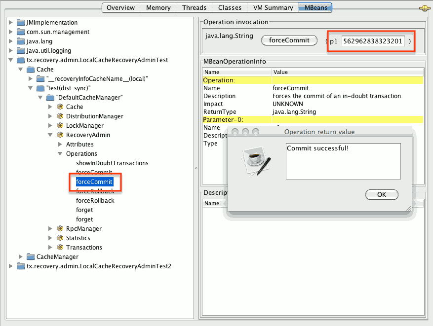
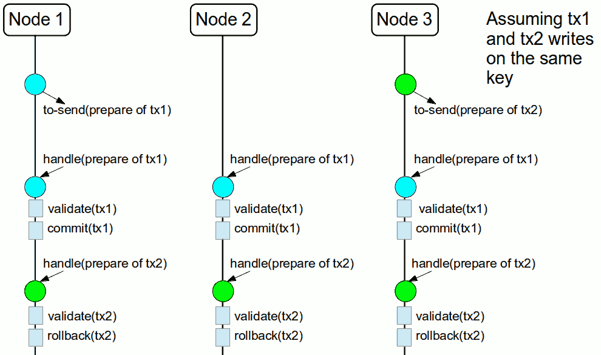

== Transactions
{brandname} can be configured to use and to participate in JTA compliant transactions.
Alternatively, if transaction support is disabled, it is equivalent to using autocommit in JDBC calls, where modifications are potentially replicated after every change (if replication is enabled).

On every cache operation {brandname} does the following:

. Retrieves the current link:{javaeedocroot}/javax/transaction/Transaction.html[Transaction] associated with the thread
. If not already done, registers link:{javaeedocroot}/javax/transaction/xa/XAResource.html[XAResource] with the transaction manager to be notified when a transaction commits or is rolled back.

In order to do this, the cache has to be provided with a reference to the environment's link:{javaeedocroot}/javax/transaction/TransactionManager.html[TransactionManager].
This is usually done by configuring the cache with the class name of an implementation of the link:{javadocroot}/org/infinispan/transaction/lookup/TransactionManagerLookup.html[TransactionManagerLookup] interface.
When the cache starts, it will create an instance of this class and invoke its `getTransactionManager()` method, which returns a reference to the `TransactionManager`.

{brandname} ships with several transaction manager lookup classes:

.Transaction manager lookup implementations
*  link:{javadocroot}/org/infinispan/transaction/lookup/EmbeddedTransactionManagerLookup.html[EmbeddedTransactionManagerLookup]:
This provides with a basic transaction manager which should only be used for embedded mode when no other implementation is available.
This implementation has some severe limitations to do with concurrent transactions and recovery.

*  link:{javadocroot}/org/infinispan/transaction/lookup/JBossStandaloneJTAManagerLookup.html[JBossStandaloneJTAManagerLookup]:
If you're running {brandname} in a standalone environment, this should be your default choice for transaction manager.
It's a fully fledged transaction manager based on link:http://narayana.io/[JBoss Transactions] which overcomes all the deficiencies of the `EmbeddedTransactionManager`.

*  link:{javadocroot}/org/infinispan/transaction/lookup/GenericTransactionManagerLookup.html[GenericTransactionManagerLookup]:
This is a lookup class that locate transaction managers in the most popular Java EE application servers.
If no transaction manager can be found, it defaults on the `EmbeddedTransactionManager`.

WARN: `DummyTransactionManagerLookup` has been deprecated in 9.0 and it will be removed in the future.
Use `EmbeddedTransactionManagerLookup` instead.

Once initialized, the `TransactionManager` can also be obtained from the `Cache` itself:

[source,java]
----
//the cache must have a transactionManagerLookupClass defined
Cache cache = cacheManager.getCache();

//equivalent with calling TransactionManagerLookup.getTransactionManager();
TransactionManager tm = cache.getAdvancedCache().getTransactionManager();
----

=== Configuring transactions [[tx:configuration]]
Transactions are configured at cache level.
Below is the configuration that affects a transaction behaviour and a small description of each configuration attribute.

[source,xml]
----
<locking
   isolation="READ_COMMITTED"
   write-skew="false"/>
<transaction
   locking="OPTIMISTIC"
   auto-commit="true"
   complete-timeout="60000"
   mode="NONE"
   notifications="true"
   protocol="DEFAULT"
   reaper-interval="30000"
   recovery-cache="__recoveryInfoCacheName__"
   stop-timeout="30000"
   transaction-manager-lookup="org.infinispan.transaction.lookup.GenericTransactionManagerLookup"/>
<versioning
   scheme="NONE"/>
----

or programmatically:

[source,java]
----
ConfigurationBuilder builder = new ConfigurationBuilder();
builder.locking()
    .isolationLevel(IsolationLevel.READ_COMMITTED)
    .writeSkewCheck(false);
builder.transaction()
    .lockingMode(LockingMode.OPTIMISTIC)
    .autoCommit(true)
    .completedTxTimeout(60000)
    .transactionMode(TransactionMode.NON_TRANSACTIONAL)
    .useSynchronization(false)
    .notifications(true)
    .transactionProtocol(TransactionProtocol.DEFAULT)
    .reaperWakeUpInterval(30000)
    .cacheStopTimeout(30000)
    .transactionManagerLookup(new GenericTransactionManagerLookup())
    .recovery()
    .enabled(false)
    .recoveryInfoCacheName("__recoveryInfoCacheName__");
builder.versioning()
    .enabled(false)
    .scheme(VersioningScheme.NONE);
----

* `isolation` - configures the isolation level. Check section <<tx:isolation-levels>> for more details.
Default is `READ_COMMITTED`.
* `write-skew` - enables the write skew check. Check section <<tx:write-skew>> for more details. Default is `false`.
* `locking` - configures whether the cache uses optimistic or pessimistic locking. Check section <<tx:locking>> for more details.
Default is `OPTIMISTIC`.
* `auto-commit` - if enable, the user does not need to start a transaction manually for a single operation. The transaction is automatically started and committed.
 Default is `true`.
* `complete-timeout` - the duration in milliseconds to keep information about completed transactions. Default is `60000`.
* `mode` - configures whether the cache is transactional or not. Default is `NONE`. The available options are:
** `NONE` - non transactional cache
** `FULL_XA` - XA transactional cache with recovery enabled. Check section <<tx:recovery>> for more details about recovery.
** `NON_DURABLE_XA` - XA transactional cache with recovery disabled.
** `NON_XA` - transactional cache with integration via link:{javaeedocroot}/javax/transaction/Synchronization.html[Synchronization] instead of XA.
Check section <<tx:sync-enlist>> for details.
** `BATCH`-  transactional cache using batch to group operations. Check section <<tx:batching>> for details.
* `notifications` - enables/disables triggering transactional events in cache listeners. Default is `true`.
* `protocol` - configures the protocol uses. Default is `DEFAULT`. Values available are:
** `DEFAULT` - uses the traditional Two-Phase-Commit protocol. It is described below.
** `TOTAL_ORDER` - uses total order ensured by the `Transport` to commit transactions. Check section <<tx:total-order>> for details.
* `reaper-interval` - the time interval in millisecond at which the thread that cleans up transaction completion information kicks in.
Defaults is `30000`.
* `recovery-cache` - configures the cache name to store the recovery information. Check section <<tx:recovery>> for more details about recovery.
Default is `__recoveryInfoCacheName__`.
* `stop-timeout` - the time in millisecond to wait for ongoing transaction when the cache is stopping. Default is  `30000`.
* `transaction-manager-lookup` - configures the fully qualified class name of a class that looks up a reference to a `javax.transaction.TransactionManager`.
Default is `org.infinispan.transaction.lookup.GenericTransactionManagerLookup`.
* Versioning `scheme` - configure the version scheme to use when write skew is enabled with optimistic or total order transactions.
Check section <<tx:write-skew>> for more details. Default is `NONE`.

For more details on how Two-Phase-Commit (2PC) is implemented in {brandname} and how locks are being acquired see the section below.
More details about the configuration settings are available in link:http://docs.jboss.org/infinispan/{infinispanversion}/configdocs/[Configuration reference].

=== Isolation levels [[tx:isolation-levels]]
{brandname} offers two isolation levels - link:https://en.wikipedia.org/wiki/Isolation_(database_systems)#Read_committed[READ_COMMITTED] and link:https://en.wikipedia.org/wiki/Isolation_(database_systems)#Repeatable_reads[REPEATABLE_READ].

These isolation levels determine when readers see a concurrent write, and are internally implemented using different subclasses of `MVCCEntry`, which have different behaviour in how state is committed back to the data container.

Here's a more detailed example that should help understand the difference between `READ_COMMITTED` and `REPEATABLE_READ` in the context of {brandname}.
With `READ_COMMITTED`, if between two consecutive read calls on the same key, the key has been updated by another transaction, the second read may return the new updated value:

[source,java]
----
Thread1: tx1.begin()
Thread1: cache.get(k) // returns v
Thread2:                                       tx2.begin()
Thread2:                                       cache.get(k) // returns v
Thread2:                                       cache.put(k, v2)
Thread2:                                       tx2.commit()
Thread1: cache.get(k) // returns v2!
Thread1: tx1.commit()
----

With `REPEATABLE_READ`, the final get will still return `v`.
So, if you're going to retrieve the same key multiple times within a transaction, you should use `REPEATABLE_READ`.

However, as read-locks are not acquired even for `REPEATABLE_READ`, this phenomena can occur:

[source,java]
----
cache.get("A") // returns 1
cache.get("B") // returns 1

Thread1: tx1.begin()
Thread1: cache.put("A", 2)
Thread1: cache.put("B", 2)
Thread2:                                       tx2.begin()
Thread2:                                       cache.get("A") // returns 1
Thread1: tx1.commit()
Thread2:                                       cache.get("B") // returns 2
Thread2:                                       tx2.commit()
----

=== Transaction locking [[tx:locking]]

==== Pessimistic transactional cache

From a lock acquisition perspective, pessimistic transactions obtain locks on keys at the time the key is written.

. A lock request is sent to the primary owner (can be an explicit lock request or an operation)
. The primary owner tries to acquire the lock:
.. If it succeed, it sends back a positive reply;
.. Otherwise, a negative reply is sent and the transaction is rollback.

As an example:

[source,java]
----
transactionManager.begin();
cache.put(k1,v1); //k1 is locked.
cache.remove(k2); //k2 is locked when this returns
transactionManager.commit();
----

When `cache.put(k1,v1)` returns, `k1` is locked and no other transaction running anywhere in the cluster can write to it.
Reading `k1` is still possible.
The lock on `k1` is released when the transaction completes (commits or rollbacks).

NOTE: For conditional operations, the validation is performed in the originator.

==== Optimistic transactional cache

With optimistic transactions locks are being acquired at transaction prepare time and are only being held up to the point the transaction commits (or rollbacks).
This is different from the 5.0 default locking model where local locks are being acquire on writes and cluster locks are being acquired during prepare time.

. The prepare is sent to all the owners.
. The primary owners try to acquire the locks needed:
.. If locking succeeds, it performs the write skew check.
.. If the write skew check succeeds (or is disabled), send a positive reply.
.. Otherwise, a negative reply is sent and the transaction is rolled back.

As an example:

[source,java]
----
transactionManager.begin();
cache.put(k1,v1);
cache.remove(k2);
transactionManager.commit(); //at prepare time, K1 and K2 is locked until committed/rolled back.
----

NOTE: For conditional commands, the validation still happens on the originator.

==== What do I need - pessimistic or optimistic transactions?
From a use case perspective, optimistic transactions should be used when there is _not_ a lot of contention between multiple transactions running at the same time.
That is because the optimistic transactions rollback if data has changed between the time it was read and the time it was committed (with write skew check enabled).

On the other hand, pessimistic transactions might be a better fit when there is high contention on the keys and transaction rollbacks are less desirable.
Pessimistic transactions are more costly by their nature: each write operation potentially involves a RPC for lock acquisition.

=== Write Skew [[tx:write-skew]]

The write skew anomaly occurs when 2 transactions read and update the same key and both of them can commit successfully without having seen the update performed by the other.
To detect and rollback one of the transaction, `write-skew` should be enabled.

NOTE: The write skew check is only performed for `REPEATABLE_READ` isolation.

NOTE: Pessimistic transaction does not perform any write skew check.
It can be avoided by locking the key at read time. Look how at the example below.

.Locking key before read (Pessimitic Transaction)
[source, java]
----
if (!cache.getAdvancedCache().lock(key)) {
   //key not locked. abort transaction
}
cache.get(key);
cache.put(key, value);

//this code is equivalent
cache.getAdvancedCache().withFlags(Flag.FORCE_WRITE_LOCK).get(key); //will throw an exception is not locked.
cache.put(key, value);
----

When operating in `LOCAL` mode, write skew checks relies on Java object references to compare differences and this is adequate to provide a reliable write-skew check.
However, this technique is useless in a cluster and a more reliable form of versioning is necessary to provide reliable write skew checks.

Data version needs to be configured in order to support write skew check:

[source,xml]
----
<versioning scheme="SIMPLE|NONE" />
----

Or

[source,java]
----
new ConfigurationBuilder().versioning().scheme(SIMPLE);
----

NOTE: `SIMPLE` versioning is an implementation of the proposed `EntryVersion` interface, backed by a long that is incremented each time the entry is updated.

=== Deadlock detection
Deadlocks can significantly (up to one order of magnitude) reduce the throughput of a system, especially when multiple transactions are operating against the same key set.
Deadlock detection is disabled by default, but can be enabled/configured per cache (i.e. under `*-cache` config element) by adding the following:

[source,xml]
----
<local-cache deadlock-detection-spin="1000"/>
----

or, programmatically

[source,java]
----
new ConfigurationBuilder().deadlockDetection().enable().spinDuration(1000);
//or
new ConfigurationBuilder().deadlockDetection().enable().spinDuration(1, TimeUnit.SECONDS);
----

Some clues on when to enable deadlock detection.

* A high number of transaction rolling back due to link:{javadocroot}/org/infinispan/util/concurrent/TimeoutException.html[TimeoutException] is an indicator that this functionality might help.
* `TimeoutException` might be caused by other causes as well, but deadlocks will always result in this exception being thrown.

Generally, when you have a high contention on a set of keys, deadlock detection may help.
But the best way is not to guess the performance improvement but to benchmark and monitor it: you can have access to statistics (e.g. number of deadlocks detected) through JMX, as it is exposed via the `DeadlockDetectingLockManager` MBean.
For more details on how deadlock detection works, benchmarks and design details refer to link:http://infinispan.blogspot.com/2009/07/increase-transactional-throughput-with.html[this] article.

NOTE: deadlock detection only runs on an a per cache basis: deadlocks that spread over two or more caches won't be detected.

=== Dealing with exceptions
If a link:{javadocroot}/org/infinispan/commons/CacheException.html[CacheException] (or a subclass of it) is thrown by a cache method within the scope of a JTA transaction, then the transaction is automatically marked for rollback.

=== Enlisting Synchronizations [[tx:sync-enlist]]
By default {brandname} registers itself as a first class participant in distributed transactions through link:{javaeedocroot}/javax/transaction/xa/XAResource.html[XAResource].
There are situations where {brandname} is not required to be a participant in the transaction, but only to be notified by its lifecycle (prepare, complete): e.g. in the case {brandname} is used as a 2nd level cache in Hibernate.

{brandname} allows transaction enlistment through link:{javaeedocroot}/javax/transaction/Synchronization.html[Synchronisation].
To enable it just use `NON_XA` transaction mode.

``Synchronization``s have the advantage that they allow `TransactionManager` to optimize 2PC with a 1PC where only one other resource is enlisted with that transaction (link:https://access.redhat.com/documentation/en-us/red_hat_jboss_enterprise_application_platform/7.0/html/development_guide/java_transaction_api_jta#about_the_lrco_optimization_for_single_phase_commit_1pc[last resource commit optimization]).
E.g. Hibernate second level cache: if {brandname} registers itself with the `TransactionManager` as a `XAResource` than at commit time, the `TransactionManager` sees two `XAResource` (cache and database) and does not make this optimization.
Having to coordinate between two resources it needs to write the tx log to disk.
On the other hand, registering {brandname} as a `Synchronisation` makes the `TransactionManager` skip writing the log to the disk (performance improvement).

===  Batching [[tx:batching]]
Batching allows atomicity and some characteristics of a transaction, but not full-blown JTA or XA capabilities.
Batching is often a lot lighter and cheaper than a full-blown transaction.

TIP: Generally speaking, one should use batching API whenever the only participant in the transaction is an {brandname} cluster.
On the other hand, JTA transactions (involving `TransactionManager`) should be used whenever the transactions involves multiple systems.
E.g. considering the "Hello world!" of transactions: transferring money from one bank account to the other.
If both accounts are stored within {brandname}, then batching can be used.
If one account is in a database and the other is {brandname}, then distributed transactions are required.

NOTE: You _do not_ have to have a transaction manager defined to use batching.

==== API
Once you have configured your cache to use batching, you use it by calling `startBatch()` and `endBatch()` on `Cache`. E.g.,

[source,java]
----
Cache cache = cacheManager.getCache();
// not using a batch
cache.put("key", "value"); // will replicate immediately

// using a batch
cache.startBatch();
cache.put("k1", "value");
cache.put("k2", "value");
cache.put("k2", "value");
cache.endBatch(true); // This will now replicate the modifications since the batch was started.

// a new batch
cache.startBatch();
cache.put("k1", "value");
cache.put("k2", "value");
cache.put("k3", "value");
cache.endBatch(false); // This will "discard" changes made in the batch
----

==== Batching and JTA
Behind the scenes, the batching functionality starts a JTA transaction, and all the invocations in that scope are associated with it.
For this it uses a very simple (e.g. no recovery) internal `TransactionManager` implementation.
With batching, you get:

. Locks you acquire during an invocation are held until the batch completes
. Changes are all replicated around the cluster in a batch as part of the batch completion process. Reduces replication chatter for each update in the batch.
. If synchronous replication or invalidation are used, a failure in replication/invalidation will cause the batch to roll back.
. All the transaction related configurations apply for batching as well.

===  Transaction recovery [[tx:recovery]]
Recovery is a feature of XA transactions, which deal with the eventuality of a resource or possibly even the transaction manager failing, and recovering accordingly from such a situation.

==== When to use recovery
Consider a distributed transaction in which money is transferred from an account stored in an external database to an account stored in {brandname}.
When `TransactionManager.commit()` is invoked, both resources prepare successfully (1st phase). During the commit (2nd) phase, the database successfully applies the changes whilst {brandname} fails before receiving the commit request from the transaction manager.
At this point the system is in an inconsistent state: money is taken from the account in the external database but not visible yet in {brandname} (since locks are only released during 2nd phase of a two-phase commit protocol).
Recovery deals with this situation to make sure data in both the database and {brandname} ends up in a consistent state.

==== How does it work
Recovery is coordinated by the transaction manager.
The transaction manager works with {brandname} to determine the list of in-doubt transactions that require manual intervention and informs the system administrator (via email, log alerts, etc).
This process is transaction manager specific, but generally requires some configuration on the transaction manager.  

Knowing the in-doubt transaction ids, the system administrator can now connect to the {brandname} cluster and replay the commit of transactions or force the rollback.
{brandname} provides JMX tooling for this - this is explained extensively in the <<tx:recovery-reconciliation>> section.

==== Configuring recovery   
Recovery is _not_ enabled by default in {brandname}.
If disabled, the `TransactionManager` won't be able to work with {brandname} to determine the in-doubt transactions.
The <<tx:configuration>> section shows how to enable it.

NOTE: `recovery-cache` attribute is not mandatory and it is configured per-cache.

NOTE: For recovery to work, `mode` must be set to `FULL_XA`, since full-blown XA transactions are needed.

===== Enable JMX support

In order to be able to use JMX for managing recovery JMX support must be explicitly enabled.
More about enabling JMX in <<jmx:chapter>> section.

==== Recovery cache
In order to track in-doubt transactions and be able to reply them, {brandname} caches all transaction state for future use.
This state is held only for in-doubt transaction, being removed for successfully completed transactions after when the commit/rollback phase completed.

This in-doubt transaction data is held within a local cache: this allows one to configure swapping this info to disk through cache loader in the case it gets too big.
This cache can be specified through the `recovery-cache` configuration attribute.
If not specified infinispan will configure a local cache for you.

It is possible (though not mandated) to share same recovery cache between all the {brandname} caches that have recovery enabled.
If the default recovery cache is overridden, then the specified recovery cache must use a link:{javadocroot}/org/infinispan/transaction/lookup/class-use/TransactionManagerLookup.html[TransactionManagerLookup] that returns a different transaction manager than the one used by the cache itself.

==== Integration with the transaction manager
Even though this is transaction manager specific, generally a transaction manager would need a reference to a `XAResource` implementation in order to invoke `XAResource.recover()` on it.
In order to obtain a reference to an {brandname} `XAResource` following API can be used:

[source,java]
----
XAResource xar = cache.getAdvancedCache().getXAResource();
----

It is a common practice to run the recovery in a different process from the one running the transaction.
At the moment it is not possible to do this with infinispan: the recovery must be run from the same process where the infinispan instance exists.
This limitation will be dropped once link:https://issues.jboss.org/browse/ISPN-375[transactions over Hot Rod] are available.

==== Reconciliation [[tx:recovery-reconciliation]]
The transaction manager informs the system administrator on in-doubt transaction in a proprietary way.
At this stage it is assumed that the system administrator knows transaction's XID (a byte array).

A normal recovery flow is:

* *STEP 1*: The system administrator connects to an {brandname} server through JMX, and lists the in doubt transactions.
The image below demonstrates JConsole connecting to an {brandname} node that has an in doubt transaction.

image::images/showInDoubtTx.png[align="center", title="Show in-doubt transactions"]

The status of each in-doubt transaction is displayed(in this example " _PREPARED_ ").
There might be multiple elements in the status field, e.g. "PREPARED" and "COMMITTED" in the case the transaction committed on certain nodes but not on all of them.  

* *STEP 2*: The system administrator visually maps the XID received from the transaction manager to an {brandname} internal id, represented as a number.
This step is needed because the XID, a byte array, cannot conveniently be passed to the JMX tool (e.g. JConsole) and then re-assembled on infinispan's side.

* *STEP 3*: The system administrator forces the transaction's commit/rollback through the corresponding jmx operation, based on the internal id.
The image below is obtained by forcing the commit of the transaction based on its internal id.

TIP: All JMX operations described above can be executed on any node, regardless of where the transaction originated.

===== Force commit/rollback based on XID
XID-based JMX operations for forcing in-doubt transactions' commit/rollback are available as well: these methods receive byte[] arrays describing the XID instead of the number associated with the transactions (as previously described at step 2).
These can be useful e.g. if one wants to set up an automatic completion job for certain in-doubt transactions.
This process is plugged into transaction manager's recovery and has access to the transaction manager's XID objects.

==== Want to know more?
The link:https://community.jboss.org/wiki/TransactionRecoveryDesign[recovery design document] describes in more detail the insides of transaction recovery implementation.

===  Total Order based commit protocol [[tx:total-order]]
The Total Order based protocol is a multi-master scheme (in this context, multi-master scheme means that all nodes can update all the data) as the (optimistic/pessimist) locking mode implemented in {brandname}.
This commit protocol relies on the concept of totally ordered delivery of messages which, informally, implies that each node which delivers a set of messages, delivers them in the same order.

This protocol comes with this advantages.

. transactions can be committed in one phase, as they are delivered in the same order by the nodes that receive them.
. it mitigates distributed deadlocks.

The weaknesses of this approach are the fact that its implementation relies on a single thread per node which delivers the transaction and its modification, and the slightly cost of total ordering the messages in `Transport`.

Thus, this protocol delivers best performance in scenarios of _high contention_ , in which it can benefit from the single-phase commit and the deliver thread is not the bottleneck.

Currently, the Total Order based protocol is available only in _transactional_ caches for _replicated_ and _distributed_ modes.

==== Overview
The Total Order based commit protocol only affects how transactions are committed by {brandname} and the isolation level and write skew affects it behaviour.

When write skew is disabled, the transaction can be committed/rolled back in single phase.
The data consistency is guaranteed by the `Transport` that ensures that all owners of a key will deliver the same transactions set by the same order.

On other hand, when write skew is enabled, the protocol adapts and uses one phase commit when it is safe.
In `XaResource` enlistment, we can use one phase if the `TransactionManager` request a commit in one phase (last resource commit optimization) and the {brandname} cache is configured in replicated mode.
This optimization is not safe in distributed mode because each node performs the write skew check validation in different keys subset.
When in `Synchronization` enlistment, the `TransactionManager` does not provide any information if {brandname} is the only resource enlisted (last resource commit optimization), so it is not possible to commit in a single phase.

===== Commit in one phase
When the transaction ends, {brandname} sends the transaction (and its modification) in total order.
This ensures all the transactions are deliver in the same order in all the involved {brandname} nodes.
As a result, when a transaction is delivered, it performs a deterministic write skew check over the same state (if enabled), leading to the same outcome (transaction commit or rollback).

The figure above demonstrates a high level example with 3 nodes.
`Node1` and `Node3` are running one transaction each and lets assume that both transaction writes on the same key.
To make it more interesting, lets assume that both nodes tries to commit at the same time, represented by the first colored circle in the figure.
The _blue_ circle represents the transaction _tx1_ and the _green_ the transaction _tx2_ .
Both nodes do a remote invocation in total order (_to-send_) with the transaction's modifications.
At this moment, all the nodes will agree in the same deliver order, for example, _tx1_ followed by _tx2_ .
Then, each node delivers _tx1_ , perform the validation and commits the modifications.
The same steps are performed for _tx2_ but, in this case, the validation will fail and the transaction is rollback in all the involved nodes.

===== Commit in two phases
In the first phase, it sends the modification in total order and the write skew check is performed.
The result of the write skew check is sent back to the originator.
As soon as it has the confirmation that all keys are successfully validated, it give a positive response to the `TransactionManager`.
On other hand, if it receives a negative reply, it returns a negative response to the `TransactionManager`.
Finally, the transaction is committed or aborted in the second phase depending of the `TransactionManager` request.

image::images/total-order-2pc.png[align="center", title="2-phase commit"]

The figure above shows the scenario described in the first figure but now committing the transactions using two phases.
When _tx1_ is deliver, it performs the validation and it replies to the `TransactionManager`.
Next, lets assume that _tx2_ is deliver before the `TransactionManager` request the second phase for _tx1_.
In this case, _tx2_ will be enqueued and it will be validated only when _tx1_ is completed.
Eventually, the `TransactionManager` for _tx1_ will request the second phase (the commit) and all the nodes are free to perform the validation of _tx2_ .

===== Transaction Recovery
<<tx:recovery, Transaction recovery>> is currently not available for Total Order based commit protocol.

===== State Transfer
For simplicity reasons, the total order based commit protocol uses a blocking version of the current state transfer.
The main differences are:

. enqueue the transaction deliver while the state transfer is in progress;
. the state transfer control messages (`CacheTopologyControlCommand`) are sent in total order.

This way, it provides a synchronization between the state transfer and the transactions deliver that is the same all the nodes.
Although, the transactions caught in the middle of state transfer (i.e. sent before the state transfer start and deliver after it) needs to be re-sent to find a new total order involving the new joiners.

image::images/total-order-joing-during-st.png[align="center", title="Node joining during transaction"]

The figure above describes a node joining.
In the scenario, the _tx2_ is sent in _topologyId=1_ but when it is received, it is in _topologyId=2_ .
So, the transaction is re-sent involving the new nodes.

==== Configuration

To use total order in your cache, you need to add the `TOA` protocol in your `jgroups.xml` configuration file.

.jgroups.xml
[source,xml]
----
<tom.TOA />
----

NOTE: Check the link:http://jgroups.org/manual-3.x/html/index.html[JGroups Manual] for more details.

NOTE: If you are interested in detail how JGroups guarantees total order, check the link::http://jgroups.org/manual/index.html#TOA[TOA manual].

Also, you need to set the `protocol=TOTAL_ORDER` in the `<transaction>` element, as shown in <<tx:configuration, Configuration section>>.

==== When to use it?

Total order shows benefits when used in write intensive and high contented workloads.
It mitigates the cost associated with deadlock detection and avoids contention in the lock keys.

